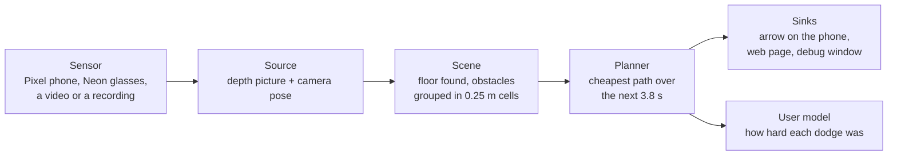

# NeuromorphicPaths

A walking aid that looks ahead for you. A sensor watches the path in front of the walker, a laptop
works out where the obstacles are and plans a way past them, and a display shows one arrow: walk
this way. If something is about to be in the way, an alarm goes up as well.

This file is the map of the repository. Each part has its own README with the details.

## What's in here

```
NeuromorphicPaths/
  server/                    the laptop pipeline, in Python. Most of the work happens here
    nav/                     the pipeline itself, one folder per stage
      sources/               reads a sensor or a recording and hands over depth frames
      pose/                  where the camera is and which way it's pointing
      scene/                 turns a depth picture into obstacles on the floor
      planner/               plans a path past them and picks the arrow's direction
      usermodel/             watches how the walker responds, measures what each dodge cost
      sinks/                 sends the result somewhere: the phone, a web page, a debug window
      runtime/               the loop that runs all of the above, frame by frame
      evaluation/            replays recorded walks and scores the planner on them
    tests/                   the test suite, plus small committed recordings to test against
    examples/                small scripts, like checking the Neon glasses are reachable
    docs/                    the message format between the Pixel app and the laptop
  pixel_app/                 Android app for a Google Pixel: sends depth to the laptop, shows the arrow
  SidewalkVision/            Android app that runs on its own on a phone with the Neon glasses
  OldAppEnvrionmentStuff/    the first app, built for Meta glasses, with an early report draft
  docs/                      measured results, how-to guides and diagrams
```

## How a frame gets from the sensor to the arrow



1. **Source.** Every sensor ends up as the same thing: a depth picture, where each pixel says how far
   away that point is, plus where the camera is pointing. The Pixel measures depth itself with
   ARCore. The Neon glasses and plain video only give a normal picture, so a neural network guesses
   the depth from it.
2. **Scene.** It finds the floor, keeps everything between ankle and head height, and drops it into
   a grid of 0.25 m squares, 3 m to each side and 6 m ahead. A square with enough points in it
   becomes an obstacle. It also tracks how much each obstacle's distance wobbles from frame to frame, because
   a reading that keeps jumping around is one to be careful about.
3. **Planner.** Picture a heat map of the space ahead, where each spot is colored by how surprising
   it would be to be standing there when you get there. Near an obstacle it's hot, and the more an
   obstacle's reading wobbles, the hotter the area around it. The planner finds the coolest route
   through that map over the next 3.8 seconds, which is 5.32 m at walking pace. The arrow points at
   where that route is one second ahead.
   The heat map picture leaves out two things. The planner also charges for every step sideways,
   so it won't zigzag to save a little heat. And it remembers the route it picked one frame earlier and
   charges a bit for straying from it, so it doesn't flip between left and right on every frame
   when both sides are nearly as good.
4. **Sinks.** The path goes to whatever is listening: the Pixel app draws the arrow over the camera
   picture, a web page shows the planner's view from above and the depth picture, and a desktop
   window shows the same for whoever's tuning things.

The alarm is separate from the arrow. It goes up when something is within 0.7 seconds of contact at
walking pace, which is about 1 m.

**A worked example.** A wall runs from 3 m on the left to 1 m on the right, 4 m ahead. The only open
floor is to the right, so the planner plans a sidestep right and the arrow reads 35.5 degrees right.
That's the widest it ever goes: a full sidestep at 1 m/s while walking forward at 1.4 m/s. The alarm
stays off, because 4 m is nearly three seconds away.

## How to use it

Everything below runs from `server/`. Python 3.12, and on Windows we use Git Bash.

**Set up and run the tests.** No phone, glasses or GPU needed:

```
cd server
py -3.12 -m venv .venv
.venv/Scripts/python -m pip install -e ".[dev]"
.venv/Scripts/python -m pytest
```

That takes about two and a half minutes.

**Replay a recorded walk.** Recordings aren't committed, because they're large. They're shared as
folders, and you put one under `server/frame_logs/`. Then open `http://localhost:8765` in a browser:

```
.venv/Scripts/python -m nav --source logged --log-dir frame_logs/<walk> --sink web --realtime
```

**Run it live with the Pixel.** Start the laptop first, then the app on the phone. The phone shows
the arrow and the browser shows the page:

```
.venv/Scripts/python -m nav --source arcore_tcp --arcore-accept-timeout 600 --reconnect --sink phone_app --sink web --floor-max-tilt 50 --record-to frame_logs/<new walk> --verbose
```

**Score the planner on a walk.** How often the arrow sits at its limit, how often it swings from one
side to the other, and what the alarm did:

```
.venv/Scripts/python -m nav.evaluation.check_planner numbers frame_logs/<walk>
```

## Where to read next

| If you want to | Read |
|---|---|
| run the pipeline with any sensor, and every flag | [`server/README.md`](server/README.md) |
| add or change a test | [`server/tests/README.md`](server/tests/README.md) |
| build and run the Pixel app | [`pixel_app/README.md`](pixel_app/README.md) |
| change the messages between the phone and the laptop | [`server/docs/arcore_wire_format.md`](server/docs/arcore_wire_format.md) |
| see what has been measured on recorded walks | [`docs/evaluation/`](docs/evaluation/) |
| score the arrow against how the walker actually turned | [`docs/guides/score_the_arrow_against_turns.md`](docs/guides/score_the_arrow_against_turns.md) |
| build the diagrams | [`docs/README.md`](docs/README.md) |
