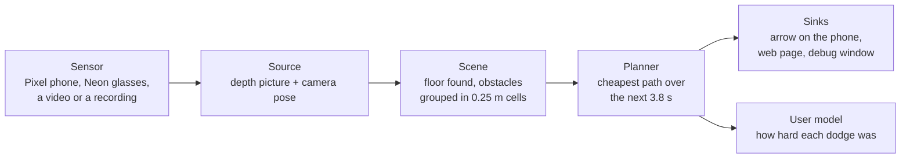

# NeuromorphicPaths

A walking aid that looks ahead for you. A sensor watches the path in front of the walker, a laptop
works out where the obstacles are and plans a way past them, and a display shows one arrow: walk
this way. If something is about to be in the way, an alarm goes up as well.

This file is the map of the repository. Each part has its own README with the details.

## What's in here

```
NeuromorphicPaths/
  server/                    the laptop pipeline, in Python. Most of the work happens here
    nav/                     the pipeline itself, one folder per stage
      sources/               reads a sensor or a recording and hands over depth frames
      pose/                  where the camera is and which way it's pointing
      scene/                 turns a depth picture into obstacles on the floor
      planner/               plans a path past them and picks the arrow's direction
      usermodel/             watches how the walker responds, measures what each dodge cost
      sinks/                 sends the result somewhere: the phone, a web page, a debug window
      runtime/               the loop that runs all of the above, frame by frame
      evaluation/            replays recorded walks and scores the planner on them
    tests/                   the test suite, plus small committed recordings to test against
    examples/                small scripts: check the Neon glasses, record their stream, summarize timing
    docs/                    the message format between the Pixel app and the laptop
  pixel_app/                 Android app for a Google Pixel: sends depth to the laptop, shows the arrow
  OldAppEnvrionmentStuff/    the first app, built for Meta glasses, with an early report draft
  docs/                      measured results, how-to guides and diagrams
```

## How a frame gets from the sensor to the arrow



1. **Source.** Every sensor ends up as the same thing: a depth picture, where each pixel says how far
   away that point is, plus where the camera is pointing. The Pixel measures depth itself with
   ARCore. The Neon glasses and plain video only give a normal picture, so a neural network guesses
   the depth from it.
2. **Scene.** It finds the floor, keeps everything between ankle and head height, and drops it into
   a grid of 0.25 m squares, 3 m to each side and 6 m ahead. A square with enough points in it
   becomes an obstacle. It also tracks how much each obstacle's distance wobbles from frame to frame, because
   a reading that keeps jumping around is one to be careful about.
3. **Planner.** Picture a heat map of the space ahead, where each spot is colored by how surprising
   it would be to be standing there when you get there. Near an obstacle it's hot, and the more an
   obstacle's reading wobbles, the hotter the area around it. The planner finds the coolest route
   through that map over the next 3.8 seconds, which is 5.32 m at walking pace. The arrow points at
   where that route is one second ahead.
   The heat map picture leaves out two things. The planner also charges for every step sideways,
   so it won't zigzag to save a little heat. And it remembers the route it picked one frame earlier and
   charges a bit for straying from it, so it doesn't flip between left and right on every frame
   when both sides are nearly as good.
4. **Sinks.** The path goes to whatever is listening: the Pixel app draws the arrow over the camera
   picture, a web page shows the planner's view from above and the depth picture, and a desktop
   window shows the same for whoever's tuning things.

The alarm is separate from the arrow. It goes up when something is within 0.7 seconds of contact at
walking pace, which is about 1 m.

**A worked example.** A wall runs from 3 m on the left to 1 m on the right, 4 m ahead. The only open
floor is to the right, so the planner plans a sidestep right and the arrow reads 35.5 degrees right.
That's the widest it ever goes: a full sidestep at 1 m/s while walking forward at 1.4 m/s. The alarm
stays off, because 4 m is nearly three seconds away.

## How to use it

Everything below runs from `server/`. Python 3.12, and on Windows we use Git Bash.

**Set up and run the tests.** No phone, glasses or GPU needed:

```
cd server
py -3.12 -m venv .venv
.venv/Scripts/python -m pip install -e ".[dev]"
.venv/Scripts/python -m pytest
```

That takes about three minutes. `pyproject.toml` holds every version bound a fresh install needs,
OpenCV below 5 among them. If pip stalls on a 401, your machine has a user-level `pip.ini` pointing
at a private index, and the fix is under Install in [`server/README.md`](server/README.md). The
glasses need the `glasses` extra and a CUDA build of torch, also there.

**The app's tests**, from `pixel_app/`, with the JDK and SDK that come with Android Studio. Full
build and run steps are in [`pixel_app/README.md`](pixel_app/README.md):

```
cd pixel_app
JAVA_HOME="/c/Program Files/Android/Android Studio/jbr" ANDROID_HOME="$LOCALAPPDATA/Android/Sdk" ./gradlew.bat :app:testDebugUnitTest
```

### Recordings live on your machine, not in the repository

Nothing recorded is committed. The repository is a free private GitHub one with little space, one
walk is 70 to 280 MB, and the glasses' video shows passers-by. So any command below that names a
recording needs a local copy of it in `server/frame_logs/`, which git ignores. Ask whoever recorded
it for the folder. These are the ones the docs and the evaluation refer to:

| Folder under `server/frame_logs/` | What it is | Size |
|---|---|---|
| `pixel_walk_3` | Pixel walk, the planner's main test walk | 277 MB |
| `pixel_display_run` | Pixel walk with the arrow on the phone, the older three-value arrow | 159 MB |
| `wifi_run_2` | Pixel walk over home Wi-Fi, 2,144 frames, the 1 s lookahead arrow | 127 MB |
| `straight_walk_4` | Pixel walk in a straight line, for the arrow's spread when nothing is in the way | 122 MB |
| `contact_walk_1` | indoor Pixel walk, the first with the contact term | 72 MB |
| `neon_walk_1` | the glasses' live walk, as a frame log | 194 MB |
| `captures/neon_walk_1`, `captures/neon_walk_2` | the glasses' raw streams, replayable through the whole pipeline | 204 and 184 MB |
| `before_walk_1`, `after_walk_1`, `before_walk_2_5ghz` | the three Pixel walks the frame-to-arrow delay is measured on, each with its report | 234, 207 and 150 MB |
| `before_walk_1_phone`, `after_walk_1_phone`, `before_walk_2_5ghz_phone` | the Pixel's own timing log for each of those walks | about 1 MB each |
| `replays` | the timing logs and reports of the replays behind the delay's before-and-after figures | 14 MB |

The two golden recordings the tests replay are the exception. They're cut down to a few hundred KB
and committed under `server/tests/fixtures/`, so the suite needs no recording at all.

**Replay a recorded walk.** Then open `https://localhost:8765` in a browser, and accept the
certificate warning once:

```
.venv/Scripts/python -m nav --source logged --log-dir frame_logs/<walk> --sink web --realtime
```

That replays through the same scene and planner, which is what planner work wants. It isn't for
timing, because it keeps the original walk's arrival times. To time the laptop on a recorded Pixel
walk, send the walk over the network into an ordinary live run instead. The commands are under
*The timing log* in [`server/README.md`](server/README.md).

**Run it live with the Pixel.** Start the laptop first, then the app on the phone. The phone shows
the arrow and the browser shows the page:

```
.venv/Scripts/python -m nav --source arcore_tcp --arcore-accept-timeout 600 --reconnect --sink phone_app --sink web --floor-max-tilt 50 --record-to frame_logs/<new walk> --verbose
```

**Run it live with the Neon glasses.** Needs the glasses extra and a CUDA build of torch, both in
[`server/README.md`](server/README.md). Open the Companion app with the glasses plugged in, read the
phone's address off its streaming screen, and open the page in a browser. That can be a phone's
browser, which is how the walker watches the arrow with the glasses on:

```
.venv/Scripts/python examples/check_neon.py --neon-address <phone address>
.venv/Scripts/python -m nav --source neon_live --neon-address <phone address> --process-resolution 336 --sink web --record-to frame_logs/<new walk> --verbose
```

**Record the glasses' raw stream, and replay it later** without the glasses, through the same
decoder, depth model and planner:

```
.venv/Scripts/python examples/capture_neon_stream.py --neon-address <phone address> --seconds 240 frame_logs/captures/<new walk>
.venv/Scripts/python -m nav --source neon_live --neon-replay frame_logs/captures/<new walk> --process-resolution 336 --sink web
```

**Record a walk on the phone alone**, somewhere the phone can't reach the laptop, and replay it to
the laptop later: *Recording a walk without the laptop* in [`pixel_app/README.md`](pixel_app/README.md).

**Measure the delay from a frame to the arrow**, and split it into the phone's, the network's, the
laptop's and the display's shares: [`docs/guides/frame_to_arrow_delay.md`](docs/guides/frame_to_arrow_delay.md).

**Score the planner on a walk.** How often the arrow sits at its limit, how often it swings from one
side to the other, and what the alarm did:

```
.venv/Scripts/python -m nav.evaluation.check_planner numbers frame_logs/<walk>
```

## Retired

**SidewalkVision** was a phone-only Android app. It ran its own depth model, surprise map and
planner on the phone, with the Neon glasses giving gaze. It was retired because the laptop now does
every calculation, and a phone only shows what the laptop sends, through the web page above. The
whole app is in commit `125f663`, the last one that changed it.

One part of it is kept for later: its path model,
`SidewalkVision/app/src/main/assets/best_int8.tflite`, 3,603,922 bytes. It marks which part of a
camera picture is walkable path. A planned addition to the laptop's planner will use it to charge
for stepping off the path, switched off by default. To get the model back, run this from the
repository root in Git Bash:

```bash
git restore --source=125f663 -- SidewalkVision/app/src/main/assets/best_int8.tflite
```

For the whole app, use the same command with `-- SidewalkVision` at the end. `git restore` writes
the file's bytes directly. Don't redirect `git show` into a file instead, because Windows
PowerShell re-encodes redirected output and the model comes out corrupted.

## Where to read next

| If you want to | Read |
|---|---|
| understand the math, from the camera to the arrow, and which parts are the professor's | [`docs/math/`](docs/math/) |
| run the pipeline with any sensor, and every flag | [`server/README.md`](server/README.md) |
| add or change a test | [`server/tests/README.md`](server/tests/README.md) |
| build and run the Pixel app | [`pixel_app/README.md`](pixel_app/README.md) |
| change the messages between the phone and the laptop | [`server/docs/arcore_wire_format.md`](server/docs/arcore_wire_format.md) |
| see what has been measured on recorded walks | [`docs/evaluation/`](docs/evaluation/) |
| see how the glasses did on real hardware: latency, frame rate, floor | [`docs/evaluation/neon_glasses_first_session.md`](docs/evaluation/neon_glasses_first_session.md) |
| measure how late the arrow is, from the frame it was planned from | [`docs/guides/frame_to_arrow_delay.md`](docs/guides/frame_to_arrow_delay.md) |
| drive a vibration motor or headphones from the planner's output | [`docs/guides/drive_feedback_from_the_path.md`](docs/guides/drive_feedback_from_the_path.md) |
| score the arrow against how the walker actually turned | [`docs/guides/score_the_arrow_against_turns.md`](docs/guides/score_the_arrow_against_turns.md) |
| build the diagrams | [`docs/README.md`](docs/README.md) |
