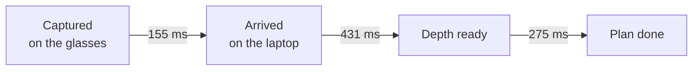

# The Neon glasses, first session

What the laptop pipeline did with the Pupil Labs Neon glasses on real hardware: how late each
arrow was, how many came per second, and how often the floor was found. All of it comes from one
session on 2026-10-05, in a classroom.

How to rerun every number here is at the end.

## Conditions

These apply to every figure below unless a section says otherwise.

| | |
|---|---|
| Laptop | Quadro T2000 with Max-Q, 4 GB, NVIDIA driver 581.95, on mains power |
| Software | Python 3.12.10, torch 2.14.1+cu126, the DA3METRIC-LARGE depth model, `--process-resolution 336` |
| Network | the school Wi-Fi, with the laptop and the Companion phone both on it. Address given with `--neon-address`, discovery not tried. Time Echo round trip 8 ms on the walk, 6 to 13 ms across the day |
| Clocks | the Neon's clock ran 1274 ms behind the laptop's on the walk, and 1274 to 1302 ms across the day's runs. Drift over a run was not measured, because the walk was stopped before its closing measurement |
| Background load | Zoom, Firefox, Discord and Task Manager took about 3.5 cores early in the session. They were asked to be closed, and whether they were before the walk was not recorded |
| Not recorded | the Companion phone's model and app version. The walk had no timed warm-up, but the pipeline had been run several times earlier in the session |

## How late each arrow was

A frame goes through four stamps on its way to an arrow. Each step between two stamps is called
a share.



The numbers on the arrows are medians from the live walk. Medians don't add up, so the median from
capture to plan done is its own figure, 905 ms.

The live walk ran about 5.8 minutes indoors. 570 frames were planned after leaving out the first
10 s, while the network and the GPU warmed up.

| Share | median | 95th percentile | worst |
|---|---|---|---|
| capture to arrival | 155 ms | 714 ms | 1.6 s |
| arrival to depth ready | 431 ms | 776 ms | 1.3 s |
| depth ready to plan done | 275 ms | 753 ms | 1.5 s |
| capture to plan done | 905 ms | 2.0 s | 2.9 s |

Capture to arrival has about ±8 ms of extra uncertainty. The glasses' clock offset is measured
with Python's `time_ns()`, which ticks in 15.6 ms steps on Windows.

The arrow on the phone's browser page looked another 0.5 to 1.5 s behind to the walker. That was
judged by eye, not measured.

## How many arrows per second

1.68 planned frames a second on the walk, with a longest gap of 1.4 s between two plans.

The decoder logged 15 backlog warnings. It warns at most once every 10 s, so that counts warnings,
not how many times it fell behind.

Two standing runs, before the walk, compared the process resolution:

| `--process-resolution` | Planned frames a second | Run length |
|---|---|---|
| 504 | 0.76 | 4.6 minutes |
| 280 | 2.48 | 1.5 minutes |

The depth model alone, timed on one frame at a time, tops out at about 3.5 a second at 280. The
sensor plan assumed about 10 frames a second at reduced resolution. The measured 1.68 is the figure
to plan with on this laptop.

## How often the floor was found

The live walk ran before the depth was converted from the model's 300 pixel focal length to
meters. Without that conversion the model's raw depth at 336 is about 1.9 times too large, so the
floor came out about 2.9 m below the camera, and the floor check refuses anything over 2.2 m.
That walk's figure, `fitted` on 243 of 570 frames (42.6 %), describes that bug, not the pipeline.

The second capture was replayed with the conversion through `--neon-replay`, 432 frames. `fitted`
on 395 (91 %), with the camera a median of 1.56 m above the floor, 1.41 to 1.66 m between the 10th
and 90th percentiles. The other 37 were walls, refused for leaning a median of 82.6 degrees. The
same 432 frames at the old scale fitted 13 (3 %).

## On a replay

`check_planner numbers` on that replay's frame log printed the same output three times running.
The arrow sat at its sidestep limit on 5.1 % of frames, and the alarm was on for 24.1 %.

On the `--neon-replay` run itself, the scene took a median of 125 ms a frame and the planner 131 ms,
with 95th percentiles of 422 and 371 ms.

A raw capture replayed through `--neon-replay` took a median of 86 ms on the laptop from a packet
being fed in to its decoded frame reaching the pipeline, and 137 ms at the 95th percentile.

## The pose, from when the picture was taken

On this walk each frame was posed with whatever IMU reading was newest when the frame reached the
laptop. That was 155 ms after the picture was taken at the median, 714 ms at the 95th percentile.
A head turning at 100 degrees a second turns 15 to 70 degrees in that time, and the floor is fitted
against "up" from that pose. Now the glasses' process keeps the last 3 s of IMU readings, and each
frame gets the reading nearest the moment its picture was taken, within 50 ms. A frame with no
reading that near has no pose rather than an older one.

The second capture was replayed twice on 2026-10-08, before and after the change. Then the before
replay's own frames were fitted again both ways with `check_planner floor-lean`, so both poses are
compared on the same 380 frames. Lean is the angle between the fitted floor and that pose's up. On a
flat floor a right pose gives about zero.

| Pose | Frames | Floor fitted | Lean, median | 90th percentile | Largest |
|---|---|---|---|---|---|
| Newest reading on arrival | 380 | 353 (92.9 %) | 1.94° | 6.13° | 20.93° |
| Reading nearest the capture | 380 | 348 (91.6 %) | 1.79° | 4.99° | 20.46° |

Refitting with the arrival pose gave the run's own floor on every frame, so the left column is the
run itself. On the after replay both poses are the same frame for frame, which is the live code
choosing exactly what the rule says.

These understate a live walk. In a replay a frame is late only by this laptop's share, 96 ms at the
median, against 155 ms live, because the network share isn't there.

## Holding the previous plan between the glasses' frames

The planner leans toward the plan it made on the frame before, so a near-tie doesn't flip sides
every frame. It's our term, in the professor's half-squared shape, and it dropped any plan older than
0.5 s. On this walk 334 of 594 gaps between plans were longer, so most of the time it wasn't there.
It now keeps a plan up to 3 s old, and lets an older one pull less: the plan's spread, 0.25 m when
fresh, widens with its age, 0.30 m at 0.6 s and 0.36 m at 1.4 s.

The glasses replay can't show the difference. It has no full swings of the arrow with the old rule,
the new one, or the prior switched off, and with no position the plan-disagreement figures can't be
computed. So the choice was measured on the three Pixel walks, thinned to the glasses' own gaps
between plans (median 0.6 to 0.7 s, more than half over 0.5 s). Full swings of the arrow from one
sidestep limit to the other, last segment of each walk:

| | `pixel_walk_3`, 76 frames | classroom, 129 | `contact_walk_1`, 59 |
|---|---|---|---|
| No prior | 14 | 24 | 8 |
| Dropped after 0.5 s | 5 | 13 | 3 |
| Kept to 3 s, widening | 0 | 0 | 0 |

Dropping it after 1.0 s instead still let 2 swings through on the classroom. Widening faster than
0.05 m² a second let them back too (2 and 3), because a plan 0.6 s old then pulls too weakly to hold
a near-tie. At the phone's full rate the change does almost nothing. `contact_walk_1` and the
classroom give the same figures, and `pixel_walk_3` holds the arrow at its limit on 36.8 % of frames
instead of 34.1 %, through its tracking dropouts, with swings and alarm unchanged.

## The IMU that sent only zeros

Every IMU reading in the captures from 17:36 to 17:45 was (0, 0, 0, 0), and its timestamp was 0 too:
519 readings in `smoke` and 24,650 in `neon_walk_1`. From 17:49 they were normal. A zero timestamp
means each packet decoded to nothing at all. The Pupil Labs client reads both the rotation and the
time out of a protobuf message, and an empty one reads back as zeros.

Pupil Labs answered the same report in
[pl-realtime-api issue 71](https://github.com/pupil-labs/pl-realtime-api/issues/71): the streamed IMU
sends zeros after an earlier connection to the glasses wasn't closed cleanly, and force-stopping and
restarting the Companion app clears it. Recording on the phone carries on unaffected.

Tested with the glasses on 2026-10-08, five runs of `examples/check_neon.py`, which now watches the
IMU for 3 s after the first frame and counts its readings:

| Condition | IMU readings in 3 s | Empty |
|---|---|---|
| Control | 508 | 0 |
| After a capture that closed its sessions cleanly | 515 | 0 |
| After a capture killed hard, 3 s earlier | 448 | 0 |
| While another capture still held the stream | 478 | 478, none with a timestamp |
| 25 s later, the other capture gone | 426 | 0 |

So the phone serves the IMU stream to one client. A second client connected while the first is still
open gets packets that decode to nothing, the first keeps receiving, and the second recovers the
moment the first connection is gone. A process that dies takes its socket with it, which is why the
kill didn't do it. What does it is a client still alive and no longer reading. On the 5th that was
the first live runs, whose reader thread was starved of the interpreter lock, with new runs started
beside them. Closing the other run clears it. Force-stopping the app does the same when the other
run can't be found. The check now says so.

## Rerunning it

The recordings aren't committed, because they're large. They're shared as folders under
`server/frame_logs/`: the live walk's frame log `neon_walk_1`, and the raw captures
`captures/neon_walk_1` and `captures/neon_walk_2`. From `server/`:

```
# The live walk's latency table, rate, gap and floor counts
.venv/Scripts/python examples/timing_report.py frame_logs/neon_walk_1

# The floor on the second capture, with the depth conversion
.venv/Scripts/python -m nav --source neon_live --neon-replay frame_logs/captures/neon_walk_2 --process-resolution 336 --sink web --record-to frame_logs/neon_walk_2_replay --verbose

# The planner figures on that replay, the same output every run
.venv/Scripts/python -m nav.evaluation.check_planner numbers frame_logs/neon_walk_2_replay

# The floor refitted with both poses. The shift is the replay's own "stamps shifted by" log line
.venv/Scripts/python -m nav --source neon_live --neon-replay frame_logs/captures/neon_walk_2 --process-resolution 336 --sink web --record-to frame_logs/neon_walk_2_before --verbose > frame_logs/neon_walk_2_before.log 2>&1
.venv/Scripts/python -m nav.evaluation.check_planner floor-lean frame_logs/neon_walk_2_before --capture frame_logs/captures/neon_walk_2 --replay-shift-seconds <shift>

# The empty-IMU check on a capture
.venv/Scripts/python examples/check_neon.py --neon-replay frame_logs/captures/neon_walk_1
```

The floor-lean comparison needs a replay recorded by code from before the pose change, since the
new code logs the capture-time pose. Replays are recorded at real time, so a second run plans a
slightly different set of frames, which is why the comparison refits one run's own frames.

The scene and planner medians come from that replay's `--verbose` lines. The floor's refusal
reasons come from running the scene's own floor functions over each frame of the log.

The `neon_walk_1` frame log was recorded before the conversion existed, so its depth is in the
model's raw units. Replaying it with `--source logged` reads that as meters. Use the raw captures
for anything that depends on depth.
