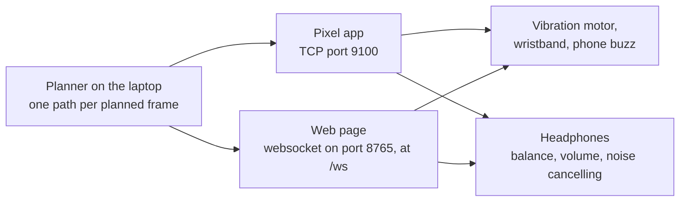

# Driving haptics and headphones from the path

Nothing in the pipeline vibrates or plays a sound yet. This guide is for whoever builds that part.
It says which values in the planner's output are worth listening to, what each one means in
numbers, and how they could drive a vibration motor or a pair of headphones.

## Where the values come from

Every time the laptop finishes planning a frame, it sends out one path message. A feedback driver
listens to that message and turns a few of its numbers into something the walker can feel or hear.



There are two ways to get the message:

- **TCP port 9100.** This is what the Pixel app reads. Each message is a 4-byte big-endian length,
  then that many bytes of JSON. The framing and every field are in
  [`server/docs/arcore_wire_format.md`](../../server/docs/arcore_wire_format.md), under *What the
  laptop sends back*.
- **The web page's websocket, `wss://<laptop>:8765/ws`.** The same JSON, with one extra key,
  `"kind": "path"`. Skip the other kinds on that socket, which are the page's plan views and depth
  pictures. The page is served over HTTPS with a self-signed certificate, so a client of its own
  has to accept that certificate, the way a browser does once.

A path message looks like this:

```json
{
  "timestamp_seconds": 12.345,
  "times_seconds": [0.0, 0.1, 0.2],
  "lateral_offsets_meters": [0.0, 0.05, 0.12],
  "lookahead_heading_radians": 0.0423,
  "alarm": false,
  "cumulative_cost_bits": 18.4,
  "scene_information_bits": 0.37,
  "avoidance_surprise_bits": 0.51
}
```

## Levels and switches

The values come in two kinds, and a pair of headphones is a good way to picture them. Some values
are a **level**, like the volume knob: they say how much. Others are a **switch**, like the noise
cancelling button: they say whether a mode is on. The comparison stops working at one point. A
headphone switch stays where you put it. These switches flip on their own as the scene changes, so
the driver has to decide how quickly to follow them.

| Field | Kind | What it says | Range | Could drive |
|---|---|---|---|---|
| `lookahead_heading_radians` | level, with a side | Where the path is heading, read 1 s ahead. Positive is right | 0 straight ahead, up to ±0.62 rad (±35.5 degrees) | Which side buzzes or sounds, and how strongly |
| `avoidance_surprise_bits` | level | How soon the walker reaches the nearest thing in their way | 0 with nothing in the way, 0.72 at 1 s to contact, 1.47 where the alarm goes up and the drawn path is fully red, climbing fast after that | How urgent the cue is: its strength or its pulse rate |
| `alarm` | switch | Something in the walker's corridor is under 0.7 s away at walking pace, or was in the last 0.5 s | `true` or `false` | A distinct pattern that means stop or step aside |
| `scene_information_bits` | level, usable as a switch | How much what the camera saw changed the plan from the plan with nothing in view | 0 for an empty scene. Under 4 on 95 % of one recorded walk's frames, but there's no fixed top: that walk's highest is 22 | Whether to say anything at all. At 0 the scene changed nothing |
| `lateral_offsets_meters`, `times_seconds` | the whole plan | Where to be sideways, every 0.1 s, out to 3.8 s | positive is right | A warning before a turn the plan already holds |

`cumulative_cost_bits` is not on the list. The contract says it's for display and logging, not for
steering, because its size depends on how many costs the planner adds up, not on how close anything is.

### What the avoidance number means in meters

The planner computes it from the time until the walker reaches the nearest thing in a
corridor reaching 0.3 m either side of their line, at walking pace (1.4 m/s). The formula is
`(1 s / time to contact)² / (2 ln 2)`, so it grows fast as contact gets near:

| Nearest thing in the corridor | Time to contact | `avoidance_surprise_bits` |
|---|---|---|
| 4.2 m | 3.0 s | 0.08 |
| 2.8 m | 2.0 s | 0.18 |
| 1.4 m | 1.0 s | 0.72 |
| 0.98 m | 0.7 s, where the alarm goes up | 1.47 |
| 0.7 m | 0.5 s | 2.89 |

A car's parking sensor is a fair picture: it beeps faster as you back up toward something. The
difference is that this number only counts what's in the walker's corridor. A wall right beside
them reads 0.

## Haptics

A simple mapping for one motor on each side, or for a wristband that can buzz left or right:

- **Which side:** the sign of `lookahead_heading_radians`.
- **How strongly:** `abs(lookahead_heading_radians) / 0.62`, from 0 to 1.
- **How urgently:** pulse faster as `avoidance_surprise_bits` rises. For example, one pulse a second
  at 0.18, four a second at 1.47.
- **Alarm:** a pattern that is never used for anything else, like three short pulses on both sides.
- **Quiet:** when `scene_information_bits` is 0, the camera saw nothing that changed the plan, so
  nothing needs to buzz.

## Headphones

The same values can drive audio. Each of these mirrors a control the walker already knows from
their own headphones.

**Three of them arrive ready-made.** Every path carries `ear_gain_left` and `ear_gain_right`, how
loud each ear should be, and `alarm_pan`, where the danger is while the alarm is up, −1 left to +1
right. The laptop works them out, the ear away from the heading going quieter by the course's
surprise of the heading error and the danger's ear dropping to a floor, so a display applies them
and decides nothing. The laptop's own web page does exactly that in its noise-cancellation mode, and
the formula is in `docs/math/09_arrow_and_alarm.md`. The page also shows the two gains as five
arcs an ear, one lit per 20 %, and the noise-cancelling rule below as `NC ON` or `NC OFF`, so a
teammate building the headphone side can watch the page to see what the numbers do on a walk.
A path from a laptop older than these keys has none of them, which reads as no cue: both ears
at full. The recipes below are for a cue built from the other values, and the page's alarm
mode still uses the first of them for its guidance beep.

**Stereo balance from the heading.** Play the cue panned toward the side the path goes. Take
`pan = lookahead_heading_radians / 0.62`, clamped to -1 to 1. Equal-power panning keeps the loudness
the same as the sound moves: left gain `cos((pan + 1) · π/4)`, right gain `sin((pan + 1) · π/4)`.

| Heading | `pan` | Left gain | Right gain |
|---|---|---|---|
| 0 rad, straight ahead | 0 | 0.71 | 0.71 |
| 0.31 rad, 17.8 degrees right | 0.5 | 0.38 | 0.92 |
| 0.62 rad, the full sidestep right | 1 | 0 | 1 |
| -0.31 rad, 17.8 degrees left | -0.5 | 0.92 | 0.38 |

**Volume or beep rate from the avoidance number.** Either one works, like the parking sensor
above. For volume, `min(1, avoidance_surprise_bits / 1.47)` reaches full volume right where the
alarm goes up.

**Noise cancelling off while the alarm is up.** When `alarm` turns true, switch the headphones
from noise cancelling to their ambient or transparency mode, so the walker hears what's around
them. Switch back once it has been false for a couple of seconds. The alarm already stays up for
at least 0.5 s once raised, and an extra hold on the headphone side keeps the mode from flipping
back and forth. As far as we know, Android has no standard way for an app to change this mode.
Most headphones only expose it through their maker's own app or SDK, so check the model you have
before building on it.

**Silence on an empty scene.** At `scene_information_bits` of 0 the cue can stop altogether. The
walker then knows that no sound means nothing to avoid, which reads more clearly than a constant
quiet tone.

## A worked example

One path message, read the way a driver would read it:

```json
{"lookahead_heading_radians": 0.31, "avoidance_surprise_bits": 0.72, "alarm": false, "scene_information_bits": 2.1}
```

- The path heads 17.8 degrees right, half the full sidestep. Haptics: the right motor at half
  strength. Headphones: pan 0.5, so left gain 0.38 and right gain 0.92.
- The nearest thing in the corridor is 1 s away, 1.4 m at walking pace. Haptics: about two pulses
  a second. Headphones: volume `0.72 / 1.47`, so about half.
- No alarm, so noise cancelling stays as the walker set it.
- `scene_information_bits` is 2.1, so the scene matters and the cue plays.

## Four things that matter more for feedback than for the screen

**The heading flattens at its limit.** ±35.5 degrees is how far the walker can sidestep at 1.0 m/s
while walking at 1.4 m/s. With something 3 to 5.32 m ahead, the arrow sat at that limit on 30.3 %
of the classroom recording's frames and 1.6 % of `pixel_walk_3`'s. A strength mapped straight from
the heading is at full in exactly those moments. `avoidance_surprise_bits` is the value that still
changes there.

**The alarm holds, the heading doesn't.** Once raised, the alarm stays up for at least 0.5 s, so it
doesn't flicker from one path to the next. The heading's only steadying is the planner's pull
toward its previous plan. On the Pixel recordings, that pull took full swings from one sidestep
limit to the other from 76 to 105 a minute down to 0 to 1.3. It lapses when the previous plan is
more than 0.5 s old. On the glasses walk, 334 of the 594 gaps between the capture times of
consecutive planned frames (56 %) were longer than that. So on the glasses, a driver that eases its
strength over a few paths will feel steadier than one that jumps.

**Paths come about 1.7 times a second on the glasses.** Measured on 2026-10-05 at
`--process-resolution 336` on the Quadro T2000 laptop, over a school Wi-Fi network. The longest
gap between two paths was 1.4 s. A driver has to hold the last value between paths, and should
stop once no path has come for longer than that, rather than keep cueing on old news.

**A path describes the world as it was when the frame was captured.** On that walk, a frame took
0.9 s at the median and 2.0 s at the 95th percentile from capture to finished plan. The arrow on
the phone looked another 0.5 to 1.5 s behind to the walker, judged by eye rather than measured.
`timestamp_seconds` is on the sensor's own clock, not the laptop's, and the message doesn't carry
the offset between the two. So a driver can't work out a path's age from its stamp. What it can
measure is how long ago the message arrived. For the glasses that day, the Neon's clock ran 1.27 to
1.30 s behind the laptop's.

The full measurements from that session are in
[`docs/evaluation/neon_glasses_first_session.md`](../evaluation/neon_glasses_first_session.md).
