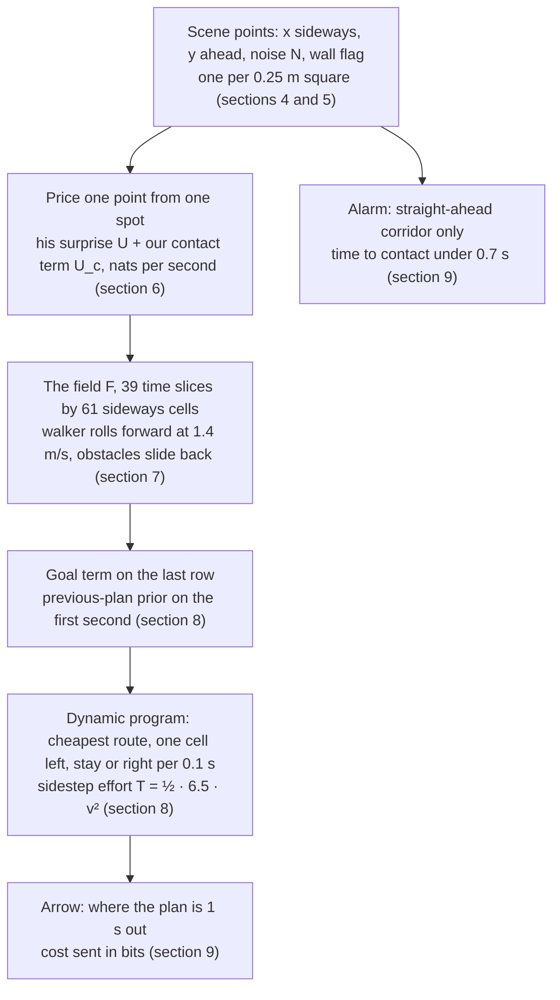

[Contents](README.md#contents) · [The colors](README.md#the-colors) · Next: [1. Seeing in meters](01_seeing_in_meters.md)

# The planner on one page

The whole planner, from the scene's obstacle points to the arrow and the alarm, with every formula
it runs and one worked example. Read this first. Each step names the section with the full
derivation, the symbol table and the reasons behind the constants.

This page covers sections 6 to 9. Sections 1 to 5 turn a camera frame into what the planner reads:
one point per 0.25 m floor square, with its position, its clearance and its noise. Section 10
measures how much the scene changed the plan, and section 16 lists what exists but is switched
off, such as motion prediction.

Everything up to the last step is in natural-log units, nats. One bit is $`\ln 2 = 0.693`$ nats.
The planner adds everything up in nats and converts once at the end.

## The chain



The alarm never reads the plan. It looks at the same scene points and nothing else.

## 1. What comes in

The scene hands over one point per 0.25 m square: sideways $`x`$, ahead $`y`$, a noise
$`{\color{orange}{N}}`$ (how much its distance wobbled over the last 0.5 s, never below 0.01 m),
and a wall flag. Before any term sees a wall, its noise is tripled, so the planner treats it as
less certain and keeps more room from it.

```math
{\color{orange}{N}}_{\text{eff}} = 3\,{\color{orange}{N}} \ \text{for a wall}, \qquad {\color{orange}{N}} \ \text{otherwise}
```

Full story: [4. Obstacles and the walker's body](04_obstacles_and_body.md),
[5. Following things over time](05_following_over_time.md), and the wall multiplier in
[6. Surprise](06_surprise.md#walls-get-three-times-the-noise).

## 2. Pricing one point from one spot

Two terms, both a surprise rate in nats per second, added at weight 1. $`d`$ is the distance from
the spot to the point.

**His avoidance surprise.** Wobble over room, squared, halved. The gap is measured from the 0.35 m
footprint, floored at 0.06 m, and one point's surprise is capped at $`2 \times 10^4`$.

```math
{\color{purple}{U}} = \min\!\left(\tfrac{1}{2}\left(\frac{\max({\color{orange}{N}}_{\text{eff}},\ 10^{-6})}{\max({\color{teal}{S}},\ 0.06)}\right)^2,\ 2 \times 10^4\right), \qquad {\color{teal}{S}} = d - 0.35
```

A big steady gap costs almost nothing. A small wobbly gap costs a lot.

**Our contact term.** Asks whether the body would touch the thing. The gap from the 0.30 m body is
blurred by the noise and by a 0.10 m sway guess, and the cost is the surprise of getting past
clean, spread over the 0.43 s it takes to walk past something.

```math
{\color{teal}{S}}_b = d - 0.30, \qquad \sigma = \sqrt{{\color{orange}{N}}_{\text{eff}}^2 + 0.10^2}, \qquad {\color{purple}{U}}_c = \frac{\min\!\left(-\ln \Phi({\color{teal}{S}}_b / \sigma),\ 50\right)}{0.60 / 1.4}
```

$`\Phi`$ is the bell curve's area to the left of a value. His term alone made walking into a steady
post nearly free, because the post's noise is tiny and the gap is floored. This term is what fixed
that.

Full story: [6. Surprise](06_surprise.md).

## 3. The field

A table with 39 rows, one every 0.1 s out to 3.8 s, and 61 columns, one every 0.1 m from 3 m left
to 3 m right. The walker is assumed to keep walking straight at $`v_w = 1.4`$ m/s, so at row
$`k`$ every point has slid back by $`1.4\,t_k`$. Each entry is the summed cost per second of
standing in that column at that moment.

```math
y_j(k) = y_j - v_w\,t_k, \qquad d_{c,j}(k) = \sqrt{(g_c - x_j)^2 + y_j(k)^2}
```

```math
F[k, c] = \sum_{\text{terms}}\ \sum_{G}\ \max_{j \in G}\ {\color{purple}{U}}_{\text{term}}\!\left(d_{c,j}(k),\ {\color{orange}{N}}_{\text{eff},j}\right)
```

Within one square only the worst point counts, squares add, and the two terms add. Live, the scene
sends one point per square, so the maximum does nothing and the field is a plain sum.

Full story: [7. The field](07_the_field.md).

## 4. Two nudges before the search

**The goal term**, on the last row only, pulls the path toward the side the walker wants to end
up on. Straight ahead by default, or the gaze point on the floor in gaze mode. The tolerance
$`\lambda`$ is 1.5 m.

```math
F[38, c] \mathrel{+}= \tfrac{1}{2}\left(\frac{g_c - x_{\text{goal}}}{\lambda}\right)^2
```

**The previous-plan prior**, on the rows in the first second, pulls the path toward where last
frame's plan said the walker should be, $`e_k`$, after sliding that plan forward by however far
the walker has walked since. Its spread starts at $`\rho = 0.25`$ m and widens with the old plan's
age $`\Delta_f`$, and a plan older than 3.0 s is dropped. This is what stopped the arrow swinging
from one side to the other every frame.

```math
P_k(c) = \tfrac{1}{2}\,\frac{(g_c - e_k)^2}{\rho^2 + 0.05\,\Delta_f} \quad \text{for } 0 < t_k \le 1.0
```

Full story: [8. Planning a path](08_planning_a_path.md#the-goal-the-last-plan-and-which-path-wins).

## 5. The search

A dynamic program over the table. From each cell the walker can go one cell left, stay, or one
cell right, so sideways speed $`v`$ is 0 or 1.0 m/s. A step costs the field entry plus the
sideways effort $`{\color{blue}{T}}`$, times the 0.1 s step.

```math
{\color{blue}{T}}(v) = \tfrac{1}{2} \cdot 6.5 \cdot v^2, \qquad J_k(c) = \min_{\delta \in \{-1, 0, 1\}} \Big[ J_{k-1}(c - \delta) + \big(F[k, c] + {\color{blue}{T}}\big)\,0.1 \Big]
```

So one sidestep cell adds 0.325 and staying put adds only the field. $`J_k(c)`$ is the cheapest
way of reaching cell $`c`$ at row $`k`$. The cheapest cell on the last row wins, and following the
remembered steps back gives the path. The prior's share along that path comes off the total,
then one divide by $`\ln 2`$ makes it the bits the course quotes.

```math
C_{\text{bits}} = \frac{J_{38}(c^{\star}) - 0.1 \sum_k P_k(c^{\star}_k)}{\ln 2}
```

Full story: [8. Planning a path](08_planning_a_path.md).

## 6. The arrow

Where the plan has the walker one second out, against where they are now and the 1.4 m they will
have walked. Positive is right. The widest it can be is $`\mathrm{atan2}(1.0, 1.4) = 35.5°`$, one
full sidestep against walking pace.

```math
\theta = \mathrm{atan2}\big(o_{10} - o_0,\ 1.4\big)
```

Full story: [9. The arrow and the alarm](09_arrow_and_alarm.md).

## 7. The alarm

Only points ahead and within the body's 0.30 m to either side count. Divide the smallest
clearance among them by walking speed to get the time to contact $`{\color{red}{\tau}}`$. Raise
under 0.7 s, and once raised, hold for 0.5 s.

```math
{\color{red}{\tau}} = \frac{\min_{i:\ y_i > 0,\ |x_i| \le 0.30} {\color{teal}{S}}_i}{1.4}, \qquad \text{raise when } {\color{red}{\tau}} < 0.7
```

The same $`{\color{red}{\tau}}`$ feeds his avoidance form in bits, which colors the path and
nothing else. At the alarm's threshold it reads 1.47 bits, and that is where the path turns fully
red.

```math
{\color{purple}{U}}_{\text{avoid}} = \frac{(1\ \text{s} / {\color{red}{\tau}})^2}{2 \ln 2}
```

Full story: [9. The arrow and the alarm](09_arrow_and_alarm.md) and
[14. How the path looks](14_how_the_path_looks.md).

## Worked example, one post

A post 0.5 m to the right and 2.0 m ahead, noise $`{\color{orange}{N}} = 0.0337`$ m, not a wall.
That noise is the median for groups within 2 m on the classroom walk.

1. **Where it is at row 14**, 1.4 s out. The walker has covered 1.96 m, so the post sits at
   $`(0.5, 0.04)`$, level with the walker. From the center column, $`d = 0.50`$ m.
2. **His term.** $`{\color{teal}{S}} = 0.50 - 0.35 = 0.15`$, so
   $`\tfrac{1}{2}(0.0337 / 0.15)^2 = 0.025`$ per second.
3. **Contact term.** $`{\color{teal}{S}}_b = 0.20`$, $`\sigma = 0.106`$, so
   $`{\color{teal}{S}}_b / \sigma = 1.91`$. $`-\ln \Phi(1.91) = 0.028`$, and over 0.43 s that is
   0.066 per second.
4. **The entry.** $`F[14, 0] = 0.025 + 0.066 = 0.091`$ per second. A path through that cell adds
   0.0091 for the step.
5. **Three columns left**, $`g = -0.3`$. $`d = 0.80`$ m, his term drops to 0.0028 per second and
   the contact term to about zero. Getting there costs three sidesteps, $`3 \times 0.325 = 0.975`$.
   So the plan only moves over if the post's cost, summed over every row it stays close in, beats
   that.
6. **The alarm** stays quiet. The post is 0.5 m to the side, outside the 0.30 m corridor, so
   $`{\color{red}{\tau}}`$ is undefined and the avoidance surprise is 0 bits.

Every number here comes from the worked examples in sections 6, 7 and 8, where each one is taken
further.

## What this page leaves out

- **The scene information** on the web page, a divergence in bits between the planner's path
  distribution with the obstacles in and with them out. [10. How much the scene shaped the plan](10_scene_shaped_the_plan.md).
- **Motion prediction**, which slides a point along its measured velocity. It exists and is off,
  because no recording has anything moving in it yet. [16. Planned, and off by default](16_planned.md).
- **Whose math each piece is.** His surprise, his combining rule and his forward recurrence are the
  core. The contact term, the goal term, the prior, the 1 s lookahead and the alarm are ours, and
  the weight 6.5 and speed 1.4 m/s are his constants adapted.
  [15. How we stick to the professor's math](15_professors_math.md).

---

[Contents](README.md#contents) · [The colors](README.md#the-colors) · Next: [1. Seeing in meters](01_seeing_in_meters.md)
