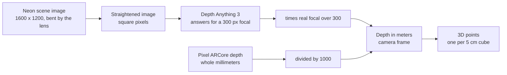

[Contents](README.md#contents) · [The colors](README.md#the-colors) · Next: [2. Which way is up](02_which_way_is_up.md)

# 1. Seeing in meters

Every distance the planner works with is in meters, and that includes the gap to an obstacle,
$`{\color{teal}{S}}`$. Neither camera hands over meters directly. The Pixel sends depth as whole
millimeters. The Neon glasses send a color picture, and a depth model on the laptop turns that
picture into numbers that are only meters for one particular zoom. This section is the chain that
gets from "a pixel and a number" to "a point in space, in meters".

The picture of distances is called a **depth map**: one number per pixel, saying how far away the
surface seen at that pixel is. The description of the camera's zoom and center is the **camera
matrix**, also called the intrinsics. Turning a depth pixel back into a 3D point is
**unprojection**.

Picture someone guessing distances from a photo. They don't know which lens took it, so they guess
as if it were a standard lens. Tell them the real lens zooms in less than that, and they can scale
every guess by the same ratio. The comparison stops working at one point. A person adjusts by
judgment, and the code multiplies by one fixed ratio, which is right only because the depth model
really does assume one fixed lens.

> [!NOTE]
> **Ingredients**
> - **Depth per pixel.** On the Pixel, ARCore's depth image, 16-bit millimeters over the network
>   (`server/nav/sources/framecodec.py`). On the Neon, Depth Anything 3's metric model
>   (`DA3METRIC-LARGE`), run on the laptop on the straightened scene image
>   (`server/nav/sources/estimated_depth.py`).
> - **The camera matrix.** On the Neon, the device's own calibration, read over the network when
>   the laptop connects (`server/nav/sources/neon_live.py`). On the Pixel, the ARCore frame header.
>   For a plain video file, an assumed field of view.
> - **The lens bend.** On the Neon, eight distortion numbers from the same device calibration.
> - **Image sizes.** The Neon's scene camera is 1600 by 1200 pixels. The depth image comes out at
>   the model's processing resolution, 504 by default and 336 in the 2026-10-05 glasses session.

Every point in this section is in the **camera frame**. Its axes follow OpenCV: x to the right in
the picture, y down, z straight out of the lens, all in meters (`server/nav/types.py`). Section 2
explains how that frame gets tied to gravity.



## Depth model output to meters

Depth Anything 3's metric model answers as if every camera had the same zoom, a focal length of
300 pixels. The real camera almost never matches. So the code multiplies each depth value by how
much more, or less, zoomed the real camera is than that assumed one. The assumed zoom is called the
**canonical focal length**.

```math
z(u,v) = z_{\text{raw}}(u,v)\cdot\frac{(f_x + f_y)/2}{f_{\text{canon}}},\qquad f_{\text{canon}} = 300\ \text{px}
```

The result is stored as 32-bit floats. When a checkpoint already answers in meters, the code skips
the multiplication and passes the depth through unchanged.

| Symbol | Plain English | Units | Frame | Where in the code |
|---|---|---|---|---|
| $`(u, v)`$ | Pixel column and row in the depth image | px | depth image | `server/nav/sources/estimated_depth.py` |
| $`z_{\text{raw}}`$ | Depth as the model returns it, meters only for a 300 px camera | "meters at 300 px" | camera, along z | `server/nav/sources/estimated_depth.py` |
| $`z`$ | Depth in meters, along the lens axis | m | camera, along z | `server/nav/sources/estimated_depth.py` |
| $`f_x, f_y`$ | The real camera's focal lengths, at the depth image's size | px | camera | `server/nav/sources/estimated_depth.py` |
| $`f_{\text{canon}}`$ | The focal length the model assumes, 300 | px | none | `server/nav/sources/estimator.py` |

The focal length has to be the one at the depth image's size, not the camera's own size. The model
never sees the 1600 pixel image. It sees a shrunk copy.

| Step | Expression | Why |
|---|---|---|
| 1 | $`f_x' = f_x \cdot W_d / W_s`$, $`f_y' = f_y \cdot H_d / H_s`$ | Shrinking an image shrinks its focal length by the same ratio, separately across and down |
| 2 | $`\bar f = (f_x' + f_y')/2`$ | Depth Anything 3's own scaling rule takes the mean of the two |
| 3 | $`\bar f / 300`$ | How much more zoomed the real camera is than the one the model assumed |
| 4 | $`z = z_{\text{raw}} \cdot \bar f / 300`$ | Every pixel gets the same factor |

Here $`W_s`$ and $`H_s`$ are the scene image's width and height, and $`W_d`$ and $`H_d`$ the depth image's,
all in pixels.

**Worked example: one Neon frame at three resolutions.** The straightened Neon image has a focal
length of 754 px at 1600 pixels wide (`server/nav/sources/camera_model.py`, and the subsection "Square pixels at the larger focal"
below explains where 754 comes from). The code's docstring records one glasses frame run through the
model at three processing resolutions (`server/nav/sources/estimator.py`). The depth image width
equals the processing resolution, because Depth Anything 3 resizes the long side to it. That last
part is the library's behavior and the repository doesn't state it, but it reproduces the
docstring's numbers.

| Resolution | Focal at depth size | Factor | Raw camera height | Converted |
|---|---|---|---|---|
| 504 | $`754 \times 504/1600 = 237.51`$ px | $`237.51/300 = 0.7917`$ | 1.91 m | $`1.91 \times 0.7917 = 1.512`$ m |
| 336 | $`754 \times 336/1600 = 158.34`$ px | $`158.34/300 = 0.5278`$ | 2.91 m | $`2.91 \times 0.5278 = 1.536`$ m |
| 280 | $`754 \times 280/1600 = 131.95`$ px | $`131.95/300 = 0.4398`$ | 3.55 m | $`3.55 \times 0.4398 = 1.561`$ m |

The raw heights swing from 1.91 to 3.55 m depending on a processing setting. The converted ones sit
between 1.51 and 1.56 m, which is about where a walker's eyes are. A camera's height shouldn't
depend on how big an image the model was given, so that's the check that the conversion is right.

This is what went wrong in the 2026-10-05 glasses session, which ran at 336 before the conversion
existed. The floor came out about 2.9 m below the camera instead of about 1.56 m, so depth was
about $`2.91 / 1.536 = 1.89`$ times too large. The floor check refuses any floor more than 2.2 m
below the camera (section 3), so only 243 of 570 frames fitted a floor on that walk. A refused
frame keeps the last floor it had. On a replay with the conversion, 395 of 432 frames fitted one, with the camera a median 1.56 m up
(`docs/evaluation/neon_glasses_first_session.md`).

> [!WARNING]
> "Depth times focal over 300" leaves out which focal. It's the mean of $`f_x`$ and $`f_y`$ at the
> depth image's size. Plugging in the native 754 px instead would make depth
> $`1600/504 = 3.17`$ times too large at 504, and $`1600/336 = 4.76`$ times at 336. Taking the mean
> only matters when $`f_x \ne f_y`$, and no current route sends that, because the Neon's pixels are
> made square first and the fallback camera has one focal. The depth image's exact size is set
> inside Depth Anything 3 and isn't written in the repository. 504 by 378 is inferred.

> [!NOTE]
> **Neon Player's depth plugin is in meters too, and no route reads it any more.** Pupil Labs'
> plugin applies the same conversion before it saves its depth maps. It uses the recording's mean
> focal, scaled to the 504 px it runs the model at, over 300. On a recorded walk its saved maps came
> to 0.9343 times the model's raw output, against 0.9353 for exactly that conversion
> (`docs/evaluation/neon_recording_routes.md`). It estimates depth on the picture before the lens is
> straightened, though, so its floor sat 0.08 m off on the same frames. A recording is now replayed
> by `server/nav/sources/neon_recording.py`, which straightens it and runs this conversion like the
> live route.

> [!NOTE]
> **Library rule: Depth Anything 3.** Mean focal over 300 is the rule in Depth Anything 3's own
> `apply_metric_scaling` and in the metric model's usage notes. The code applies the same rule
> itself, after inference (`server/nav/sources/estimator.py`,
> `server/nav/sources/estimated_depth.py`).

## ARCore millimeters to meters

The phone sends each depth pixel as a whole number of millimeters, two bytes each. The laptop
divides by 1000.

```math
z = \frac{\text{float32}(z_{\text{mm}})}{1000}
```

That's for 16-bit integer depth. A frame that arrives as 32-bit or 16-bit floats is cast to 32-bit
floats with no scaling.

| Symbol | Plain English | Units | Frame | Where in the code |
|---|---|---|---|---|
| $`z_{\text{mm}}`$ | ARCore's depth pixel, as sent | mm | camera, along z | `server/nav/sources/framecodec.py` |
| $`z`$ | The same depth in meters | m | camera, along z | `server/nav/sources/framecodec.py` |

**Worked example.**
1. 1560 mm becomes $`1560 / 1000 = 1.560`$ m.
2. The largest 16-bit value, 65535, becomes 65.535 m. Unprojection drops it later as further than
   30 m.
3. A zero, which ARCore sends where it has no reading, becomes 0 m. Unprojection drops it as closer
   than 0.1 m.

> [!WARNING]
> The only thing lost is anything finer than a millimeter.

> [!TIP]
> **Ours.** ARCore's depth image is 16-bit millimeters, which is a vendor fact quoted in the code.
> The phone keeps that format on the wire to keep each pixel at two bytes, and the laptop does the
> division (`server/nav/sources/framecodec.py`).

## The fallback camera

A plain video file comes with no camera matrix, and the metric model doesn't always supply one.
Then the code assumes a field of view, the angle from the left edge of the picture to the right,
and builds the simplest camera that has it. Its optical center is the exact middle of the image.
This is a **pinhole camera matrix**.

```math
f = \frac{W_d/2}{\tan\theta_{\text{half}}},\qquad K = \begin{pmatrix} f & 0 & W_d/2 \\ 0 & f & H_d/2 \\ 0 & 0 & 1 \end{pmatrix}
```

| Symbol | Plain English | Units | Frame | Where in the code |
|---|---|---|---|---|
| $`W_d`$, $`H_d`$ | Depth image width and height | px | depth image | `server/nav/sources/estimator.py` |
| $`\theta_{\text{half}}`$ | Half the assumed field of view, `--fallback-fov` over 2 | degrees | camera | `server/nav/sources/config.py` |
| $`f`$ | The focal length that gives that angle | px | camera | `server/nav/sources/estimator.py` |
| $`K`$ | The camera matrix built from it | px | camera | `server/nav/sources/estimator.py` |

The formula is one triangle. Half the image width sits opposite half the angle, and the focal
length is the side next to it.

**Worked example.** A 504 by 378 depth image.
1. The default, 100 degrees across: $`\tan 50^\circ = 1.191754`$, so $`f = 252 / 1.191754 = 211.45`$ px,
   with the center at (252, 189).
2. Phone footage, run with `--fallback-fov 75`: $`\tan 37.5^\circ = 0.767327`$, so
   $`f = 252 / 0.767327 = 328.41`$ px.

> [!WARNING]
> A wrong angle only stretches distances along the lens axis. With the focal over 300 conversion,
> depth scales with $`f`$ but the sideways offsets don't. So assuming 100 degrees for a camera that
> really sees 75 scales every z by $`211.45 / 328.41 = 0.6439`$. A level camera still reads its height
> correctly. A camera pitched down 40 degrees, 1.5 m up, reads its height as
> $`1.5 / \sqrt{\cos^2 40^\circ + \sin^2 40^\circ / 0.6439^2} = 1.5 / 1.258 = 1.19`$ m, and its floor
> leans by $`\arctan\big((\sin 40^\circ / 0.6439) / \cos 40^\circ\big) - 40^\circ = 52.5^\circ - 40^\circ = 12.5^\circ`$.
> Both figures match the code's docstring (`server/nav/sources/estimator.py`). The center is also
> assumed at the exact middle of the image, with the same focal across and down.

> [!TIP]
> **Ours.** The 100 degree default comes from the team's earlier script. The code's comment says a
> phone camera is nearer 75, so a run on phone footage should set `--fallback-fov 75`, and the
> server README does. Only the video file route uses this. The Neon brings its own calibration.

## Straightening the Neon's lens

The Neon's scene camera is wide, and its lens bends straight lines, most of all near the edges. A
lamp post near the side of the picture comes out curved and pulled toward the middle. The depth
model learned on pictures where straight lines stay straight, so the laptop straightens every Neon
frame before the model sees it. Straightening is called **undistortion**. The bend is described by
**OpenCV's rational lens model**, which takes eight numbers per camera, the **distortion
coefficients**.

The code works backwards from the straight picture. For each pixel of the straight output, it asks
where that point sits in the bent input, and reads the color there.

```math
x' = \frac{u_o - c_{x,\text{new}}}{f_{\text{sq}}},\qquad y' = \frac{v_o - c_{y,\text{new}}}{f_{\text{sq}}},\qquad \rho^2 = x'^2 + y'^2
```

```math
x'' = x'\,\frac{1 + k_1\rho^2 + k_2\rho^4 + k_3\rho^6}{1 + k_4\rho^2 + k_5\rho^4 + k_6\rho^6} + 2p_1 x'y' + p_2\,(\rho^2 + 2x'^2)
```

```math
y'' = y'\,\frac{1 + k_1\rho^2 + k_2\rho^4 + k_3\rho^6}{1 + k_4\rho^2 + k_5\rho^4 + k_6\rho^6} + p_1\,(\rho^2 + 2y'^2) + 2p_2 x'y'
```

```math
u_s = f_x\,x'' + c_x,\qquad v_s = f_y\,y'' + c_y
```

The output pixel takes the input's color at $`(u_s, v_s)`$, blended from the four nearest input
pixels. The lookup positions depend only on the calibration, so they're computed once as a map
(`cv2.initUndistortRectifyMap`) and every frame reuses it (`cv2.remap`).

| Symbol | Plain English | Units | Frame | Where in the code |
|---|---|---|---|---|
| $`(u_o, v_o)`$ | A pixel of the straight output image | px | straightened image | `server/nav/sources/camera_model.py` |
| $`(x', y')`$ | Its direction from the lens axis, as sideways over forward | none | camera | Inside OpenCV's `initUndistortRectifyMap`, called from `server/nav/sources/camera_model.py` |
| $`\rho`$ | How far that direction is from the axis | none | camera | Inside OpenCV's `initUndistortRectifyMap`, called from `server/nav/sources/camera_model.py` |
| $`k_1 \dots k_6`$ | How strongly the lens bends with distance from the axis | none | camera | read from the device |
| $`p_1, p_2`$ | A small skew that doesn't follow circles around the axis | none | camera | read from the device |
| $`(x'', y'')`$ | Where the bent lens actually puts that direction | none | camera | Inside OpenCV's `initUndistortRectifyMap`, called from `server/nav/sources/camera_model.py` |
| $`f_x, f_y, c_x, c_y`$ | The device's own focal lengths and center | px | delivered image | read from the device |
| $`f_{\text{sq}}, c_{x,\text{new}}, c_{y,\text{new}}`$ | The straight image's focal and center, below | px | straightened image | `server/nav/sources/camera_model.py` |
| $`(u_s, v_s)`$ | The pixel of the bent input to read | px | delivered image | Inside OpenCV's `initUndistortRectifyMap`, called from `server/nav/sources/camera_model.py` |

$`\rho`$ is written with a Greek letter here so it isn't confused with the walker's footprint radius
$`r`$ in later sections.

| Step | Expression | Why |
|---|---|---|
| 1 | $`(x', y')`$ from the output pixel | Undo the straight camera's zoom and center, leaving a direction |
| 2 | Multiply by the radial fraction | Bending depends on distance from the axis, so this is a function of $`\rho^2`$ |
| 3 | Add the $`p_1`$, $`p_2`$ terms | The skew part, which doesn't follow circles around the axis |
| 4 | Apply the device's $`f_x, f_y, c_x, c_y`$ | Back to a pixel position in the picture the camera delivered |

**Worked example: how far the Neon's lens pulls a point in.** The Neon's calibration, as read off
the device and recorded in the tests, is $`f_x = 890.9`$, $`f_y = 890.6`$, $`c_x = 807.3`$,
$`c_y = 608.5`$, with $`k_1 = -0.1307`$, $`k_2 = 0.1092`$, $`p_1 = -0.0003`$, $`p_2 = -0.0005`$, $`k_3 = 0`$,
$`k_4 = 0.1702`$, $`k_5 = 0.0519`$, $`k_6 = 0.0255`$ (`server/tests/test_camera_model.py`). Take a
direction level with the axis, $`y' = 0`$.

| Direction | $`\rho^2`$ | Radial fraction | $`x''`$ | Lens puts it at $`u_s`$ | A bend-free lens would put it at |
|---|---|---|---|---|---|
| $`x' = 0.5`$, 26.6° right | 0.25 | 0.9311 | 0.4652 | $`807.3 + 890.9 \times 0.4652 = 1221.7`$ | $`807.3 + 890.9 \times 0.5 = 1252.7`$ |
| $`x' = 1.0604`$, 46.7° right | 1.1245 | 0.7664 | 0.8110 | $`807.3 + 890.9 \times 0.8110 = 1529.8`$ | $`807.3 + 890.9 \times 1.0604 = 1752.0`$ |

At 26.6 degrees the lens pulls the point 31 px toward the middle. At 46.7 degrees it pulls it
222 px in. A bend-free lens with this focal would put that second direction past the right edge at
1600, so the bend is what fits it in the frame. The $`p`$ terms move the two points up by about
0.07 and 0.3 px and sideways by about 0.3 and 1.5 px, which is too little to see. Those shifts are
already in the table's $`x''`$ values. At the very center $`x' = y' = 0`$, every term is zero, and the center of
the output reads the input at $`(c_x, c_y)`$.

The gaze point goes the other way, from the bent image to the straight one. That direction has no
formula, so OpenCV guesses, bends the guess, compares, and repeats, up to 50 rounds or until it's
within a millionth of a pixel. Section 13 picks it up from there.

## Square pixels at the larger focal

After straightening, OpenCV picks a new zoom for the output that leaves no blank border
(`getOptimalNewCameraMatrix` with $`\alpha = 0`$, where $`\alpha = 0`$ means crop until every output
pixel has a source). On the Neon it picked different zooms across and down, $`f_x = 636`$ and
$`f_y = 754`$. That would squash the picture sideways. The code sets both to the larger one. Pixels
with the same focal across and down are called **square pixels**.

```math
f_{\text{sq}} = \max\big(f_{x,\text{new}},\ f_{y,\text{new}}\big)
```

The center stays where OpenCV put it.

| Symbol | Plain English | Units | Frame | Where in the code |
|---|---|---|---|---|
| $`f_{x,\text{new}}, f_{y,\text{new}}`$ | OpenCV's border-free zooms, across and down | px | straightened image | `server/nav/sources/camera_model.py` |
| $`f_{\text{sq}}`$ | The one focal used for both | px | straightened image | `server/nav/sources/camera_model.py` |

| Step | Expression | Why |
|---|---|---|
| 1 | OpenCV returns $`f_{x,\text{new}} = 636`$, $`f_{y,\text{new}} = 754`$ | Each axis zoomed just enough to leave no blank border |
| 2 | $`636 / 754 = 0.8435`$ | The picture would be squashed 15.6 percent sideways, which the code's comment rounds to 16 |
| 3 | $`f_{\text{sq}} = \max(636, 754) = 754`$ | Square pixels, by zooming the wide axis in to match |
| 4 | $`100 \times 754 / 636 = 118.6`$ | A feature 100 px wide at 636 now spans 118.6 px, so a bit more is cropped off the sides |

**Worked example: what the depth model sees.** The tests pin the square focal at 754.4 px for the
Neon (`server/tests/test_camera_model.py`). The straight image is 1600 by 1200, so:

1. Across: $`2\arctan(800 / 754.4) = 2 \times 46.68^\circ = 93.4^\circ`$.
2. Down: $`2\arctan(600 / 754.4) = 77.0^\circ`$, OpenCV's full vertical angle, kept whole because
   the larger focal came from that axis.
3. The device matrix alone, with no bend, would claim
   $`\arctan(807.3/890.9) + \arctan(792.7/890.9) = 83.8^\circ`$ across. That's the "about 84" the
   test mentions. It isn't the lens's real width, because a barrel lens packs extra angle into its
   edge pixels. The code logs the real "before" figure when it builds the straightener, on the first
   frame, by straightening the two edge
   pixels on the row through the optical center, $`c_y`$, and measuring the angle between them.

> [!WARNING]
> "The lens is straightened" hides two crops. OpenCV crops once to leave no blank border, and the
> larger focal crops the sides again. An obstacle near the left or right edge of the raw picture
> can fall outside the straight one. At the outermost row the lookup can land half a pixel past
> the source, so the code copies the edge pixel there instead of leaving black, because the depth
> model would invent depth for black. Both Neon routes straighten the same way: the live glasses
> (`server/nav/sources/neon_live.py`) and a recording (`server/nav/sources/neon_recording.py`) build
> the straightener through one function, `undistorter_for`.

> [!NOTE]
> **Library rules: OpenCV and Pupil Labs.** The rational model, the border-free matrix and the
> remap are OpenCV's, and the code doesn't write the model out. The eight coefficients are Pupil
> Labs' per-device calibration, read from the glasses at connect, or from a recording's
> `calibration.bin`.

> [!TIP]
> **Ours: the larger focal for both axes.** The depth model learned on square pixels, and the
> focal over 300 conversion uses a single focal. The code's comment records the 636 against 754
> measurement that prompted it.

## From a pixel to a point

Each depth pixel becomes a point in space. The further a pixel is from the picture's center, the
further sideways or down the point is, in proportion to how far away it is. That's similar
triangles. Pixels with no depth, too close or too far are dropped first.

```math
\mathbf{p} = \left(\frac{(u - c_x)\,z}{f_x},\ \frac{(v - c_y)\,z}{f_y},\ z\right),\qquad \text{kept when } 0.1 \le z \le 30\ \text{m}
```

Only every second row and every second column is used.

| Symbol | Plain English | Units | Frame | Where in the code |
|---|---|---|---|---|
| $`(u, v)`$ | Pixel column and row, as whole numbers | px | depth image | `server/nav/scene/unproject.py` |
| $`z`$ | Depth in meters along the lens axis | m | camera | `server/nav/scene/unproject.py` |
| $`f_x, f_y, c_x, c_y`$ | The camera matrix at the depth image's size | px | camera | `server/nav/scene/unproject.py` |
| $`s`$ | Stride, use every $`s`$-th row and column, 2 | pixels | depth image | `server/nav/scene/config.py` |
| $`\mathbf{p}`$ | The 3D point | m | camera | `server/nav/scene/unproject.py` |

| Step | Expression | Why |
|---|---|---|
| 1 | $`(u - c_x)/f_x`$ | How far off-center the pixel is, as sideways per meter forward |
| 2 | $`\times z`$ | Scale by how far forward the surface is |
| 3 | Same for $`v`$, then $`z`$ itself | Down and forward |

**Worked example.** A 504 by 378 depth image with the fallback camera, $`f = 211.45`$ px and center
(252, 189). A stride of 2 leaves $`252 \times 189 = 47{,}628`$ pixels to look at. Pixel (352, 289) at
$`z = 1.51`$ m:

1. Sideways: $`(352 - 252) \times 1.51 / 211.45 = 100 \times 1.51 / 211.45 = 0.7141`$ m right.
2. Down: $`(289 - 189) \times 1.51 / 211.45 = 0.7141`$ m.
3. Forward: 1.51 m.

So $`\mathbf{p} = (0.7141, 0.7141, 1.51)`$ in the camera frame. Sections 2 and 3 follow this point.

> [!WARNING]
> $`z`$ is distance along the lens axis, not along the line from the lens to the point, and the
> pixel number is used as the coordinate with no half-pixel shift. Both are the usual convention
> for metric depth maps. The 0.1 to 30 m range is what drops ARCore's zero-means-missing pixels and
> the sky.

> [!TIP]
> **Ours.** The stride and the 0.1 to 30 m range come from the team's earlier script. The code's
> comment gives the reason for the range: closer than the floor is a smudged lens, and further is
> sky.

## Thinning to one point per 5 cm cube

Space is cut into 5 cm cubes, and every cube that holds points keeps a single point, the average
of them. Near surfaces get many samples and far ones few, so without this the near ones would
outvote the far ones in the floor search. This is **voxel downsampling**, and a voxel is one of the
cubes.

```math
\mathbf{q} = \frac{1}{\lvert V\rvert}\sum_{\mathbf{p}\in V}\mathbf{p}
```

| Symbol | Plain English | Units | Frame | Where in the code |
|---|---|---|---|---|
| $`V`$ | The points inside one 0.05 m cube | none | camera | `server/nav/scene/unproject.py` |
| $`\lvert V\rvert`$ | How many points that is | count | none | `server/nav/scene/unproject.py` |
| $`\mathbf{q}`$ | The one point the cube keeps | m | camera | `server/nav/scene/unproject.py` |

**Worked example.** The Neon at 504, so $`f = 237.51`$ px, with stride 2. At 1.51 m, neighboring
samples sit $`2 \times 1.51 / 237.51 = 0.0127`$ m apart. A 0.05 m cube edge holds
$`0.05 / 0.0127 = 3.9`$ of them, so a surface facing the camera puts about $`3.9^2 = 15.2`$ samples in
each cube. All of them become one point.

> [!WARNING]
> The average stays inside its 5 cm cube, so the kept point lies within 2.5 cm of the cube's
> center along each axis. An original point near one face can end up almost a full edge, 5 cm,
> away from it along an axis. The cubes line up with the camera's axes, not the floor's.

> [!NOTE]
> **Library rule: Open3D.** This is Open3D's `voxel_down_sample` at 0.05 m, the only Open3D call
> in the scene code. Averaging the points in each cube is Open3D's behavior and the repository
> doesn't restate it. The 0.05 m size comes from the team's earlier script.

---

[Contents](README.md#contents) · [The colors](README.md#the-colors) · Next: [2. Which way is up](02_which_way_is_up.md)
