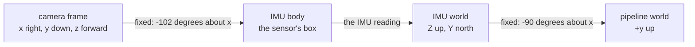

[Contents](README.md#contents) · [The colors](README.md#the-colors) · Previous: [1. Seeing in meters](01_seeing_in_meters.md) · Next: [3. Finding the floor](03_finding_the_floor.md)

# 2. Which way is up

The floor search in section 3 needs to know which way is up. From the picture alone it can't tell.
Tip a camera far enough and the floor looks like a wall, and a wall looks like a floor. Gravity
settles it. Both devices measure gravity, so the code turns their reading into an up direction as
the camera sees it. A device's reading of how it's turned is its **orientation**. When that
orientation is tied to gravity, the code calls the pose **gravity-aligned**.

Think of a spirit level glued to the camera. On the Pixel, ARCore reads the bubble and reports it
directly in the camera's terms. On the Neon, the bubble sits on the motion sensor's box, and that
box is glued to the frame at an angle to the camera, so the code also needs the glue angle. The
comparison stops working at one point. A spirit level only shows up, and the devices also report a
compass direction, which the floor search doesn't need.

The Neon's motion sensor is an **IMU**, an inertial measurement unit. It fuses its own sensors on
the device and reports its orientation as a **quaternion**, four numbers that describe one
rotation.

Every quantity here lives in one of these frames.

| Frame | Axes | Units | Where in the code |
|---|---|---|---|
| camera | x right in the picture, y down, z out of the lens (OpenCV) | m | `server/nav/types.py` |
| IMU body | The Neon IMU's own axes, Pupil Labs' convention | none | `server/nav/pose/neon_mount.py` |
| IMU world | Z up, Y toward magnetic north | none | `server/nav/pose/neon_mount.py` |
| pipeline world | +y up, `WORLD_UP = (0, 1, 0)`. On the Pixel, this is ARCore's world | m | `server/nav/types.py` |
| ground | Two floor directions, lateral to the right and forward, from section 3 | m | `server/nav/types.py` |

> [!NOTE]
> **Ingredients**
> - **Pixel.** ARCore's orientation, four numbers $`(w, x, y, z)`$ that turn the camera's axes into
>   ARCore's world, where +y is straight up. The phone sends the gravity-aligned flag as true, and
>   the laptop assumes true when the key is missing. ARCore also sends a position
>   (`server/nav/sources/framecodec.py`, `server/docs/arcore_wire_format.md`).
> - **Neon, live.** The IMU quaternion taken nearest the moment the frame was captured, within
>   0.05 s, read by field name as $`(w, x, y, z)`$. Not the newest one, because a frame reaches the
>   laptop 155 ms after capture at the median and the head keeps turning. A zero reading is never
>   used, and a frame with no usable reading that near has no orientation at all
>   (`server/nav/pose/imu_orientation.py`, `server/nav/sources/neon_stream.py`).
> - **Neon, recorded.** The recording's IMU sample nearest in time, within 0.05 s, reordered from
>   $`(x, y, z, w)`$ (`server/nav/sources/neon_plugin.py`).
> - **Mount angles.** Two fixed turns from Pupil Labs' documentation, not measured on our glasses
>   (`server/nav/pose/neon_mount.py`).
> - **Plain video.** Nothing. The code falls back to the picture's own up.

On the Neon, the camera's orientation is a chain of three turns.



## A turn about one axis, as four numbers

A turn by an angle $`\theta`$ about the sideways x axis, written as a quaternion:

```math
q_x(\theta) = \left(\cos\frac{\theta}{2},\ \sin\frac{\theta}{2},\ 0,\ 0\right)
```

The four numbers are in the order $`(q_w, q_x, q_y, q_z)`$, and positive angles turn right-handed.

| Symbol | Plain English | Units | Frame | Where in the code |
|---|---|---|---|---|
| $`\theta`$ | The turn angle about x | degrees | between the two frames it links | `server/nav/pose/neon_mount.py` |
| $`q_x(\theta)`$ | That turn as a unit quaternion | none | between the two frames | `server/nav/pose/neon_mount.py` |

**Worked example: the Neon's two mount turns.**
1. Camera into IMU body, $`\theta = -102^\circ`$. Half of that is $`-51^\circ`$, so
   $`q = (\cos(-51^\circ), \sin(-51^\circ), 0, 0) = (0.629320, -0.777146, 0, 0)`$. Pupil Labs writes
   this angle as $`-90 - 12`$. The 90 relabels axes, and the 12 is the camera tilted down from the
   module's forward direction.
2. IMU world into pipeline world, $`\theta = -90^\circ`$:
   $`q = (0.707107, -0.707107, 0, 0)`$. A quarter turn about x sends the IMU world's up, $`(0, 0, 1)`$,
   to $`(0, 1, 0)`$, our up. It sends north, $`(0, 1, 0)`$, to $`(0, 0, -1)`$, so north ends up on
   minus z.

> [!NOTE]
> **Vendor numbers: Pupil Labs.** Both angles come from Pupil Labs' IMU transformation
> documentation, and the code says so. They weren't measured on our glasses, and they're assumed
> identical for every Neon. The mount file's comment still says the first live run is what
> confirms them. The 2026-10-05 replay found a floor on 91 percent of frames, but no comment
> records the angles as confirmed.

## Chaining turns: the Hamilton product

Two turns in a row combine by multiplying their quaternions with the **Hamilton product**. The
right-hand one happens first, and the order matters.

```math
\begin{aligned}
(a \otimes b)_w &= a_w b_w - a_x b_x - a_y b_y - a_z b_z \\
(a \otimes b)_x &= a_w b_x + a_x b_w + a_y b_z - a_z b_y \\
(a \otimes b)_y &= a_w b_y - a_x b_z + a_y b_w + a_z b_x \\
(a \otimes b)_z &= a_w b_z + a_x b_y - a_y b_x + a_z b_w
\end{aligned}
```

| Symbol | Plain English | Units | Frame | Where in the code |
|---|---|---|---|---|
| $`a, b`$ | Two rotations, $`b`$ applied first | none | $`b`$ ends where $`a`$ starts | `server/nav/pose/imu_orientation.py` |
| $`a \otimes b`$ | Both turns as one | none | from $`b`$'s start to $`a`$'s end | `server/nav/pose/imu_orientation.py` |

**Worked example: both mount turns at once.** $`q_x(-90^\circ) \otimes q_x(-102^\circ)`$:
1. $`w = 0.707107 \times 0.629320 - (-0.707107)(-0.777146) = 0.444997 - 0.549525 = -0.104528`$
2. $`x = 0.707107 \times (-0.777146) + (-0.707107)(0.629320) = -0.549525 - 0.444997 = -0.994522`$
3. $`y = z = 0`$

That's $`(\cos(-96^\circ), \sin(-96^\circ), 0, 0) = q_x(-192^\circ)`$. Two turns about the same axis
add up, which is the check.

> [!TIP]
> **Ours, standard algebra.** The product is written out by hand in the code rather than pulled
> from a library.

## The camera's orientation from the IMU

Chain the three turns: camera into the IMU's box, the box into the IMU's world, that world into
ours. The result says how the camera is turned in the pipeline world. It knows up and north. It
doesn't know where the camera is.

```math
q_{\text{wc}} = \frac{q_{\text{w}\leftarrow\text{iw}} \otimes \hat q_{\text{imu}} \otimes q_{\text{b}\leftarrow\text{c}}}{\lVert\,q_{\text{w}\leftarrow\text{iw}} \otimes \hat q_{\text{imu}} \otimes q_{\text{b}\leftarrow\text{c}}\,\rVert},\qquad \hat q_{\text{imu}} = \frac{q_{\text{imu}}}{\lVert q_{\text{imu}}\rVert}
```

The pose that comes out has no position and has the gravity-aligned flag set to true.

| Symbol | Plain English | Units | Frame | Where in the code |
|---|---|---|---|---|
| $`q_{\text{imu}}`$ | The IMU's reading, not always exactly length 1 | none | IMU body into IMU world | `server/nav/pose/imu_orientation.py` |
| $`q_{\text{b}\leftarrow\text{c}}`$ | $`q_x(-102^\circ)`$ | none | camera into IMU body | `server/nav/pose/neon_mount.py` |
| $`q_{\text{w}\leftarrow\text{iw}}`$ | $`q_x(-90^\circ)`$ | none | IMU world into pipeline world | `server/nav/pose/neon_mount.py` |
| $`q_{\text{wc}}`$ | The camera's orientation | none | camera into pipeline world | `server/nav/pose/imu_orientation.py` |

| Step | Expression | Why |
|---|---|---|
| 1 | $`\hat q_{\text{imu}} = q_{\text{imu}} / \lVert q_{\text{imu}}\rVert`$ | A rotation has length 1, and the reading may be slightly off |
| 2 | $`\hat q_{\text{imu}} \otimes q_{\text{b}\leftarrow\text{c}}`$ | Camera into the box, then the box into the IMU world |
| 3 | $`q_{\text{w}\leftarrow\text{iw}} \otimes (\dots)`$ | The IMU world into ours |
| 4 | Divide by the length | Keep the result a clean rotation after rounding |

**Worked example: the box sitting level, facing north.** That reading is $`(1, 0, 0, 0)`$, no turn.
Then $`q_{\text{wc}} = q_x(-90^\circ) \otimes (1,0,0,0) \otimes q_x(-102^\circ) = (-0.104528, -0.994522, 0, 0)`$,
a $`-192^\circ`$ turn about x. The lens direction, camera $`(0, 0, 1)`$, lands at
$`(0,\ -\sin(-192^\circ),\ \cos(-192^\circ)) = (0, -0.2079, -0.9781)`$ in the pipeline world. That's
toward north, minus z, and 12 degrees below level, the camera's tilt. A reading of $`(2, 0, 0, 0)`$
gives the same answer after step 1.

**Readings that aren't rotations.** A quaternion that's nearly zero, or not a number, is a dropped
reading. The code skips it and keeps the last good one.

```math
\text{usable when } \lVert q\rVert \text{ is finite and } \lVert q\rVert \ge 0.5
```

A mount quaternion written into the code has to be a true rotation, $`\big\lvert\,\lVert q\rVert - 1\,\big\rvert \le 10^{-6}`$.

1. $`(0, 0, 0, 0)`$ has length 0, under 0.5, so it's skipped.
2. $`(0.5, 0, 0, 0)`$ has length exactly 0.5, so it's kept and scaled to $`(1, 0, 0, 0)`$.
3. The two mount quaternions above have length 1 to within about $`10^{-16}`$.

> [!TIP]
> **Ours: the chain and the gates.** The chain links Pupil Labs' documented mount to the
> orientation the glasses compute themselves. The empty-reading gate is there because the Neon sent
> nothing but zero quaternions for minutes at a time on 2026-10-05
> (`server/nav/pose/imu_orientation.py`).

> [!WARNING]
> The pose has no position, so nothing on the Neon route places points in a world that stays put.
> A live frame with no usable IMU reading within 0.05 s of its capture falls back to the picture's
> own up, which assumes the head is level. And the 0.5 cut accepts a badly scaled but nonzero
> reading and quietly rescales it.

## Up, as the camera sees it

The floor search works in the camera frame, so it needs up written in camera axes. First the
quaternion becomes a 3 by 3 **rotation matrix** $`R`$. Each column of $`R`$ is one camera axis written
in world coordinates.

```math
R = \begin{pmatrix} 1 - 2(q_y^2 + q_z^2) & 2(q_x q_y - q_z q_w) & 2(q_x q_z + q_y q_w) \\ 2(q_x q_y + q_z q_w) & 1 - 2(q_x^2 + q_z^2) & 2(q_y q_z - q_x q_w) \\ 2(q_x q_z - q_y q_w) & 2(q_y q_z + q_x q_w) & 1 - 2(q_x^2 + q_y^2) \end{pmatrix}
```

Then up in the camera frame is the world's up turned back into camera axes, when the pose is
gravity-aligned. Turning back is the transpose, $`R^\top`$.

```math
\mathbf{u}_{\text{cam}} = \begin{cases} R^\top\,(0, 1, 0) & \text{if the pose is flagged gravity-aligned} \\ (0, -1, 0) & \text{otherwise, the picture's own up} \end{cases}
```

**Gravity is used whenever the pose is flagged gravity-aligned, with or without a position.** The
Neon has no position and still gets gravity. The code ties up to the flag, not to a position
(`server/nav/scene/pipeline.py`).

| Symbol | Plain English | Units | Frame | Where in the code |
|---|---|---|---|---|
| $`(q_w, q_x, q_y, q_z)`$ | The camera's orientation, scaled to length 1 | none | camera into pipeline world | `server/nav/scene/transform.py` |
| $`R`$ | The same rotation as a matrix | none | camera into pipeline world | `server/nav/scene/transform.py` |
| $`(0, 1, 0)`$ | `WORLD_UP` | none | pipeline world | `server/nav/types.py` |
| $`(0, -1, 0)`$ | `CAMERA_UP`, the top of the picture | none | camera | `server/nav/scene/floor.py` |
| $`\mathbf{u}_{\text{cam}}`$ | Up, in camera axes, length 1 | none | camera | `server/nav/scene/pipeline.py` |

**Worked example: a level head on the Neon.** With $`q = (-0.104528, -0.994522, 0, 0)`$:
1. $`q_x^2 = 0.989074`$ and $`q_x q_w = 0.103956`$.
2. $`R_{11} = R_{22} = 1 - 2 \times 0.989074 = -0.978148`$, $`R_{12} = -2 \times 0.103956 = -0.207912`$,
   $`R_{21} = 0.207912`$, $`R_{00} = 1`$, everything else 0. That's a $`-192^\circ`$ turn about x.
3. $`R^\top(0, 1, 0)`$ is the second row of $`R`$: $`\mathbf{u}_{\text{cam}} = (0, -0.978148, -0.207912)`$.
4. Its angle from the picture's up is $`\arccos(0.978148) = 12.0^\circ`$, the camera's tilt from the
   vendor's mount.

So with the head level, up points mostly toward the top of the picture and a little back toward
the wearer. Section 3 uses this vector.

> [!TIP]
> **Ours: gravity from the flag, not from a position.** The Pixel in portrait sends its depth image
> sideways, and measured against the picture's up its floor leaned 89 degrees on every frame of the
> first walk. The glasses report gravity and no position at all, and the code's comment records
> that asking for a position threw their gravity away (`server/nav/scene/pipeline.py`).

> [!WARNING]
> The picture's own up is right only for a level camera. It's used for plain video files, for live
> Neon frames that arrive before the first usable IMU reading, and on the Neon Player plugin route
> until a usable IMU sample turns up, which for a recording with no IMU data is every frame. That's the one place the code
> assumes a level camera on purpose. Section 1's fallback camera shows what a pitched camera then
> gets wrong.

## Into the world, when there is a position

Only the Pixel has a position, from ARCore's tracking. With one, each camera-frame point is turned
into the world and then shifted by where the camera is. The floor plane from section 3 moves the
same way. A plane is written as $`\mathbf{n}\cdot\mathbf{p} + d = 0`$, where $`\mathbf{n}`$ is the
direction straight out of it and $`d`$ is its offset.

```math
\mathbf{p}_w = R\,\mathbf{p}_c + \mathbf{t},\qquad \mathbf{n}_w = R\,\mathbf{n}_c,\qquad d_w = d_c - \mathbf{n}_w\cdot\mathbf{t}
```

| Symbol | Plain English | Units | Frame | Where in the code |
|---|---|---|---|---|
| $`\mathbf{p}_c`$, $`\mathbf{p}_w`$ | A point, before and after | m | camera, pipeline world | `server/nav/scene/transform.py` |
| $`\mathbf{t}`$ | Where the camera is | m | pipeline world | `server/nav/scene/transform.py` |
| $`\mathbf{n}_c`$, $`\mathbf{n}_w`$ | The plane's direction, before and after | none | camera, pipeline world | `server/nav/scene/transform.py` |
| $`d_c`$, $`d_w`$ | The plane's offset, before and after | m | camera, pipeline world | `server/nav/scene/transform.py` |

**Worked example, arithmetic only.** No current route pairs the Neon's rotation with a position, so
this just shows the sums. Take $`R`$ from above and a camera 1.56 m up, $`\mathbf{t} = (0, 1.56, 0)`$.
1. Section 1's point, $`\mathbf{p}_c = (0.7141, 0.7141, 1.51)`$:
   $`R\,\mathbf{p}_c = (0.7141,\ -0.698495 - 0.313947,\ 0.148470 - 1.477003) = (0.7141, -1.0124, -1.3285)`$.
2. Add $`\mathbf{t}`$: $`\mathbf{p}_w = (0.7141, 0.5476, -1.3285)`$, a point 0.55 m above the floor and
   1.33 m to the north.
3. The level floor in camera axes, $`\mathbf{n}_c = (0, -0.978148, -0.207912)`$ with $`d_c = 1.56`$:
   $`\mathbf{n}_w = (0,\ 0.956774 + 0.043227,\ -0.203373 + 0.203373) = (0, 1, 0)`$ and
   $`d_w = 1.56 - 1.56 = 0`$. The floor is the plane $`y = 0`$.

The point's height comes out 0.5476 m in both frames, which section 3 checks from the camera side.

> [!TIP]
> **Ours, standard rigid motion.** The convention is written in the code: an orientation turns
> camera-frame vectors into the world, and world equals $`R`$ times camera plus position
> (`server/nav/scene/transform.py`).

---

[Contents](README.md#contents) · [The colors](README.md#the-colors) · Previous: [1. Seeing in meters](01_seeing_in_meters.md) · Next: [3. Finding the floor](03_finding_the_floor.md)
