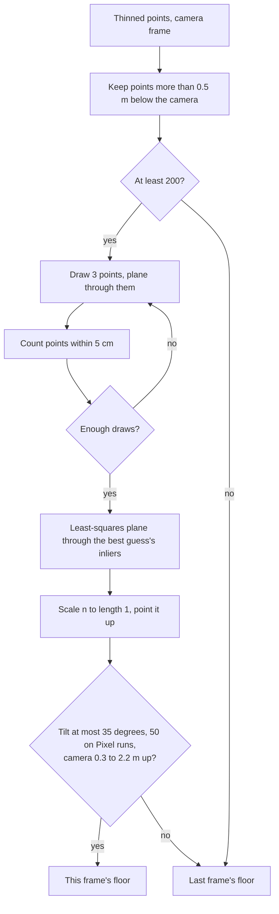

[Contents](README.md#contents) · [The colors](README.md#the-colors) · Previous: [2. Which way is up](02_which_way_is_up.md) · Next: [4. Obstacles and the walker's body](04_obstacles_and_body.md)

# 3. Finding the floor

Clearance is measured along the floor, and an obstacle is only an obstacle if it sticks up from
the floor. So every frame, the code looks for the floor among the points from section 1. It takes
the biggest flat surface below the camera that's roughly level. The method is to guess a plane
through three random points, count how many points lie close to it, repeat, keep the best guess,
and then fit it properly to all the points that were close. That method is called **RANSAC**,
short for random sample consensus. The points close to a guess are its **inliers**.

Picture finding a table top in a cluttered room by laying a sheet of glass on three random spots
and counting how many things touch the glass. Try enough times and the table top wins, because it
has more things lying on it than any slanted guess through a chair and a lamp. The comparison
stops working at one point. The code doesn't just keep the winning sheet where it landed. It tilts
it to sit as close as it can to everything that touched it.

> [!NOTE]
> **Ingredients**
> - **Points.** The thinned camera-frame points from section 1, one per 5 cm cube.
> - **Up.** $`\mathbf{u}_{\text{cam}}`$ from section 2, in the camera frame: gravity when the pose is
>   flagged gravity-aligned, the picture's up otherwise.
> - **Last frame's floor.** Used again when this frame's guess is refused.
> - **ARCore's plane, on the Pixel.** When the phone supplies a floor plane, it goes through the
>   same level and height checks as a fitted one (`server/nav/scene/pipeline.py`).

A plane is written $`\mathbf{n}\cdot\mathbf{p} + d = 0`$. $`\mathbf{n}`$ is the direction straight out
of the plane, length 1, and $`d`$ is the offset. Everything in this section is in the camera frame,
unless the Pixel's position moves it into the world as in section 2.



## Which points may vote

Only points well below the camera get a vote, so a big wall straight ahead can't win.

```math
b_i = -(\mathbf{p}_i \cdot \mathbf{u}_{\text{cam}}),\qquad \text{a candidate when } b_i > 0.5\ \text{m}
```

The search runs only with at least 200 candidates. With fewer, last frame's floor is kept.

| Symbol | Plain English | Units | Frame | Where in the code |
|---|---|---|---|---|
| $`\mathbf{p}_i`$ | One thinned point | m | camera | `server/nav/scene/floor.py` |
| $`\mathbf{u}_{\text{cam}}`$ | Up, length 1 | none | camera | `server/nav/scene/pipeline.py` |
| $`b_i`$ | How far below the camera the point is, measured along up | m | camera | `server/nav/scene/floor.py` |

**Worked example: a level head on the Neon,** $`\mathbf{u}_{\text{cam}} = (0, -0.978148, -0.207912)`$.
1. Section 1's point $`(0.7141, 0.7141, 1.51)`$:
   $`\mathbf{p}\cdot\mathbf{u} = -0.6985 - 0.3139 = -1.0124`$, so $`b = 1.012`$ m. A candidate.
2. A point straight down the lens axis, $`(0, 0, 3)`$: $`b = 3 \times 0.207912 = 0.624`$ m. Also a
   candidate, because the camera looks 12 degrees down. Any point on the axis further than
   $`0.5 / 0.2079 = 2.40`$ m qualifies.

## A guess through three points

Pick three candidates at random. The plane through them is one guess at the floor. The direction
straight out of it is the **cross product** of two edges of the triangle.

```math
\mathbf{n} = \frac{(\mathbf{p}_2 - \mathbf{p}_1)\times(\mathbf{p}_3 - \mathbf{p}_1)}{\lVert(\mathbf{p}_2 - \mathbf{p}_1)\times(\mathbf{p}_3 - \mathbf{p}_1)\rVert},\qquad d = -\mathbf{n}\cdot\mathbf{p}_1
```

The three are drawn with replacement, at most 300 times. The random generator restarts from the
same seed, 0, on every frame. A triple whose cross product has zero length lies on a line, and it's
skipped.

| Symbol | Plain English | Units | Frame | Where in the code |
|---|---|---|---|---|
| $`\mathbf{p}_1, \mathbf{p}_2, \mathbf{p}_3`$ | The three drawn candidates | m | camera | `server/nav/scene/floor.py` |
| $`\mathbf{n}`$ | The guess's direction out of the plane, length 1 | none | camera | `server/nav/scene/floor.py` |
| $`d`$ | The guess's offset | m | camera | `server/nav/scene/floor.py` |

**Worked example: a level camera 1.56 m up,** so the floor is at camera $`y = 1.56`$. The points are
$`(0, 1.56, 2)`$, $`(1, 1.56, 3)`$ and $`(-1, 1.56, 4)`$.
1. Edges: $`(1, 0, 1)`$ and $`(-1, 0, 2)`$.
2. Cross product: $`(0 \cdot 2 - 1 \cdot 0,\ 1 \cdot (-1) - 1 \cdot 2,\ 1 \cdot 0 - 0 \cdot (-1)) = (0, -3, 0)`$.
3. $`\mathbf{n} = (0, -1, 0)`$, and $`d = -(0, -1, 0)\cdot(0, 1.56, 2) = 1.56`$.

> [!TIP]
> **Ours, in Open3D's shape.** The code reimplements Open3D's RANSAC. Open3D's version ignored its
> seed, and a replay came out different every run. A fresh generator from the same seed on every
> call means the same cloud always draws the same planes, and a frame's floor never depends on the
> frames before it (`server/nav/scene/floor.py`). The 300 draws come from the team's earlier
> script.

## Scoring a guess

Each guess scores the number of points within 5 cm of it. If two guesses tie, the one whose
inliers sit closer wins, measured by their **root mean square error** (RMSE), the typical distance
from the plane. If that ties too, the earlier draw wins.

```math
\delta_{ij} = \lvert\mathbf{n}_j\cdot\mathbf{p}_i + d_j\rvert,\qquad m_j = \#\{\,i : \delta_{ij} < \delta_{\max}\,\},\qquad \text{RMSE}_j = \sqrt{\frac{\sum_{i\,:\,\delta_{ij} < \delta_{\max}} \delta_{ij}^2}{\max(m_j, 1)}}
```

| Symbol | Plain English | Units | Frame | Where in the code |
|---|---|---|---|---|
| $`\delta_{ij}`$ | Distance from point $`i`$ to guess $`j`$ | m | camera | `server/nav/scene/floor.py` |
| $`\delta_{\max}`$ | How close counts as on the plane, 0.05, strictly under | m | none | `server/nav/scene/config.py` |
| $`m_j`$ | How many inliers guess $`j`$ has | count | none | `server/nav/scene/floor.py` |
| $`\text{RMSE}_j`$ | Typical distance of those inliers from the plane | m | none | `server/nav/scene/floor.py` |

Since $`\mathbf{n}`$ has length 1, $`\mathbf{n}\cdot\mathbf{p} + d`$ is exactly the distance from the
point to the plane, with a sign for which side.

**Worked example: the guess from above,** $`\mathbf{n} = (0, -1, 0)`$, $`d = 1.56`$, so
$`\delta = \lvert 1.56 - y\rvert`$.
1. $`y = 1.60`$: $`\delta = 0.04`$, an inlier.
2. $`y = 1.56`$: $`\delta = 0`$, an inlier.
3. $`y = 1.53`$: $`\delta = 0.03`$, an inlier.
4. $`y = 1.62`$: $`\delta = 0.06`$, not one.

So $`m = 3`$ and $`\text{RMSE} = \sqrt{(0.0016 + 0 + 0.0009)/3} = 0.0289`$ m.

> [!NOTE]
> **Library rule: Open3D.** Strictly under the distance counts, and guesses are tried in the order
> drawn, as in Open3D, which the code's comments say. The 0.05 m distance comes from the team's
> earlier script.

## When to stop drawing

Once the best guess so far covers most points, a better one is unlikely to still be undrawn, so
the search stops early. The rule asks how many draws it takes to have picked three inliers at
least once, with a set probability.

```math
k_{\text{needed}} = \frac{\ln(1 - P)}{\ln(1 - \beta^3)},\qquad \beta = \frac{m_{\text{best}}}{m_{\text{cand}}}
```

$`k_{\text{needed}}`$ is updated, keeping the smallest value so far, each time a better guess turns
up. The loop stops after draw number $`i`$, counting from 0, once $`i + 1 \ge k_{\text{needed}}`$, and
never goes past 300.

| Symbol | Plain English | Units | Frame | Where in the code |
|---|---|---|---|---|
| $`P`$ | How sure the search wants to be, 0.99999999 | probability | none | `server/nav/scene/config.py` |
| $`\beta`$ | The best guess's share of the candidates | fraction | none | `server/nav/scene/floor.py` |
| $`m_{\text{best}}`$, $`m_{\text{cand}}`$ | Inliers of the best guess, and all candidates | count | none | `server/nav/scene/floor.py` |
| $`k_{\text{needed}}`$ | Draws needed, a real number | count | none | `server/nav/scene/floor.py` |

| Step | Expression | Why |
|---|---|---|
| 1 | $`\beta^3`$ | The chance one draw picks three inliers |
| 2 | $`(1 - \beta^3)^k`$ | The chance $`k`$ draws all miss |
| 3 | $`(1 - \beta^3)^k = 1 - P`$ | Set the miss chance to what the search accepts |
| 4 | $`k = \ln(1 - P) / \ln(1 - \beta^3)`$ | Take logs and solve for $`k`$ |

**Worked example.** $`\ln(1 - 0.99999999) = \ln(10^{-8}) = -18.4207`$.
1. A floor that's 90 percent of the candidates: $`\beta^3 = 0.729`$, $`\ln(0.271) = -1.30564`$,
   $`k = 14.11`$. The loop stops after the 15th draw.
2. Half the candidates: $`\beta^3 = 0.125`$, $`\ln(0.875) = -0.133531`$, $`k = 137.95`$. It stops after
   138.
3. Below about $`\beta = 0.39`$, where $`\beta^3 = 0.0596`$, $`k`$ passes 300 and every draw runs.

> [!NOTE]
> **Library rule: Open3D.** The code's comment calls this Open3D's stopping rule, and $`P`$ is
> Open3D's default. Comparing a whole draw count against a real $`k`$ works out the same as rounding
> $`k`$ up.

## The final fit

The winning guess runs through three noisy points. The final floor is the flat plane that sits
closest to all of the winner's inliers at once. That's a **least-squares fit**. It goes through
their average point, and it faces the direction in which they're spread the least.

```math
\mathbf{c} = \frac{1}{\lvert M\rvert}\sum_{\mathbf{p}\in M}\mathbf{p},\qquad C = \sum_{\mathbf{p}\in M}(\mathbf{p} - \mathbf{c})(\mathbf{p} - \mathbf{c})^\top,\qquad \mathbf{n} = \text{the eigenvector of } C \text{ with the smallest eigenvalue},\qquad d = -\mathbf{n}\cdot\mathbf{c}
```

Then $`\mathbf{n}`$ is scaled to length 1 and flipped if it points down, so that $`d`$ reads directly as
the camera's height above the floor.

```math
\text{if } \mathbf{n}\cdot\mathbf{u}_{\text{cam}} < 0:\quad (\mathbf{n}, d) \leftarrow (-\mathbf{n}, -d)
```

| Symbol | Plain English | Units | Frame | Where in the code |
|---|---|---|---|---|
| $`M`$ | The winning guess's inliers | none | camera | `server/nav/scene/floor.py` |
| $`\mathbf{c}`$ | Their average point | m | camera | `server/nav/scene/floor.py` |
| $`C`$ | How they spread in each direction, the **scatter matrix** | m² | camera | `server/nav/scene/floor.py` |
| $`\mathbf{n}`$, $`d`$ | The final floor | none, m | camera | `server/nav/scene/floor.py` |

An eigenvector of $`C`$ is a direction, and its eigenvalue says how spread the points are along it.
Points on a floor are spread out across it and hardly at all up and down, so the smallest
eigenvalue's direction is straight up out of the floor.

**Worked example: the three points from above.**
1. $`\mathbf{c} = (0, 1.56, 3)`$, and the points sit at $`(0, 0, -1)`$, $`(1, 0, 0)`$ and $`(-1, 0, 1)`$
   from it.
2. $`C_{xx} = 0 + 1 + 1 = 2`$, $`C_{zz} = 1 + 0 + 1 = 2`$, $`C_{xz} = 0 + 0 - 1 = -1`$, and every entry
   with $`y`$ is 0.
3. The eigenvalues are 0, 1 and 3. The smallest, 0, has direction $`(0, \pm 1, 0)`$.
4. Suppose it comes back as $`(0, 1, 0)`$, so $`d = -1.56`$. Up is $`(0, -1, 0)`$ for a level camera, so
   $`\mathbf{n}\cdot\mathbf{u} = -1 < 0`$ and the plane flips to $`\mathbf{n} = (0, -1, 0)`$, $`d = 1.56`$.
5. The camera's height is $`\mathbf{n}\cdot\mathbf{0} + d = 1.56`$ m.

> [!WARNING]
> The fit makes the distance straight out of the plane small, not the vertical distance. Which way
> the eigenvector points is arbitrary, and the flip toward up is what fixes it.

> [!NOTE]
> **Library rule: Open3D.** The code's comment says the least-squares plane through all the
> inliers is what Open3D returns too. The flip toward up is ours.

## Is it really the floor?

A plane only counts as the floor if it's roughly level, the camera isn't too close to it, and the
camera isn't impossibly high above it. A refused plane falls back to last frame's floor. With no
earlier floor to fall back to, the code raises an error for that frame.

```math
\varphi = \arccos\big(\text{clip}(\mathbf{n}\cdot\mathbf{u}_{\text{cam}}, -1, 1)\big)
```

The checks run in this order, and the first one broken is the reason given:

1. Refuse if $`\varphi > \varphi_{\max}`$.
2. Refuse if $`d \le 0.3`$ m.
3. Refuse if $`d > 2.2`$ m.

| Symbol | Plain English | Units | Frame | Where in the code |
|---|---|---|---|---|
| $`\varphi`$ | How far the floor's direction leans from up, its **tilt** | degrees | camera | `server/nav/scene/floor.py` |
| $`\varphi_{\max}`$ | The most lean allowed, 35 by default, `--floor-max-tilt` | degrees | none | `server/nav/scene/config.py` |
| $`d`$ | The camera's height above the plane | m | camera | `server/nav/scene/floor.py` |
| 0.3, 2.2 | Lowest and highest camera height allowed, the second set by `--floor-max-height` | m | none | `server/nav/scene/config.py` |

The tilt is measured against $`\mathbf{u}_{\text{cam}}`$, so against gravity whenever the pose is
gravity-aligned. The live Pixel runs and the phone video runs used $`\varphi_{\max} = 50`$. The Neon
commands pass no tilt flag, so they ran at 35. The evaluation replays take the tilt from each
recording's own `run_config.json`, so the Neon replay ran at 35 too. In dot products, 35
degrees needs $`\mathbf{n}\cdot\mathbf{u} \ge \cos 35^\circ = 0.8192`$, and 50 degrees needs
$`\ge \cos 50^\circ = 0.6428`$. The server README gives the phone's 40 degree pitch toward the
pavement as the reason for 50. Against gravity the phone's pitch doesn't change the tilt, so the
repository doesn't settle why 50 suits the Pixel.

**Worked example: the Neon in the 2026-10-05 session**
(`docs/evaluation/neon_glasses_first_session.md`).
1. On the replay with the depth conversion, the camera sat a median 1.56 m up, inside 0.3 to
   2.2 m. 395 of 432 frames fitted a floor, 91 percent.
2. The other 37 were walls, refused for leaning a median 82.6 degrees, over 35. Each of those
   frames kept the last floor it had.
   `python -m nav.evaluation.check_planner floor <frame log>` prints these figures for any recorded
   run (`server/nav/evaluation/floor_report.py`). A fresh `--neon-replay` of the same capture on
   2026-10-08 planned 388 frames and fitted 361 of them, 93 percent. The camera sat a median 1.57 m
   up, 1.41 to 1.66 m between the 10th and 90th percentiles. 25 frames were refused for leaning a
   median 81.5 degrees, and 2 for a floor more than 2.2 m down. A replay plans whichever frame is
   newest when the last one finishes, so how many frames it plans moves with the laptop's speed.
3. On the live walk without the conversion, the floor came out about 2.9 m down, over 2.2, and
   only 243 of 570 frames fitted a floor.
4. Section 1's converted heights, 1.51 to 1.56 m, all pass.

> [!WARNING]
> Only the first broken rule is reported. A camera exactly 0.3 m up is refused, and one exactly
> 2.2 m up passes. A refusal quietly reuses last frame's floor, so a run of refused frames keeps an
> old floor in place.

> [!TIP]
> **Ours.** The tilt and minimum height come from the team's earlier script. The 2.2 m maximum
> comes from the first Pixel walk, where ARCore handed over a plane 2.3 m down, a meter below the
> real floor, and nothing refused it. A head-worn or hand-held camera is under about two meters
> (`server/nav/scene/config.py`, `server/nav/scene/floor.py`).

## Height above the floor, and what counts as in the way

With $`\mathbf{n}`$ length 1 and pointing up, putting a point into the plane's equation gives its
height above the floor. Only points a walker could bump into are kept, above the ankle and below
the head.

```math
e_i = \mathbf{n}\cdot\mathbf{p}_i + d,\qquad \text{kept when } 0.20 < e_i < 2.00\ \text{m}
```

That's in the camera frame when there's no position, and in the world frame after section 2's move
when there is one.

| Symbol | Plain English | Units | Frame | Where in the code |
|---|---|---|---|---|
| $`e_i`$ | How high point $`i`$ is above the floor | m | camera, or pipeline world on the Pixel | `server/nav/scene/floor.py` |
| 0.20 | Ankle height. Below it is floor | m | none | `server/nav/scene/config.py` |
| 2.00 | Head height. Above it the walker passes under | m | none | `server/nav/scene/config.py` |

The letter $`e`$ (for elevation) keeps this apart from the body half-width $`h`$ used from section 4 on.

**Worked example: the Neon floor** $`\mathbf{n} = (0, -0.978148, -0.207912)`$, $`d = 1.56`$.
1. Section 1's point $`(0.7141, 0.7141, 1.51)`$: $`\mathbf{n}\cdot\mathbf{p} = -1.0124`$, so
   $`e = -1.0124 + 1.56 = 0.5476`$ m. Kept. That's the same 0.5476 m section 2 got in the world.
2. A point exactly 0.20 m up is dropped, and so is one exactly 2.00 m up. Both limits are strict.

> [!WARNING]
> The band is fixed. It isn't tied to the actual walker's height.

> [!TIP]
> **Ours.** Both heights come from the team's earlier script.

## Forward and sideways on the floor

The planner thinks in two floor directions, **forward** and **lateral**. Forward is where the
camera points, flattened onto the floor. Lateral is the floor direction at right angles to it,
positive to the right.

```math
\mathbf{f}_0 = \mathbf{a} - (\mathbf{a}\cdot\mathbf{n})\,\mathbf{n},\qquad \mathbf{f} = \frac{\mathbf{f}_0}{\lVert\mathbf{f}_0\rVert},\qquad \boldsymbol{\ell} = \mathbf{f}\times\mathbf{n}
```

A point's ground position is then $`(\mathbf{p}\cdot\boldsymbol{\ell},\ \mathbf{p}\cdot\mathbf{f})`$,
measured from the walker. If the camera looks almost straight down, $`\lVert\mathbf{f}_0\rVert < 10^{-3}`$,
the code swaps in another hint: $`(0, 0, 1)`$ when $`\lvert n_z\rvert < 0.9`$, otherwise $`(1, 0, 0)`$.

| Symbol | Plain English | Units | Frame | Where in the code |
|---|---|---|---|---|
| $`\mathbf{a}`$ | The lens direction, $`(0, 0, 1)`$ in the camera frame, or $`R(0, 0, 1)`$ in the world | none | camera, or pipeline world | `server/nav/scene/pipeline.py` |
| $`\mathbf{f}_0`$ | The lens direction with its up part removed | none | same | `server/nav/scene/floor.py` |
| $`\mathbf{f}`$ | Forward, length 1 | none | ground | `server/nav/scene/floor.py` |
| $`\boldsymbol{\ell}`$ | Lateral, length 1, positive right | none | ground | `server/nav/scene/floor.py` |

**Worked example: the level head on the Neon,** in the camera frame.
1. $`\mathbf{a}\cdot\mathbf{n} = -0.207912`$.
2. $`\mathbf{f}_0 = (0, 0, 1) + 0.207912 \times (0, -0.978148, -0.207912) = (0, -0.203372, 0.956773)`$,
   with length 0.978149.
3. $`\mathbf{f} = (0, -0.207912, 0.978148)`$.
4. $`\boldsymbol{\ell} = \mathbf{f}\times\mathbf{n} = \big((-0.207912)(-0.207912) - (0.978148)(-0.978148),\ 0,\ 0\big) = (0.043227 + 0.956774, 0, 0) = (1, 0, 0)`$,
   the camera's right.
5. Section 1's point $`(0.7141, 0.7141, 1.51)`$ sits at lateral $`0.714`$ m and forward
   $`0.7141 \times (-0.207912) + 1.51 \times 0.978148 = -0.148 + 1.477 = 1.329`$ m.

So the point is 0.71 m to the right, 1.33 m ahead and 0.55 m up. Section 4 takes it from there.

> [!WARNING]
> Forward follows the camera, which on the Neon is the head, not the body or the direction of
> walking. Turning the head turns "forward" with it.

> [!TIP]
> **Ours.** Sections 4 and on place obstacles and plan sideways steps in these two floor
> directions, not in camera axes.

---

[Contents](README.md#contents) · [The colors](README.md#the-colors) · Previous: [2. Which way is up](02_which_way_is_up.md) · Next: [4. Obstacles and the walker's body](04_obstacles_and_body.md)
