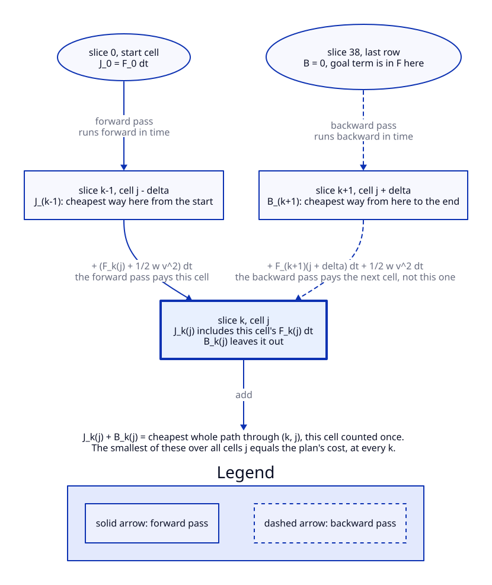

[Contents](README.md#contents) · [The colors](README.md#the-colors) · Previous: [7. The field](07_the_field.md) · Next: [9. The arrow and the alarm](09_arrow_and_alarm.md)

# 8. Planning a path

The planner looks 3.8 s ahead and chops that into slices 0.1 s apart. Counting now, that's 39
slices. At every slice the walker can be at one of 61 sideways positions, 0.1 m apart, from 3 m
left to 3 m right. A path is one position per slice. Each path gets a cost: the surprise the field
from section 7 charges at every position it passes, plus the effort of moving sideways to get
there. The planner wants the cheapest path.

Trying every path is hopeless. With three moves per step (left, stay, right) over 38 steps there
are $`3^{38}`$ paths, about $`1.35 \times 10^{18}`$ ($`38 \times \log_{10} 3 = 38 \times 0.4771 = 18.13`$).
So the planner works slice by slice and keeps, for every position, only the cheapest way of
getting there. That trick is called a **dynamic program**, and the slice-by-slice update is its
**forward recurrence**. The same idea run from the far end is the **backward recurrence**. The
planner itself only needs the forward one. Section 10 needs both.

Think of crossing a wide river on stepping stones laid out in rows. You can only hop to the stone
straight ahead or one stone to either side. Starting from the bank, you chalk on every stone of the
next row the cheapest total it takes to reach it, and to do that you only look at the three stones
behind it. When you reach the far bank, the cheapest stone there tells you the cheapest crossing,
and following the chalk back tells you the route. Where it stops working: a real walker can drift
sideways at any speed, and the planner only knows standing still sideways or a full 1.0 m/s
sidestep.



> [!NOTE]
> **Ingredients**
> - The field $`F_k(j)`$, every surprise term added up, per second, for each slice and position.
>   It comes from section 7. On the last slice it also carries the goal term, and on the first
>   second the previous-plan prior. Both are in the next part of this section.
> - The start position, the cell nearest the walker's current offset, which is 0 m.
> - The time step $`\Delta t`$ = 0.1 s and the horizon of 3.8 s, from `server/nav/planner/config.py`.
> - The lateral grid, 61 cells at $`\Delta g`$ = 0.1 m, from the same file.
> - The sideways speed limit $`v_{\text{lat}}`$ = 1.0 m/s and the kinetic weight $`w`$ = 6.5, from the
>   same file.

## The formulas

**The grid.** Position $`j`$ sits at $`g_j`$ meters to the side, positive to the right. Slice $`k`$ is
$`t_k`$ seconds from now.

```math
g_j = -3.0 + 0.1\,j \ \text{m}, \quad j = 0, \dots, 60, \qquad t_k = k\,\Delta t, \quad k = 0, \dots, 38
```

**How far one step can go.** In one step the walker moves at most as many cells as the speed limit
allows, and never fewer than one.

```math
m = \max\left(1,\ \left\lfloor \frac{v_{\text{lat}}\,\Delta t}{\Delta g} + 10^{-6} \right\rfloor\right) = 1
```

So every step moves $`\delta`$ = −1, 0 or +1 cells. The $`10^{-6}`$ is there because the grid is built
with `numpy.linspace`, which puts the spacing a few units in the last place off 0.1. A ratio that
should be exactly 2.0 would come out as 1.9999999 and floor to 1, halving the reach. A millionth of
a cell is far below any real speed, so adding it changes nothing else. At today's 1.0 m/s the ratio
already comes out just under 1, as 0.9999999999999992 on the `linspace` grid. So today the tolerance,
together with the $`\max(1, \cdot)`$, is what gives one cell.

**The effort of a sidestep.** Moving sideways costs effort that grows with the square of sideways
speed, like kinetic energy. This is the **lateral kinetic term**, $`{\color{blue}{T}}`$.

```math
{\color{blue}{T}}(\delta) = \tfrac{1}{2}\, w\, v^2, \qquad v = \frac{\delta\,\Delta g}{\Delta t}
```

$`{\color{blue}{T}}`$ is a cost per second, like the field. Both get multiplied by $`\Delta t`$ when a step
is charged.

**The forward recurrence.** $`J_k(j)`$ is the cheapest cost of arriving at position $`j`$ at slice $`k`$,
counting that position's own charge. The walker starts at cell $`j_0`$, the center.

```math
J_0(j_0) = F_0(j_0)\,\Delta t, \qquad J_0(j) = \infty \ \text{ for } j \ne j_0
```

```math
J_k(j) = \min_{\lvert\delta\rvert \le m} \Big[ J_{k-1}(j - \delta) + \big(F_k(j) + {\color{blue}{T}}(\delta)\big)\,\Delta t \Big]
```

The planner also remembers which $`\delta`$ won, so it can trace the path back from the end.

**The backward recurrence.** $`B_k(j)`$ is the cheapest cost of the rest of the path, from standing
at $`j`$ on slice $`k`$ to the end. It does not count position $`j`$'s own charge on slice $`k`$.

```math
B_{38}(j) = 0, \qquad B_k(j) = \min_{\lvert\delta\rvert \le m} \Big[ B_{k+1}(j + \delta) + \big(F_{k+1}(j + \delta) + {\color{blue}{T}}(\delta)\big)\,\Delta t \Big]
```

**Where they meet.** The forward pass pays a cell's own charge and the backward pass doesn't. So
$`J_k(j) + B_k(j)`$ is the cheapest whole path that passes through position $`j`$ at slice $`k`$, with
that cell counted exactly once. The cheapest of those, at any slice, is the cheapest path overall.

```math
\min_j \big[ J_k(j) + B_k(j) \big] = \min_j J_{38}(j) \quad \text{for every } k
```

If both passes paid the meeting cell, every total would come out high by that cell's charge.
`server/tests/test_dynamic_programming.py` checks this equality at every slice, and checks that the
plan's own cell holds the minimum at the 1 s lookahead.

| Symbol | Plain English | Units | Frame | Where in the code |
|---|---|---|---|---|
| $`k`$ | slice number, $`t_k = k\,\Delta t`$, 0 to 38 | none | time | `server/nav/planner/field.py` |
| $`j`$ | sideways position number, 0 to 60, center 30 | none | walker ground frame | `server/nav/planner/field.py` |
| $`g_j`$ | sideways offset of position $`j`$, positive right | m | walker ground frame | `server/nav/planner/field.py` |
| $`\Delta t`$ | time step | s | none | `server/nav/planner/config.py` |
| $`\Delta g`$ | grid spacing, 0.1 m, read off the grid itself | m | walker ground frame | `server/nav/planner/dynamic_programming.py` |
| $`v_{\text{lat}}`$ | sideways speed limit, 1.0 m/s | m/s | walker ground frame | `server/nav/planner/config.py` |
| $`m`$ | most cells one step can move, 1 | cells | walker ground frame | `server/nav/planner/dynamic_programming.py` |
| $`\delta`$ | cells moved in one step, −1, 0 or +1 | cells | walker ground frame | `server/nav/planner/dynamic_programming.py` |
| $`v`$ | sideways speed of that step | m/s | walker ground frame | `server/nav/planner/dynamic_programming.py` |
| $`w`$ | kinetic weight, 6.5 | cost per second per (m/s)² | none | `server/nav/planner/config.py` |
| $`{\color{blue}{T}}`$ | effort, the kinetic cost of moving sideways | cost per second | none | `server/nav/planner/dynamic_programming.py` |
| $`F_k(j)`$ | the field: surprise, goal and prior added up | cost per second | walker ground frame | `server/nav/planner/pipeline.py` |
| $`j_0`$ | start cell, nearest the walker's offset of 0 m | none | walker ground frame | `server/nav/planner/dynamic_programming.py` |
| $`J_k(j)`$ | cheapest cost to reach $`j`$ at slice $`k`$, own charge included | cost | none | `server/nav/planner/dynamic_programming.py` |
| $`B_k(j)`$ | cheapest cost from $`j`$ at slice $`k`$ to the end, own charge left out | cost | none | `server/nav/planner/dynamic_programming.py` |

## Building one step's charge

| Step | Expression | Why |
|---|---|---|
| 1 | $`v = \delta\,\Delta g / \Delta t`$ | $`\delta`$ cells of 0.1 m in 0.1 s. One cell is 1.0 m/s |
| 2 | $`{\color{blue}{T}} = \tfrac12\, w\, v^2`$ | Effort rate, shaped like kinetic energy $`\tfrac12 m v^2`$ with $`w`$ in place of the mass |
| 3 | $`\big(F_k(j) + {\color{blue}{T}}\big)\,\Delta t`$ | Both are per second, and a step lasts 0.1 s |
| 4 | $`J_{k-1}(j - \delta) + \text{step 3}`$ | Cheapest way to the cell you came from, plus this step |
| 5 | $`\min`$ over $`\delta \in \lbrace -1, 0, +1 \rbrace`$ | Keep only the cheapest of the three ways in, and remember which one won |
| 6 | $`j^{\star}_{38} = \arg\min_j J_{38}(j)`$, then follow the remembered moves back | That's the plan, one position per slice |

## Worked example

An empty scene with the goal straight ahead. The field is 0 everywhere, and the goal term on the
last slice is 0 at the center.

1. Staying at the center the whole way costs 0. So the plan is straight and its cost is 0. A test
   in `server/tests/test_dynamic_programming.py` pins this.
2. One cell sideways in one step is $`v`$ = 1.0 m/s. The charge is
   $`\tfrac12 \times 6.5 \times 1.0^2 \times 0.1 = 0.325`$.
3. A full 1.0 m sidestep is 10 such steps, $`10 \times 0.325 = 3.25`$. At the professor's weight of
   0.055 one step would be $`\tfrac12 \times 0.055 \times 1.0^2 \times 0.1 = 0.00275`$, and the full
   sidestep 0.0275.
4. At slice 10, one second out, the walker can be anywhere from 10 cells left to 10 cells right,
   $`2 \times 10 + 1 = 21`$ cells.
5. Reaching $`n`$ cells off center by slice 10 takes $`\lvert n \rvert`$ sidesteps, so
   $`J_{10} = 0.325\,\lvert n \rvert`$. From there, the cheapest rest of the path is to stay put and
   take the goal term at the end, $`0.0222\,g^2`$ (the next part works out where 0.0222 comes from).
   Moving one cell back toward the center costs 0.325 and saves at most
   $`0.0222 \times (3^2 - 2.9^2) = 0.013`$, so staying wins.
6. Forward plus backward at slice 10: at the center $`0 + 0 = 0`$. Three cells right ($`g`$ = 0.3 m),
   $`0.975 + 0.0222 \times 0.09 = 0.977`$. The minimum over cells is 0, the plan's cost, as the
   equality above says.

> [!WARNING]
> - **Sideways speed comes in whole cells.** It's 0 or 1.0 m/s either way, nothing between. There
>   is no cost on speeding up or slowing down, and the program doesn't remember the last step's
>   speed. A real walker eases into a sidestep, so the plan's turns are sharper than a person's.
> - **Forward speed is fixed** at 1.4 m/s. A path is sideways offset against time and nothing else.
> - **Slice 0 is charged too**, so the total adds up 39 slices, 3.9 s worth of rate, not 3.8.
>   Far slices count the same as near ones. Nothing is discounted.
> - **The search runs in natural-log units, and the cost goes out in bits.** The field's surprise
>   terms are natural logs, so every figure on this page is one. Once the search has picked a path,
>   the planner divides its total by $`\ln 2`$, once, and sends that as `cumulative_cost_bits`. Before
>   2026-10-07 nothing converted it, so a cost recorded before then is 1.443 times smaller than the
>   same path's cost today.

> [!IMPORTANT]
> **The forward recurrence and the shape of the effort term.** The code marks these as his,
> "written from the slides" (`server/nav/planner/dynamic_programming.py`). That covers the rule
> that one step moves at most as far as the sideways speed limit allows, the $`\tfrac12 w v^2`$ shape,
> and the slice-by-slice minimum. The public decks give the planning idea behind it: the
> Hamiltonian, total energy $`H = {\color{blue}{T}} + {\color{purple}{U}}`$, with kinetic energy
> $`\tfrac12 m \dot s^2`$, is what plans (College 5, PDF pages 12 and 13). They don't show a lateral
> grid.
>
> **His weight was 0.055.** The code marks this as his, in the comment on `lateral_kinetic_weight`
> in `server/nav/planner/config.py`.

> [!TIP]
> **Ours, with why.**
> - **The weight is 6.5, not 0.055.** At 0.055 a sidestep cost almost nothing, so the plan went to
>   full speed sideways whenever anything was ahead. Raising the weight alone made it worse in one
>   way: with his surprise as the only obstacle cost, a steadily measured post cost less to hit than
>   to dodge from 0.35 m. The contact term from section 6 fixed that first, and then the weight could
>   go up. 6.5 is the highest weight that still clears the safety tests' posts with the sway
>   anywhere from 0.05 to 0.20 m. Replayed on recorded walks, with something 3 to 5.32 m ahead and
>   the contact term on and the weight at 6.5, but before the previous-plan prior described below, the
>   arrow sat at its sideways limit on 59.0 % of classroom frames (was 94.9 %) and 58.2 % on
>   `pixel_walk_3` (was 81.1 %). With nothing in the way it never did (was 9.1 % and 15.3 %). With
>   the prior shipped, it's 30.3 % on the classroom walk and 1.6 % on `pixel_walk_3`
>   (`server/nav/planner/config.py:84-85`, `docs/evaluation/arrow_flips_and_band.md`).
> - **The speed limit of 1.0 m/s** is ours, how fast a walker can sidestep.
> - **The $`10^{-6}`$ tolerance** is ours, for the `linspace` reason above.
> - **The backward recurrence** is ours. The planner doesn't need it. It was added so section 10
>   can read the cheapest whole path through every cell.

## The goal, the last plan, and which path wins

Two more things go into the field before the dynamic program runs. A **goal term** on the last
slice pulls the path toward the side the walker wants to end up on. A **previous-plan prior** on
the first second pulls it toward the plan from the frame before, so the planner stops changing its
mind every frame. Then the cheapest path wins, and its cost is sent out with the prior's share taken
off.

Picture choosing between two supermarket checkout lines of about the same length. You lean toward
the one nearest the exit, which is the goal. Once you're standing in one, you stay unless the other
gets clearly shorter, which is the prior. Where it stops working: you'd eventually switch out of
boredom, and the prior has no clock. It holds a side until the other side is cheaper by more than
the cost of switching.

> [!NOTE]
> **Ingredients**
> - The goal's sideways position $`x_{\text{goal}}`$. In AHEAD mode, the default, it's 0. In GAZE mode
>   it's where the wearer's gaze meets the floor (section 13), clipped to the grid.
> - The goal tolerance $`\lambda`$ = 1.5 m, from `server/nav/planner/config.py`.
> - Last frame's plan: its offsets, its timestamp and its goal. Kept by
>   `server/nav/planner/previous_plan.py`.
> - This frame's timestamp, and the walking speed $`v_w`$ = 1.4 m/s.
> - The prior's spread $`\rho`$ = 0.25 m, how fast it widens with the plan's age $`\gamma`$ = 0.05 m²/s,
>   how long it covers $`T_p`$ = 1.0 s, and the oldest plan it will use, 3.0 s. All from
>   `server/nav/planner/config.py`.

## The formulas

**The goal point.** In AHEAD mode, or in GAZE mode with no gaze point on the floor, the goal is
$`(0,\ 4.0)`$ m, sideways and forward. In GAZE mode it's the gaze point clipped into the grid.

```math
\mathbf{g}_{\text{goal}} = \big(\mathrm{clip}(x_{\text{gaze}}, -3, 3),\ \mathrm{clip}(y_{\text{gaze}}, 0, 4)\big)
```

**The goal term**, added to the last slice of the field only. It's half the squared distance from
the goal, measured in tolerances.

```math
F_{38}(j) \mathrel{+}= \tfrac{1}{2}\left(\frac{g_j - x_{\text{goal}}}{\lambda}\right)^2
```

**The previous-plan prior**, added to the field on the slices in the first second that last frame's
plan also reaches, and 0 everywhere else. $`e_k`$ is where last frame's plan says the walker should
be on slice $`k`$.

```math
P_k(j) = \tfrac{1}{2}\,\frac{(g_j - e_k)^2}{\rho_f^2} \quad \text{for } 0 < t_k \le T_p, \qquad \rho_f^2 = \rho^2 + \gamma\,\Delta_f
```

An older plan says less precisely where the walker is now, so its spread widens with the time since
it was made. On a phone at 30 frames a second $`\rho_f`$ is 0.253 m against 0.25, and nothing changes.
On the glasses, a plan 0.6 s old has $`\rho_f`$ = 0.30 m and one 1.4 s old 0.36 m. It's the same
half-squared shape at a wider spread.

**Sliding the old plan forward.** Between frames the walker has walked on a little, sideways too.
So each slice reads the old plan from further along, and the sideways part already walked comes
off. $`o(\cdot)`$ is the old plan's offset at a given forward distance, read off by straight-line
interpolation.

```math
a = v_w\,\Delta_f, \qquad f_k = v_w\,t_k, \qquad e_k = o(f_k + a) - o(a)
```

**The old plan is dropped**, and no prior is added, on the first frame, when the timestamp goes
backward, when more than 3.0 s has passed, or when the goal moved sideways by more than
$`\lambda`$ = 1.5 m. It was 0.5 s, which the glasses, planning 0.4 to 1.6 s apart, crossed on 56 % of
their gaps.

**The plan and the cost sent out.** The plan ends in the cheapest last cell. The cost sent out is
that path's total with the prior's charge along it taken off.

```math
j^{\star}_{38} = \arg\min_j J_{38}(j), \qquad C = J_{38}(j^{\star}_{38}) - \Delta t \sum_k P_k(j^{\star}_k)
```

| Symbol | Plain English | Units | Frame | Where in the code |
|---|---|---|---|---|
| $`x_{\text{goal}}`$ | goal's sideways position, positive right | m | walker ground frame | `server/nav/planner/goal.py` |
| $`x_{\text{gaze}}, y_{\text{gaze}}`$ | gaze point on the floor, sideways and forward | m | walker ground frame | `server/nav/planner/goal.py` |
| $`\lambda`$ | goal tolerance, 1.5 m | m | none | `server/nav/planner/config.py` |
| $`P_k(j)`$ | previous-plan prior, per second | cost per second | walker ground frame | `server/nav/planner/previous_plan.py` |
| $`\rho`$ | prior's spread for a fresh plan, one standard deviation, 0.25 m | m | none | `server/nav/planner/config.py` |
| $`\gamma`$ | how fast the spread's square grows with the plan's age, 0.05 | m²/s | time | `server/nav/planner/config.py` |
| $`\rho_f`$ | prior's spread for a plan $`\Delta_f`$ old | m | none | `server/nav/planner/previous_plan.py` |
| $`T_p`$ | how long the prior covers, 1.0 s | s | time | `server/nav/planner/config.py` |
| $`e_k`$ | where the old plan puts the walker on slice $`k`$ | m | walker ground frame | `server/nav/planner/previous_plan.py` |
| $`o(\cdot)`$ | old plan's offset at a forward distance | m | walker ground frame | `server/nav/planner/previous_plan.py` |
| $`\Delta_f`$ | seconds since the last frame | s | time | `server/nav/planner/previous_plan.py` |
| $`a`$ | forward distance walked since the last frame | m | walker ground frame | `server/nav/planner/previous_plan.py` |
| $`f_k`$ | forward distance of slice $`k`$ | m | walker ground frame | `server/nav/planner/previous_plan.py` |
| $`j^{\star}_k`$ | the plan's cell on slice $`k`$ | none | walker ground frame | `server/nav/planner/dynamic_programming.py` |
| $`C`$ | cost sent out, `cumulative_cost_bits`, the search's total divided by $`\ln 2`$ | bits | none | `server/nav/planner/pipeline.py` |

## Building the two terms

| Step | Expression | Why |
|---|---|---|
| 1 | $`(g_j - x_{\text{goal}})/\lambda`$ | Distance from the goal, in tolerances |
| 2 | $`\tfrac12 (\cdot)^2`$ | The same half-squared shape as his surprise |
| 3 | $`\times\,\Delta t`$, last slice only | The dynamic program charges every slice for 0.1 s. So the goal costs $`0.05\,((g_j - x_{\text{goal}})/1.5)^2 = 0.0222\,(g_j - x_{\text{goal}})^2`$ |
| 4 | $`a = v_w\,\Delta_f`$ | How far the walker got along the old plan since last frame |
| 5 | $`o(f_k + a) - o(a)`$ | Read the old plan that much further along, then take off the sideways part already walked |
| 6 | $`\tfrac12 ((g_j - e_k)/\rho)^2`$ on slices 1 to 10 | Half-squared again. Small drift costs almost nothing, a swing to the other side costs a lot |
| 7 | $`C = J_{38} - \Delta t \sum P`$ | Holding a side is the walker's memory, not effort the scene asked for |

## Worked examples

**The goal, gaze 1.5 m right, empty scene.**
1. Going straight leaves the walker 1.5 m off the goal at the end:
   $`0.1 \times \tfrac12 \times (1.5/1.5)^2 = 0.05`$.
2. Getting 1.5 m right takes 15 sidestep cells, $`15 \times 0.325 = 4.875`$.
3. So the plan stays straight. Spending 4.875 to save 0.05 never wins.
4. The biggest goal charge anywhere is goal at +3 m with the path at −3 m:
   $`0.1 \times \tfrac12 \times (6/1.5)^2 = 0.8`$.
5. From the center with the goal at +3 m, going straight costs $`0.0222 \times 3^2 = 0.2`$. The first
   cell toward the goal saves $`0.0222 \times (3^2 - 2.9^2) = 0.013`$ and costs 0.325.
6. A gaze point at (50, 50) m clips to (3.0, 4.0). One at (−50, −5) clips to (−3.0, 0.0).

**The prior, last frame a full-speed sidestep right.** Take the old plan as 0.1 m further right
every slice, $`0.1k`$ m, up to 1.0 m at slice 10, and a repeated frame so $`\Delta_f = 0`$.
1. Staying on the old plan costs 0.
2. A cell 0.25 m off it costs $`\tfrac12 (0.25/0.25)^2 = 0.5`$ per second, 0.05 per slice.
3. The mirror plan, a full sidestep left, is $`0.2k`$ m off on slice $`k`$. Per second that's
   $`\tfrac12 (0.2k/0.25)^2 = 0.32k^2`$, per slice $`0.032k^2`$.
4. Over slices 1 to 10, $`\sum k^2 = 385`$, so the swing costs $`0.032 \times 385 = 12.3`$ on top of
   everything else. One sidestep cell is 0.325.

**Sliding the old plan.** At 30 frames a second, $`a = 1.4/30 = 0.047`$ m. Say the old plan went 1 m
left at 1 m/s, then straight. 0.4 s later, the slice 0.5 s ahead reads the old plan 0.9 s along,
at −0.9 m. The walker already went −0.4 m, so the prior asks for −0.5 m. A gaze goal jumping from
−1.25 to +1.25 m, 2.5 m sideways and more than 1.5, drops the old plan. Both are pinned by
`server/tests/test_previous_plan.py`.

> [!WARNING]
> - **With today's weights the goal can't move the plan in an empty scene.** One sidestep cell
>   costs 0.325. The goal term can save at most 0.8 over a whole path, and from the center at most
>   0.2. The goal only breaks near-ties that obstacles create.
> - **Only the goal's sideways position does anything.** The forward distance,
>   `goal_distance_meters` = 4.0, is read to build the goal's forward value, and nothing downstream
>   reads that value. So clipping the gaze's forward distance has no effect on any plan.
> - **The prior assumes the walker followed the old plan** at 1.4 m/s, whether they did or not.
>   Slice 0 never gets a prior.
> - **The prior's unit tests run at a spread of 0.5 m over 3.8 s**, not the shipped 0.25 m over
>   1.0 s. The worked numbers above use the shipped values.

> [!TIP]
> **Ours, with why.**
> - **The goal term** is ours, in his half-squared shape. It sits on the last slice only, so it picks
>   among safe paths instead of pulling the walker through something. $`\lambda`$ = 1.5 m is half a
>   typical hallway's width. The code credits the 4.0 m goal distance and the clipping to an older
>   planner file, without saying whose.
> - **The previous-plan prior** is ours, also in his half-squared shape. His dynamic program
>   remembers nothing between frames. When passing left and passing right cost nearly the same,
>   small changes in the scene flipped the choice. The code's comment in
>   `server/nav/planner/previous_plan.py` records the arrow swinging from one sideways limit to the
>   other 65 to 127 times a minute on the recorded walks, at his weight with or without the contact
>   term, and at ours. At the shipped weights,
>   [`docs/evaluation/arrow_flips_and_band.md`](../evaluation/arrow_flips_and_band.md) measures
>   75.9 to 105.4 full swings a minute on the three walks. The prior is held in the walker's own
>   frame because the Neon glasses stream no position.
> - **Taking the prior off the sent cost** is ours. Section 11 reads that cost as the walker's work,
>   and holding a side isn't work the scene imposed. With the same post two frames running, the
>   planner with memory and one without report the same cost to $`10^{-9}`$.
> - **The prior stays in section 10's comparison** on both sides, so holding a side doesn't count
>   as scene information.

## Which path wins

The planner takes the path with the lowest total over the whole horizon. Its total adds effort
$`{\color{blue}{T}}`$ and surprise at every slice, so picking the lowest total is the course's rule of
planning with the Hamiltonian, total energy, and choosing the least work.

> [!IMPORTANT]
> **His selection rule.** The Hamiltonian $`H = {\color{blue}{T}} + {\color{purple}{U}}`$ is for planning,
> and the plan box picks the candidate with the lowest expected work (College 5, PDF pages 13 and
> 40). The same deck also states a second rule: candidates relax against each other and the first
> to reach the acceptance threshold wins (College 5, PDF page 18 notes, and the Stationary
> Interaction paper §5.1). College 4 PDF page 39's notes call the two readings compatible. **The
> planner uses lowest total cost only.** It never runs candidates toward a threshold. It also
> plans one 3.8 s stretch, not a sequence of actions whose work is summed, which the course
> describes on College 5 PDF page 17.

---

[Contents](README.md#contents) · [The colors](README.md#the-colors) · Previous: [7. The field](07_the_field.md) · Next: [9. The arrow and the alarm](09_arrow_and_alarm.md)
