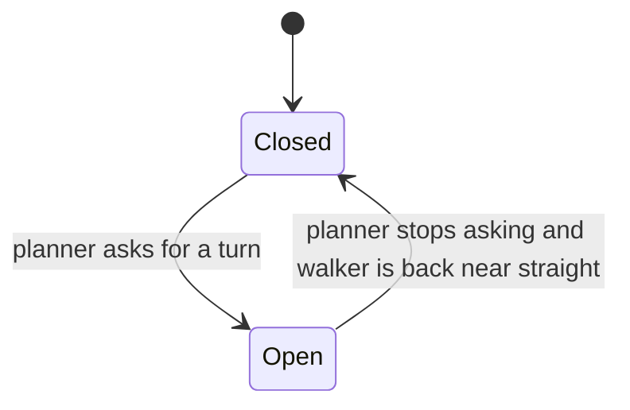

[Contents](README.md#contents) · [The colors](README.md#the-colors) · Previous: [10. How much the scene shaped the plan](10_scene_shaped_the_plan.md) · Next: [12. Scoring the arrow](12_scoring_the_arrow.md)

# 11. The walker's response

Sections 1 to 10 are about the scene and the plan. This one is about the person. When the arrow asks
for a turn, how long should the turn take, and what did the avoidance cost? The server works out both
and logs them at the end of a run. Neither number goes back into the planner. This part measures
only, it steers nothing.

## The relaxation model

**The plain idea.** Take the walker's heading error, the angle between where they're going and where
the arrow wants them to go. Once they start correcting it, the model says the error shrinks the way a
spring settles: quickly at first, slower as it gets close, and never swinging past zero to the other
side. The fastest settle that never overshoots is called critical damping, and the whole model is
called critically damped relaxation.

**An analogy.** A door closer. Push a door open, let go, and a well-tuned closer brings it shut as fast
as it can without banging it into the frame and bouncing back. A loose one bangs and rebounds. A stiff
one crawls. The analogy stops working once the target moves: a door always closes onto the same frame,
while the arrow's direction keeps changing as the plan updates, and the model ignores that.

> [!NOTE]
> **Ingredients**
> - The error to correct, $`s`$, in radians. In the running server it's the arrow's angle from section 9
>   on the frame the avoidance started.
> - The walker's time constant $`b`$, in seconds. It's 0.25 s, and the code labels it a placeholder until
>   a walker is measured (`server/nav/usermodel/config.py`). Nothing on the command line changes it.
> - A step length $`\Delta t`$ for moving the equation forward. 1 ms.
> - The heading tolerance, 0.05 rad, about 2.86°. Inside it counts as "turned".
> - Nothing from the sensors. $`b`$ is not measured, so no camera or IMU data goes in.

The formula:

```math
\ddot s + \frac{2}{b}\,\dot s + \frac{1}{b^2}\,s = 0
```

Read it left to right. $`\ddot s`$ is how fast the error's rate of change is changing. The $`s/b^2`$ part
pulls the error back toward zero, harder the bigger it is. The $`(2/b)\,\dot s`$ part brakes it, harder
the faster it's moving. A small $`b`$ means a quick walker.

The code moves it forward 1 ms at a time. It updates the rate first, then moves the error with the new
rate:

```math
a_n = -\frac{2}{b}\,v_n - \frac{s_n}{b^2}, \qquad v_{n+1} = v_n + a_n\,\Delta t, \qquad s_{n+1} = s_n + v_{n+1}\,\Delta t
```

Updating the rate first makes this semi-implicit Euler. The code comment calls it "one Euler step",
but the order of the two updates is what makes it the semi-implicit kind.

Lowercase $`s`$ is the heading error. It isn't the clearance $`{\color{teal}{S}}`$ from section 4. The
professor uses $`s`$ for an error in general.

| Symbol | Plain English | Units | Frame | Where in the code |
|---|---|---|---|---|
| $`s`$ | heading error still to correct | rad in the code. A normalized error with no unit in his version | the arrow's: on the floor, relative to the camera's forward, positive right | `server/nav/usermodel/relaxation.py` |
| $`\dot s`$, $`v`$ | how fast the error is changing | rad/s | same | `server/nav/usermodel/relaxation.py` |
| $`\ddot s`$, $`a`$ | how fast that rate is changing | rad/s² | same | `server/nav/usermodel/relaxation.py` |
| $`b`$ | the walker's time constant. The code names it `seconds_per_bit` | s | none | `server/nav/usermodel/config.py` |
| $`\Delta t`$ | integration step, 0.001 s | s | none | `server/nav/usermodel/relaxation.py` (`INTEGRATION_STEP_SECONDS`) |
| $`n`$ | step count | none | none | `server/nav/usermodel/relaxation.py` |
| $`{\color{blue}{T}}`$ | effort, the kinetic part of his Lagrangian, $`\tfrac12 m\dot s^2`$ | his energy units | none | not a separate term in the code |
| $`{\color{purple}{U}}`$ | surprise, his potential, $`\tfrac12 k s^2`$ | his energy units | none | not a separate term in the code |
| $`m`$, $`k`$, $`c`$ | mass, stiffness and damping in his derivation | none, 1/s², 1/s | none | not in the code. Only $`b`$ survives |

The equation comes out of his Lagrangian. Surprise acts like a spring's stored energy, effort acts like
motion, and friction drains the total so the error settles.

| Step | Expression | Why |
|---|---|---|
| 1 | $`L = {\color{blue}{T}} - {\color{purple}{U}} = \tfrac12 m\dot s^2 - \tfrac12 k s^2`$ | The Lagrangian: effort minus surprise. Surprise behaves like a spring pulling the error to zero |
| 2 | $`R = \tfrac12 c\,\dot s^2`$ | Rayleigh dissipation, a friction term that drains energy |
| 3 | $`\frac{d}{dt}\frac{\partial L}{\partial \dot s} - \frac{\partial L}{\partial s} + \frac{\partial R}{\partial \dot s} = 0`$ | The Euler-Lagrange equation with friction added |
| 4 | $`m\ddot s + k s + c\,\dot s = 0`$ | The three derivatives are $`m\ddot s`$, $`-(-ks)`$ and $`c\,\dot s`$ |
| 5 | $`c = 2\sqrt{mk}`$ | Critical damping, the least friction that never overshoots |
| 6 | $`\ddot s + 2\omega\,\dot s + \omega^2 s = 0`$, with $`\omega = \sqrt{k/m}`$ | Divide by $`m`$. $`c/m = 2\sqrt{k/m}`$ |
| 7 | $`\omega = 1/b`$ | Tie the settling rate to the walker's time constant |
| 8 | $`\ddot s + \frac{2}{b}\dot s + \frac{1}{b^2}s = 0`$ | Substitute. This is the line in the code |

Here are the first three steps for an error of 0.5 rad, starting at rest, with $`b = 0.25`$ s and
$`\Delta t = 0.001`$ s. $`b^2 = 0.0625`$ and $`2/b = 8`$.

| Step | $`a_n`$ | $`v_{n+1}`$ | $`s_{n+1}`$ |
|---|---|---|---|
| 1 | $`-8(0) - 0.5/0.0625 = -8.0`$ | $`0 + (-8.0)(0.001) = -0.008`$ | $`0.5 + (-0.008)(0.001) = 0.499992`$ |
| 2 | $`-8(-0.008) - 0.499992/0.0625 = 0.064 - 7.999872 = -7.935872`$ | $`-0.015936`$ | $`0.499976`$ |
| 3 | $`-7.872130`$ | $`-0.023808`$ | $`0.499952`$ |

The error barely moves at first because it starts at rest. The rate has to build up before the error
drops.

> [!WARNING]
> The stepping is an approximation. The exact solution from rest is
> $`s(t) = s_0\,(1 + t/b)\,e^{-t/b}`$, which the code never uses. At 1 ms steps the two agree to about a
> millisecond (worked out below). The model is also one-dimensional and linear, with no limit on how
> fast a person can actually turn.

> [!IMPORTANT]
> The professor's. The Lagrangian, the friction term, critical damping and $`\omega = 1/b`$ are in the
> Stationary Interaction paper, §7 and §7.1 (Eqs. 11 to 25), and on College 4 PDF pages 22 and 23. The
> paper's §7.2 (Eqs. 26 to 28) steps it with the same rate-first Euler update, and College 4 PDF page 25
> uses a 1 ms step. College 5 PDF page 6 states that the Lagrangian generates the trajectory. The code
> quotes the equation as his in `server/nav/usermodel/relaxation.py`. The value $`b = 0.25`$ s is ours,
> and only a placeholder.

## Predicted turn time

**The plain idea.** Start the spring at the error the arrow asked for, at rest, and count 1 ms steps
until the error is inside 0.05 rad. That count is the model's guess for how long the turn takes. If the
error is already inside the tolerance, the answer is 0. If it hasn't settled after 10 s, the answer is
"never", stored as infinity.

```math
T_{\text{pred}} = \begin{cases} 0 & |s_0| \le \theta_{\text{tol}} \\ \min\{\, n\,\Delta t : |s_n| \le \theta_{\text{tol}},\ n\,\Delta t < T_{\max} \,\} & \text{otherwise} \\ \infty & \text{if no such } n \end{cases}
```

The start is $`s_0 = |e|`$ with $`v_0 = 0`$, where $`e`$ is the arrow's angle on the frame the avoidance
opened. The sign is dropped, so a left turn and a right turn of the same size get the same time.

| Symbol | Plain English | Units | Frame | Where in the code |
|---|---|---|---|---|
| $`T_{\text{pred}}`$ | predicted turn time | s | none | `server/nav/usermodel/relaxation.py` (`predicted_turn_time`) |
| $`e`$ | the arrow at the opening frame | rad | on the floor, relative to the camera's forward | `server/nav/usermodel/work.py` |
| $`\theta_{\text{tol}}`$ | heading tolerance, 0.05 rad | rad | none | `server/nav/usermodel/config.py` |
| $`T_{\max}`$ | give-up time, 10 s | s | none | `server/nav/usermodel/relaxation.py` (`MAXIMUM_TURN_SECONDS`) |

For $`e = 0.5`$ rad, stepping until $`\lvert s\rvert \le 0.05`$ gives $`T_{\text{pred}} = 0.973`$ s. The exact
solution checks it. Settling to 0.05 from 0.5 means $`(1 + x)\,e^{-x} = 0.05 / 0.5 = 0.1`$ with
$`x = t/b`$. That holds at $`x \approx 3.890`$, so $`t \approx 0.25 \times 3.890 = 0.972`$ s.

Other starts, all at $`b = 0.25`$ s:

| Arrow at opening (rad) | In degrees | $`T_{\text{pred}}`$ (s) |
|---|---|---|
| 0.5 | 28.6 | 0.973 |
| 0.4 | 22.9 | 0.902 |
| 0.3 | 17.2 | 0.809 |
| 0.2 | 11.5 | 0.673 |
| 0.1 | 5.7 | 0.419 |
| 0.04 | 2.3 | 0, already inside the tolerance |

Doubling the error from 0.2 to 0.4 rad adds only $`0.902 - 0.673 = 0.229`$ s. The pull grows with the
error, so a bigger error also starts moving faster.

> [!WARNING]
> Every predicted time is a placeholder, because $`b`$ is. The prediction also starts from rest and looks
> only at the arrow on the opening frame. If the arrow changes during the avoidance, the prediction
> doesn't.

> [!TIP]
> Ours. The stopping rule, the 0.05 rad tolerance and the 10 s cap aren't attributed to him anywhere
> in the code. His own stopping rule is the acceptance threshold $`z`$, where relaxation stops once the
> error is within $`z`$ noise widths (Stationary Interaction paper §5, College 4 PDF page 25: stop when
> $`x < z`$). The code uses a fixed angle in its place.

## What $`b`$ means, and a factor of $`\ln 2`$

The professor's own sources don't agree on what $`b`$ is.

- The Stationary Interaction paper, Eqs. 35 to 37, relaxes as $`e^{-t/b}`$. There $`b`$ is the time for the
  error to shrink by a factor of $`e`$, and one halving, one bit, takes $`b \ln 2`$.
- College 5 PDF page 21 relaxes as $`e^{-(\ln 2 / b)\,t}`$. There $`b`$ is exactly the time for one halving.

Same letter, readings a factor of $`\ln 2 \approx 0.693`$ apart. The two curves match when
$`b_{\text{paper}} = b_{\text{page 21}} / \ln 2`$. So 0.25 s per halving in page 21's sense is
$`0.25 / 0.693 = 0.361`$ s in the paper's sense.

The code's equation uses $`1/b`$ as its rate, the paper's form. And the code uses $`b`$ only as a time
constant in seconds. The name says "seconds per bit", but no bit count ever goes into the predicted
time, and the work figure further down is never combined with $`b`$.

> [!WARNING]
> Right now this changes nothing, because 0.25 s isn't a measurement. Once a walker is measured, the
> measured value has to be stated in the paper's convention before it goes into the code, or every
> predicted time is off by a factor of about 0.69 or 1.44.

## When an avoidance starts and ends

The server groups frames into avoidance episodes. One opens on the first frame the planner asks for a
turn, either by raising the alarm or by pointing the arrow more than 0.05 rad off straight. It closes on
the first later frame where the planner has stopped asking and the walker isn't turned any more.



```math
\text{ask}_k = A_k \lor \big(|h_k| > \theta_{\text{tol}}\big), \qquad \text{turned}_k = |o_k| > \theta_{\text{tol}}
```

Open at the first $`k`$ with $`\text{ask}_k`$. Close at the first later $`k`$ with neither $`\text{ask}_k`$
nor $`\text{turned}_k`$. Inside an episode, the walker's turn starts at the first frame with
$`\text{turned}_k`$, time $`t_s`$, and ends at the next frame without it, time $`t_e`$.

The observed heading $`o_k`$ needs a word. There's no position on the Neon, so the server can't measure
where the walker is going. Instead it takes the camera's yaw from its orientation,
$`\psi_{\text{yaw}} = \mathrm{atan2}(F_x, F_z)`$ where $`F`$ is the camera's forward axis turned into
the world, and compares it with a slow running average of itself:

```math
\lambda = \min\Big(1, \frac{t_k - t_{k-1}}{5\ \text{s}}\Big), \qquad B_k = B_{k-1} + \lambda\,\mathrm{wrap}(\psi_k - B_{k-1}), \qquad o_k = \mathrm{wrap}(\psi_k - B_k)
```

$`B`$ starts at the first frame's yaw, and every result is folded back into one turn. A long gentle
curve drags the average along with it, so it doesn't read as one turn that never ends.

| Symbol | Plain English | Units | Frame | Where in the code |
|---|---|---|---|---|
| $`A_k`$ | the alarm as shown on frame $`k`$, after its hold | true or false | none | `server/nav/usermodel/work.py` |
| $`h_k`$ | the arrow, `lookahead_heading_radians` | rad | on the floor, relative to the camera's forward, positive right | `server/nav/usermodel/work.py` |
| $`\psi_k`$ | camera yaw. A right turn reads negative in a y-up world, the opposite of the arrow | rad | world, horizontal | `server/nav/runtime/loop.py` |
| $`B_k`$ | running average of the yaw, time constant 5 s | rad | world, horizontal | `server/nav/runtime/loop.py` (`HEADING_BASELINE_SECONDS`) |
| $`o_k`$ | observed heading, yaw minus its average | rad | world, horizontal | `server/nav/runtime/loop.py` |
| $`\lambda`$ | how far the average moves this frame | none | none | `server/nav/runtime/loop.py` |
| $`t_s`$, $`t_e`$ | walker's turn start and end | s | frame clock | `server/nav/usermodel/work.py` |

Only $`\lvert h_k\rvert`$ and $`\lvert o_k\rvert`$ are used, so the opposite signs don't matter.

Here's an episode at 30 frames a second.

1. At 10.000 s the arrow is 0.40 rad and the alarm is off. $`0.40 > 0.05`$, so the episode opens and
   records the plan's cost and the 0.40 rad.
2. At 10.500 s the observed heading reaches 0.06 rad, over 0.05. The walker's turn starts, $`t_s = 10.5`$.
3. At 11.600 s it's back to 0.04 rad. The turn ends, $`t_e = 11.6`$.
4. At 12.300 s the arrow is 0.03 rad, the alarm is off and the observed heading is 0.02 rad. Neither
   test fires, so the episode closes. The observed turn is $`11.6 - 10.5 = 1.1`$ s.

And one update of the average: $`B = 0.10`$, yaw 0.30 rad, 0.033 s since the last frame. Then
$`\lambda = 0.033 / 5 = 0.0066`$, $`B = 0.10 + 0.0066 \times 0.20 = 0.10132`$, and
$`o = 0.30 - 0.10132 = 0.1987`$ rad.

> [!WARNING]
> - The opening frame doesn't check the walker, so a walker already turned on that frame is first seen
>   on the next one.
> - An episode still open when the run ends isn't recorded.
> - The code comment says an episode closes when the planner and the walker are both back inside the
>   tolerance. The code also requires the alarm to be off.
> - On the Neon this is head yaw, not walking direction. At the Neon's 1.68 planned frames a second,
>   frames are about $`1 / 1.68 = 0.595`$ s apart, so $`\lambda \approx 0.595 / 5 = 0.12`$ per frame.

> [!TIP]
> Ours. The open and close rule, the yaw average and its 5 s time constant ("a few strides", in the
> code) are project choices. The professor's slides frame an action as running from a start to an
> acceptance threshold, and the episode is our way to find those two moments in a live stream.

## Work, in bits

**The plain idea.** The professor prices an action by how much total energy drains away between its
start and the moment it's done. The server copies that: the work of an avoidance is the plan's total
cost on the frame the episode opened, minus the plan's total cost on the frame it closed.

His version is $`W = H_0 - H_z`$, with $`H = {\color{blue}{T}} + {\color{purple}{U}}_{\text{post}}`$, the
Hamiltonian, effort plus surprise. Ours:

```math
W_{\text{bits}} = H_{\text{open}} - H_{\text{close}}, \qquad H = \frac{1}{\ln 2}\sum_{k=0}^{K-1}\Big({\color{purple}{U}}_k + G_k + {\color{blue}{T}}_k\Big)\,\Delta t
```

$`H`$ is the chosen path's cost from the planner in section 8, with the previous-plan prior's charge
taken back out. The sum is in natural-log units, and the planner divides it by $`\ln 2`$ once before
sending it, so both $`H`$ and $`W`$ are bits.

| Symbol | Plain English | Units | Frame | Where in the code |
|---|---|---|---|---|
| $`W_{\text{bits}}`$ | work of one avoidance | bits | none | `server/nav/usermodel/work.py` |
| $`H_{\text{open}}`$, $`H_{\text{close}}`$ | the plan's cost on the opening and closing frames, `cumulative_cost_bits` | bits | none | `server/nav/planner/pipeline.py` |
| $`{\color{purple}{U}}_k`$ | collision and contact surprise of the path's cell at step $`k`$, per second (section 6) | per second | ground | `server/nav/planner/pipeline.py` |
| $`G_k`$ | goal term, on the last step only (section 8) | per second | ground | `server/nav/planner/pipeline.py` |
| $`{\color{blue}{T}}_k`$ | effort of moving sideways, $`\tfrac12 w\,\dot x_k^2`$ with $`w = 6.5`$ (section 8 has the exact discrete form) | per second | ground | `server/nav/planner/dynamic_programming.py` |
| $`\Delta t`$ | planner step, 0.1 s | s | none | `server/nav/planner/config.py` |
| $`K`$ | 39 steps over the 3.8 s horizon | none | none | `server/nav/planner/config.py` |

Say the opening frame's plan cost 18.4 bits and the closing frame's 6.1 bits. Then
$`W = 18.4 - 6.1 = 12.3`$ bits. If the closing frame had cost 20.0, the work would be
$`18.4 - 20.0 = -1.6`$, and nothing in the code stops a negative figure.

Before 2026-10-07 the planner sent its natural-log sum unconverted, so the same two plans read
$`18.4 \times 0.693 = 12.75`$ and $`6.1 \times 0.693 = 4.23`$, and the work 8.53. Work figures
recorded before then are $`\ln 2`$ times the bits value.

> [!WARNING]
> - **One difference, not a sum.** His work for a sequence adds up every action's $`H_0 - H_z`$. Ours is
>   one subtraction of two frames.
> - **Two different stretches of floor.** Each $`H`$ covers the 3.8 s ahead of where the walker stood on
>   that frame, so the two costs aren't about the same floor.
> - **More than surprise.** $`H`$ includes the effort and goal terms too.
> - It's logged, and written to `episodes.jsonl` at the end of a run when the run records
>   (`--record-to`). It changes nothing in the plan.

> [!IMPORTANT]
> The professor's, adapted. $`H = T + U_{\text{post}}`$ and $`W = H_0 - H_z`$ are on College 5 PDF pages 13
> and 14, and the sum over a task sequence is on PDF page 17. The code quotes it as "the slides' H at
> start minus H at threshold" in `server/nav/usermodel/work.py`. Using the planner's path cost as $`H`$,
> and the episode's open and close frames as start and threshold, is ours.

## Observed against predicted

Each finished episode logs two times side by side.

```math
T_{\text{obs}} = \begin{cases} t_e - t_s & \text{both seen} \\ \text{none} & \text{otherwise} \end{cases}, \qquad T_{\text{pred}} = \text{the relaxation time for } |h_{\text{open}}|
```

From the episode above, $`T_{\text{obs}} = 1.1`$ s, and the arrow at opening was 0.40 rad, so
$`T_{\text{pred}} = 0.902`$ s. The log reads "turn observed 1.10 s, predicted 0.90 s".

> [!WARNING]
> These two time different things. The observed time is how long the yaw stayed more than 0.05 rad
> away from its own 5 s average. The predicted time is how long an error the size of the opening arrow
> takes to relax to 0.05 rad. Lining them up says something only once $`b`$ is measured and the observed
> heading is measured against the planned direction instead of against a running average.

> [!TIP]
> Ours. The code tracks the walker's turn "so observed and predicted can be compared". Measuring $`b`$
> itself would take a pointing test, which `server/nav/usermodel/relaxation.py` names and which hasn't
> been built.

---

[Contents](README.md#contents) · [The colors](README.md#the-colors) · Previous: [10. How much the scene shaped the plan](10_scene_shaped_the_plan.md) · Next: [12. Scoring the arrow](12_scoring_the_arrow.md)
