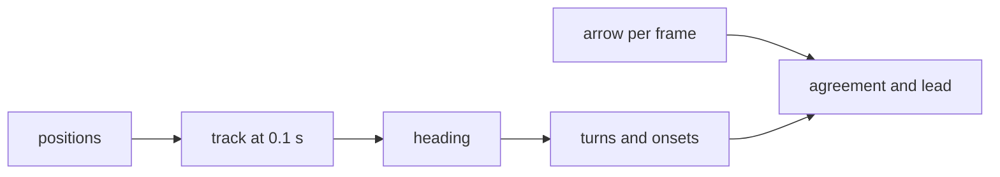

[Contents](README.md#contents) · [The colors](README.md#the-colors) · Previous: [11. The walker's response](11_walker_response.md) · Next: [13. Gaze on the floor](13_gaze_on_the_floor.md)

# 12. Scoring the arrow

**The plain idea.** Record a walk, find every place the walker actually turned, and check what the
arrow said in the second before each turn. If it pointed the way they turned, it agreed. If it pointed
the other way, it was on the wrong side. This is all offline, over recorded walks, and none of it runs
in the live loop.

**An analogy.** Grading a weather forecast. You don't judge it on the day it's issued. You wait,
see whether it rained, and then look back at what the forecast said the day before. The analogy stops
working on one point: a forecast can't change the weather, but a walker who sees the arrow may follow
it. That's why the table further down says, for each walk, whether an arrow was shown.



> [!NOTE]
> **Ingredients**
> - The phone's world position on every frame, from ARCore. The Neon glasses report no position, so
>   this scoring can't run on a Neon recording as written.
> - Each frame's arrow and the phone's forward axis in the world.
> - A separate straight walk, `straight_walk_4`, 65 m in one line, 2048 frames over 68.3 s. It set the
>   turn threshold.
> - Every number in `server/nav/evaluation/config.py`. The code says each was fixed before any
>   agreement number existed, and none is read from the planner's settings.

## The walker's track

| What | Rule | Value |
|---|---|---|
| Resample | Linear interpolation of the horizontal position onto an even grid | every $`\delta = 0.1`$ s |
| Break the track | A gap in time, a jump faster than a person, or a frame with no position | gap over 0.5 s, speed over 3.0 m/s |
| Smooth | Box average of each point with the 5 before and 5 after | 11 samples, 1.0 s first to last |
| Ends of a piece | Left unknown, never averaged over fewer samples | 5 samples (0.5 s) of position at each end |
| Velocity | Central difference of the smoothed track | $`\mathbf v_i = (\bar{\mathbf p}_{i+1} - \bar{\mathbf p}_{i-1}) / 2\delta`$ |
| Heading | Angle of the velocity on the floor, from the session's starting forward, positive right. Unknown below walking pace | speed at least 0.3 m/s |

```math
\bar{\mathbf p}_i = \frac{1}{11}\sum_{j=i-5}^{i+5}\mathbf p_j \ \text{ when 5 samples exist on both sides, unknown otherwise}
```

**Why the ends stay unknown.** A window that shrinks at the ends would leave the last few samples
barely smoothed. On a straight walk with ordinary jitter, those raw ends swing by 6 to 11 degrees. That
comes close to the 11° turn threshold below, so a shrunk window would make up some turns at breaks in
the track.

On `pixel_walk_3` one tracker jump was 17.48 m in 0.033 s, a speed of $`17.48 / 0.033 = 530`$ m/s. The
3.0 m/s bar cuts the track there.

## What counts as a turn

A turn is any 2 s stretch over which the heading changes by more than 11°. Overlapping stretches
turning the same way merge into one, and each turn is trimmed to its own swing, from its lowest point
to its furthest point in its direction.

```math
\text{candidate if } \big|\psi_{s+20} - \psi_s\big| > 11°
```

The 11° came from measuring straight walking.

| Step | Expression | Why |
|---|---|---|
| 1 | $`c_i = \lvert\psi_{i+20} - \psi_i\rvert`$ | Heading change over 2 s, which is 20 grid steps |
| 2 | Keep $`c_i`$ only inside 4 s windows of unbroken straight walking, with no change over 25° nearby | Measure wobble, not turns |
| 3 | `straight_walk_4`: 62.4 s of straight walking, 584 windows, 604 change samples | One dedicated straight walk |
| 4 | 50th, 95th and 99th percentiles: 1.71°, 6.92°, 10.39° | Ordinary wobble is small. The rare worst case is about 10° |
| 5 | $`\theta_{\text{turn}} = \lceil 10.39 \rceil = 11°`$ | A real turn must clear what straight walking does 99 % of the time |

The 99th percentile stayed at 10.39 to 10.40° for every change cap from 15° to 40°, so the 25° cap in
step 2 doesn't drive the result.

**When the turn starts.** Take the middle half of the turn, from 25 % done to 75 % done, and draw a
straight line through the halfway point at that middle rate. The onset is where that line meets the
heading the walker started from.

```math
\rho = \frac{0.5}{t_{0.75} - t_{0.25}}, \qquad t_{\text{onset}} = t_{0.5} - \frac{0.5}{\rho}, \ \text{clamped between the turn's start and peak}
```

## Agreement and lead time

The arrow is drawn relative to where the phone points, so it's first turned into the walker's
direction of travel:

```math
\alpha = \mathrm{wrap}\big(h + \mathrm{wrap}(\psi_{\text{phone}} - \psi)\big)
```

Then the arrow is averaged as a direction over the second before the onset, and read with a 5° dead
band:

```math
\bar\alpha = \mathrm{atan2}\Big(\tfrac1n\sum\sin\alpha,\ \tfrac1n\sum\cos\alpha\Big), \qquad \text{result} = \begin{cases}\text{carry on} & |\bar\alpha| \le 5° \\ \text{agreed} & \text{same side as the turn} \\ \text{wrong side} & \text{otherwise}\end{cases}
```

**Lead time**, for an agreeing turn: count back from the onset while the arrow stays more than 5° on
the turn's side. It stops at 5 s, at the previous turn's end, at the start of the record or at an
unknown sample, and all four mark the lead "at least".

| Symbol | Plain English | Units | Frame | Where in the code |
|---|---|---|---|---|
| $`\mathbf p`$, $`\bar{\mathbf p}`$ | phone position, raw and smoothed | m | world, horizontal | `server/nav/evaluation/track.py` |
| $`\delta`$ | grid step, 0.1 s | s | none | `server/nav/evaluation/config.py` |
| $`\psi`$ | walker's heading, from the smoothed velocity | rad | 0 along the session's starting forward, positive right | `server/nav/evaluation/track.py` |
| $`\theta_{\text{turn}}`$ | turn threshold, 11° over 2 s | degrees | none | `server/nav/evaluation/config.py` |
| $`t_q`$ | time the turn is fraction $`q`$ done | s | none | `server/nav/evaluation/turns.py` |
| $`\rho`$ | middle-half turn rate | fraction per second | none | `server/nav/evaluation/turns.py` |
| $`h`$ | the arrow on the latest frame, at most 0.3 s old | rad | on the floor, relative to the phone's forward | `server/nav/evaluation/scoring.py` |
| $`\psi_{\text{phone}}`$ | heading of the phone's forward axis | rad | same as $`\psi`$ | `server/nav/evaluation/scoring.py` |
| $`\alpha`$ | the arrow against the walker's travel | rad | travel, positive right | `server/nav/evaluation/scoring.py` |
| $`\bar\alpha`$ | circular mean of $`\alpha`$ over the 1 s before onset | rad | travel | `server/nav/evaluation/scoring.py` |

## Worked examples

**Smoothing.** Eleven samples of lateral position around one point: 0.00, 0.02, −0.01, 0.03, 0.01,
0.02, 0.00, 0.04, 0.01, 0.02, 0.03 m. They sum to 0.17, so the smoothed value is $`0.17 / 11 = 0.0155`$ m.

**Heading.** Smoothed positions 0.2 s apart move $`(0.05, -0.24)`$ m in world $`x`$ and $`z`$. Velocity
$`(0.25, -1.2)`$ m/s, speed $`\sqrt{0.0625 + 1.44} = 1.226`$ m/s, over 0.3. Forward is world $`-z`$, so
$`\psi = \mathrm{atan2}(0.25, 1.2) = 11.77°`$ to the right.

**Onset.** Turn progress every 0.1 s from 0 to 1.0 s: 0, 0.02, 0.08, 0.18, 0.32, 0.50, 0.68, 0.82,
0.92, 0.98, 1.0. Interpolating, $`t_{0.25} = 0.35`$, $`t_{0.5} = 0.50`$ and $`t_{0.75} = 0.65`$ s. Then
$`\rho = 0.5 / 0.30 = 1.667`$ per second, and onset $`= 0.50 - 0.30 = 0.20`$ s.

**Agreement.** Phone heading 0.20, walker heading 0.05, arrow 0.10 rad gives
$`\alpha = 0.10 + 0.15 = 0.25`$ rad. Say three readable $`\alpha`$ before onset are 0.10, 0.20, 0.30 rad.
Mean sine 0.19801, mean cosine 0.97680, so $`\bar\alpha = 0.2000`$ rad $`= 11.46°`$. That's over 5° and to
the right, so a right turn agrees.

**Lead.** Onset 10.0 s, right turn. $`\alpha`$ at 10.0, 9.9, 9.8 and 9.7 s is 0.15, 0.20, 0.12 and
0.10 rad, all over $`5° = 0.0873`$ rad. At 9.6 s it's 0.05. The lead is $`10.0 - 9.7 = 0.3`$ s.

## What the arrow scored

From `docs/evaluation/arrow_against_turns.md`. Conditions: the planner with the contact term, kinetic
weight 6.5 and the 1 s lookahead, replayed cold three times with identical results. A sidestep is the
arrow leaning more than 10° to one side for at least 0.5 s with no turn during it or within 2 s after.

| Walk | Arrow shown to the walker | Turns | Obstacle ahead | Agreed | Wrong side | Carry on | Median lead | Sidesteps a minute |
|---|---|---|---|---|---|---|---|---|
| `pixel_walk_3` | none | 18 | 17 | 10 | 7 | 0 | 0.27 s, 6 known, 3 at limit | 5.9 |
| `wifi_run_2` | the 1 s lookahead arrow | 6 | 4 | 4 | 0 | 0 | 0.40 s, 3 known, 1 at limit | 21.6 |
| `pixel_display_run` | an older three-value arrow | 9 | 4 | 3 | 0 | 1 | 0.05 s, 2 known, 2 at limit | 10.2 |

No turn on any walk was tagged open ahead. Before the contact term (kinetic weight 0.055, contact
off), `pixel_walk_3` was 12 agreed and 5 wrong side of 17, with a median lead of 0.38 s. Moving the
threshold to 8° or 14° hardly changes `pixel_walk_3`.

**Is 10 of 17 better than a coin?** Not by much. With a fair coin on each of 17 turns,
$`P(X \ge 10) = \sum_{k=10}^{17}\binom{17}{k} / 2^{17} = 41226 / 131072 = 0.31`$, about 31 %. For 12 or
more it's $`9402 / 131072 = 0.07`$, about 7 %.

From `docs/evaluation/arrow_flips_and_band.md`, before and after the previous-plan prior from
section 8 (a pull toward the last plan, spread 0.25 m, over the first 1 s). A full swing is the arrow
pinned at one limit, within 0.5° of $`\mathrm{atan2}(1.0, 1.4) = 35.54°`$, and pinned at the other
on the next frame. Plan disagreement is the mean sideways gap between two consecutive plans at the
same spot on the floor.

| Recording | Full swings a minute | 90th percentile plan disagreement | Side flips among those pairs |
|---|---|---|---|
| `contact_walk_1` | 77.1 to 0.0 | 1.176 to 0.254 m | 90.1 % to 10.7 % |
| `pixel_walk_3` | 75.9 to 1.3 | 1.102 to 0.449 m | 74.1 % to 30.2 % |
| classroom | 105.4 to 0.0 | 1.303 to 0.273 m | 84.9 % to 12.4 % |

The same prior cut the frames where the arrow sat pinned while the nearest thing in a 0.5 m corridor
was 3 to $`1.4 \times 3.8 = 5.32`$ m ahead: `pixel_walk_3` from 58.2 % to 1.6 % of 122 frames, the
classroom from 59.0 % to 30.3 % of 195.

> [!WARNING]
> - **One walker, one phone grip.** The 11° threshold comes from one straight walk.
> - **Small counts.** 17 scored turns on the main walk, and a coin gets 10 or more of 17 about 31 % of
>   the time.
> - **The ends of the track.** The code comment says heading is unknown within half a window of a
>   break. The velocity step reads the unknown fifth sample, so heading is actually unknown for 6
>   samples (0.6 s) at each end, and turn rate for 7 (0.7 s).
> - **The swing gap.** The flips document describes a full swing as the opposite limit on the next
>   frame, 33 ms later. The code accepts consecutive replayed frames up to 0.5 s apart.
> - **No Neon.** All of this needs ARCore position. The 2026-10-05 glasses session couldn't be scored
>   this way.

> [!TIP]
> All of section 12 is ours. Every threshold was measured or fixed before any agreement number
> existed, and lives in its own config file rather than being read from the planner's settings. That
> way tuning the planner can't change which turns are found or how they're tagged. The exceptions are
> the arrow's 35.54° limit and the 5.32 m reach, which are read from the planner on purpose. The reach
> uses his 3.8 s horizon.

---

[Contents](README.md#contents) · [The colors](README.md#the-colors) · Previous: [11. The walker's response](11_walker_response.md) · Next: [13. Gaze on the floor](13_gaze_on_the_floor.md)
