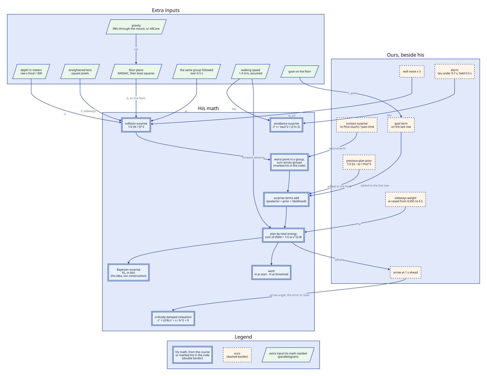

[Contents](README.md#contents) · [The colors](README.md#the-colors) · Previous: [14. How the path looks](14_how_the_path_looks.md) · Next: [Planned, and off by default](16_planned.md)

# How we stick to the professor's math

This section is the ledger behind every earlier one. The planner is built on the professor's
surprise math, and here each piece is sorted by where it comes from. Some formulas are his and we
cite them from the course material. A few values are marked as his in the code but aren't in that
material. Some of his formulas we changed, and the reason is given next to each change. Some terms
are ours, and each one sits beside his terms, never in place of them. The rest of the section
covers what the camera had to supply before his math could run, where we're still behind his math,
and where his own sources disagree. Math that comes with the tools we use, such as the depth model,
ARCore's pose and the color conversion for the path, is neither his nor ours. It only shows up here
where his math needed it as an input.

Three public sources are cited, and nothing else:

- **The paper.** Vertegaal and Rauterberg, "Stationary Interaction: A Variational Account of User
  Models as Generative Energy Potentials", 2026. Cited by section and equation.
- **College 4.** "Interactive Inference: A Theory of Learning and Action (1)". The deck prints no
  slide numbers and has one slide per PDF page, so it's cited by PDF page.
- **College 5.** "Interactive Inference (2): Models and Metrics". Cited by PDF page, because a few
  pages carry only overflow notes and the slide numbers drift.

Each box's border says whose math it is. Boxes with a double border are his, either from the course
material or marked as his in the code. The KL box is his idea with our construction. Dashed boxes
are ours. Parallelograms are inputs his math needed that the camera doesn't hand over. Each arrow
coming in from outside his group is labeled with the symbol it supplies, so you can follow, say,
$`{\color{orange}{N}}`$ back to the tracking that measures it. The arrows inside his group aren't
labeled. Every dashed box's arrow points into one of his boxes, because each addition feeds his
terms rather than replacing one. One slanted input, gaze on the floor, feeds our goal term rather
than his math. The legend sits at the bottom.

## His formulas, from the course material

> [!IMPORTANT]
> Everything in this table is in the public course material, at the place given in the Source
> column. The code's own comments mark the same formulas as his.

| Formula | What it says in plain words | Source | Where the code uses it |
|---|---|---|---|
| Surprise potential, $`{\color{purple}{U}} = \tfrac12 ({\color{teal}{S}} / {\color{orange}{N}})^2`$ | How far you are from what you expected, measured in units of how noisy things are, squared and halved. It's the exponent of a bell curve, so it's the negative log of an unnormalized Gaussian. In natural log it's in nats, and dividing by $`\ln 2`$ gives bits | Paper §3.1 Eq. 1, §3.2 Eq. 2, §4.1 Eq. 8, §7.1 Eq. 13. College 4 PDF page 12 | Only in its flipped avoidance form, next row |
| Avoidance form, $`{\color{purple}{U}} = \tfrac12 (\Delta {\color{teal}{S}} / {\color{teal}{S}})^2`$ | When the thing is to be kept away from, signal and noise swap places. The gap goes on the bottom and its wobble goes on top. A big, steady gap is calm. A small gap that's changing fast is surprising | College 5 PDF pages 61 to 71, formula on pages 62 and 65 | `server/nav/planner/surprise.py` computes $`\tfrac12({\color{orange}{N}}/{\color{teal}{S}})^2`$ per point, with the measured wobble on top and the clearance below. `server/nav/planner/alarm.py` computes $`(1\ \text{s} / {\color{red}{\tau}})^2 / (2 \ln 2)`$ in bits, for the path color |
| Posterior is prior plus likelihood, $`{\color{purple}{U}}_{\text{post}} = {\color{purple}{U}}_{\text{prior}} + {\color{purple}{U}}_{\text{like}}`$ | Bayes' rule multiplies probabilities, so in log form the surprises add. The prior is the goal, the likelihood is feedback. Independent observations each add their own likelihood term | Paper §4 Eqs. 4 to 7. College 4 PDF pages 34, 35 and 40. College 5 PDF pages 9, 46 and 54 (the sum over observations is on page 54) | The field's terms are added together, `server/nav/planner/pipeline.py` and `server/nav/planner/field.py` |
| Lagrangian $`L = {\color{blue}{T}} - {\color{purple}{U}}`$, and critically damped relaxation $`\ddot s + \tfrac{2}{b}\dot s + \tfrac{1}{b^2} s = 0`$ | Execution. Surprise acts like a spring pulling the error $`s`$ toward zero, and critical damping lets it settle as fast as it can without overshooting. $`b`$ is the time scale, which the course ties to throughput in bits per second | Paper §7 Eqs. 11 and 12, §7.1 Eq. 25. College 4 PDF pages 22 and 23. College 5 PDF page 6 | `server/nav/usermodel/relaxation.py` predicts how long a turn takes, logged beside the observed turn |
| Hamiltonian $`H = {\color{blue}{T}} + {\color{purple}{U}}_{\text{post}}`$, work $`W = H_0 - H_z`$, pick the lowest work | Planning. Flip the minus to a plus and you get total energy. Each candidate's cost is the energy it would burn getting from its start ($`H_0`$) to the acceptance threshold ($`H_z`$), and the cheapest is chosen. A sequence of actions costs the sum of its parts | College 5 PDF pages 7, 13 and 14, the selection on PDF page 40, the sum over a sequence on PDF pages 15 and 17 | `server/nav/planner/dynamic_programming.py` picks the path with the lowest total of surprise plus sideways effort. `server/nav/usermodel/work.py` computes the work |
| $`{\color{orange}{N}}`$ is the standard deviation of the measured quantity | The noise scale is just the spread of the thing you're measuring, in the same units as $`{\color{teal}{S}}`$ | Paper §4.1 Eq. 8 ($`N = \sigma`$) and §7.1 | `server/nav/scene/history.py`, `noise_scale` |
| KL divergence between two Gaussians with equal variance, $`\tfrac12 (\Delta\mu / \sigma)^2`$ | $`\Delta\mu`$ is the gap between the two means and $`\sigma`$ their shared spread. That's the surprise potential again with a normalized error plugged in. This is why the course calls $`{\color{purple}{U}}`$ Bayesian surprise: it's the surprise "left in the system" between prior and posterior | Paper §4.1 Eq. 8, §5 | `server/nav/planner/information.py` calls its measure "the professor's Bayesian surprise of the plan". How it's built is ours, see the changes table below |

**On "1 s over time to contact".** The code writes the avoidance form as
$`(1\ \text{s} / {\color{red}{\tau}})^2`$, where $`{\color{red}{\tau}}`$ is the time to contact in seconds.
That's our reading of the deck's $`\Delta {\color{teal}{S}} / {\color{teal}{S}}`$, not something the deck
says in those words. College 5 calls the ratio "tau" (PDF page 71 notes) and describes
$`\Delta {\color{teal}{S}}`$, the spread of the gap over a 1 s window, as a sign of how fast the cars
approach or separate (PDF page 65 notes). Read $`\Delta {\color{teal}{S}}`$ as the distance closed in
that 1 s, and the ratio is 1 s divided by gap over closing speed, which is 1 s over time to contact.
The 1 s is the deck's window (College 5 PDF page 65), and the code also marks it as his
(`server/nav/planner/alarm.py:26-27`).

> [!WARNING]
> That reading leaves out two things. $`\Delta {\color{teal}{S}}`$ is a standard deviation, so it grows
> when the gap opens as well as when it closes, and a closing speed doesn't. And in the
> time-to-contact literature "tau" usually means gap over closing speed, which is the inverse of the
> deck's ratio. Neither changes a number the server computes, but they matter if anyone compares our
> avoidance surprise with the deck's driving data.

**Units, as the code computes them.** Every surprise is a natural log, so it's in nats. The
collision surprise, the contact surprise and the summed path cost are all nats, and the code calls
them bits without converting. Only the avoidance surprise converts, by dividing by $`2 \ln 2`$. The
paper itself notes the $`\ln 2`$ factor and then sets it aside (§3.2), and the code's comments call
quoting nats as bits the course's convention.

## Values the code marks as his

> [!IMPORTANT]
> The course material doesn't state these values, and the code is the record. Each is marked as his
> in a comment at the place given.

| Value | What it is | Where |
|---|---|---|
| $`\Delta t = 0.1`$ s | Planning time step | `server/nav/planner/config.py:25` |
| 3.8 s | Planning horizon | `server/nav/planner/config.py:26` |
| 0.06 m | Floor under $`{\color{teal}{S}}`$, so a point on or inside the footprint doesn't divide by zero | `server/nav/planner/config.py:27` |
| $`1.0 \times 10^{-6}`$ m | Floor under $`{\color{orange}{N}}`$ | `server/nav/planner/config.py:28` |
| $`2.0 \times 10^4`$ | Cap on one point's surprise | `server/nav/planner/config.py:40` |
| 0.055 | His sideways effort weight, recorded in a comment. The code now uses 6.5, see the changes table | `server/nav/planner/config.py:29` |
| 5.0 m/s | His forward speed for a cyclist. The code plans at 1.4 m/s, see the changes table | `server/nav/planner/config.py:41` |
| Worst point within a group, then the sum across groups | How many points on many obstacles become one cost | `server/nav/planner/field.py:11-12` |
| The step-by-step path search over sideways positions | Marked "written from the slides". The sideways grid it runs on, 61 positions 0.1 m apart, isn't in the public material | `server/nav/planner/dynamic_programming.py:10` |

The decks' only step size is 1 ms, for a Fitts' law simulation (College 4 PDF page 25), so the 0.1 s
step isn't read off them either.

## What we changed in his math

| His | Ours | Why |
|---|---|---|
| Sideways effort weight 0.055 | 6.5, `server/nav/planner/config.py:39` | At 0.055 the plan sidestepped at full speed whenever anything was ahead. A full 1 m sidestep cost $`\tfrac12 \times 0.055 \times 1^2 \times 0.1 \times 10 = 0.0275`$, and a steadily measured post cost less to walk into than to dodge. At 6.5 the same sidestep costs 3.25. Raising the weight was only safe once our contact term made walking into a post expensive. 6.5 is the highest weight that still clears every post in the safety tests with the sway anywhere from 0.05 to 0.20 m. This 6.5 is the weight on sideways effort. The contact term has no weight of its own and enters at 1 |
| Forward speed 5.0 m/s, a cyclist | Walking speed $`v_w = 1.4`$ m/s, `server/nav/planner/config.py:41` | We plan for someone on foot. Over the 3.8 s horizon that's $`3.8 \times 1.4 = 5.32`$ m of walking, where 5.0 m/s would reach $`3.8 \times 5.0 = 19`$ m |
| $`{\color{orange}{N}}`$ over a 1 s window, for car following (College 5 PDF page 65) | 0.5 s window, sample standard deviation ($`n - 1`$ in the denominator), at least 3 samples, never below 0.01 m, `server/nav/scene/config.py:27-29` | The code records the window without a reason for 0.5 s. With fewer than 3 samples a standard deviation says nothing, so the floor of 0.01 m is used instead. At 30 frames a second the window holds 15 or 16 samples. It needs frames at 4 Hz or faster to measure anything |
| $`{\color{teal}{S}}`$, the gap | Clearance from the edge of a circular footprint of radius $`r = 0.35`$ m around the walker, `server/nav/walker.py:22` | A walker isn't a point. The radius is a shoulder half-width plus a margin, and the margin is room to steer |
| Work $`W = H_0 - H_z`$ | The planner's total path cost on the frame an avoidance opens, minus the same on the frame it closes, `server/nav/usermodel/work.py:92` | The planner's path cost is already effort plus surprise, which is what his $`H`$ adds up. It's summed over the 3.8 s ahead rather than read at one moment. The figure is logged and steers nothing |
| $`b`$, time per bit, measured from people | $`b = 0.25`$ s, a placeholder, `server/nav/usermodel/config.py:11` | No walker has been measured yet, and the code says so. His Hick's law fit gives about 88 ms per bit for choosing (College 4 PDF page 17), which is a different task. Every predicted turn time is a placeholder until $`b`$ is measured |
| KL between two Gaussians, in closed form | KL between two probability spreads over the 21 cells the walker can reach 1 s ahead, `server/nav/planner/information.py` | We wanted to measure how far the scene moved the plan. Each cell's probability comes from the cheapest whole path through it (forward plus backward costs), turned into a probability where each extra unit of cost halves it. The comparison is against the same planner with every obstacle term removed but the goal and the previous plan kept, so neither gets counted as scene evidence. Nothing in view gives 0 bits. A plan held at the center reads 3.01 bits, and one at the edge 6.28 bits, which is above $`\log_2 21 = 4.39`$ because the comparison spread favors the center |

## What we added beside his terms

> [!TIP]
> Every row here is a term or rule of ours. Each one is added next to his terms in the field or
> runs after his planner. None replaces one of his.

| Addition | What it does | Why it was needed |
|---|---|---|
| Contact term, $`-\ln P(\text{no touch})`$ divided by the time to walk past, at weight 1 | Turns the chance that the body overlaps a point at all into a surprise, with the spread made of the measured wobble $`{\color{orange}{N}}`$ and the walker's sideways sway, 0.10 m. The body is measured by its half-width $`h = 0.30`$ m. Dividing by the time to walk past, $`2h / v_w = 2 \times 0.30 / 1.4 = 0.4286`$ s, makes it a rate like his term. Added to the field next to his collision surprise, `server/nav/planner/contact.py` | Under $`\tfrac12({\color{orange}{N}}/{\color{teal}{S}})^2`$ alone a steady post is almost free to hit, because a steady post has a tiny $`{\color{orange}{N}}`$. At $`{\color{orange}{N}} = 0.0337`$ m, the median noise of corridor groups within 2 m on the classroom walk, walking straight into one costs 0.158 per second. The contact term puts it at 14.2 per second |
| Previous-plan prior, $`\tfrac12 ((x - e)/\rho)^2`$ with $`\rho = 0.25`$ m over the first 1 s | Adds a cost to a sideways position $`x`$ that strays from $`e`$, where last frame's plan expects the walker, held in the walker's own frame. $`\rho`$ is how far counts as one spread. Small adjustments cost almost nothing, and a swing to the other side costs about 12.3, against 0.325 for one sideways step. Added to the field like a goal prior, and its share is taken off the reported cost, `server/nav/planner/previous_plan.py` | His dynamic program keeps nothing between frames, so near-ties flipped sides every frame. The code's comment records the arrow swinging from one sidestep limit to the other 65 to 127 times a minute across the weights tried (`server/nav/planner/previous_plan.py`). At the shipped weights, `docs/evaluation/arrow_flips_and_band.md` measures 75.9 to 105.4 full swings a minute on the three recorded walks. With the prior, they went from 77.1 to 0.0, 75.9 to 1.3 and 105.4 to 0.0 |
| Wall noise multiplier, 3.0 | A point flagged as a wall has its $`{\color{orange}{N}}`$ tripled, so his term for it is 9 times larger, `server/nav/planner/config.py:45` | A wall is worth avoiding from further out than a post |
| Heading at 1 s | The arrow points from the walker now to where the plan has them 1 s ahead, $`\mathrm{atan2}(o_{10} - o_0,\ 1.4\ \text{m})`$, where $`o_k`$ is the plan's sideways offset at slice $`k`$ and slice 10 is 1.4 m ahead, `server/nav/planner/heading.py` | The angle of the first 0.1 s step could only be straight or a full sidestep, three values. On the classroom walk the 1 s arrow takes 20 values, and sits at the sidestep limit on 75.8 % of frames instead of 87.6 % |
| Alarm on time to contact at walking pace | $`{\color{red}{\tau}}`$ = clearance over 1.4 m/s for the nearest thing in a 0.30 m half-width corridor straight ahead. Raised under 0.7 s and held at least 0.5 s, `server/nav/planner/alarm.py` | A closing speed from two frames reads 1 cm of jitter as 0.3 m/s. $`0.7 \times 1.4 = 0.98`$ m, just under the 1 m at which something counts as close. The hold took the classroom walk from 108 alarm changes to 66 |
| Goal term | $`\tfrac12 ((x - x_{\text{goal}}) / 1.5)^2`$ on the last row of the horizon only, `server/nav/planner/goal.py` | A pull toward the goal's side that chooses among safe paths without dragging the walker through anything. With nothing in view it's too weak to move the plan: one sideways step costs 0.325 and the goal term can save at most 0.8 over the whole path |
| Motion prediction, off | Slides an obstacle along its measured velocity at each future slice, `server/nav/planner/config.py:46` | Someone walking toward the walker doesn't stand still. Off until the measured velocities are trusted. See the next section |

## What his math needed that the camera doesn't give

His formulas take $`{\color{teal}{S}}`$, $`{\color{orange}{N}}`$ and $`{\color{red}{\tau}}`$ as numbers someone
hands over. A camera gives pixels and a guess at depth, so each of those numbers had to be built
first.

| His symbol | What it needs | What we measured or computed | Why | Where |
|---|---|---|---|---|
| $`{\color{teal}{S}}`$, in meters | Depth in meters | Depth Anything 3's metric output times the real focal length over 300 pixels. ARCore depth converted from millimeters | The raw model output was off by up to 2 times. Camera heights read about 2.9 m instead of about 1.56 m | `server/nav/sources/estimator.py`, `server/nav/sources/framecodec.py` |
| $`{\color{teal}{S}}`$, sideways | A straight camera model out to the edges | The device's calibration with 8 rational lens coefficients, straightened with square pixels at the larger focal length, and an iterative undistortion for single points | Sideways position is what the planner steps around, and lens distortion moves it most at the edges | `server/nav/sources/camera_model.py` |
| $`{\color{teal}{S}}`$, along a floor | A floor plane | A seeded RANSAC fit with a least-squares refit. Accepted when tilted at most 35° from gravity by default (50° on the Pixel live runs) and with the camera 0.3 to 2.2 m up | Clearance is measured on the floor, and only points between ankle and head height are kept | `server/nav/scene/floor.py` |
| Up, for the floor check | Gravity | Pixel: ARCore's pose. Neon glasses: the IMU's orientation through the mount, with the camera $`-102°`$ about x from the IMU and the IMU's world $`-90°`$ from the pipeline's world | Without up, a tilted image's floor can't be told from a wall | `server/nav/pose/neon_mount.py`, `server/nav/pose/imu_orientation.py` |
| $`{\color{teal}{S}}`$, per thing | Obstacles | A height band, then 0.25 m cells with at least 2 points, the nearest point in each cell, and a wall flag | His surprise is per thing being avoided. The camera gives a cloud of points, not things | `server/nav/scene/grouping.py` |
| $`{\color{orange}{N}}`$ | The same thing followed over time | Cell ids fixed in the world, which need a tracked position, so the Pixel only. A 0.5 s window, needing frames at 4 Hz or faster | $`{\color{orange}{N}}`$ is a spread over time. The Neon has no position, so its $`{\color{orange}{N}}`$ is measured on a grid that moves with the walker | `server/nav/scene/history.py`, `server/nav/scene/pipeline.py` |
| $`{\color{red}{\tau}}`$, time to contact | A closing speed | The walking speed, a constant 1.4 m/s. The scene's measured closing rate is computed and unused | Only standing things are trusted so far | `server/nav/planner/alarm.py`, `server/nav/planner/config.py:41` |
| His horizon, in slices | How far the walker gets each slice | $`k \cdot \Delta t \cdot v_w`$ forward at slice $`k`$, with $`v_w = 1.4`$ m/s | His was 5.0 m/s, for a cyclist | `server/nav/planner/field.py` |
| Sway, for our contact term | How far a person drifts off the line | 0.10 m, an assumption | The code's comment says no recorded walk had anyone steering by the arrow. `wifi_run_2` showed the arrow, so it may now be measurable | `server/nav/planner/config.py:63` |
| The goal, for our goal term, when it follows gaze | Gaze on the floor | The gaze pixel undistorted, scaled to depth pixels, and its ray met with the floor plane | Only when the goal follows gaze, which isn't the default | `server/nav/runtime/loop.py` |

## Where we haven't caught up with his math yet

- **Planning a whole sequence.** College 5 prices a task as a sequence of actions, the sum of
  $`H_0 - H_z`$ over each (PDF pages 15 and 17). That isn't built. The planner plans one 3.8 s
  segment and plans it again on the next frame. Catching up would need a walk split into segments,
  each with its own goal and acceptance threshold, and the work of each summed.
- **The units.** The path cost, the collision and contact surprise, and the work figure are nats
  that the code calls bits. Only the avoidance surprise converts. Converting means multiplying by
  $`1 / \ln 2 \approx 1.443`$. Scaling every cost by the same factor doesn't change which path is
  cheapest, but the work figures and the information measure would read differently, so recorded
  numbers would move.
- **$`{\color{orange}{N}}`$ on the glasses.** The Neon glasses report no position, so their
  $`{\color{orange}{N}}`$ is measured on a grid that moves with the walker and is approximate. On the
  2026-10-05 glasses session the server planned 1.68 frames a second, a gap of
  $`1 / 1.68 = 0.595`$ s on average, longer than the 0.5 s window. At that pace the window usually
  held one sample, so $`{\color{orange}{N}}`$ was nearly always at its 0.01 m floor. That's worked out
  from the average rate, not read frame by frame from the session's log. Catching up needs a position source
  for the glasses and frames at 4 Hz or faster.
- **His first-to-threshold rule.** College 5 also selects the candidate that reaches the acceptance
  threshold first (PDF page 18). The planner doesn't use it. It picks the lowest total cost over a
  fixed horizon, and the code has no acceptance threshold for an avoidance.
- **The most surprising point per thing.** The combining rule described in the code takes the most
  surprising point within a group. The scene sends one point per 0.25 m cell, the one nearest the
  walker right now, so the maximum within a group never has a choice to make. The point nearest the
  walker isn't always the most surprising one from a candidate 1 m to the side. The error is under
  one cell diagonal, $`0.25 \sqrt{2} = 0.354`$ m. Catching up means sending every point in a cell to
  the planner and letting the field take the maximum per candidate.

## Where his own sources differ

- **What $`b`$ means.** The paper's Eqs. 35 to 37 relax as $`e^{-t/b}`$, so there $`b`$ is a time
  constant and the time per bit is $`b \ln 2`$. College 5 PDF page 21 relaxes as
  $`e^{-(\ln 2 / b) t}`$, so there $`b`$ is exactly the time per bit. The two differ by a factor of
  $`\ln 2 \approx 0.693`$. The code's equation uses $`b`$ as a time constant in seconds, the paper's
  way, while naming it seconds per bit, College 5's way. No bit count enters the predicted turn
  time. It matters the day $`b`$ is measured. A time per bit read off a fit like the Hick one would
  need dividing by $`\ln 2`$ before it goes into the paper's form, so 88 ms per bit would become
  $`88 / 0.693 = 127`$ ms.
- **Two selection rules.** College 5 PDF page 40 picks the candidate with the lowest work. PDF
  page 18 relaxes the candidates against each other and picks the first to reach the threshold,
  and the paper's §5.1 says the same for single actions. College 4 PDF page 39's notes call the two
  readings compatible. Our planner follows PDF page 40: lowest total over the horizon.

The sources differ in two more places, the acceptance width and the slope of the driver capacity
fit. Neither touches anything the server computes.

---

[Contents](README.md#contents) · [The colors](README.md#the-colors) · Previous: [14. How the path looks](14_how_the_path_looks.md) · Next: [Planned, and off by default](16_planned.md)
