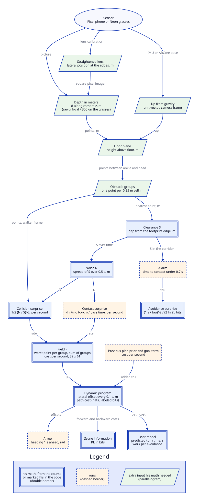

<!-- One page per section, because GitHub stops rendering math after about 825 expressions on
a page. The whole guide has about 1,450. -->

# The math, from the camera to the arrow

Every piece of math the laptop runs between a camera frame and the arrow on the walker's screen,
explained for a teammate who has never opened `server/nav/`. Each section starts with the idea in
plain words, then gives the formula, what every symbol means, where it lives in the code, and a
worked example with the real numbers.

It also says, everywhere, whose math each piece is. The professor's surprise and planning math is
the core of the planner. The project added some terms beside his, and had to measure several
things before his formulas could be fed at all. The section
[How we stick to the professor's math](15_professors_math.md) collects all of that in
one place.

This describes the code at commit `9503037` of `PlannerSnake`. If the code has moved on, the
constants quoted here may have too, and the file named in each table is where to check.

## Contents

| # | Section | What it answers |
|---|---|---|
| 1 | [Seeing in meters](01_seeing_in_meters.md) | How a picture becomes points in meters |
| 2 | [Which way is up](02_which_way_is_up.md) | How the camera knows where gravity points |
| 3 | [Finding the floor](03_finding_the_floor.md) | How the floor is found, and what counts as above it |
| 4 | [Obstacles and the walker's body](04_obstacles_and_body.md) | How points become obstacles, and how close each one is |
| 5 | [Following things over time](05_following_over_time.md) | How much an obstacle's distance wobbles |
| 6 | [Surprise](06_surprise.md) | How close plus how wobbly becomes a cost |
| 7 | [The field](07_the_field.md) | The cost of every place the walker could be over the next 3.8 s |
| 8 | [Planning a path](08_planning_a_path.md) | The cheapest way through that field |
| 9 | [The arrow and the alarm](09_arrow_and_alarm.md) | What the walker is shown |
| 10 | [How much the scene shaped the plan](10_scene_shaped_the_plan.md) | How much the obstacles changed the plan, in bits |
| 11 | [The walker's response](11_walker_response.md) | How long a turn should take, and what it cost |
| 12 | [Scoring the arrow](12_scoring_the_arrow.md) | Whether the arrow pointed where people actually turned |
| 13 | [Gaze on the floor](13_gaze_on_the_floor.md) | Where on the floor the glasses' wearer is looking |
| 14 | [How the path looks](14_how_the_path_looks.md) | Why the drawn path changes color and opacity |
| | [How we stick to the professor's math](15_professors_math.md) | His formulas, our changes and additions, and the inputs his math needed |
| | [Planned, and off by default](16_planned.md) | What is coming, and switched off until it's checked |

## The colors

Five symbols come up again and again, so each one always has the same color in the math. The color
is only a reminder. Every symbol is also named in words in its section's table, so nothing depends on
seeing color.

| Symbol | Color | What it is |
|---|---|---|
| $`{\color{teal}{S}}`$ | teal | **Clearance.** The gap between the walker and an obstacle, in meters |
| $`{\color{orange}{N}}`$ | orange | **Noise.** How much that gap wobbles over a short window, in meters |
| $`{\color{purple}{U}}`$ | purple | **Surprise.** A cost: how unexpected something is, as a number of nats or bits |
| $`{\color{blue}{T}}`$ | blue | **Effort.** The cost of moving sideways |
| $`{\color{red}{\tau}}`$ | red | **Time to contact.** How long until the walker reaches the obstacle, in seconds |

The callout boxes mean the same thing everywhere too:

> [!NOTE]
> **Ingredients.** What a formula needs, and where each input comes from.

> [!IMPORTANT]
> **The professor's math.** Cited from the course material, or marked as his in the code.

> [!TIP]
> **Ours.** Something the project added or chose, with the reason.

> [!WARNING]
> **A simplification.** What the plain version leaves out, and when that matters.

## The big picture

Read it top to bottom. Each box names the quantity it hands to the next one and its units. The box's
border tells you whose math it is:
- a double border is the professor's, from the course material or marked as his in the code
- a dashed border is ours
- a slanted box is something his math needed that the camera doesn't give directly

Two numbers come out of that chain for his formulas: the clearance $`{\color{teal}{S}}`$ to each
obstacle, and its noise $`{\color{orange}{N}}`$. The planner reads a little more than those two. It
takes each obstacle's position too, because it measures the distance again from every candidate
position it tries. It also reads whether the obstacle is a wall, and its velocity when motion
prediction is on. Sections 1 to 5 are about producing all that, and sections 6 to 9 are about
using it.
