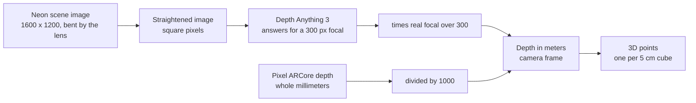
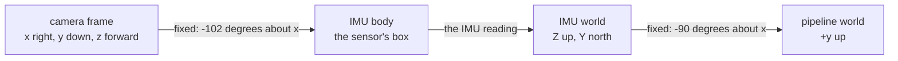
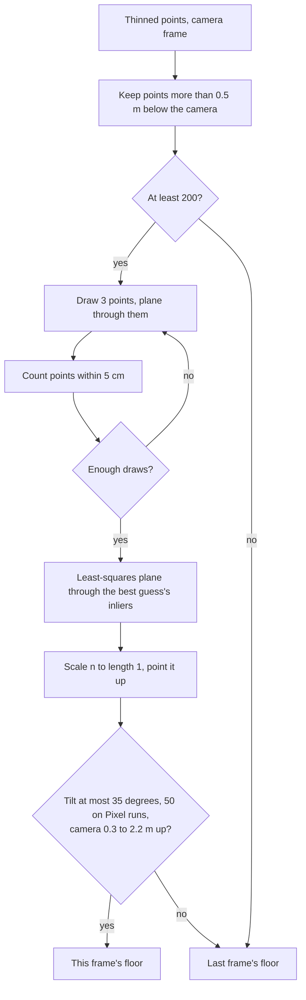
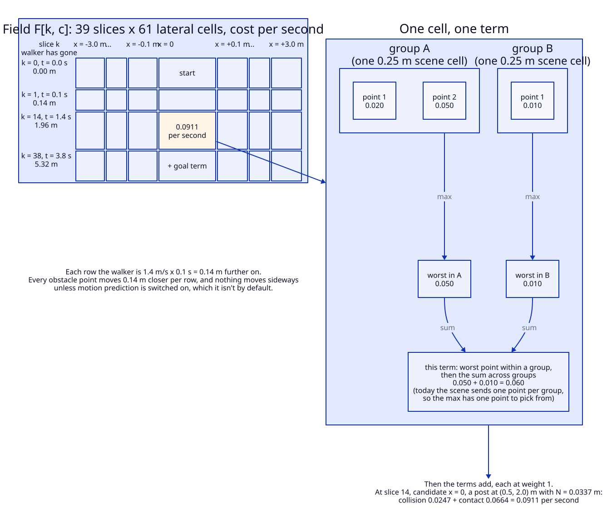
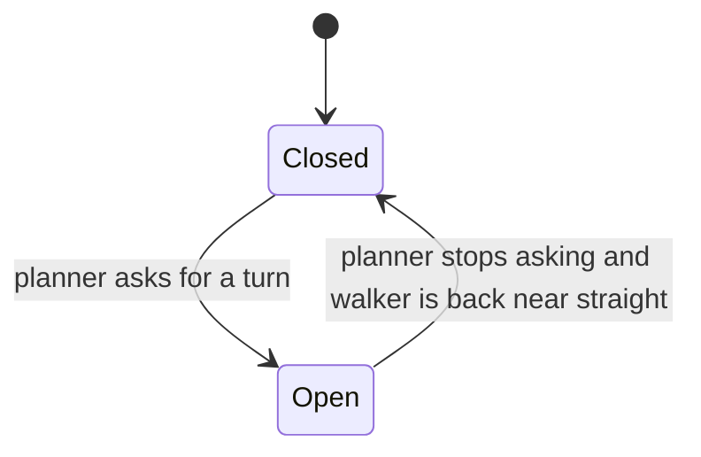
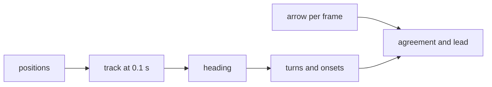

# The math, from the camera to the arrow

Every piece of math the laptop runs between a camera frame and the arrow on the walker's screen,
explained for a teammate who has never opened `server/nav/`. Each section starts with the idea in
plain words, then gives the formula, what every symbol means, where it lives in the code, and a
worked example with the real numbers.

It also says, everywhere, whose math each piece is. The professor's surprise and planning math is
the core of the planner. The project added some terms beside his, and had to measure several
things before his formulas could be fed at all. The section
[How we stick to the professor's math](#how-we-stick-to-the-professors-math) collects all of that in
one place.

This describes the code at commit `9503037` of `PlannerSnake`. If the code has moved on, the
constants quoted here may have too, and the file named in each table is where to check.

## Contents

| # | Section | What it answers |
|---|---|---|
| 1 | [Seeing in meters](#1-seeing-in-meters) | How a picture becomes points in meters |
| 2 | [Which way is up](#2-which-way-is-up) | How the camera knows where gravity points |
| 3 | [Finding the floor](#3-finding-the-floor) | How the floor is found, and what counts as above it |
| 4 | [Obstacles and the walker's body](#4-obstacles-and-the-walkers-body) | How points become obstacles, and how close each one is |
| 5 | [Following things over time](#5-following-things-over-time) | How much an obstacle's distance wobbles |
| 6 | [Surprise](#6-surprise) | How close plus how wobbly becomes a cost |
| 7 | [The field](#7-the-field) | The cost of every place the walker could be over the next 3.8 s |
| 8 | [Planning a path](#8-planning-a-path) | The cheapest way through that field |
| 9 | [The arrow and the alarm](#9-the-arrow-and-the-alarm) | What the walker is shown |
| 10 | [How much the scene shaped the plan](#10-how-much-the-scene-shaped-the-plan) | How much the obstacles changed the plan, in bits |
| 11 | [The walker's response](#11-the-walkers-response) | How long a turn should take, and what it cost |
| 12 | [Scoring the arrow](#12-scoring-the-arrow) | Whether the arrow pointed where people actually turned |
| 13 | [Gaze on the floor](#13-gaze-on-the-floor) | Where on the floor the glasses' wearer is looking |
| 14 | [How the path looks](#14-how-the-path-looks) | Why the drawn path changes color and opacity |
| | [How we stick to the professor's math](#how-we-stick-to-the-professors-math) | His formulas, our changes and additions, and the inputs his math needed |
| | [Planned, and off by default](#planned-and-off-by-default) | What is coming, and switched off until it's checked |

## The colors

Five symbols come up again and again, so each one always has the same color in the math. The color
is only a reminder. Every symbol is also named in words in its section's table, so nothing depends on
seeing color.

| Symbol | Color | What it is |
|---|---|---|
| ${\color{teal}{S}}$ | teal | **Clearance.** The gap between the walker and an obstacle, in meters |
| ${\color{orange}{N}}$ | orange | **Noise.** How much that gap wobbles over a short window, in meters |
| ${\color{purple}{U}}$ | purple | **Surprise.** A cost: how unexpected something is, as a number of nats or bits |
| ${\color{blue}{T}}$ | blue | **Effort.** The cost of moving sideways |
| ${\color{red}{\tau}}$ | red | **Time to contact.** How long until the walker reaches the obstacle, in seconds |

The callout boxes mean the same thing everywhere too:

> [!NOTE]
> **Ingredients.** What a formula needs, and where each input comes from.

> [!IMPORTANT]
> **The professor's math.** Cited from the course material, or marked as his in the code.

> [!TIP]
> **Ours.** Something the project added or chose, with the reason.

> [!WARNING]
> **A simplification.** What the plain version leaves out, and when that matters.

## The big picture

Read it top to bottom. Each box names the quantity it hands to the next one and its units. The box's
border tells you whose math it is:
- a double border is the professor's, from the course material or marked as his in the code
- a dashed border is ours
- a slanted box is something his math needed that the camera doesn't give directly

Two numbers come out of that chain for his formulas: the clearance ${\color{teal}{S}}$ to each
obstacle, and its noise ${\color{orange}{N}}$. The planner reads a little more than those two. It
takes each obstacle's position too, because it measures the distance again from every candidate
position it tries. It also reads whether the obstacle is a wall, and its velocity when motion
prediction is on. Sections 1 to 5 are about producing all that, and sections 6 to 9 are about
using it.

---

## 1. Seeing in meters

Every distance the planner works with is in meters, and that includes the gap to an obstacle,
${\color{teal}{S}}$. Neither camera hands over meters directly. The Pixel sends depth as whole
millimeters. The Neon glasses send a color picture, and a depth model on the laptop turns that
picture into numbers that are only meters for one particular zoom. This section is the chain that
gets from "a pixel and a number" to "a point in space, in meters".

The picture of distances is called a **depth map**: one number per pixel, saying how far away the
surface seen at that pixel is. The description of the camera's zoom and center is the **camera
matrix**, also called the intrinsics. Turning a depth pixel back into a 3D point is
**unprojection**.

Picture someone guessing distances from a photo. They don't know which lens took it, so they guess
as if it were a standard lens. Tell them the real lens zooms in less than that, and they can scale
every guess by the same ratio. The comparison stops working at one point. A person adjusts by
judgment, and the code multiplies by one fixed ratio, which is right only because the depth model
really does assume one fixed lens.

> [!NOTE]
> **Ingredients**
> - **Depth per pixel.** On the Pixel, ARCore's depth image, 16-bit millimeters over the network
>   (`server/nav/sources/framecodec.py`). On the Neon, Depth Anything 3's metric model
>   (`DA3METRIC-LARGE`), run on the laptop on the straightened scene image
>   (`server/nav/sources/estimated_depth.py`).
> - **The camera matrix.** On the Neon, the device's own calibration, read over the network when
>   the laptop connects (`server/nav/sources/neon_live.py`). On the Pixel, the ARCore frame header.
>   For a plain video file, an assumed field of view.
> - **The lens bend.** On the Neon, eight distortion numbers from the same device calibration.
> - **Image sizes.** The Neon's scene camera is 1600 by 1200 pixels. The depth image comes out at
>   the model's processing resolution, 504 by default and 336 in the 2026-10-05 glasses session.

Every point in this section is in the **camera frame**. Its axes follow OpenCV: x to the right in
the picture, y down, z straight out of the lens, all in meters (`server/nav/types.py`). Section 2
explains how that frame gets tied to gravity.

### Depth model output to meters

Depth Anything 3's metric model answers as if every camera had the same zoom, a focal length of
300 pixels. The real camera almost never matches. So the code multiplies each depth value by how
much more, or less, zoomed the real camera is than that assumed one. The assumed zoom is called the
**canonical focal length**.

$$z(u,v) = z_{\text{raw}}(u,v)\cdot\frac{(f_x + f_y)/2}{f_{\text{canon}}},\qquad f_{\text{canon}} = 300\ \text{px}$$

The result is stored as 32-bit floats. When a checkpoint already answers in meters, the code skips
the multiplication and passes the depth through unchanged.

| Symbol | Plain English | Units | Frame | Where in the code |
|---|---|---|---|---|
| $(u, v)$ | Pixel column and row in the depth image | px | depth image | `server/nav/sources/estimated_depth.py` |
| $z_{\text{raw}}$ | Depth as the model returns it, meters only for a 300 px camera | "meters at 300 px" | camera, along z | `server/nav/sources/estimated_depth.py` |
| $z$ | Depth in meters, along the lens axis | m | camera, along z | `server/nav/sources/estimated_depth.py` |
| $f_x, f_y$ | The real camera's focal lengths, at the depth image's size | px | camera | `server/nav/sources/estimated_depth.py` |
| $f_{\text{canon}}$ | The focal length the model assumes, 300 | px | none | `server/nav/sources/estimator.py` |

The focal length has to be the one at the depth image's size, not the camera's own size. The model
never sees the 1600 pixel image. It sees a shrunk copy.

| Step | Expression | Why |
|---|---|---|
| 1 | $f_x' = f_x \cdot W_d / W_s$, $f_y' = f_y \cdot H_d / H_s$ | Shrinking an image shrinks its focal length by the same ratio, separately across and down |
| 2 | $\bar f = (f_x' + f_y')/2$ | Depth Anything 3's own scaling rule takes the mean of the two |
| 3 | $\bar f / 300$ | How much more zoomed the real camera is than the one the model assumed |
| 4 | $z = z_{\text{raw}} \cdot \bar f / 300$ | Every pixel gets the same factor |

Here $W_s$ and $H_s$ are the scene image's width and height, and $W_d$ and $H_d$ the depth image's,
all in pixels.

**Worked example: one Neon frame at three resolutions.** The straightened Neon image has a focal
length of 754 px at 1600 pixels wide (`server/nav/sources/camera_model.py`, and the subsection "Square pixels at the larger focal"
below explains where 754 comes from). The code's docstring records one glasses frame run through the
model at three processing resolutions (`server/nav/sources/estimator.py`). The depth image width
equals the processing resolution, because Depth Anything 3 resizes the long side to it. That last
part is the library's behavior and the repository doesn't state it, but it reproduces the
docstring's numbers.

| Resolution | Focal at depth size | Factor | Raw camera height | Converted |
|---|---|---|---|---|
| 504 | $754 \times 504/1600 = 237.51$ px | $237.51/300 = 0.7917$ | 1.91 m | $1.91 \times 0.7917 = 1.512$ m |
| 336 | $754 \times 336/1600 = 158.34$ px | $158.34/300 = 0.5278$ | 2.91 m | $2.91 \times 0.5278 = 1.536$ m |
| 280 | $754 \times 280/1600 = 131.95$ px | $131.95/300 = 0.4398$ | 3.55 m | $3.55 \times 0.4398 = 1.561$ m |

The raw heights swing from 1.91 to 3.55 m depending on a processing setting. The converted ones sit
between 1.51 and 1.56 m, which is about where a walker's eyes are. A camera's height shouldn't
depend on how big an image the model was given, so that's the check that the conversion is right.

This is what went wrong in the 2026-10-05 glasses session, which ran at 336 before the conversion
existed. The floor came out about 2.9 m below the camera instead of about 1.56 m, so depth was
about $2.91 / 1.536 = 1.89$ times too large. The floor check refuses any floor more than 2.2 m
below the camera (section 3), so only 243 of 570 frames fitted a floor on that walk. A refused
frame keeps the last floor it had. On a replay with the conversion, 395 of 432 frames fitted one, with the camera a median 1.56 m up
(`docs/evaluation/neon_glasses_first_session.md`).

> [!WARNING]
> "Depth times focal over 300" leaves out which focal. It's the mean of $f_x$ and $f_y$ at the
> depth image's size. Plugging in the native 754 px instead would make depth
> $1600/504 = 3.17$ times too large at 504, and $1600/336 = 4.76$ times at 336. Taking the mean
> only matters when $f_x \ne f_y$, and no current route sends that, because the Neon's pixels are
> made square first and the fallback camera has one focal. The depth image's exact size is set
> inside Depth Anything 3 and isn't written in the repository. 504 by 378 is inferred.

> [!WARNING]
> **One route this doesn't cover.** A recorded session replayed through Pupil Labs' Neon Player
> plugin reads Depth Anything's cached depth maps directly as meters
> (`server/nav/sources/neon_plugin.py`). The repository doesn't say whether the plugin applied the
> focal over 300 conversion before it wrote that cache. So whether depths on that route are in
> meters is unknown. The server README notes that the plugin command hasn't been run yet.

> [!NOTE]
> **Library rule: Depth Anything 3.** Mean focal over 300 is the rule in Depth Anything 3's own
> `apply_metric_scaling` and in the metric model's usage notes. The code applies the same rule
> itself, after inference (`server/nav/sources/estimator.py`,
> `server/nav/sources/estimated_depth.py`).

### ARCore millimeters to meters

The phone sends each depth pixel as a whole number of millimeters, two bytes each. The laptop
divides by 1000.

$$z = \frac{\text{float32}(z_{\text{mm}})}{1000}$$

That's for 16-bit integer depth. A frame that arrives as 32-bit or 16-bit floats is cast to 32-bit
floats with no scaling.

| Symbol | Plain English | Units | Frame | Where in the code |
|---|---|---|---|---|
| $z_{\text{mm}}$ | ARCore's depth pixel, as sent | mm | camera, along z | `server/nav/sources/framecodec.py` |
| $z$ | The same depth in meters | m | camera, along z | `server/nav/sources/framecodec.py` |

**Worked example.**
1. 1560 mm becomes $1560 / 1000 = 1.560$ m.
2. The largest 16-bit value, 65535, becomes 65.535 m. Unprojection drops it later as further than
   30 m.
3. A zero, which ARCore sends where it has no reading, becomes 0 m. Unprojection drops it as closer
   than 0.1 m.

> [!WARNING]
> The only thing lost is anything finer than a millimeter.

> [!TIP]
> **Ours.** ARCore's depth image is 16-bit millimeters, which is a vendor fact quoted in the code.
> The phone keeps that format on the wire to keep each pixel at two bytes, and the laptop does the
> division (`server/nav/sources/framecodec.py`).

### The fallback camera

A plain video file comes with no camera matrix, and the metric model doesn't always supply one.
Then the code assumes a field of view, the angle from the left edge of the picture to the right,
and builds the simplest camera that has it. Its optical center is the exact middle of the image.
This is a **pinhole camera matrix**.

$$f = \frac{W_d/2}{\tan\theta_{\text{half}}},\qquad K = \begin{pmatrix} f & 0 & W_d/2 \\ 0 & f & H_d/2 \\ 0 & 0 & 1 \end{pmatrix}$$

| Symbol | Plain English | Units | Frame | Where in the code |
|---|---|---|---|---|
| $W_d$, $H_d$ | Depth image width and height | px | depth image | `server/nav/sources/estimator.py` |
| $\theta_{\text{half}}$ | Half the assumed field of view, `--fallback-fov` over 2 | degrees | camera | `server/nav/sources/config.py` |
| $f$ | The focal length that gives that angle | px | camera | `server/nav/sources/estimator.py` |
| $K$ | The camera matrix built from it | px | camera | `server/nav/sources/estimator.py` |

The formula is one triangle. Half the image width sits opposite half the angle, and the focal
length is the side next to it.

**Worked example.** A 504 by 378 depth image.
1. The default, 100 degrees across: $\tan 50^\circ = 1.191754$, so $f = 252 / 1.191754 = 211.45$ px,
   with the center at (252, 189).
2. Phone footage, run with `--fallback-fov 75`: $\tan 37.5^\circ = 0.767327$, so
   $f = 252 / 0.767327 = 328.41$ px.

> [!WARNING]
> A wrong angle only stretches distances along the lens axis. With the focal over 300 conversion,
> depth scales with $f$ but the sideways offsets don't. So assuming 100 degrees for a camera that
> really sees 75 scales every z by $211.45 / 328.41 = 0.6439$. A level camera still reads its height
> correctly. A camera pitched down 40 degrees, 1.5 m up, reads its height as
> $1.5 / \sqrt{\cos^2 40^\circ + \sin^2 40^\circ / 0.6439^2} = 1.5 / 1.258 = 1.19$ m, and its floor
> leans by $\arctan\big((\sin 40^\circ / 0.6439) / \cos 40^\circ\big) - 40^\circ = 52.5^\circ - 40^\circ = 12.5^\circ$.
> Both figures match the code's docstring (`server/nav/sources/estimator.py`). The center is also
> assumed at the exact middle of the image, with the same focal across and down.

> [!TIP]
> **Ours.** The 100 degree default comes from the team's earlier script. The code's comment says a
> phone camera is nearer 75, so a run on phone footage should set `--fallback-fov 75`, and the
> server README does. Only the video file route uses this. The Neon brings its own calibration.

### Straightening the Neon's lens

The Neon's scene camera is wide, and its lens bends straight lines, most of all near the edges. A
lamp post near the side of the picture comes out curved and pulled toward the middle. The depth
model learned on pictures where straight lines stay straight, so the laptop straightens every Neon
frame before the model sees it. Straightening is called **undistortion**. The bend is described by
**OpenCV's rational lens model**, which takes eight numbers per camera, the **distortion
coefficients**.

The code works backwards from the straight picture. For each pixel of the straight output, it asks
where that point sits in the bent input, and reads the color there.

$$x' = \frac{u_o - c_{x,\text{new}}}{f_{\text{sq}}},\qquad y' = \frac{v_o - c_{y,\text{new}}}{f_{\text{sq}}},\qquad \rho^2 = x'^2 + y'^2$$

$$x'' = x'\,\frac{1 + k_1\rho^2 + k_2\rho^4 + k_3\rho^6}{1 + k_4\rho^2 + k_5\rho^4 + k_6\rho^6} + 2p_1 x'y' + p_2\,(\rho^2 + 2x'^2)$$

$$y'' = y'\,\frac{1 + k_1\rho^2 + k_2\rho^4 + k_3\rho^6}{1 + k_4\rho^2 + k_5\rho^4 + k_6\rho^6} + p_1\,(\rho^2 + 2y'^2) + 2p_2 x'y'$$

$$u_s = f_x\,x'' + c_x,\qquad v_s = f_y\,y'' + c_y$$

The output pixel takes the input's color at $(u_s, v_s)$, blended from the four nearest input
pixels. The lookup positions depend only on the calibration, so they're computed once as a map
(`cv2.initUndistortRectifyMap`) and every frame reuses it (`cv2.remap`).

| Symbol | Plain English | Units | Frame | Where in the code |
|---|---|---|---|---|
| $(u_o, v_o)$ | A pixel of the straight output image | px | straightened image | `server/nav/sources/camera_model.py` |
| $(x', y')$ | Its direction from the lens axis, as sideways over forward | none | camera | Inside OpenCV's `initUndistortRectifyMap`, called from `server/nav/sources/camera_model.py` |
| $\rho$ | How far that direction is from the axis | none | camera | Inside OpenCV's `initUndistortRectifyMap`, called from `server/nav/sources/camera_model.py` |
| $k_1 \dots k_6$ | How strongly the lens bends with distance from the axis | none | camera | read from the device |
| $p_1, p_2$ | A small skew that doesn't follow circles around the axis | none | camera | read from the device |
| $(x'', y'')$ | Where the bent lens actually puts that direction | none | camera | Inside OpenCV's `initUndistortRectifyMap`, called from `server/nav/sources/camera_model.py` |
| $f_x, f_y, c_x, c_y$ | The device's own focal lengths and center | px | delivered image | read from the device |
| $f_{\text{sq}}, c_{x,\text{new}}, c_{y,\text{new}}$ | The straight image's focal and center, below | px | straightened image | `server/nav/sources/camera_model.py` |
| $(u_s, v_s)$ | The pixel of the bent input to read | px | delivered image | Inside OpenCV's `initUndistortRectifyMap`, called from `server/nav/sources/camera_model.py` |

$\rho$ is written with a Greek letter here so it isn't confused with the walker's footprint radius
$r$ in later sections.

| Step | Expression | Why |
|---|---|---|
| 1 | $(x', y')$ from the output pixel | Undo the straight camera's zoom and center, leaving a direction |
| 2 | Multiply by the radial fraction | Bending depends on distance from the axis, so this is a function of $\rho^2$ |
| 3 | Add the $p_1$, $p_2$ terms | The skew part, which doesn't follow circles around the axis |
| 4 | Apply the device's $f_x, f_y, c_x, c_y$ | Back to a pixel position in the picture the camera delivered |

**Worked example: how far the Neon's lens pulls a point in.** The Neon's calibration, as read off
the device and recorded in the tests, is $f_x = 890.9$, $f_y = 890.6$, $c_x = 807.3$,
$c_y = 608.5$, with $k_1 = -0.1307$, $k_2 = 0.1092$, $p_1 = -0.0003$, $p_2 = -0.0005$, $k_3 = 0$,
$k_4 = 0.1702$, $k_5 = 0.0519$, $k_6 = 0.0255$ (`server/tests/test_camera_model.py`). Take a
direction level with the axis, $y' = 0$.

| Direction | $\rho^2$ | Radial fraction | $x''$ | Lens puts it at $u_s$ | A bend-free lens would put it at |
|---|---|---|---|---|---|
| $x' = 0.5$, 26.6° right | 0.25 | 0.9311 | 0.4652 | $807.3 + 890.9 \times 0.4652 = 1221.7$ | $807.3 + 890.9 \times 0.5 = 1252.7$ |
| $x' = 1.0604$, 46.7° right | 1.1245 | 0.7664 | 0.8110 | $807.3 + 890.9 \times 0.8110 = 1529.8$ | $807.3 + 890.9 \times 1.0604 = 1752.0$ |

At 26.6 degrees the lens pulls the point 31 px toward the middle. At 46.7 degrees it pulls it
222 px in. A bend-free lens with this focal would put that second direction past the right edge at
1600, so the bend is what fits it in the frame. The $p$ terms move the two points up by about
0.07 and 0.3 px and sideways by about 0.3 and 1.5 px, which is too little to see. Those shifts are
already in the table's $x''$ values. At the very center $x' = y' = 0$, every term is zero, and the center of
the output reads the input at $(c_x, c_y)$.

The gaze point goes the other way, from the bent image to the straight one. That direction has no
formula, so OpenCV guesses, bends the guess, compares, and repeats, up to 50 rounds or until it's
within a millionth of a pixel. Section 13 picks it up from there.

### Square pixels at the larger focal

After straightening, OpenCV picks a new zoom for the output that leaves no blank border
(`getOptimalNewCameraMatrix` with $\alpha = 0$, where $\alpha = 0$ means crop until every output
pixel has a source). On the Neon it picked different zooms across and down, $f_x = 636$ and
$f_y = 754$. That would squash the picture sideways. The code sets both to the larger one. Pixels
with the same focal across and down are called **square pixels**.

$$f_{\text{sq}} = \max\big(f_{x,\text{new}},\ f_{y,\text{new}}\big)$$

The center stays where OpenCV put it.

| Symbol | Plain English | Units | Frame | Where in the code |
|---|---|---|---|---|
| $f_{x,\text{new}}, f_{y,\text{new}}$ | OpenCV's border-free zooms, across and down | px | straightened image | `server/nav/sources/camera_model.py` |
| $f_{\text{sq}}$ | The one focal used for both | px | straightened image | `server/nav/sources/camera_model.py` |

| Step | Expression | Why |
|---|---|---|
| 1 | OpenCV returns $f_{x,\text{new}} = 636$, $f_{y,\text{new}} = 754$ | Each axis zoomed just enough to leave no blank border |
| 2 | $636 / 754 = 0.8435$ | The picture would be squashed 15.6 percent sideways, which the code's comment rounds to 16 |
| 3 | $f_{\text{sq}} = \max(636, 754) = 754$ | Square pixels, by zooming the wide axis in to match |
| 4 | $100 \times 754 / 636 = 118.6$ | A feature 100 px wide at 636 now spans 118.6 px, so a bit more is cropped off the sides |

**Worked example: what the depth model sees.** The tests pin the square focal at 754.4 px for the
Neon (`server/tests/test_camera_model.py`). The straight image is 1600 by 1200, so:

1. Across: $2\arctan(800 / 754.4) = 2 \times 46.68^\circ = 93.4^\circ$.
2. Down: $2\arctan(600 / 754.4) = 77.0^\circ$, OpenCV's full vertical angle, kept whole because
   the larger focal came from that axis.
3. The device matrix alone, with no bend, would claim
   $\arctan(807.3/890.9) + \arctan(792.7/890.9) = 83.8^\circ$ across. That's the "about 84" the
   test mentions. It isn't the lens's real width, because a barrel lens packs extra angle into its
   edge pixels. The code logs the real "before" figure when it builds the straightener, on the first
   frame, by straightening the two edge
   pixels on the row through the optical center, $c_y$, and measuring the angle between them.

> [!WARNING]
> "The lens is straightened" hides two crops. OpenCV crops once to leave no blank border, and the
> larger focal crops the sides again. An obstacle near the left or right edge of the raw picture
> can fall outside the straight one. At the outermost row the lookup can land half a pixel past
> the source, so the code copies the edge pixel there instead of leaving black, because the depth
> model would invent depth for black. Only the live Neon route straightens. The Neon Player plugin
> route scales the recording's own camera matrix to the depth image's size and ignores the bend
> entirely.

> [!NOTE]
> **Library rules: OpenCV and Pupil Labs.** The rational model, the border-free matrix and the
> remap are OpenCV's, and the code doesn't write the model out. The eight coefficients are Pupil
> Labs' per-device calibration, read from the glasses at connect.

> [!TIP]
> **Ours: the larger focal for both axes.** The depth model learned on square pixels, and the
> focal over 300 conversion uses a single focal. The code's comment records the 636 against 754
> measurement that prompted it.

### From a pixel to a point

Each depth pixel becomes a point in space. The further a pixel is from the picture's center, the
further sideways or down the point is, in proportion to how far away it is. That's similar
triangles. Pixels with no depth, too close or too far are dropped first.

$$\mathbf{p} = \left(\frac{(u - c_x)\,z}{f_x},\ \frac{(v - c_y)\,z}{f_y},\ z\right),\qquad \text{kept when } 0.1 \le z \le 30\ \text{m}$$

Only every second row and every second column is used.

| Symbol | Plain English | Units | Frame | Where in the code |
|---|---|---|---|---|
| $(u, v)$ | Pixel column and row, as whole numbers | px | depth image | `server/nav/scene/unproject.py` |
| $z$ | Depth in meters along the lens axis | m | camera | `server/nav/scene/unproject.py` |
| $f_x, f_y, c_x, c_y$ | The camera matrix at the depth image's size | px | camera | `server/nav/scene/unproject.py` |
| $s$ | Stride, use every $s$-th row and column, 2 | pixels | depth image | `server/nav/scene/config.py` |
| $\mathbf{p}$ | The 3D point | m | camera | `server/nav/scene/unproject.py` |

| Step | Expression | Why |
|---|---|---|
| 1 | $(u - c_x)/f_x$ | How far off-center the pixel is, as sideways per meter forward |
| 2 | $\times z$ | Scale by how far forward the surface is |
| 3 | Same for $v$, then $z$ itself | Down and forward |

**Worked example.** A 504 by 378 depth image with the fallback camera, $f = 211.45$ px and center
(252, 189). A stride of 2 leaves $252 \times 189 = 47{,}628$ pixels to look at. Pixel (352, 289) at
$z = 1.51$ m:

1. Sideways: $(352 - 252) \times 1.51 / 211.45 = 100 \times 1.51 / 211.45 = 0.7141$ m right.
2. Down: $(289 - 189) \times 1.51 / 211.45 = 0.7141$ m.
3. Forward: 1.51 m.

So $\mathbf{p} = (0.7141, 0.7141, 1.51)$ in the camera frame. Sections 2 and 3 follow this point.

> [!WARNING]
> $z$ is distance along the lens axis, not along the line from the lens to the point, and the
> pixel number is used as the coordinate with no half-pixel shift. Both are the usual convention
> for metric depth maps. The 0.1 to 30 m range is what drops ARCore's zero-means-missing pixels and
> the sky.

> [!TIP]
> **Ours.** The stride and the 0.1 to 30 m range come from the team's earlier script. The code's
> comment gives the reason for the range: closer than the floor is a smudged lens, and further is
> sky.

### Thinning to one point per 5 cm cube

Space is cut into 5 cm cubes, and every cube that holds points keeps a single point, the average
of them. Near surfaces get many samples and far ones few, so without this the near ones would
outvote the far ones in the floor search. This is **voxel downsampling**, and a voxel is one of the
cubes.

$$\mathbf{q} = \frac{1}{\lvert V\rvert}\sum_{\mathbf{p}\in V}\mathbf{p}$$

| Symbol | Plain English | Units | Frame | Where in the code |
|---|---|---|---|---|
| $V$ | The points inside one 0.05 m cube | none | camera | `server/nav/scene/unproject.py` |
| $\lvert V\rvert$ | How many points that is | count | none | `server/nav/scene/unproject.py` |
| $\mathbf{q}$ | The one point the cube keeps | m | camera | `server/nav/scene/unproject.py` |

**Worked example.** The Neon at 504, so $f = 237.51$ px, with stride 2. At 1.51 m, neighboring
samples sit $2 \times 1.51 / 237.51 = 0.0127$ m apart. A 0.05 m cube edge holds
$0.05 / 0.0127 = 3.9$ of them, so a surface facing the camera puts about $3.9^2 = 15.2$ samples in
each cube. All of them become one point.

> [!WARNING]
> The average stays inside its 5 cm cube, so the kept point lies within 2.5 cm of the cube's
> center along each axis. An original point near one face can end up almost a full edge, 5 cm,
> away from it along an axis. The cubes line up with the camera's axes, not the floor's.

> [!NOTE]
> **Library rule: Open3D.** This is Open3D's `voxel_down_sample` at 0.05 m, the only Open3D call
> in the scene code. Averaging the points in each cube is Open3D's behavior and the repository
> doesn't restate it. The 0.05 m size comes from the team's earlier script.

---

## 2. Which way is up

The floor search in section 3 needs to know which way is up. From the picture alone it can't tell.
Tip a camera far enough and the floor looks like a wall, and a wall looks like a floor. Gravity
settles it. Both devices measure gravity, so the code turns their reading into an up direction as
the camera sees it. A device's reading of how it's turned is its **orientation**. When that
orientation is tied to gravity, the code calls the pose **gravity-aligned**.

Think of a spirit level glued to the camera. On the Pixel, ARCore reads the bubble and reports it
directly in the camera's terms. On the Neon, the bubble sits on the motion sensor's box, and that
box is glued to the frame at an angle to the camera, so the code also needs the glue angle. The
comparison stops working at one point. A spirit level only shows up, and the devices also report a
compass direction, which the floor search doesn't need.

The Neon's motion sensor is an **IMU**, an inertial measurement unit. It fuses its own sensors on
the device and reports its orientation as a **quaternion**, four numbers that describe one
rotation.

Every quantity here lives in one of these frames.

| Frame | Axes | Units | Where in the code |
|---|---|---|---|
| camera | x right in the picture, y down, z out of the lens (OpenCV) | m | `server/nav/types.py` |
| IMU body | The Neon IMU's own axes, Pupil Labs' convention | none | `server/nav/pose/neon_mount.py` |
| IMU world | Z up, Y toward magnetic north | none | `server/nav/pose/neon_mount.py` |
| pipeline world | +y up, `WORLD_UP = (0, 1, 0)`. On the Pixel, this is ARCore's world | m | `server/nav/types.py` |
| ground | Two floor directions, lateral to the right and forward, from section 3 | m | `server/nav/types.py` |

> [!NOTE]
> **Ingredients**
> - **Pixel.** ARCore's orientation, four numbers $(w, x, y, z)$ that turn the camera's axes into
>   ARCore's world, where +y is straight up. The phone sends the gravity-aligned flag as true, and
>   the laptop assumes true when the key is missing. ARCore also sends a position
>   (`server/nav/sources/framecodec.py`, `server/docs/arcore_wire_format.md`).
> - **Neon, live.** The newest IMU quaternion, read by field name as $(w, x, y, z)$
>   (`server/nav/sources/neon_live.py`).
> - **Neon, recorded.** The recording's IMU sample nearest in time, within 0.05 s, reordered from
>   $(x, y, z, w)$ (`server/nav/sources/neon_plugin.py`).
> - **Mount angles.** Two fixed turns from Pupil Labs' documentation, not measured on our glasses
>   (`server/nav/pose/neon_mount.py`).
> - **Plain video.** Nothing. The code falls back to the picture's own up.

On the Neon, the camera's orientation is a chain of three turns.

### A turn about one axis, as four numbers

A turn by an angle $\theta$ about the sideways x axis, written as a quaternion:

$$q_x(\theta) = \left(\cos\frac{\theta}{2},\ \sin\frac{\theta}{2},\ 0,\ 0\right)$$

The four numbers are in the order $(q_w, q_x, q_y, q_z)$, and positive angles turn right-handed.

| Symbol | Plain English | Units | Frame | Where in the code |
|---|---|---|---|---|
| $\theta$ | The turn angle about x | degrees | between the two frames it links | `server/nav/pose/neon_mount.py` |
| $q_x(\theta)$ | That turn as a unit quaternion | none | between the two frames | `server/nav/pose/neon_mount.py` |

**Worked example: the Neon's two mount turns.**
1. Camera into IMU body, $\theta = -102^\circ$. Half of that is $-51^\circ$, so
   $q = (\cos(-51^\circ), \sin(-51^\circ), 0, 0) = (0.629320, -0.777146, 0, 0)$. Pupil Labs writes
   this angle as $-90 - 12$. The 90 relabels axes, and the 12 is the camera tilted down from the
   module's forward direction.
2. IMU world into pipeline world, $\theta = -90^\circ$:
   $q = (0.707107, -0.707107, 0, 0)$. A quarter turn about x sends the IMU world's up, $(0, 0, 1)$,
   to $(0, 1, 0)$, our up. It sends north, $(0, 1, 0)$, to $(0, 0, -1)$, so north ends up on
   minus z.

> [!NOTE]
> **Vendor numbers: Pupil Labs.** Both angles come from Pupil Labs' IMU transformation
> documentation, and the code says so. They weren't measured on our glasses, and they're assumed
> identical for every Neon. The mount file's comment still says the first live run is what
> confirms them. The 2026-10-05 replay found a floor on 91 percent of frames, but no comment
> records the angles as confirmed.

### Chaining turns: the Hamilton product

Two turns in a row combine by multiplying their quaternions with the **Hamilton product**. The
right-hand one happens first, and the order matters.

$$\begin{aligned}
(a \otimes b)_w &= a_w b_w - a_x b_x - a_y b_y - a_z b_z \\
(a \otimes b)_x &= a_w b_x + a_x b_w + a_y b_z - a_z b_y \\
(a \otimes b)_y &= a_w b_y - a_x b_z + a_y b_w + a_z b_x \\
(a \otimes b)_z &= a_w b_z + a_x b_y - a_y b_x + a_z b_w
\end{aligned}$$

| Symbol | Plain English | Units | Frame | Where in the code |
|---|---|---|---|---|
| $a, b$ | Two rotations, $b$ applied first | none | $b$ ends where $a$ starts | `server/nav/pose/imu_orientation.py` |
| $a \otimes b$ | Both turns as one | none | from $b$'s start to $a$'s end | `server/nav/pose/imu_orientation.py` |

**Worked example: both mount turns at once.** $q_x(-90^\circ) \otimes q_x(-102^\circ)$:
1. $w = 0.707107 \times 0.629320 - (-0.707107)(-0.777146) = 0.444997 - 0.549525 = -0.104528$
2. $x = 0.707107 \times (-0.777146) + (-0.707107)(0.629320) = -0.549525 - 0.444997 = -0.994522$
3. $y = z = 0$

That's $(\cos(-96^\circ), \sin(-96^\circ), 0, 0) = q_x(-192^\circ)$. Two turns about the same axis
add up, which is the check.

> [!TIP]
> **Ours, standard algebra.** The product is written out by hand in the code rather than pulled
> from a library.

### The camera's orientation from the IMU

Chain the three turns: camera into the IMU's box, the box into the IMU's world, that world into
ours. The result says how the camera is turned in the pipeline world. It knows up and north. It
doesn't know where the camera is.

$$q_{\text{wc}} = \frac{q_{\text{w}\leftarrow\text{iw}} \otimes \hat q_{\text{imu}} \otimes q_{\text{b}\leftarrow\text{c}}}{\lVert\,q_{\text{w}\leftarrow\text{iw}} \otimes \hat q_{\text{imu}} \otimes q_{\text{b}\leftarrow\text{c}}\,\rVert},\qquad \hat q_{\text{imu}} = \frac{q_{\text{imu}}}{\lVert q_{\text{imu}}\rVert}$$

The pose that comes out has no position and has the gravity-aligned flag set to true.

| Symbol | Plain English | Units | Frame | Where in the code |
|---|---|---|---|---|
| $q_{\text{imu}}$ | The IMU's reading, not always exactly length 1 | none | IMU body into IMU world | `server/nav/pose/imu_orientation.py` |
| $q_{\text{b}\leftarrow\text{c}}$ | $q_x(-102^\circ)$ | none | camera into IMU body | `server/nav/pose/neon_mount.py` |
| $q_{\text{w}\leftarrow\text{iw}}$ | $q_x(-90^\circ)$ | none | IMU world into pipeline world | `server/nav/pose/neon_mount.py` |
| $q_{\text{wc}}$ | The camera's orientation | none | camera into pipeline world | `server/nav/pose/imu_orientation.py` |

| Step | Expression | Why |
|---|---|---|
| 1 | $\hat q_{\text{imu}} = q_{\text{imu}} / \lVert q_{\text{imu}}\rVert$ | A rotation has length 1, and the reading may be slightly off |
| 2 | $\hat q_{\text{imu}} \otimes q_{\text{b}\leftarrow\text{c}}$ | Camera into the box, then the box into the IMU world |
| 3 | $q_{\text{w}\leftarrow\text{iw}} \otimes (\dots)$ | The IMU world into ours |
| 4 | Divide by the length | Keep the result a clean rotation after rounding |

**Worked example: the box sitting level, facing north.** That reading is $(1, 0, 0, 0)$, no turn.
Then $q_{\text{wc}} = q_x(-90^\circ) \otimes (1,0,0,0) \otimes q_x(-102^\circ) = (-0.104528, -0.994522, 0, 0)$,
a $-192^\circ$ turn about x. The lens direction, camera $(0, 0, 1)$, lands at
$(0,\ -\sin(-192^\circ),\ \cos(-192^\circ)) = (0, -0.2079, -0.9781)$ in the pipeline world. That's
toward north, minus z, and 12 degrees below level, the camera's tilt. A reading of $(2, 0, 0, 0)$
gives the same answer after step 1.

**Readings that aren't rotations.** A quaternion that's nearly zero, or not a number, is a dropped
reading. The code skips it and keeps the last good one.

$$\text{usable when } \lVert q\rVert \text{ is finite and } \lVert q\rVert \ge 0.5$$

A mount quaternion written into the code has to be a true rotation, $\big\lvert\,\lVert q\rVert - 1\,\big\rvert \le 10^{-6}$.

1. $(0, 0, 0, 0)$ has length 0, under 0.5, so it's skipped.
2. $(0.5, 0, 0, 0)$ has length exactly 0.5, so it's kept and scaled to $(1, 0, 0, 0)$.
3. The two mount quaternions above have length 1 to within about $10^{-16}$.

> [!TIP]
> **Ours: the chain and the gates.** The chain links Pupil Labs' documented mount to the
> orientation the glasses compute themselves. The empty-reading gate is there because the Neon sent
> nothing but zero quaternions for minutes at a time on 2026-10-05
> (`server/nav/pose/imu_orientation.py`).

> [!WARNING]
> The pose has no position, so nothing on the Neon route places points in a world that stays put.
> On the live route the newest IMU reading is reused for the next picture, with no matching of
> times. And the 0.5 cut accepts a badly scaled but nonzero reading and quietly rescales it.

### Up, as the camera sees it

The floor search works in the camera frame, so it needs up written in camera axes. First the
quaternion becomes a 3 by 3 **rotation matrix** $R$. Each column of $R$ is one camera axis written
in world coordinates.

$$R = \begin{pmatrix} 1 - 2(q_y^2 + q_z^2) & 2(q_x q_y - q_z q_w) & 2(q_x q_z + q_y q_w) \\ 2(q_x q_y + q_z q_w) & 1 - 2(q_x^2 + q_z^2) & 2(q_y q_z - q_x q_w) \\ 2(q_x q_z - q_y q_w) & 2(q_y q_z + q_x q_w) & 1 - 2(q_x^2 + q_y^2) \end{pmatrix}$$

Then up in the camera frame is the world's up turned back into camera axes, when the pose is
gravity-aligned. Turning back is the transpose, $R^\top$.

$$\mathbf{u}_{\text{cam}} = \begin{cases} R^\top\,(0, 1, 0) & \text{if the pose is flagged gravity-aligned} \\ (0, -1, 0) & \text{otherwise, the picture's own up} \end{cases}$$

**Gravity is used whenever the pose is flagged gravity-aligned, with or without a position.** The
Neon has no position and still gets gravity. A few docstrings and the server README tie up to
having a position. The code ties it to the flag (`server/nav/scene/pipeline.py`).

| Symbol | Plain English | Units | Frame | Where in the code |
|---|---|---|---|---|
| $(q_w, q_x, q_y, q_z)$ | The camera's orientation, scaled to length 1 | none | camera into pipeline world | `server/nav/scene/transform.py` |
| $R$ | The same rotation as a matrix | none | camera into pipeline world | `server/nav/scene/transform.py` |
| $(0, 1, 0)$ | `WORLD_UP` | none | pipeline world | `server/nav/types.py` |
| $(0, -1, 0)$ | `CAMERA_UP`, the top of the picture | none | camera | `server/nav/scene/floor.py` |
| $\mathbf{u}_{\text{cam}}$ | Up, in camera axes, length 1 | none | camera | `server/nav/scene/pipeline.py` |

**Worked example: a level head on the Neon.** With $q = (-0.104528, -0.994522, 0, 0)$:
1. $q_x^2 = 0.989074$ and $q_x q_w = 0.103956$.
2. $R_{11} = R_{22} = 1 - 2 \times 0.989074 = -0.978148$, $R_{12} = -2 \times 0.103956 = -0.207912$,
   $R_{21} = 0.207912$, $R_{00} = 1$, everything else 0. That's a $-192^\circ$ turn about x.
3. $R^\top(0, 1, 0)$ is the second row of $R$: $\mathbf{u}_{\text{cam}} = (0, -0.978148, -0.207912)$.
4. Its angle from the picture's up is $\arccos(0.978148) = 12.0^\circ$, the camera's tilt from the
   vendor's mount.

So with the head level, up points mostly toward the top of the picture and a little back toward
the wearer. Section 3 uses this vector.

> [!TIP]
> **Ours: gravity from the flag, not from a position.** The Pixel in portrait sends its depth image
> sideways, and measured against the picture's up its floor leaned 89 degrees on every frame of the
> first walk. The glasses report gravity and no position at all, and the code's comment records
> that asking for a position threw their gravity away (`server/nav/scene/pipeline.py`).

> [!WARNING]
> The picture's own up is right only for a level camera. It's used for plain video files, for live
> Neon frames that arrive before the first usable IMU reading, and on the Neon Player plugin route
> until a usable IMU sample turns up, which for a recording with no IMU data is every frame. That's the one place the code
> assumes a level camera on purpose. Section 1's fallback camera shows what a pitched camera then
> gets wrong.

### Into the world, when there is a position

Only the Pixel has a position, from ARCore's tracking. With one, each camera-frame point is turned
into the world and then shifted by where the camera is. The floor plane from section 3 moves the
same way. A plane is written as $\mathbf{n}\cdot\mathbf{p} + d = 0$, where $\mathbf{n}$ is the
direction straight out of it and $d$ is its offset.

$$\mathbf{p}_w = R\,\mathbf{p}_c + \mathbf{t},\qquad \mathbf{n}_w = R\,\mathbf{n}_c,\qquad d_w = d_c - \mathbf{n}_w\cdot\mathbf{t}$$

| Symbol | Plain English | Units | Frame | Where in the code |
|---|---|---|---|---|
| $\mathbf{p}_c$, $\mathbf{p}_w$ | A point, before and after | m | camera, pipeline world | `server/nav/scene/transform.py` |
| $\mathbf{t}$ | Where the camera is | m | pipeline world | `server/nav/scene/transform.py` |
| $\mathbf{n}_c$, $\mathbf{n}_w$ | The plane's direction, before and after | none | camera, pipeline world | `server/nav/scene/transform.py` |
| $d_c$, $d_w$ | The plane's offset, before and after | m | camera, pipeline world | `server/nav/scene/transform.py` |

**Worked example, arithmetic only.** No current route pairs the Neon's rotation with a position, so
this just shows the sums. Take $R$ from above and a camera 1.56 m up, $\mathbf{t} = (0, 1.56, 0)$.
1. Section 1's point, $\mathbf{p}_c = (0.7141, 0.7141, 1.51)$:
   $R\,\mathbf{p}_c = (0.7141,\ -0.698495 - 0.313947,\ 0.148470 - 1.477003) = (0.7141, -1.0124, -1.3285)$.
2. Add $\mathbf{t}$: $\mathbf{p}_w = (0.7141, 0.5476, -1.3285)$, a point 0.55 m above the floor and
   1.33 m to the north.
3. The level floor in camera axes, $\mathbf{n}_c = (0, -0.978148, -0.207912)$ with $d_c = 1.56$:
   $\mathbf{n}_w = (0,\ 0.956774 + 0.043227,\ -0.203373 + 0.203373) = (0, 1, 0)$ and
   $d_w = 1.56 - 1.56 = 0$. The floor is the plane $y = 0$.

The point's height comes out 0.5476 m in both frames, which section 3 checks from the camera side.

> [!TIP]
> **Ours, standard rigid motion.** The convention is written in the code: an orientation turns
> camera-frame vectors into the world, and world equals $R$ times camera plus position
> (`server/nav/scene/transform.py`).

---

## 3. Finding the floor

Clearance is measured along the floor, and an obstacle is only an obstacle if it sticks up from
the floor. So every frame, the code looks for the floor among the points from section 1. It takes
the biggest flat surface below the camera that's roughly level. The method is to guess a plane
through three random points, count how many points lie close to it, repeat, keep the best guess,
and then fit it properly to all the points that were close. That method is called **RANSAC**,
short for random sample consensus. The points close to a guess are its **inliers**.

Picture finding a table top in a cluttered room by laying a sheet of glass on three random spots
and counting how many things touch the glass. Try enough times and the table top wins, because it
has more things lying on it than any slanted guess through a chair and a lamp. The comparison
stops working at one point. The code doesn't just keep the winning sheet where it landed. It tilts
it to sit as close as it can to everything that touched it.

> [!NOTE]
> **Ingredients**
> - **Points.** The thinned camera-frame points from section 1, one per 5 cm cube.
> - **Up.** $\mathbf{u}_{\text{cam}}$ from section 2, in the camera frame: gravity when the pose is
>   flagged gravity-aligned, the picture's up otherwise.
> - **Last frame's floor.** Used again when this frame's guess is refused.
> - **ARCore's plane, on the Pixel.** When the phone supplies a floor plane, it goes through the
>   same level and height checks as a fitted one (`server/nav/scene/pipeline.py`).

A plane is written $\mathbf{n}\cdot\mathbf{p} + d = 0$. $\mathbf{n}$ is the direction straight out
of the plane, length 1, and $d$ is the offset. Everything in this section is in the camera frame,
unless the Pixel's position moves it into the world as in section 2.

### Which points may vote

Only points well below the camera get a vote, so a big wall straight ahead can't win.

$$b_i = -(\mathbf{p}_i \cdot \mathbf{u}_{\text{cam}}),\qquad \text{a candidate when } b_i > 0.5\ \text{m}$$

The search runs only with at least 200 candidates. With fewer, last frame's floor is kept.

| Symbol | Plain English | Units | Frame | Where in the code |
|---|---|---|---|---|
| $\mathbf{p}_i$ | One thinned point | m | camera | `server/nav/scene/floor.py` |
| $\mathbf{u}_{\text{cam}}$ | Up, length 1 | none | camera | `server/nav/scene/pipeline.py` |
| $b_i$ | How far below the camera the point is, measured along up | m | camera | `server/nav/scene/floor.py` |

**Worked example: a level head on the Neon,** $\mathbf{u}_{\text{cam}} = (0, -0.978148, -0.207912)$.
1. Section 1's point $(0.7141, 0.7141, 1.51)$:
   $\mathbf{p}\cdot\mathbf{u} = -0.6985 - 0.3139 = -1.0124$, so $b = 1.012$ m. A candidate.
2. A point straight down the lens axis, $(0, 0, 3)$: $b = 3 \times 0.207912 = 0.624$ m. Also a
   candidate, because the camera looks 12 degrees down. Any point on the axis further than
   $0.5 / 0.2079 = 2.40$ m qualifies.

### A guess through three points

Pick three candidates at random. The plane through them is one guess at the floor. The direction
straight out of it is the **cross product** of two edges of the triangle.

$$\mathbf{n} = \frac{(\mathbf{p}_2 - \mathbf{p}_1)\times(\mathbf{p}_3 - \mathbf{p}_1)}{\lVert(\mathbf{p}_2 - \mathbf{p}_1)\times(\mathbf{p}_3 - \mathbf{p}_1)\rVert},\qquad d = -\mathbf{n}\cdot\mathbf{p}_1$$

The three are drawn with replacement, at most 300 times. The random generator restarts from the
same seed, 0, on every frame. A triple whose cross product has zero length lies on a line, and it's
skipped.

| Symbol | Plain English | Units | Frame | Where in the code |
|---|---|---|---|---|
| $\mathbf{p}_1, \mathbf{p}_2, \mathbf{p}_3$ | The three drawn candidates | m | camera | `server/nav/scene/floor.py` |
| $\mathbf{n}$ | The guess's direction out of the plane, length 1 | none | camera | `server/nav/scene/floor.py` |
| $d$ | The guess's offset | m | camera | `server/nav/scene/floor.py` |

**Worked example: a level camera 1.56 m up,** so the floor is at camera $y = 1.56$. The points are
$(0, 1.56, 2)$, $(1, 1.56, 3)$ and $(-1, 1.56, 4)$.
1. Edges: $(1, 0, 1)$ and $(-1, 0, 2)$.
2. Cross product: $(0 \cdot 2 - 1 \cdot 0,\ 1 \cdot (-1) - 1 \cdot 2,\ 1 \cdot 0 - 0 \cdot (-1)) = (0, -3, 0)$.
3. $\mathbf{n} = (0, -1, 0)$, and $d = -(0, -1, 0)\cdot(0, 1.56, 2) = 1.56$.

> [!TIP]
> **Ours, in Open3D's shape.** The code reimplements Open3D's RANSAC. Open3D's version ignored its
> seed, and a replay came out different every run. A fresh generator from the same seed on every
> call means the same cloud always draws the same planes, and a frame's floor never depends on the
> frames before it (`server/nav/scene/floor.py`). The 300 draws come from the team's earlier
> script.

### Scoring a guess

Each guess scores the number of points within 5 cm of it. If two guesses tie, the one whose
inliers sit closer wins, measured by their **root mean square error** (RMSE), the typical distance
from the plane. If that ties too, the earlier draw wins.

$$\delta_{ij} = \lvert\mathbf{n}_j\cdot\mathbf{p}_i + d_j\rvert,\qquad m_j = \#\{\,i : \delta_{ij} < \delta_{\max}\,\},\qquad \text{RMSE}_j = \sqrt{\frac{\sum_{i\,:\,\delta_{ij} < \delta_{\max}} \delta_{ij}^2}{\max(m_j, 1)}}$$

| Symbol | Plain English | Units | Frame | Where in the code |
|---|---|---|---|---|
| $\delta_{ij}$ | Distance from point $i$ to guess $j$ | m | camera | `server/nav/scene/floor.py` |
| $\delta_{\max}$ | How close counts as on the plane, 0.05, strictly under | m | none | `server/nav/scene/config.py` |
| $m_j$ | How many inliers guess $j$ has | count | none | `server/nav/scene/floor.py` |
| $\text{RMSE}_j$ | Typical distance of those inliers from the plane | m | none | `server/nav/scene/floor.py` |

Since $\mathbf{n}$ has length 1, $\mathbf{n}\cdot\mathbf{p} + d$ is exactly the distance from the
point to the plane, with a sign for which side.

**Worked example: the guess from above,** $\mathbf{n} = (0, -1, 0)$, $d = 1.56$, so
$\delta = \lvert 1.56 - y\rvert$.
1. $y = 1.60$: $\delta = 0.04$, an inlier.
2. $y = 1.56$: $\delta = 0$, an inlier.
3. $y = 1.53$: $\delta = 0.03$, an inlier.
4. $y = 1.62$: $\delta = 0.06$, not one.

So $m = 3$ and $\text{RMSE} = \sqrt{(0.0016 + 0 + 0.0009)/3} = 0.0289$ m.

> [!NOTE]
> **Library rule: Open3D.** Strictly under the distance counts, and guesses are tried in the order
> drawn, as in Open3D, which the code's comments say. The 0.05 m distance comes from the team's
> earlier script.

### When to stop drawing

Once the best guess so far covers most points, a better one is unlikely to still be undrawn, so
the search stops early. The rule asks how many draws it takes to have picked three inliers at
least once, with a set probability.

$$k_{\text{needed}} = \frac{\ln(1 - P)}{\ln(1 - \beta^3)},\qquad \beta = \frac{m_{\text{best}}}{m_{\text{cand}}}$$

$k_{\text{needed}}$ is updated, keeping the smallest value so far, each time a better guess turns
up. The loop stops after draw number $i$, counting from 0, once $i + 1 \ge k_{\text{needed}}$, and
never goes past 300.

| Symbol | Plain English | Units | Frame | Where in the code |
|---|---|---|---|---|
| $P$ | How sure the search wants to be, 0.99999999 | probability | none | `server/nav/scene/config.py` |
| $\beta$ | The best guess's share of the candidates | fraction | none | `server/nav/scene/floor.py` |
| $m_{\text{best}}$, $m_{\text{cand}}$ | Inliers of the best guess, and all candidates | count | none | `server/nav/scene/floor.py` |
| $k_{\text{needed}}$ | Draws needed, a real number | count | none | `server/nav/scene/floor.py` |

| Step | Expression | Why |
|---|---|---|
| 1 | $\beta^3$ | The chance one draw picks three inliers |
| 2 | $(1 - \beta^3)^k$ | The chance $k$ draws all miss |
| 3 | $(1 - \beta^3)^k = 1 - P$ | Set the miss chance to what the search accepts |
| 4 | $k = \ln(1 - P) / \ln(1 - \beta^3)$ | Take logs and solve for $k$ |

**Worked example.** $\ln(1 - 0.99999999) = \ln(10^{-8}) = -18.4207$.
1. A floor that's 90 percent of the candidates: $\beta^3 = 0.729$, $\ln(0.271) = -1.30564$,
   $k = 14.11$. The loop stops after the 15th draw.
2. Half the candidates: $\beta^3 = 0.125$, $\ln(0.875) = -0.133531$, $k = 137.95$. It stops after
   138.
3. Below about $\beta = 0.39$, where $\beta^3 = 0.0596$, $k$ passes 300 and every draw runs.

> [!NOTE]
> **Library rule: Open3D.** The code's comment calls this Open3D's stopping rule, and $P$ is
> Open3D's default. Comparing a whole draw count against a real $k$ works out the same as rounding
> $k$ up.

### The final fit

The winning guess runs through three noisy points. The final floor is the flat plane that sits
closest to all of the winner's inliers at once. That's a **least-squares fit**. It goes through
their average point, and it faces the direction in which they're spread the least.

$$\mathbf{c} = \frac{1}{\lvert M\rvert}\sum_{\mathbf{p}\in M}\mathbf{p},\qquad C = \sum_{\mathbf{p}\in M}(\mathbf{p} - \mathbf{c})(\mathbf{p} - \mathbf{c})^\top,\qquad \mathbf{n} = \text{the eigenvector of } C \text{ with the smallest eigenvalue},\qquad d = -\mathbf{n}\cdot\mathbf{c}$$

Then $\mathbf{n}$ is scaled to length 1 and flipped if it points down, so that $d$ reads directly as
the camera's height above the floor.

$$\text{if } \mathbf{n}\cdot\mathbf{u}_{\text{cam}} < 0:\quad (\mathbf{n}, d) \leftarrow (-\mathbf{n}, -d)$$

| Symbol | Plain English | Units | Frame | Where in the code |
|---|---|---|---|---|
| $M$ | The winning guess's inliers | none | camera | `server/nav/scene/floor.py` |
| $\mathbf{c}$ | Their average point | m | camera | `server/nav/scene/floor.py` |
| $C$ | How they spread in each direction, the **scatter matrix** | m² | camera | `server/nav/scene/floor.py` |
| $\mathbf{n}$, $d$ | The final floor | none, m | camera | `server/nav/scene/floor.py` |

An eigenvector of $C$ is a direction, and its eigenvalue says how spread the points are along it.
Points on a floor are spread out across it and hardly at all up and down, so the smallest
eigenvalue's direction is straight up out of the floor.

**Worked example: the three points from above.**
1. $\mathbf{c} = (0, 1.56, 3)$, and the points sit at $(0, 0, -1)$, $(1, 0, 0)$ and $(-1, 0, 1)$
   from it.
2. $C_{xx} = 0 + 1 + 1 = 2$, $C_{zz} = 1 + 0 + 1 = 2$, $C_{xz} = 0 + 0 - 1 = -1$, and every entry
   with $y$ is 0.
3. The eigenvalues are 0, 1 and 3. The smallest, 0, has direction $(0, \pm 1, 0)$.
4. Suppose it comes back as $(0, 1, 0)$, so $d = -1.56$. Up is $(0, -1, 0)$ for a level camera, so
   $\mathbf{n}\cdot\mathbf{u} = -1 < 0$ and the plane flips to $\mathbf{n} = (0, -1, 0)$, $d = 1.56$.
5. The camera's height is $\mathbf{n}\cdot\mathbf{0} + d = 1.56$ m.

> [!WARNING]
> The fit makes the distance straight out of the plane small, not the vertical distance. Which way
> the eigenvector points is arbitrary, and the flip toward up is what fixes it.

> [!NOTE]
> **Library rule: Open3D.** The code's comment says the least-squares plane through all the
> inliers is what Open3D returns too. The flip toward up is ours.

### Is it really the floor?

A plane only counts as the floor if it's roughly level, the camera isn't too close to it, and the
camera isn't impossibly high above it. A refused plane falls back to last frame's floor. With no
earlier floor to fall back to, the code raises an error for that frame.

$$\varphi = \arccos\big(\text{clip}(\mathbf{n}\cdot\mathbf{u}_{\text{cam}}, -1, 1)\big)$$

The checks run in this order, and the first one broken is the reason given:

1. Refuse if $\varphi > \varphi_{\max}$.
2. Refuse if $d \le 0.3$ m.
3. Refuse if $d > 2.2$ m.

| Symbol | Plain English | Units | Frame | Where in the code |
|---|---|---|---|---|
| $\varphi$ | How far the floor's direction leans from up, its **tilt** | degrees | camera | `server/nav/scene/floor.py` |
| $\varphi_{\max}$ | The most lean allowed, 35 by default, `--floor-max-tilt` | degrees | none | `server/nav/scene/config.py` |
| $d$ | The camera's height above the plane | m | camera | `server/nav/scene/floor.py` |
| 0.3, 2.2 | Lowest and highest camera height allowed, the second set by `--floor-max-height` | m | none | `server/nav/scene/config.py` |

The tilt is measured against $\mathbf{u}_{\text{cam}}$, so against gravity whenever the pose is
gravity-aligned. The live Pixel runs and the phone video runs used $\varphi_{\max} = 50$. The Neon
commands pass no tilt flag, so they ran at 35. The evaluation replays take the tilt from each
recording's own `run_config.json`, so the Neon replay ran at 35 too. In dot products, 35
degrees needs $\mathbf{n}\cdot\mathbf{u} \ge \cos 35^\circ = 0.8192$, and 50 degrees needs
$\ge \cos 50^\circ = 0.6428$. The server README gives the phone's 40 degree pitch toward the
pavement as the reason for 50. Against gravity the phone's pitch doesn't change the tilt, so the
repository doesn't settle why 50 suits the Pixel.

**Worked example: the Neon in the 2026-10-05 session**
(`docs/evaluation/neon_glasses_first_session.md`).
1. On the replay with the depth conversion, the camera sat a median 1.56 m up, inside 0.3 to
   2.2 m. 395 of 432 frames fitted a floor, 91 percent.
2. The other 37 were walls, refused for leaning a median 82.6 degrees, over 35. Each of those
   frames kept the last floor it had.
3. On the live walk without the conversion, the floor came out about 2.9 m down, over 2.2, and
   only 243 of 570 frames fitted a floor.
4. Section 1's converted heights, 1.51 to 1.56 m, all pass.

> [!WARNING]
> Only the first broken rule is reported. A camera exactly 0.3 m up is refused, and one exactly
> 2.2 m up passes. A refusal quietly reuses last frame's floor, so a run of refused frames keeps an
> old floor in place.

> [!TIP]
> **Ours.** The tilt and minimum height come from the team's earlier script. The 2.2 m maximum
> comes from the first Pixel walk, where ARCore handed over a plane 2.3 m down, a meter below the
> real floor, and nothing refused it. A head-worn or hand-held camera is under about two meters
> (`server/nav/scene/config.py`, `server/nav/scene/floor.py`).

### Height above the floor, and what counts as in the way

With $\mathbf{n}$ length 1 and pointing up, putting a point into the plane's equation gives its
height above the floor. Only points a walker could bump into are kept, above the ankle and below
the head.

$$e_i = \mathbf{n}\cdot\mathbf{p}_i + d,\qquad \text{kept when } 0.20 < e_i < 2.00\ \text{m}$$

That's in the camera frame when there's no position, and in the world frame after section 2's move
when there is one.

| Symbol | Plain English | Units | Frame | Where in the code |
|---|---|---|---|---|
| $e_i$ | How high point $i$ is above the floor | m | camera, or pipeline world on the Pixel | `server/nav/scene/floor.py` |
| 0.20 | Ankle height. Below it is floor | m | none | `server/nav/scene/config.py` |
| 2.00 | Head height. Above it the walker passes under | m | none | `server/nav/scene/config.py` |

The letter $e$ (for elevation) keeps this apart from the body half-width $h$ used from section 4 on.

**Worked example: the Neon floor** $\mathbf{n} = (0, -0.978148, -0.207912)$, $d = 1.56$.
1. Section 1's point $(0.7141, 0.7141, 1.51)$: $\mathbf{n}\cdot\mathbf{p} = -1.0124$, so
   $e = -1.0124 + 1.56 = 0.5476$ m. Kept. That's the same 0.5476 m section 2 got in the world.
2. A point exactly 0.20 m up is dropped, and so is one exactly 2.00 m up. Both limits are strict.

> [!WARNING]
> The band is fixed. It isn't tied to the actual walker's height.

> [!TIP]
> **Ours.** Both heights come from the team's earlier script.

### Forward and sideways on the floor

The planner thinks in two floor directions, **forward** and **lateral**. Forward is where the
camera points, flattened onto the floor. Lateral is the floor direction at right angles to it,
positive to the right.

$$\mathbf{f}_0 = \mathbf{a} - (\mathbf{a}\cdot\mathbf{n})\,\mathbf{n},\qquad \mathbf{f} = \frac{\mathbf{f}_0}{\lVert\mathbf{f}_0\rVert},\qquad \boldsymbol{\ell} = \mathbf{f}\times\mathbf{n}$$

A point's ground position is then $(\mathbf{p}\cdot\boldsymbol{\ell},\ \mathbf{p}\cdot\mathbf{f})$,
measured from the walker. If the camera looks almost straight down, $\lVert\mathbf{f}_0\rVert < 10^{-3}$,
the code swaps in another hint: $(0, 0, 1)$ when $\lvert n_z\rvert < 0.9$, otherwise $(1, 0, 0)$.

| Symbol | Plain English | Units | Frame | Where in the code |
|---|---|---|---|---|
| $\mathbf{a}$ | The lens direction, $(0, 0, 1)$ in the camera frame, or $R(0, 0, 1)$ in the world | none | camera, or pipeline world | `server/nav/scene/pipeline.py` |
| $\mathbf{f}_0$ | The lens direction with its up part removed | none | same | `server/nav/scene/floor.py` |
| $\mathbf{f}$ | Forward, length 1 | none | ground | `server/nav/scene/floor.py` |
| $\boldsymbol{\ell}$ | Lateral, length 1, positive right | none | ground | `server/nav/scene/floor.py` |

**Worked example: the level head on the Neon,** in the camera frame.
1. $\mathbf{a}\cdot\mathbf{n} = -0.207912$.
2. $\mathbf{f}_0 = (0, 0, 1) + 0.207912 \times (0, -0.978148, -0.207912) = (0, -0.203372, 0.956773)$,
   with length 0.978149.
3. $\mathbf{f} = (0, -0.207912, 0.978148)$.
4. $\boldsymbol{\ell} = \mathbf{f}\times\mathbf{n} = \big((-0.207912)(-0.207912) - (0.978148)(-0.978148),\ 0,\ 0\big) = (0.043227 + 0.956774, 0, 0) = (1, 0, 0)$,
   the camera's right.
5. Section 1's point $(0.7141, 0.7141, 1.51)$ sits at lateral $0.714$ m and forward
   $0.7141 \times (-0.207912) + 1.51 \times 0.978148 = -0.148 + 1.477 = 1.329$ m.

So the point is 0.71 m to the right, 1.33 m ahead and 0.55 m up. Section 4 takes it from there.

> [!WARNING]
> Forward follows the camera, which on the Neon is the head, not the body or the direction of
> walking. Turning the head turns "forward" with it.

> [!TIP]
> **Ours.** Sections 4 and on place obstacles and plan sideways steps in these two floor
> directions, not in camera axes.

---

## 4. Obstacles and the walker's body

After section 3 we have a cloud of points in meters, and we know where the floor is. The planner
can't reason about thousands of loose points every frame, so this step boils them down. It lays
every point flat on the floor as "this far to the right, this far ahead" of the walker. It sorts
the points into 0.25 m squares on the floor, throws out squares with too little in them, and
shrinks each square that's left to the one point nearest the walker. Then it measures how much
room is left between the edge of the walker and that point.

In the code a square is a **cell**, the points in one cell form a **group**, and the room left is
the **clearance**, written ${\color{teal}{S}}$. A group is the planner's idea of "one obstacle".

Think of a parking garage with painted bays. You don't describe every car part by part. You note
which bays are taken and, for each taken bay, the corner of the car nearest you. The comparison
stops working at the bay itself. A garage bay holds one car, but our squares know nothing about
objects, so a long wall fills a whole row of squares and counts as many obstacles.

> [!NOTE]
> **Ingredients**
> - Points in meters, already thinned to one point per 5 cm cube (section 1).
> - The floor plane and the up direction (sections 2 and 3). They give each point's height and
>   the two directions lying flat on the floor, forward and lateral.
> - Only points between 0.20 m and 2.00 m above the floor (section 3). Lower is floor, higher is
>   something the walker passes under.
> - The walker's position. On the Pixel it's the camera's position as ARCore tracks it. The Neon
>   glasses have no position, so the walker sits at zero in the camera's own frame.
> - The footprint radius r = 0.35 m (`server/nav/walker.py`) and the body half-width h = 0.30 m
>   (`server/nav/planner/config.py`).

### The formulas

**Where a point is on the floor.** Take the point's offset from the walker and measure it along
the two floor directions:

$$x_i = (\mathbf{p}_i - \mathbf{p}_w)\cdot\hat{l}, \qquad y_i = (\mathbf{p}_i - \mathbf{p}_w)\cdot\hat{f}$$

**Which square it lands in, body frame.** The grid reaches 3 m to each side and 6 m ahead, and
moves with the walker:

$$C = \left\lceil \frac{2W}{c} \right\rceil = 24, \qquad \text{col} = \left\lfloor \frac{x + W}{c} \right\rfloor, \qquad \text{row} = \left\lfloor \frac{y}{c} \right\rfloor, \qquad \text{id} = \text{row}\cdot C + \text{col}$$

for points with $-W \le x < W$ and $0 \le y < F$. Anything else gets id $-1$ and is dropped.

**Which square it lands in, world frame.** With a tracked position the squares are pinned to the
world instead, so a post keeps its id while the walker goes past it:

$$\text{col} = \left\lfloor \frac{X}{c} \right\rfloor + 2^{20}, \qquad \text{row} = \left\lfloor \frac{Y}{c} \right\rfloor + 2^{20}, \qquad \text{id} = \text{row}\cdot 2^{21} + \text{col}$$

Points outside the same 6 m by 6 m window in front of the walker are still dropped.

**Keep a square only with enough in it**, $n_g \ge 2$.

**Shrink a group to its nearest point, and keep its middle:**

$$(x_n, y_n) = \arg\min_{j \in g} \sqrt{x_j^2 + y_j^2}, \qquad (\bar{x}, \bar{y}) = \frac{1}{n_g}\sum_{j \in g} (x_j, y_j)$$

**Wall flag.** A group is a wall when its tallest point reaches 1.5 m:

$$\text{wall}_g = \left[\, e_{\max,g} \ge 1.5 \,\right]$$

**Clearance.** The walker is a circle of radius r around their own position. The clearance is the
gap from the edge of that circle to the group's nearest point, never below zero:

$${\color{teal}{S}} = \max\!\left(0,\ \sqrt{x_n^2 + y_n^2} - r\right)$$

**The body, a second width.** The contact term (section 6) asks whether the body itself would
touch something. It measures from the body half-width h instead:

$${\color{teal}{S}}_b = d - h$$

where d is a center distance. ${\color{teal}{S}}_b$ is allowed to go negative, which means
overlap. The two widths differ by $r - h = 0.35 - 0.30 = 0.05$ m. That 0.05 m is room to steer,
and no constant holds it. The alarm (section 9) uses h only for how wide a corridor it watches.
Its time to contact divides the clearance ${\color{teal}{S}}$ below, measured from r = 0.35 m.

| Symbol | Plain English | Units | Frame | Where in the code |
|---|---|---|---|---|
| $\mathbf{p}_i$ | One point of the cloud | m | camera, or world with a position | `server/nav/scene/pipeline.py` |
| $\mathbf{p}_w$ | The walker's position, zero without tracking | m | camera, or world | `server/nav/scene/pipeline.py` |
| $\hat{f}$, $\hat{l}$ | Forward and lateral directions on the floor. Forward is where the camera looks, tilt removed. Lateral points right | none | same as $\mathbf{p}_i$ | `server/nav/scene/floor.py` |
| $x_i$, $y_i$ | How far right and how far ahead a point is | m | walker | `server/nav/scene/pipeline.py` |
| $X$, $Y$ | The same point on floor axes fixed to the world | m | world ground | `server/nav/scene/grouping.py` |
| $c$ | Edge of one square, 0.25 | m | floor | `server/nav/scene/config.py` |
| $W$ | How far the grid reaches to each side, 3.0 | m | walker | `server/nav/scene/config.py` |
| $F$ | How far the grid reaches ahead, 6.0 | m | walker | `server/nav/scene/config.py` |
| $C$ | Columns in the body grid, 24 | count | walker | `server/nav/scene/grouping.py` |
| $n_g$ | Points in group g, counted as 5 cm cubes | count | none | `server/nav/scene/grouping.py` |
| $(x_n, y_n)$ | The group's point nearest the walker | m | walker | `server/nav/scene/grouping.py` |
| $(\bar{x}, \bar{y})$ | The average of the group's points | m | walker | `server/nav/scene/grouping.py` |
| $e_{\max,g}$ | Height of the group's tallest point above the floor | m | floor | `server/nav/scene/grouping.py` |
| r | Footprint radius, 0.35 | m | walker | `server/nav/walker.py` |
| h | Body half-width, 0.30 | m | walker | `server/nav/planner/config.py` |
| ${\color{teal}{S}}$ | Clearance, the gap from the footprint's edge to the nearest point | m | walker | `server/nav/scene/grouping.py` |
| ${\color{teal}{S}}_b$ | Gap from the body's edge, negative on overlap | m | walker | `server/nav/planner/contact.py` |
| d | Center distance from the walker, or a candidate position, to a point | m | walker | `server/nav/planner/field.py` |

### From points to one clearance per group

| Step | Expression | Why |
|---|---|---|
| 1 | keep $0.20 < e < 2.00$, height above the floor | Below is floor, above is overhead (section 3) |
| 2 | $x_i$, $y_i$ along $\hat{l}$, $\hat{f}$ | The planner works in "right of me" and "ahead of me" |
| 3 | id from $\lfloor (x+W)/c \rfloor$ and $\lfloor y/c \rfloor$, or the world version | One 0.25 m square is one group |
| 4 | keep when $n_g \ge 2$ | A single point is as likely to be depth noise as an object |
| 5 | $(x_n, y_n)$ = nearest member | One point stands for the group from here on |
| 6 | $(\bar{x}, \bar{y})$ = average member | Section 5 follows the group's middle to get a velocity |
| 7 | wall when $e_{\max,g} \ge 1.5$ | Walls and tree trunks get a wider berth (section 6) |
| 8 | ${\color{teal}{S}} = \max(0, \sqrt{x_n^2 + y_n^2} - r)$ | The room left, measured from the footprint's edge |

### Worked example

Three points of a table edge land on the floor at $(0.55, 2.10)$, $(0.60, 2.05)$ and
$(0.70, 2.20)$ m, in the body frame.

1. Columns: $(0.55 + 3)/0.25 = 14.2$, $(0.60 + 3)/0.25 = 14.4$ and $(0.70 + 3)/0.25 = 14.8$. All
   floor to 14.
2. Rows: $2.10/0.25 = 8.4$, $2.05/0.25 = 8.2$ and $2.20/0.25 = 8.8$. All floor to 8.
3. id $= 8 \cdot 24 + 14 = 206$. The body grid has $24 \cdot 24 = 576$ squares in total.
4. Three points, at least 2, so the group stays.
5. Distances from the walker: $\sqrt{0.3025 + 4.41} = \sqrt{4.7125} = 2.1708$,
   $\sqrt{0.36 + 4.2025} = \sqrt{4.5625} = 2.1360$ and $\sqrt{0.49 + 4.84} = \sqrt{5.33} = 2.3087$ m.
   The nearest point is $(0.60, 2.05)$.
6. Middle: $(1.85/3,\ 6.35/3) = (0.6167, 2.1167)$ m.
7. A table top at 0.75 m is not a wall. One point at 1.80 m in the same square would make it one.
8. ${\color{teal}{S}} = 2.1360 - 0.35 = 1.7860$ m. Measured from the body it would be
   $2.1360 - 0.30 = 1.8360$ m.

Two points much closer show the floor at zero and the second width:

| Nearest point | Center distance | ${\color{teal}{S}}$ from r = 0.35 | ${\color{teal}{S}}_b$ from h = 0.30 |
|---|---|---|---|
| $(0.20, 0.30)$ | $\sqrt{0.13} = 0.3606$ | 0.0106 | 0.0606 |
| $(0.10, 0.20)$ | $\sqrt{0.05} = 0.2236$ | 0, floored | $-0.0764$, overlap |

With a tracked position, a point at world $X = -1.3$, $Y = 12.6$ m gets column
$\lfloor -5.2 \rfloor + 1{,}048{,}576 = 1{,}048{,}570$ and row
$\lfloor 50.4 \rfloor + 1{,}048{,}576 = 1{,}048{,}626$. Its id is
$1{,}048{,}626 \cdot 2{,}097{,}152 + 1{,}048{,}570 = 2{,}199{,}129{,}161{,}722$. The world grid
reaches $2^{20} \cdot 0.25 = 262{,}144$ m to each side of where the run started.

> [!WARNING]
> - **A square isn't an object.** A 2 m wall along the path covers 8 squares, so it's 8 groups.
>   Later sections add groups up, so a wall costs more than a post at the same distance.
> - **The body grid moves with the walker.** Without a position, a post changes id every 0.25 m
>   the walker covers. Its history in section 5 starts over each time. Only the Pixel has a
>   tracked position, so only the Pixel gets world ids.
> - **World squares follow the world's axes.** A post standing on a square's border splits into
>   two groups, each with its own history.
> - **Height is dropped.** A table edge at 0.75 m and a chair leg below it land on the same spot
>   of floor.
> - **Nearest to the walker, not nearest to a sidestep.** The planner later measures from
>   candidate positions to the side (section 7). The point nearest the walker isn't always the
>   point nearest a position 1 m over. The error is under one square's diagonal,
>   $0.25\sqrt{2} = 0.354$ m.
> - **The wall flag is height only.** A person 1.8 m tall standing still counts as a wall.
> - **The planner's field doesn't read this ${\color{teal}{S}}$.** It recomputes the gap from
>   every candidate position at every future moment (section 7). The ${\color{teal}{S}}$ worked
>   out here feeds the noise in section 5 and the alarm in section 9.

> [!IMPORTANT]
> ${\color{teal}{S}}$ is the professor's symbol. In his avoidance form it's the gap you want to
> keep, the distance to the car in front (College 5, PDF pages 61 to 71). In the Stationary
> Interaction paper it's the signal, the distance from where you are to where you expected to be
> (§4.1, Eq. 8). We fill it in with the gap from the walker to an obstacle.

> [!TIP]
> Everything else in this section is ours:
> - **The 0.25 m squares.** The professor's surprise speaks of points. A depth camera gives tens
>   of thousands of them, so we group them first. A square of 0.25 m is coarse enough that one
>   square is roughly one obstacle.
> - **The 2-point minimum.** One point is as likely to be depth noise as something real.
> - **The nearest point per square.** It's one point per group, chosen once per frame.
> - **The wall flag at 1.5 m.** A wall or a tree trunk deserves a wider berth than a bollard.
>   Section 6 says how.
> - **The round footprint, r = 0.35 m.** A shoulder half-width plus a margin. It can be changed
>   from the command line with `--walker-radius`.
> - **The body, h = 0.30 m.** A shoulder half-width with room for arm swing, narrower than the
>   footprint. The contact term asks whether the body would touch, and the alarm uses h for its
>   corridor width. The footprint's extra 0.05 m is room to steer.

---

## 5. Following things over time

One frame tells us how far away each group is. It doesn't tell us how much to trust that number.
So the scene keeps the last half second of clearances for every group and asks how much they've
been wobbling. A post whose distance jitters by a centimeter is steady. One whose distance jumps
around by half a meter isn't. That wobble is the **noise scale**, written
${\color{orange}{N}}$, and it's the plain sample standard deviation of the group's recent
clearances ${\color{teal}{S}}$.

The same record gives two more numbers for free: how fast a group's clearance shrank between the
last two readings, the **closing rate**, and how fast its middle moved across the floor, its
**velocity**.

Think of reading a bathroom scale while you shift your weight. The number wobbles, and the spread
of the last few readings tells you how much to trust any one of them. The comparison stops working
when things move on purpose. You don't walk toward a scale, but a walker does walk toward a post,
and ${\color{orange}{N}}$ counts that steady change as wobble too.

> [!NOTE]
> **Ingredients**
> - Each group's clearance ${\color{teal}{S}}$, every frame (section 4).
> - A group id that stays on the same patch of floor from frame to frame. That needs the world
>   ids from section 4, which need a tracked position, so only the Pixel has them.
> - Each frame's timestamp, on the laptop's clock.
> - The window, 0.5 s, the minimum of 3 samples, and the floor of 0.01 m under
>   ${\color{orange}{N}}$ (`server/nav/scene/config.py`).
> - For the velocity, each group's middle on floor axes fixed to the world (section 4).

### The formulas

**The window.** At time t, a group seen this frame keeps only samples with $t_i \ge t - 0.5$. A
sample exactly 0.5 s old stays.

**The noise scale.** With n samples in the window:

$${\color{orange}{N}} = \begin{cases} N_{\text{floor}} & n < 3 \\[4pt] \max\!\left(\sqrt{\dfrac{1}{n-1}\displaystyle\sum_{i=1}^{n}\left({\color{teal}{S}}_i - \bar{{\color{teal}{S}}}\right)^2},\ N_{\text{floor}}\right) & n \ge 3 \end{cases}$$

Below 3 samples it returns the floor, 0.01 m. The $n - 1$ makes it the sample standard deviation
(`np.std` with `ddof=1`).

**Closing rate.** The newest two samples only, positive when the gap is shrinking:

$$\dot{c} = \frac{{\color{teal}{S}}_{n-1} - {\color{teal}{S}}_n}{t_n - t_{n-1}}$$

It's empty with fewer than 2 samples or a gap of zero or less.

**Velocity.** The newest two positions of the group's middle, on world floor axes:

$$\mathbf{v} = \frac{\mathbf{c}_n - \mathbf{c}_{n-1}}{t_n - t_{n-1}}$$

It's turned from world axes into the walker's axes before the planner sees it. Without a tracked
position there's no velocity at all.

**Forgetting.** After each frame, a group whose newest sample is older than $t - 0.5$ is deleted,
so ids from long ago don't pile up.

| Symbol | Plain English | Units | Frame | Where in the code |
|---|---|---|---|---|
| t | This frame's timestamp | s | laptop clock | `server/nav/scene/history.py` |
| $t_i$ | A stored sample's timestamp | s | laptop clock | `server/nav/scene/history.py` |
| ${\color{teal}{S}}_i$ | One stored clearance of the group | m | walker | `server/nav/scene/history.py` |
| $\bar{{\color{teal}{S}}}$ | Their average | m | walker | `server/nav/scene/history.py` |
| n | Samples in the window | count | none | `server/nav/scene/history.py` |
| $N_{\text{floor}}$ | The lowest ${\color{orange}{N}}$ ever reported, 0.01 | m | none | `server/nav/scene/config.py` |
| ${\color{orange}{N}}$ | Noise scale, how much ${\color{teal}{S}}$ wobbled over the window | m | none, it's a spread of a distance | `server/nav/scene/history.py` |
| $\dot{c}$ | Closing rate, how fast the gap shrank | m/s | walker | `server/nav/scene/history.py` |
| $\mathbf{c}_n$ | The group's middle at the newest sample | m | world ground | `server/nav/scene/pipeline.py` |
| $\mathbf{v}$ | The group's velocity | m/s | world ground, then walker | `server/nav/scene/history.py` |

### Building the noise scale

| Step | Expression | Why |
|---|---|---|
| 1 | append $({\color{teal}{S}}, t)$ to the group | One sample per frame the group is seen |
| 2 | drop samples with $t_i < t - 0.5$ | Only the last half second counts |
| 3 | if $n < 3$, return 0.01 | Below 3 samples a standard deviation says nothing |
| 4 | $\bar{{\color{teal}{S}}} = \frac{1}{n}\sum {\color{teal}{S}}_i$ | The average gap |
| 5 | $\sum ({\color{teal}{S}}_i - \bar{{\color{teal}{S}}})^2$ | How far each sample sits from it, squared |
| 6 | divide by $n - 1$, take the root | The sample standard deviation |
| 7 | $\max(\cdot, 0.01)$ | ${\color{orange}{N}}$ never reads below 1 cm |

### Worked examples

**Steady readings.** Three samples, 2.00, 2.01 and 1.99 m. The average is 2.00. The squared gaps
are 0, 0.0001 and 0.0001, which sum to 0.0002. Divided by 2 that's 0.0001, and the root is 0.01.
So ${\color{orange}{N}} = \max(0.01, 0.01) = 0.01$ m.

**Shakier readings.** Four samples, 2.00, 2.05, 1.95 and 2.10 m. The average is 2.025. The squared
gaps are 0.000625, 0.000625, 0.005625 and 0.005625, summing to 0.0125. Divided by 3 that's
0.004167, and ${\color{orange}{N}} = \sqrt{0.004167} = 0.0645$ m.

**Too few.** Two samples, whatever their values. $n < 3$, so ${\color{orange}{N}} = 0.01$ m.

**Walking straight at a post.** The Pixel at 30 frames a second, walking at 1.4 m/s toward a post
that doesn't move, with world ids so the post keeps its id. The clearance drops by
$1.4/30 = 0.0467$ m every frame. A half-second window at 30 frames a second holds 15 or 16
samples. For evenly spaced values the sample standard deviation is the spacing times
$\sqrt{n(n+1)/12}$:

| Samples | $\sqrt{n(n+1)/12}$ | ${\color{orange}{N}}$ |
|---|---|---|
| 15 | $\sqrt{15 \cdot 16/12} = \sqrt{20} = 4.472$ | $0.0467 \cdot 4.472 = 0.209$ m |
| 16 | $\sqrt{16 \cdot 17/12} = 4.761$ | $0.0467 \cdot 4.761 = 0.222$ m |

That's about 0.21 m from the approach alone, with no sensor noise at all. For scale, the median noise of
groups in the corridor within 2 m on the classroom walk was 0.0337 m
(`server/tests/test_planner_pipeline.py`). On `pixel_walk_3` the same median is 0.0958 m.

**The Neon at 1.68 planned frames a second.** On average, frames arrive $1/1.68 = 0.595$ s apart,
which is longer than the window. At that pace the previous sample is usually gone by the time the
next one arrives, so the window holds 1 sample and the group gets ${\color{orange}{N}} = 0.01$ m.
To measure anything, 3 samples have to fit inside 0.5 s, which means two gaps of 0.25 s or less.
Evenly spaced, that takes 4 frames a second or more. This is worked out from the session's average
rate. No log of that session was read to check it frame by frame.

**Closing rate.** A group reads 1.80 m and then 1.75 m, 1/30 s apart. That's
$(1.80 - 1.75) \cdot 30 = 1.5$ m/s. A jitter of just 0.01 m between two frames reads as
$0.01 \cdot 30 = 0.3$ m/s, which is why the alarm doesn't use it.

**Velocity.** A group's middle goes from $(1.00, 5.00)$ to $(1.02, 4.96)$ m in 1/30 s. That's
$(0.02 \cdot 30,\ -0.04 \cdot 30) = (0.6, -1.2)$ m/s on the world's floor axes. With the walker
turned 30° to the right of the world's forward axis, a group moving $(0, 1.0)$ m/s in the world moves
$(-0.5, 0.866)$ m/s for the walker, drifting left and pulling away.

**Forgetting.** A group last seen at $t = 10.0$ s is kept at $t = 10.4$, where the cutoff is 9.9,
and deleted at $t = 10.6$, where the cutoff is 10.1.

> [!WARNING]
> - **${\color{orange}{N}}$ includes the walker's own approach.** The code takes the plain sample standard
>   deviation of ${\color{teal}{S}}$ with no trend removed. So the walker's own approach shows up
>   in it, about 0.21 m at 30 frames a second, as worked out above. That's six times the 0.0337 m
>   median noise of corridor groups within 2 m on the classroom walk. The docstring in `server/nav/scene/history.py` describes jitter.
>   This is what the code measures.
> - **On the Neon, ${\color{orange}{N}}$ is approximate.** The glasses have no tracked position,
>   so the grid moves with the walker and the same id is a different patch of floor each frame.
>   At the 2026-10-05 glasses session's average of 1.68 frames a second it's nearly always the
>   floor, 0.01 m, so in practice it isn't measured.
> - **Below 4 evenly spaced frames a second, ${\color{orange}{N}}$ is a constant.** The window
>   can't hold 3 samples, so it's 0.01 m.
> - **The floor doesn't stop a division.** The config comment says the floor stops surprise
>   dividing by almost zero. In the professor's term ${\color{orange}{N}}$ sits on top of the
>   fraction (section 6), and the contact term's spread never drops below the 0.10 m sway. What
>   the floor does is keep ${\color{orange}{N}}$ from reading as zero.
> - **The planner doesn't read the closing rate.** It's worked out and attached to every
>   obstacle, but only the evaluation fixture code (`server/nav/evaluation/fixture.py`) reads it.
>   A comment in `server/nav/scene/history.py` says time to contact divides by it. It doesn't.
>   Time to contact uses the walking speed, 1.4 m/s (section 9).
> - **A velocity can come from points, not motion.** The middle of a square's points moves when
>   points enter or leave the square. A still object that's half hidden one frame and fully
>   visible the next gets a velocity. That's why motion prediction is off (section 7).
> - **Old samples linger a little.** A group seen within the window but not this frame keeps
>   samples older than the window, because only groups seen this frame get trimmed. Nothing reads
>   ${\color{orange}{N}}$ for an unseen group, and the extras are trimmed before anything reads
>   it again, so the plan never sees them.

> [!IMPORTANT]
> ${\color{orange}{N}}$ is the professor's noise scale. In the Stationary Interaction paper it's
> the spread of the measured quantity, in the same units as ${\color{teal}{S}}$ (§3.1, Eq. 1, and
> §4.1, Eq. 8). In his car-following example the spread is taken over a 1 s moving window
> (College 5, PDF page 65).

> [!TIP]
> These are ours:
> - **A 0.5 s window** instead of his 1 s, which was for car following. Half a second is about
>   0.7 m of walking.
> - **The sample form**, dividing by $n - 1$.
> - **At least 3 samples**, because below that a standard deviation says nothing.
> - **The 0.01 m floor.**
> - **The closing rate, the velocity and the forgetting rule.** The closing rate is unused. The
>   velocity only feeds motion prediction, which is off.

---

## 6. Surprise

Surprise is what the planner tries to keep low. Every obstacle point adds some, depending on where
the walker would be standing. Two terms do the pricing. The professor's term compares how much a
reading wobbles with how much room is left. Our contact term asks how likely the body is to
actually touch the thing. Walls get extra wobble before either term sees them. Section 7 then adds
everything up over time and sideways position.

### His surprise potential

A reading is surprising when its wobble is large compared with the room left. A post 2 m away
that wobbles a centimeter barely matters. One that wobbles half a meter does, and the planner
steers around the wobble. This is the professor's **surprise potential**, written
${\color{purple}{U}}$.

In its general form it's "how far off you are, in units of noise, squared and halved". When the
thing is something to stay away from, the professor flips the fraction. The gap goes on the bottom
and its wobble goes on top. A big, steady gap means low surprise. A small gap that's wobbling
means high surprise. That flipped version is the **avoidance form**, and it's the one the planner
uses.

Think of carrying a full cup of coffee through a doorway. Wide doorway and steady hands, no
problem. Narrow doorway or shaky hands, and the stress climbs fast. What matters is the shake
compared with the room. The comparison stops working at a post that's perfectly still. You'd still
worry about walking into it, but this term barely does, because its shake is tiny. That's the gap
our contact term fills, further down.

> [!NOTE]
> **Ingredients**
> - d, the center distance from a candidate sideways position to an obstacle point, at one
>   future moment (section 7).
> - The footprint radius r = 0.35 m (`server/nav/walker.py`), so ${\color{teal}{S}} = d - r$.
> - ${\color{orange}{N}}$ for the point's group (section 5), tripled for walls (below).
> - The floor under ${\color{teal}{S}}$, $\varepsilon_S = 0.06$ m, the floor under
>   ${\color{orange}{N}}$, $\varepsilon_N = 10^{-6}$ m, and the cap $U_{\max} = 2.0 \times 10^4$
>   (`server/nav/planner/config.py`).

The general form, from the paper:

$${\color{purple}{U}} = \frac{1}{2}\left(\frac{{\color{teal}{S}}}{{\color{orange}{N}}}\right)^2$$

The avoidance form, from the car-following lecture, with $\Delta{\color{teal}{S}}$ the spread of
the gap over a 1 s window:

$${\color{purple}{U}} = \frac{1}{2}\left(\frac{\Delta{\color{teal}{S}}}{{\color{teal}{S}}}\right)^2$$

What the planner computes, per second, for one point:

$${\color{purple}{U}} = \min\!\left(\frac{1}{2}\left(\frac{\max({\color{orange}{N}},\ \varepsilon_N)}{\max({\color{teal}{S}},\ \varepsilon_S)}\right)^2,\ U_{\max}\right), \qquad {\color{teal}{S}} = d - r$$

| Symbol | Plain English | Units | Frame | Where in the code |
|---|---|---|---|---|
| d | Center distance from a candidate position to a point | m | walker | `server/nav/planner/field.py` |
| r | Footprint radius, 0.35 | m | walker | `server/nav/walker.py` |
| ${\color{teal}{S}}$ | Clearance from the footprint's edge, negative before the floor | m | walker | `server/nav/planner/surprise.py` |
| $\Delta{\color{teal}{S}}$ | In the lecture, the spread of the gap over 1 s | m | none | none, the code uses ${\color{orange}{N}}$ |
| ${\color{orange}{N}}$ | Noise scale, how much the clearance wobbles | m | none | `server/nav/scene/history.py` |
| $\varepsilon_S$ | Floor under ${\color{teal}{S}}$, 0.06 | m | none | `server/nav/planner/config.py` |
| $\varepsilon_N$ | Floor under ${\color{orange}{N}}$, $10^{-6}$ | m | none | `server/nav/planner/config.py` |
| $U_{\max}$ | Cap on one point's surprise, $2.0 \times 10^4$ | per second | none | `server/nav/planner/config.py` |
| ${\color{purple}{U}}$ | Surprise of one point, as a rate | natural-log units per second | none | `server/nav/planner/surprise.py` |

| Step | Expression | Why |
|---|---|---|
| 1 | $p(x) \propto e^{-{\color{purple}{U}}}$, ${\color{purple}{U}} = \dfrac{(x - \mu)^2}{2\sigma^2}$ | A bell curve is e to the minus something. Minus its log hands back that something, with the constant dropped |
| 2 | ${\color{teal}{S}} = x - \mu$, ${\color{orange}{N}} = \sigma$, so ${\color{purple}{U}} = \tfrac12({\color{teal}{S}}/{\color{orange}{N}})^2$ | The error is the signal and the spread is the noise |
| 3 | ${\color{purple}{U}} = \tfrac12(\Delta{\color{teal}{S}}/{\color{teal}{S}})^2$ | Avoiding a target swaps signal and noise. The gap is what keeps you safe, so it goes on the bottom |
| 4 | $\Delta{\color{teal}{S}} \to {\color{orange}{N}}$, ${\color{teal}{S}} \to d - r$ | Our wobble over 0.5 s, and the gap from each candidate position |
| 5 | $\max({\color{teal}{S}}, 0.06)$, $\max({\color{orange}{N}}, 10^{-6})$ | The ${\color{teal}{S}}$ floor keeps the fraction finite when the walker touches the point. The ${\color{orange}{N}}$ floor keeps a zero ${\color{orange}{N}}$ from reading as exactly zero. Live, the scene already floors ${\color{orange}{N}}$ at 0.01 m |
| 6 | $\min(\cdot, 2.0 \times 10^4)$ | An upper limit on one point's surprise |
| 7 | multiply by $\Delta t = 0.1$ s in the path search | It's a rate per second (section 7) |

**Units.** This is a natural log, so the values are nats. The code calls the summed cost bits but
never divides by $\ln 2$. In real bits every value here would be $1/\ln 2 = 1.443$ times larger.

Some real numbers, per second, with the per-step charge at $\Delta t = 0.1$ s:

| Situation | Working | ${\color{purple}{U}}$ per second | Per 0.1 s step |
|---|---|---|---|
| ${\color{teal}{S}} = 1$ m, ${\color{orange}{N}} = 0.1$ m | $\tfrac12(0.1/1)^2$ | 0.005 | 0.0005 |
| ${\color{teal}{S}} = {\color{orange}{N}} = 0.2$ m | $\tfrac12(1)^2$ | 0.5 | 0.05 |
| Steady post, ${\color{orange}{N}} = 0.0337$ m, ${\color{teal}{S}} = 0.5$ m | $\tfrac12(0.0674)^2$ | 0.00227 | 0.000227 |
| Same post at contact, $d = 0.20$, so ${\color{teal}{S}} = -0.15$, floored to 0.06 | $\tfrac12(0.0337/0.06)^2 = \tfrac12(0.5617)^2$ | 0.158 | 0.0158 |
| Same post, walking straight through it, $d = 0$, ${\color{teal}{S}} = -0.35$, floored to 0.06 | the same | 0.158 | 0.0158 |
| Cap | $\tfrac12 \cdot 200^2 = 20{,}000$, reached at ${\color{orange}{N}}/{\color{teal}{S}} = 200$, so ${\color{orange}{N}} = 12$ m at the floor | 20,000 | 2,000 |

The 0.0337 m is the median noise of groups in the corridor within 2 m on the classroom walk
(`server/tests/test_planner_pipeline.py`). On `pixel_walk_3` that median is 0.0958 m. The last two rows are the
problem the contact term fixes. Once the gap hits the floor, brushing past a steady post 6 cm away
and walking straight into it cost exactly the same, about 0.16 per second.

**The avoidance form elsewhere.** The alarm's number in section 9 also uses the avoidance form. It
puts one second over the time to contact, ${\color{red}{\tau}}$, in place of
$\Delta{\color{teal}{S}}/{\color{teal}{S}}$, and converts to bits:
${\color{purple}{U}} = (1\text{ s}/{\color{red}{\tau}})^2 / (2\ln 2)$. At 1 s to contact that's
$1/1.3863 = 0.72$ bits. Reading $\Delta{\color{teal}{S}}/{\color{teal}{S}}$ as 1 s over the time to
contact is our reading of the deck, not his wording.

> [!WARNING]
> - **Everything inside the floor costs the same.** Below ${\color{teal}{S}} = 0.06$ m, including
>   any overlap, the surprise stops growing. A post with a small ${\color{orange}{N}}$ is cheap to
>   walk into.
> - **Only one point per group counts**, the one nearest the walker (section 4).
> - **${\color{teal}{S}}$ uses the footprint**, r = 0.35 m, not the body.
> - **No closing speed enters.** The only motion is the walker's own advance (section 7).
> - **On "1 s over time to contact".** The deck calls $\Delta{\color{teal}{S}}/{\color{teal}{S}}$
>   "tau" (College 5, PDF page 71 notes) and says $\Delta{\color{teal}{S}}$ shows how fast the
>   cars move toward or away from each other (PDF page 65 notes). Reading
>   $\Delta{\color{teal}{S}}$ as a closing speed over 1 s gives 1 s over the time to contact. Two
>   catches. $\Delta{\color{teal}{S}}$ is a standard deviation, so it grows when the gap opens as
>   well as when it closes. And the usual tau in time-to-contact work is gap over closing speed,
>   the inverse of the deck's ratio.

> [!IMPORTANT]
> The surprise potential is the professor's. The Stationary Interaction paper builds it from the
> bell curve (§3.1, Eq. 1, p. 4), gives the bits conversion (§3.2, Eq. 2, p. 4) and writes it as
> half the squared ratio of signal to noise (§4.1, Eq. 8, pp. 7 to 8). College 4, PDF page 12, has
> the same $\tfrac12 s^2$ with $s = {\color{teal}{S}}/{\color{orange}{N}}$. The avoidance form,
> with signal and noise swapped, comes from the car-following study on College 5, PDF pages 61 to
> 71, and the formula itself is on PDF pages 62 and 65. The floor under ${\color{teal}{S}}$, the floor under ${\color{orange}{N}}$, the cap,
> and the 1 s in the alarm's version: the code marks these as his.

### Walls get three times the noise

A wall or a tree trunk is worth avoiding from further out than a bollard. So before any term sees
a point, a wall's ${\color{orange}{N}}$ is multiplied by 3. The planner then reads the wall as less
certain and gives it more room.

It's like the extra space you leave a parked truck compared with a fire hydrant, even when both
stand still. The comparison stops at size. The wall flag only looks at height (section 4), so a
tall person standing still gets the same treatment.

> [!NOTE]
> **Ingredients**
> - The wall flag from section 4, set when a square's tallest point is 1.5 m or more.
> - ${\color{orange}{N}}$ from section 5.
> - The multiplier $\kappa = 3.0$ (`server/nav/planner/config.py`).

$${\color{orange}{N}}_{\text{eff}} = \begin{cases} \kappa\,{\color{orange}{N}} & \text{wall} \\ {\color{orange}{N}} & \text{otherwise} \end{cases}$$

| Symbol | Plain English | Units | Frame | Where in the code |
|---|---|---|---|---|
| $\kappa$ | Wall multiplier, 3.0 | none | none | `server/nav/planner/config.py` |
| ${\color{orange}{N}}_{\text{eff}}$ | The noise every term reads | m | none | `server/nav/planner/field.py` |

With ${\color{orange}{N}} = 0.0337$ m, a wall's ${\color{orange}{N}}_{\text{eff}}$ is 0.1011 m.

1. His term at ${\color{teal}{S}} = 0.5$ m goes from $\tfrac12(0.0674)^2 = 0.00227$ to
   $\tfrac12(0.2022)^2 = 0.0204$ per second. That's $\kappa^2 = 9$ times.
2. The contact term's spread, below, goes from $\sqrt{0.0337^2 + 0.10^2} = 0.1055$ m to
   $\sqrt{0.1011^2 + 0.10^2} = 0.1422$ m.
3. A wall at the floor, ${\color{orange}{N}} = 0.01$ m, gets 0.03 m.

> [!WARNING]
> The multiplier acts on ${\color{orange}{N}}$, not on the cost. In his term it's squared, so the
> cost goes up 9 times. In the contact term it widens the spread, which lowers the cost right at
> the wall and raises it further out.

> [!TIP]
> Ours. The code's comment: "A wall is worth avoiding further out than a post."

### The contact term

His term prices wobble. It doesn't ask the obvious question: would the body hit the thing? The
contact term asks exactly that. Two things make the answer uncertain. The reading wobbles
(${\color{orange}{N}}$), and a person drifts a little to the side of the line the arrow asks for,
which we call **sway**. Together they blur where the body will really be, so there's some
**contact probability** p. The cost is the surprise of getting past cleanly, minus the log of the
chance of not touching.

Think of squeezing past someone in a narrow hallway with a backpack on. You know roughly where
you'll be, but you drift a bit, so there's a chance you brush them, and it gets big fast as the
gap closes. The comparison stops at how people actually walk. A real person corrects as they go,
and here the drift is a fixed 0.10 m guess.

> [!NOTE]
> **Ingredients**
> - d, the center distance from a candidate position to a point, at one future moment (section 7).
> - The body half-width h = 0.30 m, so the body's gap is ${\color{teal}{S}}_b = d - h$
>   (`server/nav/planner/config.py`).
> - ${\color{orange}{N}}_{\text{eff}}$, with the wall multiplier.
> - The sway s = 0.10 m. It's an assumption, not a measurement. The code's comment says no recorded
>   walk had anyone steering by the arrow, so there was nothing to measure it from. `wifi_run_2`
>   (section 12) is a walk with the arrow shown, so a measurement may now be possible.
> - The walking speed $v_w = 1.4$ m/s and the cap $C_{\max} = 50$.

$${\color{teal}{S}}_b = d - h, \qquad \sigma = \sqrt{{\color{orange}{N}}_{\text{eff}}^2 + s^2}, \qquad p = \Phi\!\left(-\frac{{\color{teal}{S}}_b}{\sigma}\right)$$

$${\color{purple}{U}}_c = \frac{\min\!\left(-\ln \Phi\!\left(\dfrac{{\color{teal}{S}}_b}{\sigma}\right),\ C_{\max}\right)}{t_{\text{pass}}}, \qquad t_{\text{pass}} = \frac{2h}{v_w} = \frac{0.60}{1.4} = 0.4286\text{ s}$$

| Symbol | Plain English | Units | Frame | Where in the code |
|---|---|---|---|---|
| h | Body half-width, 0.30 | m | walker | `server/nav/planner/config.py` |
| ${\color{teal}{S}}_b$ | Gap from the body's edge, negative on overlap | m | walker | `server/nav/planner/contact.py` |
| s | Sway, how far a walker drifts sideways, one standard deviation, 0.10 | m | walker | `server/nav/planner/config.py` |
| $\sigma$ | Total blur on the gap | m | walker | `server/nav/planner/contact.py` |
| $\Phi$ | Bell-curve area to the left of a value | none | none | `server/nav/planner/contact.py` |
| p | Chance the body touches the point | probability | none | not stored, see below |
| $C_{\max}$ | Cap on one point's surprise, 50 | nats | none | `server/nav/planner/config.py` |
| $t_{\text{pass}}$ | Time the body takes to walk past an obstacle | s | none | `server/nav/planner/contact.py` |
| ${\color{purple}{U}}_c$ | Contact surprise of one point, as a rate | nats per second | none | `server/nav/planner/contact.py` |

| Step | Expression | Why |
|---|---|---|
| 1 | ${\color{teal}{S}}_b = d - h$ | The question is about the body, not the steering footprint |
| 2 | $\sigma^2 = {\color{orange}{N}}_{\text{eff}}^2 + s^2$ | Two independent wobbles add as squares |
| 3 | $p = \Phi(-{\color{teal}{S}}_b/\sigma)$ | The chance the blurred gap is below zero |
| 4 | $-\ln(1 - p) = -\ln\Phi({\color{teal}{S}}_b/\sigma)$ | The surprise of getting past without touching |
| 5 | $\min(\cdot, 50)$ | A cap. At s = 0.10 m it never binds |
| 6 | divide by $t_{\text{pass}} = 2h/v_w$ | Makes it a rate. The path search multiplies by $\Delta t$, so walking past one obstacle adds up to about one surprise whatever $\Delta t$ is |
| 7 | add beside his term, weight 1 | It's separate evidence about the same scene |

The code never stores p. It goes straight to the surprise with `scipy.special.log_ndtr`, which
stays accurate far out in the tail.

With ${\color{orange}{N}} = 0.0337$ m the blur is $\sigma = \sqrt{0.001136 + 0.01} = 0.10553$ m.
Some real numbers:

| Situation | $\frac{{\color{teal}{S}}_b}{\sigma}$ | $-\ln\Phi$ | ${\color{purple}{U}}_c$ per second | His ${\color{purple}{U}}$ per second |
|---|---|---|---|---|
| Just touching, ${\color{teal}{S}}_b = 0$ | 0 | $\ln 2 = 0.6931$ | $0.6931/0.4286 = 1.617$ | |
| One spread clear, ${\color{orange}{N}} = 0$, ${\color{teal}{S}}_b = 0.10$ | 1 | $-\ln 0.841345 = 0.1728$ | 0.403 | |
| Steady post, 10 cm overlap, $d = 0.20$ | $-0.10/0.10553 = -0.948$ | $-\ln 0.1717 = 1.762$ | 4.11 | 0.158 |
| Walking straight through it, $d = 0$ | $-0.30/0.10553 = -2.843$ | $-\ln 0.002236 = 6.10$ | 14.2 | 0.158 |
| Deepest overlap, ${\color{orange}{N}} = 0$, $d = 0$ | $-3$ | $-\ln\Phi(-3) = 6.608$ | 15.42 | |

In the 10 cm overlap row the chance of touching is $p = \Phi(0.948) = 0.828$. In the walk-through
row the contact term charges $14.2 \cdot 0.1 = 1.42$ per 0.1 s step against his 0.0158, about 90
times more. The most any one point can reach at s = 0.10 m is 6.61 before the division and 15.4
per second after it, far under the cap of 50. That's the bound at ${\color{orange}{N}} = 0$. The
scene never sends an ${\color{orange}{N}}$ below 0.01 m, so live the most is
$-\ln\Phi(-0.30/\sqrt{0.01^2 + 0.10^2}) = -\ln\Phi(-2.985) = 6.56$, or 15.3 per second. The cap only binds for a sway under about 0.031 m.

> [!WARNING]
> - **The blur is a bell curve**, and the reading's wobble and the walker's sway are treated as
>   independent.
> - **The sway is a guess**, 0.10 m, until someone walks by the arrow and we can measure it.
> - **One point is one possible contact.** Consecutive time slices that overlap the same obstacle
>   are added as separate contacts.
> - **Groups add** (section 7), and a wall is many 0.25 m squares. Walking beside a wall costs
>   about 1.4 to 1.5 times one square at the same gap. His term overcounts a wall more, 2 to 4
>   times.
> - **The comment's 6.61 is before the division.** The config comment says no point can cost more
>   than 6.61. As a rate it's up to 15.4 per second. Both are the bound at
>   ${\color{orange}{N}} = 0$. Live, with the 0.01 m floor, the most is about 6.56, or 15.3 per second.
> - **Units.** This is a natural log, like his term. The code calls the summed path cost bits
>   without converting.

> [!TIP]
> Ours, added beside his term. Under his term a steady post costs almost nothing, about 0.16 per
> second even at contact, because its ${\color{orange}{N}}$ is tiny and its gap is floored at
> 0.06 m. Walking straight into it was barely worse than passing close by. The contact term costs
> 14.2 per second there. It enters the field at weight 1. The 6.5 that shows up elsewhere is the
> sideways effort weight (section 8), not a weight on this term. The lecture measures crash risk
> in a similar shape, as the surprise of not crashing, $-\log_2(1 - p)$ (College 5, PDF page 68),
> but the contact term itself is ours.

---

## 7. The field

Sections 4 to 6 price one obstacle point from one spot at one moment. The planner needs that
price everywhere it might go. So it builds a table. Each row is a moment in the future, every
0.1 s out to 3.8 s. Each column is a place the walker could be sideways, every 0.1 m from 3 m left
to 3 m right. Each entry says how costly it would be, per second, to be at that sideways spot at
that moment, given everything in view. That table is the **field**, and section 8 finds the
cheapest path through it.

Think of a spreadsheet for a wide sidewalk, with the lanes as columns and the coming seconds as
rows. You shade each box by how bad that lane will be at that moment, then pick a route down the
sheet that stays in the light boxes. The comparison stops at the walking itself. The field assumes
you keep walking straight ahead at 1.4 m/s in every column, and nobody slows down or stops.

In the diagram, each row is one 0.1 s slice and each column one 0.1 m sideways position. Look at
where one obstacle's cost lands: in the columns nearest it, and in the slices around the moment
the walker draws level with it.

> [!NOTE]
> **Ingredients**
> - The obstacle points, one per group, with each one's ${\color{orange}{N}}$ and wall flag
>   (sections 4 and 5).
> - The cost terms from section 6. His surprise is always on. The contact term is on by default
>   (`contact_term_enabled`).
> - The time step $\Delta t = 0.1$ s and the horizon 3.8 s (`server/nav/planner/config.py`).
> - The walking speed $v_w = 1.4$ m/s.
> - The planner's sideways grid: $\pm 3.0$ m at $\Delta g = 0.1$ m. This is a different grid from
>   the scene's 0.25 m squares.

### The formulas

**How many slices.** Counting now:

$$K = \operatorname{round}\!\left(\frac{3.8}{0.1}\right) + 1 = 39, \qquad t_k = k\,\Delta t, \quad k = 0, \dots, 38$$

**How many sideways positions.**

$$M = \operatorname{round}\!\left(\frac{2 \cdot 3.0}{0.1}\right) + 1 = 61, \qquad g_c = -3.0,\ -2.9,\ \dots,\ 2.9,\ 3.0$$

**Where each point is at slice k.** The walker walks forward, so every point comes toward them:

$$x_j(k) = x_j, \qquad y_j(k) = y_j - v_w\,t_k$$

**How far it is from each candidate position.**

$$d_{c,j}(k) = \sqrt{\bigl(g_c - x_j(k)\bigr)^2 + y_j(k)^2}$$

**Adding it up.** For each term, each group counts its worst point. The groups add, then the terms
add, each at weight 1:

$$F[k, c] = \sum_{\text{terms}}\ \sum_{G}\ \max_{j \in G}\ {\color{purple}{U}}_{\text{term}}\!\left(d_{c,j}(k),\ {\color{orange}{N}}_{\text{eff},j}\right)$$

**What a path pays.** Every entry is a rate per second. The path search in section 8 charges
$F[k, c]\,\Delta t$ for each slice a path passes through.

| Symbol | Plain English | Units | Frame | Where in the code |
|---|---|---|---|---|
| $\Delta t$ | Time step, 0.1 | s | none | `server/nav/planner/config.py` |
| K | Number of slices, now included, 39 | count | none | `server/nav/planner/field.py` |
| $t_k$ | Time of slice k | s | none | `server/nav/planner/field.py` |
| $\Delta g$ | Spacing of the sideways positions, 0.1 | m | walker | `server/nav/planner/config.py` |
| M | Number of sideways positions, 61 | count | none | `server/nav/planner/field.py` |
| $g_c$ | Sideways position c, positive right | m | walker | `server/nav/planner/field.py` |
| $v_w$ | Walking speed, 1.4 | m/s | walker | `server/nav/planner/config.py` |
| $x_j$, $y_j$ | Point j now, right and ahead of the walker | m | walker | `server/nav/scene/pipeline.py` |
| $x_j(k)$, $y_j(k)$ | Point j at slice k, relative to where the walker will be | m | walker, this frame | `server/nav/planner/field.py` |
| $d_{c,j}(k)$ | Center distance from position c to point j at slice k | m | walker | `server/nav/planner/field.py` |
| G | A group of points, one 0.25 m scene square | none | none | `server/nav/scene/grouping.py` |
| ${\color{purple}{U}}_{\text{term}}$ | One term's surprise rate for one point (section 6) | per second | none | `server/nav/planner/surprise.py`, `server/nav/planner/contact.py` |
| $F[k, c]$ | The field, cost per second at slice k and position c, shape 39 by 61 | per second | walker | `server/nav/planner/field.py` |

| Step | Expression | Why |
|---|---|---|
| 1 | $g_c$ from $-3.0$ to $3.0$ in 61 steps | The places the walker could be sideways |
| 2 | $K = \operatorname{round}(3.8/0.1) + 1 = 39$ | The moments the plan looks at, 38 steps of 0.1 s after now |
| 3 | $y_j(k) = y_j - 1.4\,t_k$ | The walker covers $k \cdot 0.1 \cdot 1.4$ m by slice k |
| 4 | $d_{c,j}(k)$ | The gap every term prices |
| 5 | ${\color{purple}{U}}_{\text{term}}(d, {\color{orange}{N}}_{\text{eff}})$ | Section 6, once per term |
| 6 | $\max_{j \in G}$ | Within a group, only the costliest point counts |
| 7 | $\sum_G$ | Separate groups add up |
| 8 | $\sum_{\text{terms}}$, weight 1 | Each term is separate evidence about the same scene |
| 9 | $F[k, c]\,\Delta t$ in the path search | A rate times a duration gives a cost |

**Why round.** $3.8/0.1$ in floating point comes out just under 38, because neither 3.8 nor 0.1 is
stored exactly. `round` gives 38, so K = 39 and the last slice is at 3.8 s. A plain `int()` would
cut it to 37 and give 38 slices, losing the last one.

### Worked example

A post 0.5 m to the right and 2.0 m ahead, ${\color{orange}{N}} = 0.0337$ m, not a wall.

1. **Where it goes.** By slice 10, $t = 1.0$ s, the walker has covered 1.4 m, so the post is at
   $(0.5, 0.6)$. By slice 14 it's at $(0.5,\ 2.0 - 1.96) = (0.5, 0.04)$. The walker draws level
   at $2.0/1.4 = 1.43$ s. By slice 20 it's at $(0.5, -0.8)$, behind the walker.
2. **Distance at slice 14.** From $g_c = 0$, $d = \sqrt{0.25 + 0.0016} = 0.5016$ m. From
   $g_c = -0.3$, $d = \sqrt{0.64 + 0.0016} = 0.8010$ m.
3. **His term from $g_c = 0$.** ${\color{teal}{S}} = 0.5016 - 0.35 = 0.1516$, so
   ${\color{orange}{N}}/{\color{teal}{S}} = 0.2223$. Squared that's 0.04942, and half is 0.0247 per
   second.
4. **Contact term from $g_c = 0$.** ${\color{teal}{S}}_b = 0.5016 - 0.30 = 0.2016$ and
   $\sigma = 0.10553$, so ${\color{teal}{S}}_b/\sigma = 1.910$. $\Phi(1.910) = 0.97196$ and
   $-\ln 0.97196 = 0.02844$. Divided by 0.4286 s that's 0.0664 per second.
5. **The entry.** $F[14, g_c{=}0] = 0.0247 + 0.0664 = 0.0911$ per second. A path through it pays
   $0.0911 \cdot 0.1 = 0.00911$ for that step.
6. **Three cells to the left.** From $g_c = -0.3$, ${\color{teal}{S}} = 0.8010 - 0.35 = 0.4510$, so
   his term is $\tfrac12(0.0337/0.4510)^2 = \tfrac12(0.0747)^2 = 0.0028$ per second. The contact
   gap is $0.5010/0.10553 = 4.75$ spreads, so the contact term is about 0.000002 per second,
   effectively zero. Standing 0.3 m further left cuts the entry from 0.0911 to about 0.0028 per
   second, roughly 33 times less.

**The combining rule on its own.** Say group 1 has two points costing 0.020 and 0.050 per second,
and group 2 has one point costing 0.010. That term adds $0.050 + 0.010 = 0.060$ to the entry.

**Motion prediction.** With it on, a group with a measured velocity also slides along that
velocity at each slice. It's off by default (`predict_motion = False`), because the scene's group
velocities aren't trusted yet. The details are in the Planned section.

> [!WARNING]
> - **Straight ahead at 1.4 m/s, in every column.** Every candidate position is assumed to keep
>   the same forward pace. A sidestep doesn't slow the walker down, and a walker who has stopped is
>   still modeled as walking. The horizon covers $1.4 \cdot 3.8 = 5.32$ m, inside the scene's 6 m
>   reach.
> - **Things behind the walker still cost.** The distance squares the forward gap, so a post
>   0.8 m behind counts the same as one 0.8 m ahead.
> - **The worst point per group never actually chooses.** The scene sends one point per group,
>   the nearest to the walker (section 4), so in the live pipeline the field is a plain sum over
>   groups. The maximum only does work when a caller hands over several points per group, as the
>   tests do.
> - **A group is a 0.25 m square, not an object.** A wall or a long table is many groups, all
>   added, so it costs more than one post at the same gap.
> - **These are rates.** A printed table of field values without the factor of 0.1 is in
>   different units from a path cost.
> - **Two widths of 3 m, kept equal by hand.** The planner's $\pm 3.0$ m and the scene's 3 m reach
>   are separate settings. Nothing beyond 3 m to the side is ever seen, so the edge columns look
>   emptier than the world may be.

> [!IMPORTANT]
> The time step of 0.1 s, the 3.8 s horizon, and the combining rule, worst point within a group
> and then the sum across groups: the code marks these as his. The code also records his walking
> speed as 5.0 m/s, for a cyclist. Adding separate terms follows his rule that independent
> likelihood terms add (College 5, PDF page 54).

> [!TIP]
> These are ours:
> - **1.4 m/s**, an average walking pace in place of his cyclist's 5.0 m/s.
> - **61 sideways positions 0.1 m apart**, matching the scene's 3 m reach.
> - **Rounding the slice count**, so 3.8 s isn't lost to floating point.
> - **Running his combining rule once per term**, because one term's worst point need not be
>   another's.
> - **Motion prediction**, which is off.

---

## 8. Planning a path

The planner looks 3.8 s ahead and chops that into slices 0.1 s apart. Counting now, that's 39
slices. At every slice the walker can be at one of 61 sideways positions, 0.1 m apart, from 3 m
left to 3 m right. A path is one position per slice. Each path gets a cost: the surprise the field
from section 7 charges at every position it passes, plus the effort of moving sideways to get
there. The planner wants the cheapest path.

Trying every path is hopeless. With three moves per step (left, stay, right) over 38 steps there
are $3^{38}$ paths, about $1.35 \times 10^{18}$ ($38 \times \log_{10} 3 = 38 \times 0.4771 = 18.13$).
So the planner works slice by slice and keeps, for every position, only the cheapest way of
getting there. That trick is called a **dynamic program**, and the slice-by-slice update is its
**forward recurrence**. The same idea run from the far end is the **backward recurrence**. The
planner itself only needs the forward one. Section 10 needs both.

Think of crossing a wide river on stepping stones laid out in rows. You can only hop to the stone
straight ahead or one stone to either side. Starting from the bank, you chalk on every stone of the
next row the cheapest total it takes to reach it, and to do that you only look at the three stones
behind it. When you reach the far bank, the cheapest stone there tells you the cheapest crossing,
and following the chalk back tells you the route. Where it stops working: a real walker can drift
sideways at any speed, and the planner only knows standing still sideways or a full 1.0 m/s
sidestep.

> [!NOTE]
> **Ingredients**
> - The field $F_k(j)$, every surprise term added up, per second, for each slice and position.
>   It comes from section 7. On the last slice it also carries the goal term, and on the first
>   second the previous-plan prior. Both are in the next part of this section.
> - The start position, the cell nearest the walker's current offset, which is 0 m.
> - The time step $\Delta t$ = 0.1 s and the horizon of 3.8 s, from `server/nav/planner/config.py`.
> - The lateral grid, 61 cells at $\Delta g$ = 0.1 m, from the same file.
> - The sideways speed limit $v_{\text{lat}}$ = 1.0 m/s and the kinetic weight $w$ = 6.5, from the
>   same file.

### The formulas

**The grid.** Position $j$ sits at $g_j$ meters to the side, positive to the right. Slice $k$ is
$t_k$ seconds from now.

$$g_j = -3.0 + 0.1\,j \ \text{m}, \quad j = 0, \dots, 60, \qquad t_k = k\,\Delta t, \quad k = 0, \dots, 38$$

**How far one step can go.** In one step the walker moves at most as many cells as the speed limit
allows, and never fewer than one.

$$m = \max\left(1,\ \left\lfloor \frac{v_{\text{lat}}\,\Delta t}{\Delta g} + 10^{-6} \right\rfloor\right) = 1$$

So every step moves $\delta$ = −1, 0 or +1 cells. The $10^{-6}$ is there because the grid is built
with `numpy.linspace`, which puts the spacing a few units in the last place off 0.1. A ratio that
should be exactly 2.0 would come out as 1.9999999 and floor to 1, halving the reach. A millionth of
a cell is far below any real speed, so adding it changes nothing else. At today's 1.0 m/s the ratio
already comes out just under 1, as 0.9999999999999992 on the `linspace` grid. So today the tolerance,
together with the $\max(1, \cdot)$, is what gives one cell.

**The effort of a sidestep.** Moving sideways costs effort that grows with the square of sideways
speed, like kinetic energy. This is the **lateral kinetic term**, ${\color{blue}{T}}$.

$${\color{blue}{T}}(\delta) = \tfrac{1}{2}\, w\, v^2, \qquad v = \frac{\delta\,\Delta g}{\Delta t}$$

${\color{blue}{T}}$ is a cost per second, like the field. Both get multiplied by $\Delta t$ when a step
is charged.

**The forward recurrence.** $J_k(j)$ is the cheapest cost of arriving at position $j$ at slice $k$,
counting that position's own charge. The walker starts at cell $j_0$, the center.

$$J_0(j_0) = F_0(j_0)\,\Delta t, \qquad J_0(j) = \infty \ \text{ for } j \ne j_0$$

$$J_k(j) = \min_{\lvert\delta\rvert \le m} \Big[ J_{k-1}(j - \delta) + \big(F_k(j) + {\color{blue}{T}}(\delta)\big)\,\Delta t \Big]$$

The planner also remembers which $\delta$ won, so it can trace the path back from the end.

**The backward recurrence.** $B_k(j)$ is the cheapest cost of the rest of the path, from standing
at $j$ on slice $k$ to the end. It does not count position $j$'s own charge on slice $k$.

$$B_{38}(j) = 0, \qquad B_k(j) = \min_{\lvert\delta\rvert \le m} \Big[ B_{k+1}(j + \delta) + \big(F_{k+1}(j + \delta) + {\color{blue}{T}}(\delta)\big)\,\Delta t \Big]$$

**Where they meet.** The forward pass pays a cell's own charge and the backward pass doesn't. So
$J_k(j) + B_k(j)$ is the cheapest whole path that passes through position $j$ at slice $k$, with
that cell counted exactly once. The cheapest of those, at any slice, is the cheapest path overall.

$$\min_j \big[ J_k(j) + B_k(j) \big] = \min_j J_{38}(j) \quad \text{for every } k$$

If both passes paid the meeting cell, every total would come out high by that cell's charge.
`server/tests/test_dynamic_programming.py` checks this equality at every slice, and checks that the
plan's own cell holds the minimum at the 1 s lookahead.

| Symbol | Plain English | Units | Frame | Where in the code |
|---|---|---|---|---|
| $k$ | slice number, $t_k = k\,\Delta t$, 0 to 38 | none | time | `server/nav/planner/field.py` |
| $j$ | sideways position number, 0 to 60, center 30 | none | walker ground frame | `server/nav/planner/field.py` |
| $g_j$ | sideways offset of position $j$, positive right | m | walker ground frame | `server/nav/planner/field.py` |
| $\Delta t$ | time step | s | none | `server/nav/planner/config.py` |
| $\Delta g$ | grid spacing, 0.1 m, read off the grid itself | m | walker ground frame | `server/nav/planner/dynamic_programming.py` |
| $v_{\text{lat}}$ | sideways speed limit, 1.0 m/s | m/s | walker ground frame | `server/nav/planner/config.py` |
| $m$ | most cells one step can move, 1 | cells | walker ground frame | `server/nav/planner/dynamic_programming.py` |
| $\delta$ | cells moved in one step, −1, 0 or +1 | cells | walker ground frame | `server/nav/planner/dynamic_programming.py` |
| $v$ | sideways speed of that step | m/s | walker ground frame | `server/nav/planner/dynamic_programming.py` |
| $w$ | kinetic weight, 6.5 | cost per second per (m/s)² | none | `server/nav/planner/config.py` |
| ${\color{blue}{T}}$ | effort, the kinetic cost of moving sideways | cost per second | none | `server/nav/planner/dynamic_programming.py` |
| $F_k(j)$ | the field: surprise, goal and prior added up | cost per second | walker ground frame | `server/nav/planner/pipeline.py` |
| $j_0$ | start cell, nearest the walker's offset of 0 m | none | walker ground frame | `server/nav/planner/dynamic_programming.py` |
| $J_k(j)$ | cheapest cost to reach $j$ at slice $k$, own charge included | cost | none | `server/nav/planner/dynamic_programming.py` |
| $B_k(j)$ | cheapest cost from $j$ at slice $k$ to the end, own charge left out | cost | none | `server/nav/planner/dynamic_programming.py` |

### Building one step's charge

| Step | Expression | Why |
|---|---|---|
| 1 | $v = \delta\,\Delta g / \Delta t$ | $\delta$ cells of 0.1 m in 0.1 s. One cell is 1.0 m/s |
| 2 | ${\color{blue}{T}} = \tfrac12\, w\, v^2$ | Effort rate, shaped like kinetic energy $\tfrac12 m v^2$ with $w$ in place of the mass |
| 3 | $\big(F_k(j) + {\color{blue}{T}}\big)\,\Delta t$ | Both are per second, and a step lasts 0.1 s |
| 4 | $J_{k-1}(j - \delta) + \text{step 3}$ | Cheapest way to the cell you came from, plus this step |
| 5 | $\min$ over $\delta \in \lbrace -1, 0, +1 \rbrace$ | Keep only the cheapest of the three ways in, and remember which one won |
| 6 | $j^{\star}_{38} = \arg\min_j J_{38}(j)$, then follow the remembered moves back | That's the plan, one position per slice |

### Worked example

An empty scene with the goal straight ahead. The field is 0 everywhere, and the goal term on the
last slice is 0 at the center.

1. Staying at the center the whole way costs 0. So the plan is straight and its cost is 0. A test
   in `server/tests/test_dynamic_programming.py` pins this.
2. One cell sideways in one step is $v$ = 1.0 m/s. The charge is
   $\tfrac12 \times 6.5 \times 1.0^2 \times 0.1 = 0.325$.
3. A full 1.0 m sidestep is 10 such steps, $10 \times 0.325 = 3.25$. At the professor's weight of
   0.055 one step would be $\tfrac12 \times 0.055 \times 1.0^2 \times 0.1 = 0.00275$, and the full
   sidestep 0.0275.
4. At slice 10, one second out, the walker can be anywhere from 10 cells left to 10 cells right,
   $2 \times 10 + 1 = 21$ cells.
5. Reaching $n$ cells off center by slice 10 takes $\lvert n \rvert$ sidesteps, so
   $J_{10} = 0.325\,\lvert n \rvert$. From there, the cheapest rest of the path is to stay put and
   take the goal term at the end, $0.0222\,g^2$ (the next part works out where 0.0222 comes from).
   Moving one cell back toward the center costs 0.325 and saves at most
   $0.0222 \times (3^2 - 2.9^2) = 0.013$, so staying wins.
6. Forward plus backward at slice 10: at the center $0 + 0 = 0$. Three cells right ($g$ = 0.3 m),
   $0.975 + 0.0222 \times 0.09 = 0.977$. The minimum over cells is 0, the plan's cost, as the
   equality above says.

> [!WARNING]
> - **Sideways speed comes in whole cells.** It's 0 or 1.0 m/s either way, nothing between. There
>   is no cost on speeding up or slowing down, and the program doesn't remember the last step's
>   speed. A real walker eases into a sidestep, so the plan's turns are sharper than a person's.
> - **Forward speed is fixed** at 1.4 m/s. A path is sideways offset against time and nothing else.
> - **Slice 0 is charged too**, so the total adds up 39 slices, 3.9 s worth of rate, not 3.8.
>   Far slices count the same as near ones. Nothing is discounted.
> - **The units are natural-log units.** The field's surprise terms are natural logs, and nothing
>   converts the summed cost. The plan's cost goes out as `cumulative_cost_bits`, so the code calls
>   this bits. A true bit figure would be the number divided by $\ln 2$, about 1.44 times larger.

> [!IMPORTANT]
> **The forward recurrence and the shape of the effort term.** The code marks these as his,
> "written from the slides" (`server/nav/planner/dynamic_programming.py`). That covers the rule
> that one step moves at most as far as the sideways speed limit allows, the $\tfrac12 w v^2$ shape,
> and the slice-by-slice minimum. The public decks give the planning idea behind it: the
> Hamiltonian, total energy $H = {\color{blue}{T}} + {\color{purple}{U}}$, with kinetic energy
> $\tfrac12 m \dot s^2$, is what plans (College 5, PDF pages 12 and 13). They don't show a lateral
> grid.
>
> **His weight was 0.055.** The code marks this as his, in the comment on `lateral_kinetic_weight`
> in `server/nav/planner/config.py`.

> [!TIP]
> **Ours, with why.**
> - **The weight is 6.5, not 0.055.** At 0.055 a sidestep cost almost nothing, so the plan went to
>   full speed sideways whenever anything was ahead. Raising the weight alone made it worse in one
>   way: with his surprise as the only obstacle cost, a steadily measured post cost less to hit than
>   to dodge from 0.35 m. The contact term from section 6 fixed that first, and then the weight could
>   go up. 6.5 is the highest weight that still clears the safety tests' posts with the sway
>   anywhere from 0.05 to 0.20 m. Replayed on recorded walks, with something 3 to 5.32 m ahead and
>   the contact term on and the weight at 6.5, but before the previous-plan prior described below, the
>   arrow sat at its sideways limit on 59.0 % of classroom frames (was 94.9 %) and 58.2 % on
>   `pixel_walk_3` (was 81.1 %). With nothing in the way it never did (was 9.1 % and 15.3 %). With
>   the prior shipped, it's 30.3 % on the classroom walk and 1.6 % on `pixel_walk_3`
>   (`server/nav/planner/config.py:84-85`, `docs/evaluation/arrow_flips_and_band.md`).
> - **The speed limit of 1.0 m/s** is ours, how fast a walker can sidestep.
> - **The $10^{-6}$ tolerance** is ours, for the `linspace` reason above.
> - **The backward recurrence** is ours. The planner doesn't need it. It was added so section 10
>   can read the cheapest whole path through every cell.

### The goal, the last plan, and which path wins

Two more things go into the field before the dynamic program runs. A **goal term** on the last
slice pulls the path toward the side the walker wants to end up on. A **previous-plan prior** on
the first second pulls it toward the plan from the frame before, so the planner stops changing its
mind every frame. Then the cheapest path wins, and its cost is sent out with the prior's share taken
off.

Picture choosing between two supermarket checkout lines of about the same length. You lean toward
the one nearest the exit, which is the goal. Once you're standing in one, you stay unless the other
gets clearly shorter, which is the prior. Where it stops working: you'd eventually switch out of
boredom, and the prior has no clock. It holds a side until the other side is cheaper by more than
the cost of switching.

> [!NOTE]
> **Ingredients**
> - The goal's sideways position $x_{\text{goal}}$. In AHEAD mode, the default, it's 0. In GAZE mode
>   it's where the wearer's gaze meets the floor (section 13), clipped to the grid.
> - The goal tolerance $\lambda$ = 1.5 m, from `server/nav/planner/config.py`.
> - Last frame's plan: its offsets, its timestamp and its goal. Kept by
>   `server/nav/planner/previous_plan.py`.
> - This frame's timestamp, and the walking speed $v_w$ = 1.4 m/s.
> - The prior's spread $\rho$ = 0.25 m, how long it covers $T_p$ = 1.0 s, and the oldest plan it will
>   use, 0.5 s. All from `server/nav/planner/config.py`.

### The formulas

**The goal point.** In AHEAD mode, or in GAZE mode with no gaze point on the floor, the goal is
$(0,\ 4.0)$ m, sideways and forward. In GAZE mode it's the gaze point clipped into the grid.

$$\mathbf{g}_{\text{goal}} = \big(\mathrm{clip}(x_{\text{gaze}}, -3, 3),\ \mathrm{clip}(y_{\text{gaze}}, 0, 4)\big)$$

**The goal term**, added to the last slice of the field only. It's half the squared distance from
the goal, measured in tolerances.

$$F_{38}(j) \mathrel{+}= \tfrac{1}{2}\left(\frac{g_j - x_{\text{goal}}}{\lambda}\right)^2$$

**The previous-plan prior**, added to the field on the slices in the first second that last frame's
plan also reaches, and 0 everywhere else. $e_k$ is where last frame's plan says the walker should
be on slice $k$.

$$P_k(j) = \tfrac{1}{2}\left(\frac{g_j - e_k}{\rho}\right)^2 \quad \text{for } 0 < t_k \le T_p$$

**Sliding the old plan forward.** Between frames the walker has walked on a little, sideways too.
So each slice reads the old plan from further along, and the sideways part already walked comes
off. $o(\cdot)$ is the old plan's offset at a given forward distance, read off by straight-line
interpolation.

$$a = v_w\,\Delta_f, \qquad f_k = v_w\,t_k, \qquad e_k = o(f_k + a) - o(a)$$

**The old plan is dropped**, and no prior is added, on the first frame, when the timestamp goes
backward, when more than 0.5 s has passed, or when the goal moved sideways by more than
$\lambda$ = 1.5 m.

**The plan and the cost sent out.** The plan ends in the cheapest last cell. The cost sent out is
that path's total with the prior's charge along it taken off.

$$j^{\star}_{38} = \arg\min_j J_{38}(j), \qquad C = J_{38}(j^{\star}_{38}) - \Delta t \sum_k P_k(j^{\star}_k)$$

| Symbol | Plain English | Units | Frame | Where in the code |
|---|---|---|---|---|
| $x_{\text{goal}}$ | goal's sideways position, positive right | m | walker ground frame | `server/nav/planner/goal.py` |
| $x_{\text{gaze}}, y_{\text{gaze}}$ | gaze point on the floor, sideways and forward | m | walker ground frame | `server/nav/planner/goal.py` |
| $\lambda$ | goal tolerance, 1.5 m | m | none | `server/nav/planner/config.py` |
| $P_k(j)$ | previous-plan prior, per second | cost per second | walker ground frame | `server/nav/planner/previous_plan.py` |
| $\rho$ | prior's spread, one standard deviation, 0.25 m | m | none | `server/nav/planner/config.py` |
| $T_p$ | how long the prior covers, 1.0 s | s | time | `server/nav/planner/config.py` |
| $e_k$ | where the old plan puts the walker on slice $k$ | m | walker ground frame | `server/nav/planner/previous_plan.py` |
| $o(\cdot)$ | old plan's offset at a forward distance | m | walker ground frame | `server/nav/planner/previous_plan.py` |
| $\Delta_f$ | seconds since the last frame | s | time | `server/nav/planner/previous_plan.py` |
| $a$ | forward distance walked since the last frame | m | walker ground frame | `server/nav/planner/previous_plan.py` |
| $f_k$ | forward distance of slice $k$ | m | walker ground frame | `server/nav/planner/previous_plan.py` |
| $j^{\star}_k$ | the plan's cell on slice $k$ | none | walker ground frame | `server/nav/planner/dynamic_programming.py` |
| $C$ | cost sent out, `cumulative_cost_bits` | cost | none | `server/nav/planner/pipeline.py` |

### Building the two terms

| Step | Expression | Why |
|---|---|---|
| 1 | $(g_j - x_{\text{goal}})/\lambda$ | Distance from the goal, in tolerances |
| 2 | $\tfrac12 (\cdot)^2$ | The same half-squared shape as his surprise |
| 3 | $\times\,\Delta t$, last slice only | The dynamic program charges every slice for 0.1 s. So the goal costs $0.05\,((g_j - x_{\text{goal}})/1.5)^2 = 0.0222\,(g_j - x_{\text{goal}})^2$ |
| 4 | $a = v_w\,\Delta_f$ | How far the walker got along the old plan since last frame |
| 5 | $o(f_k + a) - o(a)$ | Read the old plan that much further along, then take off the sideways part already walked |
| 6 | $\tfrac12 ((g_j - e_k)/\rho)^2$ on slices 1 to 10 | Half-squared again. Small drift costs almost nothing, a swing to the other side costs a lot |
| 7 | $C = J_{38} - \Delta t \sum P$ | Holding a side is the walker's memory, not effort the scene asked for |

### Worked examples

**The goal, gaze 1.5 m right, empty scene.**
1. Going straight leaves the walker 1.5 m off the goal at the end:
   $0.1 \times \tfrac12 \times (1.5/1.5)^2 = 0.05$.
2. Getting 1.5 m right takes 15 sidestep cells, $15 \times 0.325 = 4.875$.
3. So the plan stays straight. Spending 4.875 to save 0.05 never wins.
4. The biggest goal charge anywhere is goal at +3 m with the path at −3 m:
   $0.1 \times \tfrac12 \times (6/1.5)^2 = 0.8$.
5. From the center with the goal at +3 m, going straight costs $0.0222 \times 3^2 = 0.2$. The first
   cell toward the goal saves $0.0222 \times (3^2 - 2.9^2) = 0.013$ and costs 0.325.
6. A gaze point at (50, 50) m clips to (3.0, 4.0). One at (−50, −5) clips to (−3.0, 0.0).

**The prior, last frame a full-speed sidestep right.** Take the old plan as 0.1 m further right
every slice, $0.1k$ m, up to 1.0 m at slice 10, and a repeated frame so $\Delta_f = 0$.
1. Staying on the old plan costs 0.
2. A cell 0.25 m off it costs $\tfrac12 (0.25/0.25)^2 = 0.5$ per second, 0.05 per slice.
3. The mirror plan, a full sidestep left, is $0.2k$ m off on slice $k$. Per second that's
   $\tfrac12 (0.2k/0.25)^2 = 0.32k^2$, per slice $0.032k^2$.
4. Over slices 1 to 10, $\sum k^2 = 385$, so the swing costs $0.032 \times 385 = 12.3$ on top of
   everything else. One sidestep cell is 0.325.

**Sliding the old plan.** At 30 frames a second, $a = 1.4/30 = 0.047$ m. Say the old plan went 1 m
left at 1 m/s, then straight. 0.4 s later, the slice 0.5 s ahead reads the old plan 0.9 s along,
at −0.9 m. The walker already went −0.4 m, so the prior asks for −0.5 m. A gaze goal jumping from
−1.25 to +1.25 m, 2.5 m sideways and more than 1.5, drops the old plan. Both are pinned by
`server/tests/test_previous_plan.py`.

> [!WARNING]
> - **With today's weights the goal can't move the plan in an empty scene.** One sidestep cell
>   costs 0.325. The goal term can save at most 0.8 over a whole path, and from the center at most
>   0.2. The goal only breaks near-ties that obstacles create. The docstring in
>   `server/nav/planner/goal.py` says that with nothing in view the goal decides, and with these
>   numbers it doesn't.
> - **Only the goal's sideways position does anything.** The forward distance,
>   `goal_distance_meters` = 4.0, is read to build the goal's forward value, and nothing downstream
>   reads that value. So clipping the gaze's forward distance has no effect on any plan.
> - **The prior assumes the walker followed the old plan** at 1.4 m/s, whether they did or not.
>   Slice 0 never gets a prior.
> - **The prior's unit tests run at a spread of 0.5 m over 3.8 s**, not the shipped 0.25 m over
>   1.0 s. The worked numbers above use the shipped values.

> [!TIP]
> **Ours, with why.**
> - **The goal term** is ours, in his half-squared shape. It sits on the last slice only, so it picks
>   among safe paths instead of pulling the walker through something. $\lambda$ = 1.5 m is half a
>   typical hallway's width. The code credits the 4.0 m goal distance and the clipping to an older
>   planner file, without saying whose.
> - **The previous-plan prior** is ours, also in his half-squared shape. His dynamic program
>   remembers nothing between frames. When passing left and passing right cost nearly the same,
>   small changes in the scene flipped the choice. The code's comment in
>   `server/nav/planner/previous_plan.py` records the arrow swinging from one sideways limit to the
>   other 65 to 127 times a minute on the recorded walks, at his weight with or without the contact
>   term, and at ours. At the shipped weights,
>   [`docs/evaluation/arrow_flips_and_band.md`](../evaluation/arrow_flips_and_band.md) measures
>   75.9 to 105.4 full swings a minute on the three walks. The prior is held in the walker's own
>   frame because the Neon glasses stream no position.
> - **Taking the prior off the sent cost** is ours. Section 11 reads that cost as the walker's work,
>   and holding a side isn't work the scene imposed. With the same post two frames running, the
>   planner with memory and one without report the same cost to $10^{-9}$.
> - **The prior stays in section 10's comparison** on both sides, so holding a side doesn't count
>   as scene information.

### Which path wins

The planner takes the path with the lowest total over the whole horizon. Its total adds effort
${\color{blue}{T}}$ and surprise at every slice, so picking the lowest total is the course's rule of
planning with the Hamiltonian, total energy, and choosing the least work.

> [!IMPORTANT]
> **His selection rule.** The Hamiltonian $H = {\color{blue}{T}} + {\color{purple}{U}}$ is for planning,
> and the plan box picks the candidate with the lowest expected work (College 5, PDF pages 13 and
> 40). The same deck also states a second rule: candidates relax against each other and the first
> to reach the acceptance threshold wins (College 5, PDF page 18 notes, and the Stationary
> Interaction paper §5.1). College 4 PDF page 39's notes call the two readings compatible. **The
> planner uses lowest total cost only.** It never runs candidates toward a threshold. It also
> plans one 3.8 s stretch, not a sequence of actions whose work is summed, which the course
> describes on College 5 PDF page 17.

---

## 9. The arrow and the alarm

The planner hands the walker two things. The **arrow** says which way to go: it points from where
the walker is now to where the plan has them one second from now. The **alarm** says something is
about to be hit: it looks only at the strip straight ahead that the body would sweep, works out how
long until the walker reaches the nearest thing in it at walking pace, and goes off under 0.7 s.
That time is the **time to contact**, ${\color{red}{\tau}}$. The two are separate on purpose. The
alarm never reads the plan.

Riding a bike, you steer by looking a few meters down the road, not at your front wheel. The arrow
works the same way, aiming at the plan one second out. The alarm is more like a car's parking
sensor, which beeps when something is close in front. Where it stops working: a parking sensor
measures how fast the gap is actually closing, and ours assumes the walker is moving at 1.4 m/s even
when they're standing still.

> [!NOTE]
> **Ingredients**
> - The plan's sideways offsets $o_k$, one per slice, from section 8.
> - The lookahead $T_h$ = 1.0 s, the time step $\Delta t$ = 0.1 s and the walking speed $v_w$ =
>   1.4 m/s, from `server/nav/planner/config.py`.
> - The obstacle points' positions on the floor, $x_i$ sideways and $y_i$ forward, and each one's
>   clearance ${\color{teal}{S}}_i$ measured from the 0.35 m footprint. All from the scene, section 4.
> - The body half-width $h$ = 0.30 m, the alarm threshold $T_a$ = 0.7 s and the hold $H$ = 0.5 s,
>   from `server/nav/planner/config.py`.
> - Frame timestamps, for the hold.

### The formulas

**The arrow.** The lookahead slice is $k_h$. The arrow's angle compares how far sideways the plan
goes by then with how far forward the walker gets. Positive is right.

$$k_h = \mathrm{round}(T_h / \Delta t) = 10, \qquad \theta = \operatorname{atan2}\big(o_{k_h} - o_0,\ k_h\,\Delta t\,v_w\big)$$

**The alarm corridor.** Only points ahead and within the body's half-width to either side count.

$$\mathcal{C} = \lbrace\, i : y_i > 0,\ \lvert x_i \rvert \le h \,\rbrace$$

**Time to contact and the raise rule.** Divide the smallest clearance in the corridor by walking
speed. Ask for the alarm when that's under the threshold.

$${\color{red}{\tau}}_c = \frac{\min_{i \in \mathcal{C}} {\color{teal}{S}}_i}{v_w}, \qquad \text{raise} = \big(\mathcal{C} \ne \emptyset\big) \wedge \big({\color{red}{\tau}}_c < T_a\big)$$

**The hold.** Once raised at time $t_r$, the alarm stays shown for at least $H$.

$$\text{shown}(t) = \text{raise}(t) \ \vee \ \big(t_r \text{ is set} \wedge t - t_r < H\big)$$

$t_r$ is set on the first raising frame. It's cleared on a quiet frame once the hold has run out,
or by a timestamp earlier than $t_r$. Only frame timestamps count, never the laptop's clock.

**Avoidance surprise in bits.** The course's way of saying how soon the walker reaches the nearest
thing in the way, as a surprise. One second over the time to contact, squared, halved, and turned
into bits. It colors the path (section 14). The alarm doesn't use it.

$${\color{red}{\tau}} = \frac{\max\big(\min_{i \in \mathcal{C}} {\color{teal}{S}}_i,\ \varepsilon_S\big)}{v_w}, \qquad {\color{purple}{U}} = \frac{(1\ \text{s} / {\color{red}{\tau}})^2}{2 \ln 2}$$

${\color{purple}{U}}$ is 0 when the corridor is empty. Writing it as $\tfrac12 (1\ \text{s}/{\color{red}{\tau}})^2$
natural-log units divided by $\ln 2$ gives the same number. This is the one cost term in the planner
that converts to bits. The scene information in section 10 is in bits too, because its divergence
uses $\log_2$ from the start.

| Symbol | Plain English | Units | Frame | Where in the code |
|---|---|---|---|---|
| $o_k$ | plan's sideways offset on slice $k$, positive right | m | walker ground frame | `server/nav/planner/heading.py` |
| $T_h$ | lookahead, 1.0 s | s | time | `server/nav/planner/config.py` |
| $k_h$ | lookahead slice, 10 | none | time | `server/nav/planner/heading.py` |
| $\theta$ | arrow angle, sent as `first_heading_radians` | rad | walker ground frame | `server/nav/planner/heading.py` |
| $v_w$ | walking speed, 1.4 m/s | m/s | walker ground frame | `server/nav/planner/config.py` |
| $x_i, y_i$ | point's sideways and forward position | m | walker ground frame | `server/nav/planner/alarm.py` |
| $h$ | body half-width, 0.30 m | m | walker ground frame | `server/nav/planner/config.py` |
| $\mathcal{C}$ | points in the corridor | none | walker ground frame | `server/nav/planner/alarm.py` |
| ${\color{teal}{S}}_i$ | clearance, gap from the 0.35 m footprint's edge to point $i$ | m | walker ground frame | `server/nav/scene/grouping.py` |
| ${\color{red}{\tau}}_c$ | time to contact at walking pace | s | time | `server/nav/planner/alarm.py` |
| $T_a$ | alarm threshold, 0.7 s | s | time | `server/nav/planner/config.py` |
| $H$ | alarm hold, 0.5 s | s | time | `server/nav/planner/config.py` |
| $t_r$ | time the alarm was raised | s | frame timestamps | `server/nav/planner/alarm.py` |
| $\varepsilon_S$ | his floor under clearance, 0.06 m | m | none | `server/nav/planner/config.py` |
| ${\color{purple}{U}}$ | avoidance surprise | bits | none | `server/nav/planner/alarm.py` |

### Building the avoidance surprise

| Step | Expression | Why |
|---|---|---|
| 1 | $\min_{i \in \mathcal{C}} {\color{teal}{S}}_i$ | The nearest thing in the strip the body sweeps |
| 2 | $\max(\cdot,\ 0.06)$ | His floor, so a touching point doesn't divide by zero |
| 3 | ${\color{red}{\tau}} = \cdot / 1.4$ | Seconds until the walker gets there at walking pace |
| 4 | $1\ \text{s} / {\color{red}{\tau}}$ | His avoidance ratio, read as one second over the time to contact |
| 5 | $\tfrac12 (\cdot)^2$ | His half-squared surprise, in natural-log units |
| 6 | $\div \ln 2$ | Natural-log units to bits. Steps 5 and 6 together are the $1/(2\ln 2)$ |

### Worked examples

**The arrow.**
1. $k_h = \mathrm{round}(1.0 / 0.1) = 10$. Forward by then: $10 \times 0.1 \times 1.4 = 1.4$ m.
2. One cell per step, 10 steps: the plan is at most 1.0 m to the side.
3. The widest arrow is $\operatorname{atan2}(1.0, 1.4) = 0.6202$ rad $= 35.54°$. That's a full sidestep,
   1.0 m/s, against walking pace, 1.4 m/s. It equals $\operatorname{atan2}(v_{\text{lat}}, v_w)$ only
   because one step reaches exactly one cell.
4. A plan 0.9 m across gives $\operatorname{atan2}(0.9, 1.4) = 0.5713$ rad, 32.7°.

**Why not the first step.** The arrow used to be the angle of the plan's first 0.1 s step. One step
moves −0.1, 0 or +0.1 m against 0.14 m forward, so that angle was −35.54°, 0° or +35.54° and
nothing between: three values. At the 1 s lookahead the plan can be any of 21 offsets. On the
classroom walk the arrow takes 20 different values instead of 3, and sits at its sideways limit on
75.8 % of frames instead of 87.6 %.

**The alarm.**
1. Raise when ${\color{teal}{S}} < 0.7 \times 1.4 = 0.98$ m. Clearance is measured from the 0.35 m
   footprint, so for a point dead ahead that's its center closer than $0.98 + 0.35 = 1.33$ m.
2. A post 0.9 m ahead: ${\color{teal}{S}} = 0.55$ m, ${\color{red}{\tau}}_c = 0.55 / 1.4 = 0.39$ s. Raise.
3. A post 1.4 m ahead: ${\color{teal}{S}} = 1.05$ m, ${\color{red}{\tau}}_c = 0.75$ s. No raise. Exactly at
   0.7 s doesn't raise either, since the test is strictly less than.
4. A point 0.29 m to the side and 0.8 m ahead is in the corridor. At 0.31 m it's out.
5. Raised at 0.0 s and quiet after: still shown at 0.1, 0.3 and 0.49 s, cleared at 0.5 s. That's 15
   frames at 30 frames a second. The hold runs from the first raise, so an alarm raised for longer
   than 0.5 s clears on its first quiet frame.

**The avoidance surprise.**
1. One second to contact, ${\color{teal}{S}}$ = 1.4 m: $1 / (2 \ln 2) = 1 / 1.3863 = 0.72$ bits.
2. 0.7 s, the alarm threshold, ${\color{teal}{S}}$ = 0.98 m: $(1/0.7)^2 / 1.3863 = 2.0408 / 1.3863 = 1.47$ bits.
3. At the floor, ${\color{teal}{S}}$ = 0.06 m: ${\color{red}{\tau}} = 0.04286$ s, $23.33^2 / 1.3863 = 392.7$ bits.

> [!WARNING]
> - **A swerve and return inside the first second reads as straight.** The arrow only compares now
>   with one second out. Its forward distance also assumes 1.4 m/s.
> - **The time to contact is on the short side.** The corridor uses the 0.30 m body, but the
>   clearance inside it comes from the scene, measured from the 0.35 m footprint. The footprint is
>   0.05 m wider, which at 1.4 m/s is about 0.036 s.
> - **The alarm assumes walking pace.** Something coming toward the walker faster isn't treated as
>   more urgent, and a walker standing still in front of something still gets the alarm. The scene's
>   measured closing rate is a two-frame difference that reads 1 cm of jitter as about a third of a
>   meter per second, so it isn't used.
> - **The corridor goes straight on**, whatever the plan says.
> - **The hold delays clearing** by up to 0.5 s.
> - **The path turns fully red at 0.72 bits**, which is one second to contact. The alarm raises at
>   0.7 s, which is 1.47 bits. The two don't line up. Section 14 has the path's colors.

> [!IMPORTANT]
> **The avoidance form is his.** When the thing in question is something to keep away from, the
> course swaps signal and noise: the gap goes in the denominator and its 1 s spread on top,
> ${\color{purple}{U}} = \tfrac12 (\Delta {\color{teal}{S}} / {\color{teal}{S}})^2$ (the car-following study on
> College 5, PDF pages 61 to 71, with the formula on PDF pages 62 and 65). The conversion to bits, $1/(2 \ln 2)$, is in the Stationary
> Interaction paper, Eq. 2. The 1 s reference is marked his in the code
> (`AVOIDANCE_REFERENCE_SECONDS` in `server/nav/planner/alarm.py`). Reading $\Delta {\color{teal}{S}} /
> {\color{teal}{S}}$ as one second over the time to contact is ours. The deck calls the ratio "tau"
> and says $\Delta {\color{teal}{S}}$ shows how fast the cars approach or separate. If that spread
> stands for the distance closed in 1 s, the ratio is 1 s divided by (gap over closing speed),
> which is 1 s over the time to contact. Two
> cautions: a spread grows when the gap opens too, and the usual tau in the time-to-contact
> literature is gap over closing speed, the inverse of the deck's ratio.

> [!TIP]
> **Ours, with why.**
> - **The arrow at the 1 s lookahead.** The first step only ever gave three angles, as worked out
>   above.
> - **The corridor at the body's 0.30 m.** At the old 0.35 m plus 0.15 m, a doorway about 0.9 m wide
>   on the 2026-10-03 apartment walk raised the alarm on 93 % of its frames. At 0.30 m it's 36 %,
>   and things the walker stood in front of still raise it on 84 %.
> - **Time to contact at walking pace, under 0.7 s.** 0.7 s at 1.4 m/s is 0.98 m, which stays under
>   the 1 m at which something counts as close. Replayed on the classroom walk with the corridor and
>   the hold, the alarm is on for 60.0 % of frames with 66 changes, down from 76.0 % and 408.
> - **The 0.5 s hold**, so the alarm doesn't flicker. It takes the classroom walk from 108 changes to
>   66, and the last stretch of `pixel_walk_3` from 55 to 35.

---

## 10. How much the scene shaped the plan

Did what the camera saw actually change where the plan goes? To answer that, the planner runs twice
more each frame. Once with everything, and once as a planner that sees nothing: same goal, same
memory of the last plan, no obstacles. For each run it asks where the walker is likely to be one
second from now, as a spread of chances over the sideways cells. Then it measures how different the
two spreads are. That difference is the **Kullback-Leibler divergence**, KL for short, of the
**posterior** (with the scene) from the **prior** (without it), in bits. It's 0 when the scene
changed nothing, with nothing in view for example. An empty corridor isn't enough, because a post off
to the side still enters the posterior. It's not a confidence score.

Think of a weather forecast against the usual weather for that day of the year. If today's forecast
looks like the usual, it told you nothing new. If it says snow in July, it told you a lot. Where it
stops working: the KL says how far the plan moved away from what the planner would do blind, not
whether moving was the right call.

> [!NOTE]
> **Ingredients**
> - The forward costs $J$ and backward costs $B$ from section 8, at the lookahead slice
>   $k_h$ = 10, one second out.
> - Two fields to run them on. The **posterior field** is the planner's own field. The **prior field**
>   is the same with the obstacle terms taken out, collision and contact, and the goal term and
>   previous-plan prior kept. Built in `server/nav/planner/pipeline.py`.
> - The effort term ${\color{blue}{T}}$ lives inside the dynamic program, so both runs have it.
> - Cost: for each field, a forward pass up to $k_h$ and a backward pass from it. Each runs over
>   its half of the field, so the two together cost about one full pass. The tests bound plan plus
>   information under 10 ms (`server/tests/test_dynamic_programming.py`).

### The formulas

**Cheapest whole path through each cell.** At the lookahead slice, forward plus backward is the
cost of the best complete path through that cell, counted once (section 8). It's $\infty$ where a
cell can't be reached.

$$c_j = J_{k_h}(j) + B_{k_h}(j)$$

**From costs to chances, base 2.** Every extra unit of cost halves a cell's chance. This is a
**softmin**: the cheapest cell gets the biggest share, and cells that cost $\infty$ get none.

$$p_j = \frac{2^{-(c_j - \min c)}}{\sum_{j'} 2^{-(c_{j'} - \min c)}}$$

$q_j$ is built the same way from the prior field.

**The divergence.** Sum over cells the chance with the scene, times log2 of how much the scene
raised or lowered that cell's chance.

$$I = \max\Big(0,\ \sum_{j:\ p_j > 0} p_j \log_2 \frac{p_j}{q_j}\Big)$$

A cell with $p_j > 0$ and $q_j = 0$ raises an error instead of returning infinity. Both runs share
the same reachable cells, so it shouldn't come up.

**The ceiling.** When the scene leaves only one sensible cell, $p$ puts everything on it and
$I = -\log_2 q_j$ for that cell. The most that can ever come out is

$$I \le -\log_2 \min_{j:\ q_j > 0} q_j$$

The minimum runs over the reachable cells only. A cell that can't be reached has $q_j = 0$.

That's **not** $\log_2$ of the number of cells, 21 here. $\log_2 21$ would be the ceiling against a
prior that gives every cell the same chance. This prior favors the center, because every sideways
cell costs effort, so an edge cell has a smaller chance than $1/21$ and pinning the plan there reads
higher.

| Symbol | Plain English | Units | Frame | Where in the code |
|---|---|---|---|---|
| $k_h$ | lookahead slice, 10, one second out | none | time | `server/nav/planner/heading.py` |
| $j$ | sideways cell, center 30, 21 reachable at $k_h$ | none | walker ground frame | `server/nav/planner/information.py` |
| $J_{k_h}(j)$ | cheapest cost from the start to cell $j$, own charge included | cost | none | `server/nav/planner/dynamic_programming.py` |
| $B_{k_h}(j)$ | cheapest cost from cell $j$ to the end, own charge left out | cost | none | `server/nav/planner/dynamic_programming.py` |
| $c_j$ | cheapest whole path through cell $j$ | cost, natural-log units, read as bits | none | `server/nav/planner/information.py` |
| $p_j$ | chance of being at cell $j$ one second out, with the scene | none | walker ground frame | `server/nav/planner/information.py` |
| $q_j$ | the same, for the planner that sees nothing | none | walker ground frame | `server/nav/planner/information.py` |
| $I$ | scene information, KL of $p$ from $q$ | bits | none | `server/nav/planner/information.py` |

### Building it

| Step | Expression | Why |
|---|---|---|
| 1 | $c_j = J_{k_h}(j) + B_{k_h}(j)$ | Cheapest whole path through each cell at one second out |
| 2 | $c_j - \min c$ | Shift so the cheapest cell is 0. The shift cancels in the division |
| 3 | $2^{-(\cdot)}$, then divide by the sum | Costs to chances. One unit of cost more is half the chance |
| 4 | Same steps on the prior field | What the planner would expect with nothing in view |
| 5 | $\sum p_j \log_2 (p_j / q_j)$ | KL divergence, in bits because of the $\log_2$ |
| 6 | $\max(0, \cdot)$ | KL can't be negative. This only clears rounding |

### Worked example

The prior field with the goal straight ahead and no previous plan. Every number comes from section 8.

1. Reaching $n$ cells off center by slice 10 costs $0.325\,\lvert n \rvert$. The rest of the path
   costs the goal term, $0.0222\,(0.1 n)^2 = 0.000222\,n^2$. So $c_n = 0.325\,\lvert n \rvert +
   0.000222\,n^2$ for $n$ from −10 to 10.
2. The cheapest is the center, $c_0 = 0$. Each cell out multiplies the weight by
   $2^{-0.325} = 0.79830$, and the goal term trims a little more:
   weight $= 0.79830^{\lvert n \rvert} \times 2^{-0.000222\,n^2}$.
3. The weights for $n$ = 1 to 10 are 0.79818, 0.63689, 0.50804, 0.40513, 0.32296, 0.25739,
   0.20506, 0.16332, 0.13004 and 0.10351. Both sides plus the center:
   $Z = 1 + 2 \times 3.53050 = 8.0610$.
4. Prior chance of the center: $q = 1 / 8.0610 = 0.1241$. Prior chance of an edge cell, a full
   1.0 m sidestep by one second: $q = 0.10351 / 8.0610 = 0.01284$.
5. **Plan pinned to the center.** Everything on the center cell gives
   $I = -\log_2 0.1241 = \log_2 8.0610 = 3.011$ bits. That's not 0, even though the center is the
   prior's own favorite: the prior spread its chances over 21 cells and the scene narrowed that
   to one.
6. **Plan pinned to the edge.** $I = -\log_2 0.01284 = 6.283$ bits. That's the ceiling for this
   prior.
7. Compare $\log_2 21 = 4.392$ bits. The edge case goes over it, which is why that isn't the
   ceiling.
8. **Empty scene.** The two fields are identical, so $p = q$ and $I = 0$.
9. **The softmin by itself.** Costs (0, 1, $\infty$) give chances (2/3, 1/3, 0).

> [!WARNING]
> - **The units are mixed.** $c$ is a natural-log cost, the same units as the field and the effort
>   term. The softmin treats it as bits by using $2^{-c}$. The code calls it bits. Read as
>   natural-log units, one sidestep cell would scale the chance by $e^{-0.325} = 0.7225$ instead of
>   0.7983, so the code's spread of chances is flatter than a natural-log reading gives. The divergence
>   itself really is in bits, because of the $\log_2$.
> - **One slice only.** It reads the plan one second out and nothing else.
> - **The goal and the last plan are held fixed, not removed.** The prior keeps both, so $I$ is what
>   the scene added given the goal and the memory, not everything that shaped the plan. The
>   docstring at the top of `server/nav/planner/information.py` says the prior has only the
>   sideways cost and the goal. The pipeline also keeps the previous-plan prior in it, and the
>   function's own parameter description says so.

> [!IMPORTANT]
> **KL as Bayesian surprise is his.** For two bell curves with the same width, the KL divergence
> between them is half the squared gap between their centers over the variance. That's exactly his
> surprise potential, which is why the Stationary Interaction paper calls it Bayesian surprise
> (§4.1, Eq. 8) and expresses it in bits (§5). The module's first docstring line calls this measure
> "the professor's Bayesian surprise of the plan" (`server/nav/planner/information.py`). That one
> line is the whole claim. Here the KL is taken between two spreads over 21 cells, not two bell
> curves, so his formula is the special case and this is the general one.

> [!TIP]
> **The construction is ours.** Forward plus backward per cell, the base-2 softmin, reading it at
> the 1 s lookahead, and what goes into the prior. None of it is marked his. The aim is to say how
> much this frame's view changed the plan, apart from the goal and the memory.
> - **The prior keeps the goal**, or the scene would get credit for a turn the gaze caused.
> - **The prior keeps the previous-plan prior**, since that's the walker's memory and not something
>   seen this frame. Holding a side doesn't count as scene information.
> - **The backward pass** from section 8 exists for this. The planner alone never needs it.

---

## 11. The walker's response

Sections 1 to 10 are about the scene and the plan. This one is about the person. When the arrow asks
for a turn, how long should the turn take, and what did the avoidance cost? The server works out both
and logs them at the end of a run. Neither number goes back into the planner. This part measures
only, it steers nothing.

### The relaxation model

**The plain idea.** Take the walker's heading error, the angle between where they're going and where
the arrow wants them to go. Once they start correcting it, the model says the error shrinks the way a
spring settles: quickly at first, slower as it gets close, and never swinging past zero to the other
side. The fastest settle that never overshoots is called critical damping, and the whole model is
called critically damped relaxation.

**An analogy.** A door closer. Push a door open, let go, and a well-tuned closer brings it shut as fast
as it can without banging it into the frame and bouncing back. A loose one bangs and rebounds. A stiff
one crawls. The analogy stops working once the target moves: a door always closes onto the same frame,
while the arrow's direction keeps changing as the plan updates, and the model ignores that.

> [!NOTE]
> **Ingredients**
> - The error to correct, $s$, in radians. In the running server it's the arrow's angle from section 9
>   on the frame the avoidance started.
> - The walker's time constant $b$, in seconds. It's 0.25 s, and the code labels it a placeholder until
>   a walker is measured (`server/nav/usermodel/config.py`). Nothing on the command line changes it.
> - A step length $\Delta t$ for moving the equation forward. 1 ms.
> - The heading tolerance, 0.05 rad, about 2.86°. Inside it counts as "turned".
> - Nothing from the sensors. $b$ is not measured, so no camera or IMU data goes in.

The formula:

$$\ddot s + \frac{2}{b}\,\dot s + \frac{1}{b^2}\,s = 0$$

Read it left to right. $\ddot s$ is how fast the error's rate of change is changing. The $s/b^2$ part
pulls the error back toward zero, harder the bigger it is. The $(2/b)\,\dot s$ part brakes it, harder
the faster it's moving. A small $b$ means a quick walker.

The code moves it forward 1 ms at a time. It updates the rate first, then moves the error with the new
rate:

$$a_n = -\frac{2}{b}\,v_n - \frac{s_n}{b^2}, \qquad v_{n+1} = v_n + a_n\,\Delta t, \qquad s_{n+1} = s_n + v_{n+1}\,\Delta t$$

Updating the rate first makes this semi-implicit Euler. The code comment calls it "one Euler step",
but the order of the two updates is what makes it the semi-implicit kind.

Lowercase $s$ is the heading error. It isn't the clearance ${\color{teal}{S}}$ from section 4. The
professor uses $s$ for an error in general.

| Symbol | Plain English | Units | Frame | Where in the code |
|---|---|---|---|---|
| $s$ | heading error still to correct | rad in the code. A normalized error with no unit in his version | the arrow's: on the floor, relative to the camera's forward, positive right | `server/nav/usermodel/relaxation.py` |
| $\dot s$, $v$ | how fast the error is changing | rad/s | same | `server/nav/usermodel/relaxation.py` |
| $\ddot s$, $a$ | how fast that rate is changing | rad/s² | same | `server/nav/usermodel/relaxation.py` |
| $b$ | the walker's time constant. The code names it `seconds_per_bit` | s | none | `server/nav/usermodel/config.py` |
| $\Delta t$ | integration step, 0.001 s | s | none | `server/nav/usermodel/relaxation.py` (`INTEGRATION_STEP_SECONDS`) |
| $n$ | step count | none | none | `server/nav/usermodel/relaxation.py` |
| ${\color{blue}{T}}$ | effort, the kinetic part of his Lagrangian, $\tfrac12 m\dot s^2$ | his energy units | none | not a separate term in the code |
| ${\color{purple}{U}}$ | surprise, his potential, $\tfrac12 k s^2$ | his energy units | none | not a separate term in the code |
| $m$, $k$, $c$ | mass, stiffness and damping in his derivation | none, 1/s², 1/s | none | not in the code. Only $b$ survives |

The equation comes out of his Lagrangian. Surprise acts like a spring's stored energy, effort acts like
motion, and friction drains the total so the error settles.

| Step | Expression | Why |
|---|---|---|
| 1 | $L = {\color{blue}{T}} - {\color{purple}{U}} = \tfrac12 m\dot s^2 - \tfrac12 k s^2$ | The Lagrangian: effort minus surprise. Surprise behaves like a spring pulling the error to zero |
| 2 | $R = \tfrac12 c\,\dot s^2$ | Rayleigh dissipation, a friction term that drains energy |
| 3 | $\frac{d}{dt}\frac{\partial L}{\partial \dot s} - \frac{\partial L}{\partial s} + \frac{\partial R}{\partial \dot s} = 0$ | The Euler-Lagrange equation with friction added |
| 4 | $m\ddot s + k s + c\,\dot s = 0$ | The three derivatives are $m\ddot s$, $-(-ks)$ and $c\,\dot s$ |
| 5 | $c = 2\sqrt{mk}$ | Critical damping, the least friction that never overshoots |
| 6 | $\ddot s + 2\omega\,\dot s + \omega^2 s = 0$, with $\omega = \sqrt{k/m}$ | Divide by $m$. $c/m = 2\sqrt{k/m}$ |
| 7 | $\omega = 1/b$ | Tie the settling rate to the walker's time constant |
| 8 | $\ddot s + \frac{2}{b}\dot s + \frac{1}{b^2}s = 0$ | Substitute. This is the line in the code |

Here are the first three steps for an error of 0.5 rad, starting at rest, with $b = 0.25$ s and
$\Delta t = 0.001$ s. $b^2 = 0.0625$ and $2/b = 8$.

| Step | $a_n$ | $v_{n+1}$ | $s_{n+1}$ |
|---|---|---|---|
| 1 | $-8(0) - 0.5/0.0625 = -8.0$ | $0 + (-8.0)(0.001) = -0.008$ | $0.5 + (-0.008)(0.001) = 0.499992$ |
| 2 | $-8(-0.008) - 0.499992/0.0625 = 0.064 - 7.999872 = -7.935872$ | $-0.015936$ | $0.499976$ |
| 3 | $-7.872130$ | $-0.023808$ | $0.499952$ |

The error barely moves at first because it starts at rest. The rate has to build up before the error
drops.

> [!WARNING]
> The stepping is an approximation. The exact solution from rest is
> $s(t) = s_0\,(1 + t/b)\,e^{-t/b}$, which the code never uses. At 1 ms steps the two agree to about a
> millisecond (worked out below). The model is also one-dimensional and linear, with no limit on how
> fast a person can actually turn.

> [!IMPORTANT]
> The professor's. The Lagrangian, the friction term, critical damping and $\omega = 1/b$ are in the
> Stationary Interaction paper, §7 and §7.1 (Eqs. 11 to 25), and on College 4 PDF pages 22 and 23. The
> paper's §7.2 (Eqs. 26 to 28) steps it with the same rate-first Euler update, and College 4 PDF page 25
> uses a 1 ms step. College 5 PDF page 6 states that the Lagrangian generates the trajectory. The code
> quotes the equation as his in `server/nav/usermodel/relaxation.py`. The value $b = 0.25$ s is ours,
> and only a placeholder.

### Predicted turn time

**The plain idea.** Start the spring at the error the arrow asked for, at rest, and count 1 ms steps
until the error is inside 0.05 rad. That count is the model's guess for how long the turn takes. If the
error is already inside the tolerance, the answer is 0. If it hasn't settled after 10 s, the answer is
"never", stored as infinity.

$$T_{\text{pred}} = \begin{cases} 0 & |s_0| \le \theta_{\text{tol}} \\ \min\{\, n\,\Delta t : |s_n| \le \theta_{\text{tol}},\ n\,\Delta t < T_{\max} \,\} & \text{otherwise} \\ \infty & \text{if no such } n \end{cases}$$

The start is $s_0 = |e|$ with $v_0 = 0$, where $e$ is the arrow's angle on the frame the avoidance
opened. The sign is dropped, so a left turn and a right turn of the same size get the same time.

| Symbol | Plain English | Units | Frame | Where in the code |
|---|---|---|---|---|
| $T_{\text{pred}}$ | predicted turn time | s | none | `server/nav/usermodel/relaxation.py` (`predicted_turn_time`) |
| $e$ | the arrow at the opening frame | rad | on the floor, relative to the camera's forward | `server/nav/usermodel/work.py` |
| $\theta_{\text{tol}}$ | heading tolerance, 0.05 rad | rad | none | `server/nav/usermodel/config.py` |
| $T_{\max}$ | give-up time, 10 s | s | none | `server/nav/usermodel/relaxation.py` (`MAXIMUM_TURN_SECONDS`) |

For $e = 0.5$ rad, stepping until $\lvert s\rvert \le 0.05$ gives $T_{\text{pred}} = 0.973$ s. The exact
solution checks it. Settling to 0.05 from 0.5 means $(1 + x)\,e^{-x} = 0.05 / 0.5 = 0.1$ with
$x = t/b$. That holds at $x \approx 3.890$, so $t \approx 0.25 \times 3.890 = 0.972$ s.

Other starts, all at $b = 0.25$ s:

| Arrow at opening (rad) | In degrees | $T_{\text{pred}}$ (s) |
|---|---|---|
| 0.5 | 28.6 | 0.973 |
| 0.4 | 22.9 | 0.902 |
| 0.3 | 17.2 | 0.809 |
| 0.2 | 11.5 | 0.673 |
| 0.1 | 5.7 | 0.419 |
| 0.04 | 2.3 | 0, already inside the tolerance |

Doubling the error from 0.2 to 0.4 rad adds only $0.902 - 0.673 = 0.229$ s. The pull grows with the
error, so a bigger error also starts moving faster.

> [!WARNING]
> Every predicted time is a placeholder, because $b$ is. The prediction also starts from rest and looks
> only at the arrow on the opening frame. If the arrow changes during the avoidance, the prediction
> doesn't.

> [!TIP]
> Ours. The stopping rule, the 0.05 rad tolerance and the 10 s cap aren't attributed to him anywhere
> in the code. His own stopping rule is the acceptance threshold $z$, where relaxation stops once the
> error is within $z$ noise widths (Stationary Interaction paper §5, College 4 PDF page 25: stop when
> $x < z$). The code uses a fixed angle in its place.

### What $b$ means, and a factor of $\ln 2$

The professor's own sources don't agree on what $b$ is.

- The Stationary Interaction paper, Eqs. 35 to 37, relaxes as $e^{-t/b}$. There $b$ is the time for the
  error to shrink by a factor of $e$, and one halving, one bit, takes $b \ln 2$.
- College 5 PDF page 21 relaxes as $e^{-(\ln 2 / b)\,t}$. There $b$ is exactly the time for one halving.

Same letter, readings a factor of $\ln 2 \approx 0.693$ apart. The two curves match when
$b_{\text{paper}} = b_{\text{page 21}} / \ln 2$. So 0.25 s per halving in page 21's sense is
$0.25 / 0.693 = 0.361$ s in the paper's sense.

The code's equation uses $1/b$ as its rate, the paper's form. And the code uses $b$ only as a time
constant in seconds. The name says "seconds per bit", but no bit count ever goes into the predicted
time, and the work figure further down is never combined with $b$.

> [!WARNING]
> Right now this changes nothing, because 0.25 s isn't a measurement. Once a walker is measured, the
> measured value has to be stated in the paper's convention before it goes into the code, or every
> predicted time is off by a factor of about 0.69 or 1.44.

### When an avoidance starts and ends

The server groups frames into avoidance episodes. One opens on the first frame the planner asks for a
turn, either by raising the alarm or by pointing the arrow more than 0.05 rad off straight. It closes on
the first later frame where the planner has stopped asking and the walker isn't turned any more.

$$\text{ask}_k = A_k \lor \big(|h_k| > \theta_{\text{tol}}\big), \qquad \text{turned}_k = |o_k| > \theta_{\text{tol}}$$

Open at the first $k$ with $\text{ask}_k$. Close at the first later $k$ with neither $\text{ask}_k$
nor $\text{turned}_k$. Inside an episode, the walker's turn starts at the first frame with
$\text{turned}_k$, time $t_s$, and ends at the next frame without it, time $t_e$.

The observed heading $o_k$ needs a word. There's no position on the Neon, so the server can't measure
where the walker is going. Instead it takes the camera's yaw from its orientation,
$\psi_{\text{yaw}} = \operatorname{atan2}(F_x, F_z)$ where $F$ is the camera's forward axis turned into
the world, and compares it with a slow running average of itself:

$$\lambda = \min\Big(1, \frac{t_k - t_{k-1}}{5\ \text{s}}\Big), \qquad B_k = B_{k-1} + \lambda\,\operatorname{wrap}(\psi_k - B_{k-1}), \qquad o_k = \operatorname{wrap}(\psi_k - B_k)$$

$B$ starts at the first frame's yaw, and every result is folded back into one turn. A long gentle
curve drags the average along with it, so it doesn't read as one turn that never ends.

| Symbol | Plain English | Units | Frame | Where in the code |
|---|---|---|---|---|
| $A_k$ | the alarm as shown on frame $k$, after its hold | true or false | none | `server/nav/usermodel/work.py` |
| $h_k$ | the arrow, `first_heading_radians` | rad | on the floor, relative to the camera's forward, positive right | `server/nav/usermodel/work.py` |
| $\psi_k$ | camera yaw. A right turn reads negative in a y-up world, the opposite of the arrow | rad | world, horizontal | `server/nav/runtime/loop.py` |
| $B_k$ | running average of the yaw, time constant 5 s | rad | world, horizontal | `server/nav/runtime/loop.py` (`HEADING_BASELINE_SECONDS`) |
| $o_k$ | observed heading, yaw minus its average | rad | world, horizontal | `server/nav/runtime/loop.py` |
| $\lambda$ | how far the average moves this frame | none | none | `server/nav/runtime/loop.py` |
| $t_s$, $t_e$ | walker's turn start and end | s | frame clock | `server/nav/usermodel/work.py` |

Only $\lvert h_k\rvert$ and $\lvert o_k\rvert$ are used, so the opposite signs don't matter.

Here's an episode at 30 frames a second.

1. At 10.000 s the arrow is 0.40 rad and the alarm is off. $0.40 > 0.05$, so the episode opens and
   records the plan's cost and the 0.40 rad.
2. At 10.500 s the observed heading reaches 0.06 rad, over 0.05. The walker's turn starts, $t_s = 10.5$.
3. At 11.600 s it's back to 0.04 rad. The turn ends, $t_e = 11.6$.
4. At 12.300 s the arrow is 0.03 rad, the alarm is off and the observed heading is 0.02 rad. Neither
   test fires, so the episode closes. The observed turn is $11.6 - 10.5 = 1.1$ s.

And one update of the average: $B = 0.10$, yaw 0.30 rad, 0.033 s since the last frame. Then
$\lambda = 0.033 / 5 = 0.0066$, $B = 0.10 + 0.0066 \times 0.20 = 0.10132$, and
$o = 0.30 - 0.10132 = 0.1987$ rad.

> [!WARNING]
> - The opening frame doesn't check the walker, so a walker already turned on that frame is first seen
>   on the next one.
> - An episode still open when the run ends isn't recorded.
> - The code comment says an episode closes when the planner and the walker are both back inside the
>   tolerance. The code also requires the alarm to be off.
> - On the Neon this is head yaw, not walking direction. At the Neon's 1.68 planned frames a second,
>   frames are about $1 / 1.68 = 0.595$ s apart, so $\lambda \approx 0.595 / 5 = 0.12$ per frame.

> [!TIP]
> Ours. The open and close rule, the yaw average and its 5 s time constant ("a few strides", in the
> code) are project choices. The professor's slides frame an action as running from a start to an
> acceptance threshold, and the episode is our way to find those two moments in a live stream.

### Work, in what the code calls bits

**The plain idea.** The professor prices an action by how much total energy drains away between its
start and the moment it's done. The server copies that: the work of an avoidance is the plan's total
cost on the frame the episode opened, minus the plan's total cost on the frame it closed.

His version is $W = H_0 - H_z$, with $H = {\color{blue}{T}} + {\color{purple}{U}}_{\text{post}}$, the
Hamiltonian, effort plus surprise. Ours:

$$W_{\text{bits}} = H_{\text{open}} - H_{\text{close}}, \qquad H = \sum_{k=0}^{K-1}\Big({\color{purple}{U}}_k + G_k + {\color{blue}{T}}_k\Big)\,\Delta t$$

$H$ is the chosen path's cost from the planner in section 8, with the previous-plan prior's charge
taken back out.

| Symbol | Plain English | Units | Frame | Where in the code |
|---|---|---|---|---|
| $W_{\text{bits}}$ | work of one avoidance | natural-log cost the code calls bits | none | `server/nav/usermodel/work.py` |
| $H_{\text{open}}$, $H_{\text{close}}$ | the plan's cost on the opening and closing frames, `cumulative_cost_bits` | same | none | `server/nav/planner/pipeline.py` |
| ${\color{purple}{U}}_k$ | collision and contact surprise of the path's cell at step $k$, per second (section 6) | per second | ground | `server/nav/planner/pipeline.py` |
| $G_k$ | goal term, on the last step only (section 8) | per second | ground | `server/nav/planner/pipeline.py` |
| ${\color{blue}{T}}_k$ | effort of moving sideways, $\tfrac12 w\,\dot x_k^2$ with $w = 6.5$ (section 8 has the exact discrete form) | per second | ground | `server/nav/planner/dynamic_programming.py` |
| $\Delta t$ | planner step, 0.1 s | s | none | `server/nav/planner/config.py` |
| $K$ | 39 steps over the 3.8 s horizon | none | none | `server/nav/planner/config.py` |

Say the opening frame's plan cost 18.4 and the closing frame's cost 6.1. Then
$W = 18.4 - 6.1 = 12.3$. That's 12.3 in natural-log units. In real bits it would be
$12.3 / \ln 2 = 12.3 / 0.693 = 17.7$. If the closing frame had cost 20.0, the work would be
$18.4 - 20.0 = -1.6$, and nothing in the code stops a negative figure.

> [!WARNING]
> - **The units.** The planner's costs are natural-log values, and the code labels them bits without
>   dividing by $\ln 2$. Only the avoidance surprise in section 9 converts.
> - **One difference, not a sum.** His work for a sequence adds up every action's $H_0 - H_z$. Ours is
>   one subtraction of two frames.
> - **Two different stretches of floor.** Each $H$ covers the 3.8 s ahead of where the walker stood on
>   that frame, so the two costs aren't about the same floor.
> - **More than surprise.** $H$ includes the effort and goal terms too.
> - It's logged, and written to `episodes.jsonl` at the end of a run when the run records
>   (`--record-to`). It changes nothing in the plan.

> [!IMPORTANT]
> The professor's, adapted. $H = T + U_{\text{post}}$ and $W = H_0 - H_z$ are on College 5 PDF pages 13
> and 14, and the sum over a task sequence is on PDF page 17. The code quotes it as "the slides' H at
> start minus H at threshold" in `server/nav/usermodel/work.py`. Using the planner's path cost as $H$,
> and the episode's open and close frames as start and threshold, is ours.

### Observed against predicted

Each finished episode logs two times side by side.

$$T_{\text{obs}} = \begin{cases} t_e - t_s & \text{both seen} \\ \text{none} & \text{otherwise} \end{cases}, \qquad T_{\text{pred}} = \text{the relaxation time for } |h_{\text{open}}|$$

From the episode above, $T_{\text{obs}} = 1.1$ s, and the arrow at opening was 0.40 rad, so
$T_{\text{pred}} = 0.902$ s. The log reads "turn observed 1.10 s, predicted 0.90 s".

> [!WARNING]
> These two time different things. The observed time is how long the yaw stayed more than 0.05 rad
> away from its own 5 s average. The predicted time is how long an error the size of the opening arrow
> takes to relax to 0.05 rad. Lining them up says something only once $b$ is measured and the observed
> heading is measured against the planned direction instead of against a running average.

> [!TIP]
> Ours. The code tracks the walker's turn "so observed and predicted can be compared". Measuring $b$
> itself would take a pointing test, which `server/nav/usermodel/relaxation.py` names and which hasn't
> been built.

---

## 12. Scoring the arrow

**The plain idea.** Record a walk, find every place the walker actually turned, and check what the
arrow said in the second before each turn. If it pointed the way they turned, it agreed. If it pointed
the other way, it was on the wrong side. This is all offline, over recorded walks, and none of it runs
in the live loop.

**An analogy.** Grading a weather forecast. You don't judge it on the day it's issued. You wait,
see whether it rained, and then look back at what the forecast said the day before. The analogy stops
working on one point: a forecast can't change the weather, but a walker who sees the arrow may follow
it. That's why the table further down says, for each walk, whether an arrow was shown.

> [!NOTE]
> **Ingredients**
> - The phone's world position on every frame, from ARCore. The Neon glasses report no position, so
>   this scoring can't run on a Neon recording as written.
> - Each frame's arrow and the phone's forward axis in the world.
> - A separate straight walk, `straight_walk_4`, 65 m in one line, 2048 frames over 68.3 s. It set the
>   turn threshold.
> - Every number in `server/nav/evaluation/config.py`. The code says each was fixed before any
>   agreement number existed, and none is read from the planner's settings.

### The walker's track

| What | Rule | Value |
|---|---|---|
| Resample | Linear interpolation of the horizontal position onto an even grid | every $\delta = 0.1$ s |
| Break the track | A gap in time, a jump faster than a person, or a frame with no position | gap over 0.5 s, speed over 3.0 m/s |
| Smooth | Box average of each point with the 5 before and 5 after | 11 samples, 1.0 s first to last |
| Ends of a piece | Left unknown, never averaged over fewer samples | 5 samples (0.5 s) of position at each end |
| Velocity | Central difference of the smoothed track | $\mathbf v_i = (\bar{\mathbf p}_{i+1} - \bar{\mathbf p}_{i-1}) / 2\delta$ |
| Heading | Angle of the velocity on the floor, from the session's starting forward, positive right. Unknown below walking pace | speed at least 0.3 m/s |

$$\bar{\mathbf p}_i = \frac{1}{11}\sum_{j=i-5}^{i+5}\mathbf p_j \ \text{ when 5 samples exist on both sides, unknown otherwise}$$

**Why the ends stay unknown.** A window that shrinks at the ends would leave the last few samples
barely smoothed. On a straight walk with ordinary jitter, those raw ends swing by 6 to 11 degrees. That
comes close to the 11° turn threshold below, so a shrunk window would make up some turns at breaks in
the track.

On `pixel_walk_3` one tracker jump was 17.48 m in 0.033 s, a speed of $17.48 / 0.033 = 530$ m/s. The
3.0 m/s bar cuts the track there.

### What counts as a turn

A turn is any 2 s stretch over which the heading changes by more than 11°. Overlapping stretches
turning the same way merge into one, and each turn is trimmed to its own swing, from its lowest point
to its furthest point in its direction.

$$\text{candidate if } \big|\psi_{s+20} - \psi_s\big| > 11°$$

The 11° came from measuring straight walking.

| Step | Expression | Why |
|---|---|---|
| 1 | $c_i = \lvert\psi_{i+20} - \psi_i\rvert$ | Heading change over 2 s, which is 20 grid steps |
| 2 | Keep $c_i$ only inside 4 s windows of unbroken straight walking, with no change over 25° nearby | Measure wobble, not turns |
| 3 | `straight_walk_4`: 62.4 s of straight walking, 584 windows, 604 change samples | One dedicated straight walk |
| 4 | 50th, 95th and 99th percentiles: 1.71°, 6.92°, 10.39° | Ordinary wobble is small. The rare worst case is about 10° |
| 5 | $\theta_{\text{turn}} = \lceil 10.39 \rceil = 11°$ | A real turn must clear what straight walking does 99 % of the time |

The 99th percentile stayed at 10.39 to 10.40° for every change cap from 15° to 40°, so the 25° cap in
step 2 doesn't drive the result.

**When the turn starts.** Take the middle half of the turn, from 25 % done to 75 % done, and draw a
straight line through the halfway point at that middle rate. The onset is where that line meets the
heading the walker started from.

$$\rho = \frac{0.5}{t_{0.75} - t_{0.25}}, \qquad t_{\text{onset}} = t_{0.5} - \frac{0.5}{\rho}, \ \text{clamped between the turn's start and peak}$$

### Agreement and lead time

The arrow is drawn relative to where the phone points, so it's first turned into the walker's
direction of travel:

$$\alpha = \operatorname{wrap}\big(h + \operatorname{wrap}(\psi_{\text{phone}} - \psi)\big)$$

Then the arrow is averaged as a direction over the second before the onset, and read with a 5° dead
band:

$$\bar\alpha = \operatorname{atan2}\Big(\tfrac1n\sum\sin\alpha,\ \tfrac1n\sum\cos\alpha\Big), \qquad \text{result} = \begin{cases}\text{carry on} & |\bar\alpha| \le 5° \\ \text{agreed} & \text{same side as the turn} \\ \text{wrong side} & \text{otherwise}\end{cases}$$

**Lead time**, for an agreeing turn: count back from the onset while the arrow stays more than 5° on
the turn's side. It stops at 5 s, at the previous turn's end, at the start of the record or at an
unknown sample, and all four mark the lead "at least".

| Symbol | Plain English | Units | Frame | Where in the code |
|---|---|---|---|---|
| $\mathbf p$, $\bar{\mathbf p}$ | phone position, raw and smoothed | m | world, horizontal | `server/nav/evaluation/track.py` |
| $\delta$ | grid step, 0.1 s | s | none | `server/nav/evaluation/config.py` |
| $\psi$ | walker's heading, from the smoothed velocity | rad | 0 along the session's starting forward, positive right | `server/nav/evaluation/track.py` |
| $\theta_{\text{turn}}$ | turn threshold, 11° over 2 s | degrees | none | `server/nav/evaluation/config.py` |
| $t_q$ | time the turn is fraction $q$ done | s | none | `server/nav/evaluation/turns.py` |
| $\rho$ | middle-half turn rate | fraction per second | none | `server/nav/evaluation/turns.py` |
| $h$ | the arrow on the latest frame, at most 0.3 s old | rad | on the floor, relative to the phone's forward | `server/nav/evaluation/scoring.py` |
| $\psi_{\text{phone}}$ | heading of the phone's forward axis | rad | same as $\psi$ | `server/nav/evaluation/scoring.py` |
| $\alpha$ | the arrow against the walker's travel | rad | travel, positive right | `server/nav/evaluation/scoring.py` |
| $\bar\alpha$ | circular mean of $\alpha$ over the 1 s before onset | rad | travel | `server/nav/evaluation/scoring.py` |

### Worked examples

**Smoothing.** Eleven samples of lateral position around one point: 0.00, 0.02, −0.01, 0.03, 0.01,
0.02, 0.00, 0.04, 0.01, 0.02, 0.03 m. They sum to 0.17, so the smoothed value is $0.17 / 11 = 0.0155$ m.

**Heading.** Smoothed positions 0.2 s apart move $(0.05, -0.24)$ m in world $x$ and $z$. Velocity
$(0.25, -1.2)$ m/s, speed $\sqrt{0.0625 + 1.44} = 1.226$ m/s, over 0.3. Forward is world $-z$, so
$\psi = \operatorname{atan2}(0.25, 1.2) = 11.77°$ to the right.

**Onset.** Turn progress every 0.1 s from 0 to 1.0 s: 0, 0.02, 0.08, 0.18, 0.32, 0.50, 0.68, 0.82,
0.92, 0.98, 1.0. Interpolating, $t_{0.25} = 0.35$, $t_{0.5} = 0.50$ and $t_{0.75} = 0.65$ s. Then
$\rho = 0.5 / 0.30 = 1.667$ per second, and onset $= 0.50 - 0.30 = 0.20$ s.

**Agreement.** Phone heading 0.20, walker heading 0.05, arrow 0.10 rad gives
$\alpha = 0.10 + 0.15 = 0.25$ rad. Say three readable $\alpha$ before onset are 0.10, 0.20, 0.30 rad.
Mean sine 0.19801, mean cosine 0.97680, so $\bar\alpha = 0.2000$ rad $= 11.46°$. That's over 5° and to
the right, so a right turn agrees.

**Lead.** Onset 10.0 s, right turn. $\alpha$ at 10.0, 9.9, 9.8 and 9.7 s is 0.15, 0.20, 0.12 and
0.10 rad, all over $5° = 0.0873$ rad. At 9.6 s it's 0.05. The lead is $10.0 - 9.7 = 0.3$ s.

### What the arrow scored

From `docs/evaluation/arrow_against_turns.md`. Conditions: the planner with the contact term, kinetic
weight 6.5 and the 1 s lookahead, replayed cold three times with identical results. A sidestep is the
arrow leaning more than 10° to one side for at least 0.5 s with no turn during it or within 2 s after.

| Walk | Arrow shown to the walker | Turns | Obstacle ahead | Agreed | Wrong side | Carry on | Median lead | Sidesteps a minute |
|---|---|---|---|---|---|---|---|---|
| `pixel_walk_3` | none | 18 | 17 | 10 | 7 | 0 | 0.27 s, 6 known, 3 at limit | 5.9 |
| `wifi_run_2` | the 1 s lookahead arrow | 6 | 4 | 4 | 0 | 0 | 0.40 s, 3 known, 1 at limit | 21.6 |
| `pixel_display_run` | an older three-value arrow | 9 | 4 | 3 | 0 | 1 | 0.05 s, 2 known, 2 at limit | 10.2 |

No turn on any walk was tagged open ahead. Before the contact term (kinetic weight 0.055, contact
off), `pixel_walk_3` was 12 agreed and 5 wrong side of 17, with a median lead of 0.38 s. Moving the
threshold to 8° or 14° hardly changes `pixel_walk_3`.

**Is 10 of 17 better than a coin?** Not by much. With a fair coin on each of 17 turns,
$P(X \ge 10) = \sum_{k=10}^{17}\binom{17}{k} / 2^{17} = 41226 / 131072 = 0.31$, about 31 %. For 12 or
more it's $9402 / 131072 = 0.07$, about 7 %.

From `docs/evaluation/arrow_flips_and_band.md`, before and after the previous-plan prior from
section 8 (a pull toward the last plan, spread 0.25 m, over the first 1 s). A full swing is the arrow
pinned at one limit, within 0.5° of $\operatorname{atan2}(1.0, 1.4) = 35.54°$, and pinned at the other
on the next frame. Plan disagreement is the mean sideways gap between two consecutive plans at the
same spot on the floor.

| Recording | Full swings a minute | 90th percentile plan disagreement | Side flips among those pairs |
|---|---|---|---|
| `contact_walk_1` | 77.1 to 0.0 | 1.176 to 0.254 m | 90.1 % to 10.7 % |
| `pixel_walk_3` | 75.9 to 1.3 | 1.102 to 0.449 m | 74.1 % to 30.2 % |
| classroom | 105.4 to 0.0 | 1.303 to 0.273 m | 84.9 % to 12.4 % |

The same prior cut the frames where the arrow sat pinned while the nearest thing in a 0.5 m corridor
was 3 to $1.4 \times 3.8 = 5.32$ m ahead: `pixel_walk_3` from 58.2 % to 1.6 % of 122 frames, the
classroom from 59.0 % to 30.3 % of 195.

> [!WARNING]
> - **One walker, one phone grip.** The 11° threshold comes from one straight walk.
> - **Small counts.** 17 scored turns on the main walk, and a coin gets 10 or more of 17 about 31 % of
>   the time.
> - **The ends of the track.** The code comment says heading is unknown within half a window of a
>   break. The velocity step reads the unknown fifth sample, so heading is actually unknown for 6
>   samples (0.6 s) at each end, and turn rate for 7 (0.7 s).
> - **The swing gap.** The flips document describes a full swing as the opposite limit on the next
>   frame, 33 ms later. The code accepts consecutive replayed frames up to 0.5 s apart.
> - **No Neon.** All of this needs ARCore position. The 2026-10-05 glasses session couldn't be scored
>   this way.

> [!TIP]
> All of section 12 is ours. Every threshold was measured or fixed before any agreement number
> existed, and lives in its own config file rather than being read from the planner's settings. That
> way tuning the planner can't change which turns are found or how they're tagged. The exceptions are
> the arrow's 35.54° limit and the 5.32 m reach, which are read from the planner on purpose. The reach
> uses his 3.8 s horizon.

---

## 13. Gaze on the floor

**The plain idea.** The Neon glasses report where in the image the walker is looking. Draw a line from
the camera through that pixel, see where it hits the floor, and read that spot as so far to the side
and so far ahead. That's the gaze point on the floor, and in gaze mode it becomes the planner's goal.

**An analogy.** A laser pointer strapped to your glasses, aimed wherever your eyes go. The red dot on
the pavement is the goal. The analogy stops working when you look up: a real pointer would light up a
wall or nothing, while this calculation only knows about the floor plane and gives up on anything that
doesn't come down to it.

> [!NOTE]
> **Ingredients**
> - The gaze pixel from the Neon, already straightened for lens distortion and scaled into the depth
>   image's pixels (`server/nav/sources/neon_live.py`, `server/nav/sources/estimated_depth.py`).
> - The depth image's camera numbers: focal lengths $f_x, f_y$ and image center $c_x, c_y$, in pixels.
> - The scene's last floor plane in the camera frame, from section 3.
> - Gaze mode switched on. It isn't the default. In the default mode the goal is straight ahead.

The ray through the pixel, and where it meets the floor:

$$\mathbf r = \Big(\frac{u - c_x}{f_x},\ \frac{v - c_y}{f_y},\ 1\Big), \qquad \mathbf n\cdot\mathbf x + d = 0 \ \text{on the floor}$$

$$t = -\frac{d}{\mathbf r\cdot\mathbf n}, \qquad \mathbf P = t\,\mathbf r, \qquad (\text{lateral},\ \text{forward}) = \big(\mathbf P\cdot\hat{\mathbf l},\ \mathbf P\cdot\hat{\mathbf f}\big)$$

The floor axes come from the plane. Forward is the camera's forward with its up-and-down part removed,
and right is forward crossed with the floor's up:

$$\hat{\mathbf f} = \frac{\hat{\mathbf z}_c - (\hat{\mathbf z}_c\cdot\mathbf n)\,\mathbf n}{\lVert\hat{\mathbf z}_c - (\hat{\mathbf z}_c\cdot\mathbf n)\,\mathbf n\rVert}, \qquad \hat{\mathbf l} = \hat{\mathbf f}\times\mathbf n$$

It returns nothing when there's no gaze pixel, when there's no floor plane yet, when the ray is level
or pointing up ($\mathbf r\cdot\mathbf n \ge 0$), or when the hit distance $t$ isn't positive. With
nothing, the goal sits straight ahead, at lateral 0. With a point, the goal clips it to lateral
$-3$ to $3$ m and forward $0$ to $4$ m. Only the lateral value steers. The goal keeps a forward value,
4 m when there's no point, but nothing downstream reads it.

| Symbol | Plain English | Units | Frame | Where in the code |
|---|---|---|---|---|
| $(u, v)$ | gaze pixel, column and row | pixels | depth image | `server/nav/runtime/loop.py` |
| $f_x, f_y$ | focal lengths | pixels | depth image | `server/nav/runtime/loop.py` |
| $c_x, c_y$ | image center | pixels | depth image | `server/nav/runtime/loop.py` |
| $\mathbf r$ | ray through the pixel, one unit deep | none | camera: x right, y down, z forward | `server/nav/runtime/loop.py` |
| $\mathbf n$ | floor normal, unit length, pointing up | none | camera | `server/nav/scene/floor.py` |
| $d$ | floor offset. The camera's height when $\mathbf n$ points up | m | camera | `server/nav/scene/floor.py` |
| $t$ | how far along the ray the floor is. The ray is one unit deep, so $t$ is the hit's depth | m | camera | `server/nav/runtime/loop.py` |
| $\mathbf P$ | the hit point | m | camera | `server/nav/runtime/loop.py` |
| $\hat{\mathbf z}_c$ | camera forward, $(0, 0, 1)$ | none | camera | `server/nav/scene/floor.py` |
| $\hat{\mathbf f}$, $\hat{\mathbf l}$ | floor forward and floor right | none | camera | `server/nav/scene/floor.py` (`ground_axes`) |
| lateral, forward | the gaze point on the floor | m | ground: right positive, forward away from the walker | `server/nav/runtime/loop.py` |

| Step | Expression | Why |
|---|---|---|
| 1 | $\mathbf r = ((u - c_x)/f_x,\ (v - c_y)/f_y,\ 1)$ | Pinhole camera run backwards. Every point on this ray lands on pixel $(u, v)$ |
| 2 | $\mathbf n\cdot(t\,\mathbf r) + d = 0$ | Ask which point $t\,\mathbf r$ on the ray lies on the floor |
| 3 | $t = -d / (\mathbf r\cdot\mathbf n)$ | Solve for $t$. Needs $\mathbf r\cdot\mathbf n < 0$, a ray heading down |
| 4 | $\mathbf P = t\,\mathbf r$ | The hit point in the camera frame |
| 5 | lateral $= \mathbf P\cdot\hat{\mathbf l}$, forward $= \mathbf P\cdot\hat{\mathbf f}$ | Measure it along the floor axes. Both run parallel to the floor, so the walker's foot below the camera reads as $(0, 0)$ |

Here's one with round numbers. Focal lengths 300 px, image center $(168, 168)$, gaze at
pixel $(200, 260)$. The camera is 1.56 m up, the 2026-10-05 glasses session's median, and pitched 10°
down, so $\mathbf n = (0, -\cos 10°, -\sin 10°) = (0, -0.98481, -0.17365)$ and $d = 1.56$.

1. $\mathbf r = (32/300,\ 92/300,\ 1) = (0.10667,\ 0.30667,\ 1)$.
2. $\mathbf r\cdot\mathbf n = 0.30667 \times (-0.98481) + 1 \times (-0.17365) = -0.47566$. Negative, so
   the ray heads down.
3. $t = 1.56 / 0.47566 = 3.2797$, and $\mathbf P = (0.3498,\ 1.0058,\ 3.2797)$. Check:
   $\mathbf n\cdot\mathbf P + d \approx 0$.
4. $\hat{\mathbf z}_c\cdot\mathbf n = -0.17365$, so the unnormalized forward is
   $(0, -0.17101, 0.96985)$ with length 0.98481, giving $\hat{\mathbf f} = (0, -0.17365, 0.98481)$ and
   $\hat{\mathbf l} = (1, 0, 0)$.
5. Lateral $= 0.350$ m. Forward $= 1.0058 \times (-0.17365) + 3.2797 \times 0.98481 = -0.1747 + 3.2298 = 3.055$ m.

The goal is $(0.35, 3.06)$, a bit to the right and about 3 m ahead.

**A ray that lands behind.** Same camera and height, but the head pitched 70° down and the gaze near
the bottom of the image, pixel $(168, 318)$. Then $\mathbf n = (0, -0.34202, -0.93969)$,
$\hat{\mathbf f} = (0, -0.93969, 0.34202)$ and $\mathbf r = (0, 0.5, 1)$.

1. $\mathbf r\cdot\mathbf n = 0.5 \times (-0.34202) - 0.93969 = -1.11070$. Heading down, so it's
   accepted.
2. $t = 1.56 / 1.11070 = 1.40452$, $\mathbf P = (0, 0.70226, 1.40452)$.
3. Forward $= 0.70226 \times (-0.93969) + 1.40452 \times 0.34202 = -0.65991 + 0.48038 = -0.180$ m.

That's 0.18 m behind the walker's foot. The code returns it anyway. The goal clips forward to 0, but
nothing reads the goal's forward value, so the clip changes nothing. The lateral value, 0 here, still
steers the plan as if the walker were looking at a point straight ahead.

> [!WARNING]
> - **No check for behind.** The code comment says it returns nothing when the ray doesn't reach the
>   floor ahead. It actually returns a point for any downward ray, even one landing behind the walker,
>   as in the second example. The goal's clip to forward 0 doesn't catch it, because nothing reads
>   the goal's forward value. A ray landing behind still steers by its lateral value.
> - **Pinhole only.** The gaze pixel is straightened once upstream. This step assumes a perfect pinhole.
> - **"Ahead" is where the camera points.** On the glasses that's where the head faces, not where the
>   body is walking.
> - **The goal's pull is weak.** In an empty scene the goal term can't move the plan by itself: one
>   sidestep costs 0.325 against at most 0.8 the goal can save over the whole path. Section 8 has the
>   numbers.

> [!TIP]
> Ours. A plain ray and plane intersection, with no attribution in the code. It's there so the planner
> can aim where the walker looks, which only the Neon measures.

---

## 14. How the path looks

**The plain idea.** The planned path is drawn on the depth view and on the web page. Its color says how
close something in the walker's way is: blue when nothing is near, red once something is a second away
at walking pace. How solid the fill is says how much what the camera saw bent the plan: 70 % opaque
when the scene changed nothing, fully solid once the scene information from section 10 reaches 1 bit.

**An analogy.** A kettle with a color-changing base: blue when cold, red when it's hot enough to burn.
The analogy stops working at the top end. A kettle keeps getting hotter past red, while the path stops changing
once it's red, so it can't show the difference between 1.0 s and 0.5 s to contact.

> [!NOTE]
> **Ingredients**
> - The avoidance surprise ${\color{purple}{U}}$ in bits, from section 9. It comes from the time to
>   contact ${\color{red}{\tau}}$, the clearance ${\color{teal}{S}}$ of the nearest thing in the 0.30 m
>   half-width corridor divided by walking speed 1.4 m/s.
> - The scene information $I$, from section 10.
> - Two end colors, blue (47, 111, 255) and red (235, 48, 48), and the OKLab conversion published by
>   Björn Ottosson.
> - Nothing else. The colors of obstacles and walls are fixed.

### Color

$${\color{purple}{U}} = \frac{(1\ \text{s} / {\color{red}{\tau}})^2}{2\ln 2}, \qquad \phi = \min\Big(1,\ \frac{\color{purple}{U}}{0.72}\Big), \qquad \text{color} = \operatorname{OKLab}^{-1}\big(L_0 + \phi\,(L_1 - L_0)\big)$$

OKLab is a color space built so that equal steps look like equal changes to the eye. Blending there
keeps the middle of the ramp from going muddy, which a plain RGB average tends to do.

### Fill opacity

$$\text{opacity} = 0.7 + 0.3\,\min\Big(1,\ \frac{I}{1\ \text{bit}}\Big), \qquad \text{border opacity} = 0.6$$

The border stays at 0.6 so the path's direction is visible even when the fill is faint.

| Symbol | Plain English | Units | Frame | Where in the code |
|---|---|---|---|---|
| ${\color{purple}{U}}$ | avoidance surprise, `avoidance_surprise_bits` | bits, really converted | none | `server/nav/planner/alarm.py` |
| ${\color{red}{\tau}}$ | time to contact at walking pace | s | none | `server/nav/planner/alarm.py` |
| ${\color{teal}{S}}$ | clearance of the nearest thing in the corridor, from the 0.35 m footprint | m | ground | `server/nav/planner/alarm.py` |
| $\phi$ | how far along the blue-to-red ramp, 0 to 1 | none | none | `server/nav/sinks/path_style.py` |
| 0.72 | surprise at which the path is fully red (`SURPRISE_RED_BITS`) | bits | none | `server/nav/sinks/path_style.py` |
| $L_0$, $L_1$ | blue and red in OKLab | none | none | `server/nav/sinks/path_style.py` |
| $I$ | scene information, `scene_information_bits` | bits, from chances built on natural-log costs | none | `server/nav/planner/information.py` |
| 0.7, 1, 0.6 | fill floor, fill full at 1 bit, border | none | none | `server/nav/sinks/path_style.py` |

| Step | Expression | Why |
|---|---|---|
| 1 | ${\color{red}{\tau}} = {\color{teal}{S}} / 1.4$ | Time to reach the nearest thing at walking pace |
| 2 | ${\color{purple}{U}} = (1 / {\color{red}{\tau}})^2 / (2\ln 2)$ | His avoidance form in bits, section 9 |
| 3 | $\phi = \min(1, {\color{purple}{U}} / 0.72)$ | 0.72 bits is ${\color{red}{\tau}} = 1$ s: $1 / (2\ln 2) = 1 / 1.3863 = 0.7213$ |
| 4 | Convert both end colors to OKLab | So the blend looks even |
| 5 | $L_0 + \phi\,(L_1 - L_0)$ | Straight-line blend between them |
| 6 | Back to sRGB, round to whole numbers | What the screen takes |

The end colors in OKLab are $L_0 = (0.5881, -0.0267, -0.2227)$ and
$L_1 = (0.6114, 0.1976, 0.0999)$. Walking toward a single post in the corridor gives this:

| Clearance ${\color{teal}{S}}$ | ${\color{red}{\tau}} = {\color{teal}{S}} / 1.4$ | ${\color{purple}{U}}$ | $\phi$ | Color |
|---|---|---|---|---|
| nothing in the corridor | none | 0 | 0 | (47, 111, 255), blue |
| 2.80 m | 2.00 s | $0.25 / 1.3863 = 0.180$ | about 0.25 | about (114, 113, 210) |
| 1.98 m | 1.414 s | $0.500 / 1.3863 = 0.361$ | about 0.5 | about (159, 105, 163) |
| 1.40 m | 1.00 s | 0.721 | 1, capped | (235, 48, 48), red |
| 0.98 m | 0.70 s | $2.041 / 1.3863 = 1.47$ | 1 | red, and the alarm raises below this |

At $\phi = 0.5$ the OKLab blend is $(0.5998, 0.0854, -0.0614)$, which converts back to
(159.2, 105.5, 163.3) and rounds to (159, 105, 163). Its lightness 0.5998 sits halfway between the two
ends. A plain RGB average would give $((47 + 235)/2, (111 + 48)/2, (255 + 48)/2) = (141, 80, 152)$
instead.

For the fill, take $I = 0.37$ bits. The opacity is $0.7 + 0.3 \times 0.37 = 0.811$. At $I = 0.5$ it's
$0.7 + 0.15 = 0.85$, and anything from 1 bit up is fully solid.

### Fixed colors and sizes

| Thing | Drawn as | Where in the code |
|---|---|---|
| Obstacle groups | amber (255, 200, 0) | `server/nav/sinks/path_style.py` |
| Walls | magenta (255, 0, 255) | `server/nav/sinks/path_style.py` |
| Path border | the path's color at opacity 0.6 | `server/nav/sinks/path_style.py` |
| Path width | twice the body half-width, $2 \times 0.30 = 0.60$ m | `server/nav/sinks/web_messages.py` |
| Field cells marked as seen | cells whose floor spot projects inside the depth image | `server/nav/sinks/floor_geometry.py` |

The depth view and the web page call the same style functions, so they always agree.

> [!WARNING]
> - **Red comes before the alarm.** The code comment says 0.72 bits, ${\color{red}{\tau}} = 1$ s, is
>   "where an alarm in bits would raise". The alarm actually raises when ${\color{red}{\tau}}$ drops
>   under 0.7 s, which is 1.47 bits in the same form. So from 1.40 m down to 0.98 m of clearance the
>   path is fully red and the alarm is still off.
> - **The ramp saturates.** Everything closer than 1.40 m looks the same red.
> - **Two kinds of bits.** ${\color{purple}{U}}$ really is converted to bits. $I$ is a $\log_2$
>   divergence, so it's in bits too. What's off is where its chances come from: they're built as
>   $2^{-c}$ from the planner's natural-log costs, which the code calls bits (section 10).
> - **Drawn narrower than it's planned.** The path is drawn 0.60 m wide, but the clearance it keeps is
>   measured from the 0.35 m footprint radius, 0.70 m across.
> - **Seen means in view.** A cell behind an obstacle still counts as seen, because only the field of
>   view is checked.

> [!TIP]
> Ours. The ramps, their end points and the fixed colors are project choices. The inputs aren't: the
> color reads his avoidance form from section 9, and the opacity reads the scene information from
> section 10, which the code describes as the professor's Bayesian surprise of the plan. The OKLab
> matrices are Björn Ottosson's published ones.

---

## How we stick to the professor's math

This section is the ledger behind every earlier one. The planner is built on the professor's
surprise math, and here each piece is sorted by where it comes from. Some formulas are his and we
cite them from the course material. A few values are marked as his in the code but aren't in that
material. Some of his formulas we changed, and the reason is given next to each change. Some terms
are ours, and each one sits beside his terms, never in place of them. The rest of the section
covers what the camera had to supply before his math could run, where we're still behind his math,
and where his own sources disagree. Math that comes with the tools we use, such as the depth model,
ARCore's pose and the color conversion for the path, is neither his nor ours. It only shows up here
where his math needed it as an input.

Three public sources are cited, and nothing else:

- **The paper.** Vertegaal and Rauterberg, "Stationary Interaction: A Variational Account of User
  Models as Generative Energy Potentials", 2026. Cited by section and equation.
- **College 4.** "Interactive Inference: A Theory of Learning and Action (1)". The deck prints no
  slide numbers and has one slide per PDF page, so it's cited by PDF page.
- **College 5.** "Interactive Inference (2): Models and Metrics". Cited by PDF page, because a few
  pages carry only overflow notes and the slide numbers drift.

Each box's border says whose math it is. Boxes with a double border are his, either from the course
material or marked as his in the code. The KL box is his idea with our construction. Dashed boxes
are ours. Parallelograms are inputs his math needed that the camera doesn't hand over. Each arrow
coming in from outside his group is labeled with the symbol it supplies, so you can follow, say,
${\color{orange}{N}}$ back to the tracking that measures it. The arrows inside his group aren't
labeled. Every dashed box's arrow points into one of his boxes, because each addition feeds his
terms rather than replacing one. One slanted input, gaze on the floor, feeds our goal term rather
than his math. The legend sits at the bottom.

### His formulas, from the course material

> [!IMPORTANT]
> Everything in this table is in the public course material, at the place given in the Source
> column. The code's own comments mark the same formulas as his.

| Formula | What it says in plain words | Source | Where the code uses it |
|---|---|---|---|
| Surprise potential, ${\color{purple}{U}} = \tfrac12 ({\color{teal}{S}} / {\color{orange}{N}})^2$ | How far you are from what you expected, measured in units of how noisy things are, squared and halved. It's the exponent of a bell curve, so it's the negative log of an unnormalized Gaussian. In natural log it's in nats, and dividing by $\ln 2$ gives bits | Paper §3.1 Eq. 1, §3.2 Eq. 2, §4.1 Eq. 8, §7.1 Eq. 13. College 4 PDF page 12 | Only in its flipped avoidance form, next row |
| Avoidance form, ${\color{purple}{U}} = \tfrac12 (\Delta {\color{teal}{S}} / {\color{teal}{S}})^2$ | When the thing is to be kept away from, signal and noise swap places. The gap goes on the bottom and its wobble goes on top. A big, steady gap is calm. A small gap that's changing fast is surprising | College 5 PDF pages 61 to 71, formula on pages 62 and 65 | `server/nav/planner/surprise.py` computes $\tfrac12({\color{orange}{N}}/{\color{teal}{S}})^2$ per point, with the measured wobble on top and the clearance below. `server/nav/planner/alarm.py` computes $(1\ \text{s} / {\color{red}{\tau}})^2 / (2 \ln 2)$ in bits, for the path color |
| Posterior is prior plus likelihood, ${\color{purple}{U}}_{\text{post}} = {\color{purple}{U}}_{\text{prior}} + {\color{purple}{U}}_{\text{like}}$ | Bayes' rule multiplies probabilities, so in log form the surprises add. The prior is the goal, the likelihood is feedback. Independent observations each add their own likelihood term | Paper §4 Eqs. 4 to 7. College 4 PDF pages 34, 35 and 40. College 5 PDF pages 9, 46 and 54 (the sum over observations is on page 54) | The field's terms are added together, `server/nav/planner/pipeline.py` and `server/nav/planner/field.py` |
| Lagrangian $L = {\color{blue}{T}} - {\color{purple}{U}}$, and critically damped relaxation $\ddot s + \tfrac{2}{b}\dot s + \tfrac{1}{b^2} s = 0$ | Execution. Surprise acts like a spring pulling the error $s$ toward zero, and critical damping lets it settle as fast as it can without overshooting. $b$ is the time scale, which the course ties to throughput in bits per second | Paper §7 Eqs. 11 and 12, §7.1 Eq. 25. College 4 PDF pages 22 and 23. College 5 PDF page 6 | `server/nav/usermodel/relaxation.py` predicts how long a turn takes, logged beside the observed turn |
| Hamiltonian $H = {\color{blue}{T}} + {\color{purple}{U}}_{\text{post}}$, work $W = H_0 - H_z$, pick the lowest work | Planning. Flip the minus to a plus and you get total energy. Each candidate's cost is the energy it would burn getting from its start ($H_0$) to the acceptance threshold ($H_z$), and the cheapest is chosen. A sequence of actions costs the sum of its parts | College 5 PDF pages 7, 13 and 14, the selection on PDF page 40, the sum over a sequence on PDF pages 15 and 17 | `server/nav/planner/dynamic_programming.py` picks the path with the lowest total of surprise plus sideways effort. `server/nav/usermodel/work.py` computes the work |
| ${\color{orange}{N}}$ is the standard deviation of the measured quantity | The noise scale is just the spread of the thing you're measuring, in the same units as ${\color{teal}{S}}$ | Paper §4.1 Eq. 8 ($N = \sigma$) and §7.1 | `server/nav/scene/history.py`, `noise_scale` |
| KL divergence between two Gaussians with equal variance, $\tfrac12 (\Delta\mu / \sigma)^2$ | $\Delta\mu$ is the gap between the two means and $\sigma$ their shared spread. That's the surprise potential again with a normalized error plugged in. This is why the course calls ${\color{purple}{U}}$ Bayesian surprise: it's the surprise "left in the system" between prior and posterior | Paper §4.1 Eq. 8, §5 | `server/nav/planner/information.py` calls its measure "the professor's Bayesian surprise of the plan". How it's built is ours, see the changes table below |

**On "1 s over time to contact".** The code writes the avoidance form as
$(1\ \text{s} / {\color{red}{\tau}})^2$, where ${\color{red}{\tau}}$ is the time to contact in seconds.
That's our reading of the deck's $\Delta {\color{teal}{S}} / {\color{teal}{S}}$, not something the deck
says in those words. College 5 calls the ratio "tau" (PDF page 71 notes) and describes
$\Delta {\color{teal}{S}}$, the spread of the gap over a 1 s window, as a sign of how fast the cars
approach or separate (PDF page 65 notes). Read $\Delta {\color{teal}{S}}$ as the distance closed in
that 1 s, and the ratio is 1 s divided by gap over closing speed, which is 1 s over time to contact.
The 1 s is the deck's window (College 5 PDF page 65), and the code also marks it as his
(`server/nav/planner/alarm.py:26-27`).

> [!WARNING]
> That reading leaves out two things. $\Delta {\color{teal}{S}}$ is a standard deviation, so it grows
> when the gap opens as well as when it closes, and a closing speed doesn't. And in the
> time-to-contact literature "tau" usually means gap over closing speed, which is the inverse of the
> deck's ratio. Neither changes a number the server computes, but they matter if anyone compares our
> avoidance surprise with the deck's driving data.

**Units, as the code computes them.** Every surprise is a natural log, so it's in nats. The
collision surprise, the contact surprise and the summed path cost are all nats, and the code calls
them bits without converting. Only the avoidance surprise converts, by dividing by $2 \ln 2$. The
paper itself notes the $\ln 2$ factor and then sets it aside (§3.2), and the code's comments call
quoting nats as bits the course's convention.

### Values the code marks as his

> [!IMPORTANT]
> The course material doesn't state these values, and the code is the record. Each is marked as his
> in a comment at the place given.

| Value | What it is | Where |
|---|---|---|
| $\Delta t = 0.1$ s | Planning time step | `server/nav/planner/config.py:25` |
| 3.8 s | Planning horizon | `server/nav/planner/config.py:26` |
| 0.06 m | Floor under ${\color{teal}{S}}$, so a point on or inside the footprint doesn't divide by zero | `server/nav/planner/config.py:27` |
| $1.0 \times 10^{-6}$ m | Floor under ${\color{orange}{N}}$ | `server/nav/planner/config.py:28` |
| $2.0 \times 10^4$ | Cap on one point's surprise | `server/nav/planner/config.py:40` |
| 0.055 | His sideways effort weight, recorded in a comment. The code now uses 6.5, see the changes table | `server/nav/planner/config.py:29` |
| 5.0 m/s | His forward speed for a cyclist. The code plans at 1.4 m/s, see the changes table | `server/nav/planner/config.py:41` |
| Worst point within a group, then the sum across groups | How many points on many obstacles become one cost | `server/nav/planner/field.py:11-12` |
| The step-by-step path search over sideways positions | Marked "written from the slides". The sideways grid it runs on, 61 positions 0.1 m apart, isn't in the public material | `server/nav/planner/dynamic_programming.py:10` |

The decks' only step size is 1 ms, for a Fitts' law simulation (College 4 PDF page 25), so the 0.1 s
step isn't read off them either.

### What we changed in his math

| His | Ours | Why |
|---|---|---|
| Sideways effort weight 0.055 | 6.5, `server/nav/planner/config.py:39` | At 0.055 the plan sidestepped at full speed whenever anything was ahead. A full 1 m sidestep cost $\tfrac12 \times 0.055 \times 1^2 \times 0.1 \times 10 = 0.0275$, and a steadily measured post cost less to walk into than to dodge. At 6.5 the same sidestep costs 3.25. Raising the weight was only safe once our contact term made walking into a post expensive. 6.5 is the highest weight that still clears every post in the safety tests with the sway anywhere from 0.05 to 0.20 m. This 6.5 is the weight on sideways effort. The contact term has no weight of its own and enters at 1 |
| Forward speed 5.0 m/s, a cyclist | Walking speed $v_w = 1.4$ m/s, `server/nav/planner/config.py:41` | We plan for someone on foot. Over the 3.8 s horizon that's $3.8 \times 1.4 = 5.32$ m of walking, where 5.0 m/s would reach $3.8 \times 5.0 = 19$ m |
| ${\color{orange}{N}}$ over a 1 s window, for car following (College 5 PDF page 65) | 0.5 s window, sample standard deviation ($n - 1$ in the denominator), at least 3 samples, never below 0.01 m, `server/nav/scene/config.py:27-29` | The code records the window without a reason for 0.5 s. With fewer than 3 samples a standard deviation says nothing, so the floor of 0.01 m is used instead. At 30 frames a second the window holds 15 or 16 samples. It needs frames at 4 Hz or faster to measure anything |
| ${\color{teal}{S}}$, the gap | Clearance from the edge of a circular footprint of radius $r = 0.35$ m around the walker, `server/nav/walker.py:22` | A walker isn't a point. The radius is a shoulder half-width plus a margin, and the margin is room to steer |
| Work $W = H_0 - H_z$ | The planner's total path cost on the frame an avoidance opens, minus the same on the frame it closes, `server/nav/usermodel/work.py:92` | The planner's path cost is already effort plus surprise, which is what his $H$ adds up. It's summed over the 3.8 s ahead rather than read at one moment. The figure is logged and steers nothing |
| $b$, time per bit, measured from people | $b = 0.25$ s, a placeholder, `server/nav/usermodel/config.py:11` | No walker has been measured yet, and the code says so. His Hick's law fit gives about 88 ms per bit for choosing (College 4 PDF page 17), which is a different task. Every predicted turn time is a placeholder until $b$ is measured |
| KL between two Gaussians, in closed form | KL between two probability spreads over the 21 cells the walker can reach 1 s ahead, `server/nav/planner/information.py` | We wanted to measure how far the scene moved the plan. Each cell's probability comes from the cheapest whole path through it (forward plus backward costs), turned into a probability where each extra unit of cost halves it. The comparison is against the same planner with every obstacle term removed but the goal and the previous plan kept, so neither gets counted as scene evidence. Nothing in view gives 0 bits. A plan held at the center reads 3.01 bits, and one at the edge 6.28 bits, which is above $\log_2 21 = 4.39$ because the comparison spread favors the center |

### What we added beside his terms

> [!TIP]
> Every row here is a term or rule of ours. Each one is added next to his terms in the field or
> runs after his planner. None replaces one of his.

| Addition | What it does | Why it was needed |
|---|---|---|
| Contact term, $-\ln P(\text{no touch})$ divided by the time to walk past, at weight 1 | Turns the chance that the body overlaps a point at all into a surprise, with the spread made of the measured wobble ${\color{orange}{N}}$ and the walker's sideways sway, 0.10 m. The body is measured by its half-width $h = 0.30$ m. Dividing by the time to walk past, $2h / v_w = 2 \times 0.30 / 1.4 = 0.4286$ s, makes it a rate like his term. Added to the field next to his collision surprise, `server/nav/planner/contact.py` | Under $\tfrac12({\color{orange}{N}}/{\color{teal}{S}})^2$ alone a steady post is almost free to hit, because a steady post has a tiny ${\color{orange}{N}}$. At ${\color{orange}{N}} = 0.0337$ m, the median noise of corridor groups within 2 m on the classroom walk, walking straight into one costs 0.158 per second. The contact term puts it at 14.2 per second |
| Previous-plan prior, $\tfrac12 ((x - e)/\rho)^2$ with $\rho = 0.25$ m over the first 1 s | Adds a cost to a sideways position $x$ that strays from $e$, where last frame's plan expects the walker, held in the walker's own frame. $\rho$ is how far counts as one spread. Small adjustments cost almost nothing, and a swing to the other side costs about 12.3, against 0.325 for one sideways step. Added to the field like a goal prior, and its share is taken off the reported cost, `server/nav/planner/previous_plan.py` | His dynamic program keeps nothing between frames, so near-ties flipped sides every frame. The code's comment records the arrow swinging from one sidestep limit to the other 65 to 127 times a minute across the weights tried (`server/nav/planner/previous_plan.py`). At the shipped weights, `docs/evaluation/arrow_flips_and_band.md` measures 75.9 to 105.4 full swings a minute on the three recorded walks. With the prior, they went from 77.1 to 0.0, 75.9 to 1.3 and 105.4 to 0.0 |
| Wall noise multiplier, 3.0 | A point flagged as a wall has its ${\color{orange}{N}}$ tripled, so his term for it is 9 times larger, `server/nav/planner/config.py:45` | A wall is worth avoiding from further out than a post |
| Heading at 1 s | The arrow points from the walker now to where the plan has them 1 s ahead, $\operatorname{atan2}(o_{10} - o_0,\ 1.4\ \text{m})$, where $o_k$ is the plan's sideways offset at slice $k$ and slice 10 is 1.4 m ahead, `server/nav/planner/heading.py` | The angle of the first 0.1 s step could only be straight or a full sidestep, three values. On the classroom walk the 1 s arrow takes 20 values, and sits at the sidestep limit on 75.8 % of frames instead of 87.6 % |
| Alarm on time to contact at walking pace | ${\color{red}{\tau}}$ = clearance over 1.4 m/s for the nearest thing in a 0.30 m half-width corridor straight ahead. Raised under 0.7 s and held at least 0.5 s, `server/nav/planner/alarm.py` | A closing speed from two frames reads 1 cm of jitter as 0.3 m/s. $0.7 \times 1.4 = 0.98$ m, just under the 1 m at which something counts as close. The hold took the classroom walk from 108 alarm changes to 66 |
| Goal term | $\tfrac12 ((x - x_{\text{goal}}) / 1.5)^2$ on the last row of the horizon only, `server/nav/planner/goal.py` | A pull toward the goal's side that chooses among safe paths without dragging the walker through anything. With nothing in view it's too weak to move the plan: one sideways step costs 0.325 and the goal term can save at most 0.8 over the whole path |
| Motion prediction, off | Slides an obstacle along its measured velocity at each future slice, `server/nav/planner/config.py:46` | Someone walking toward the walker doesn't stand still. Off until the measured velocities are trusted. See the next section |

### What his math needed that the camera doesn't give

His formulas take ${\color{teal}{S}}$, ${\color{orange}{N}}$ and ${\color{red}{\tau}}$ as numbers someone
hands over. A camera gives pixels and a guess at depth, so each of those numbers had to be built
first.

| His symbol | What it needs | What we measured or computed | Why | Where |
|---|---|---|---|---|
| ${\color{teal}{S}}$, in meters | Depth in meters | Depth Anything 3's metric output times the real focal length over 300 pixels. ARCore depth converted from millimeters | The raw model output was off by up to 2 times. Camera heights read about 2.9 m instead of about 1.56 m | `server/nav/sources/estimator.py`, `server/nav/sources/framecodec.py` |
| ${\color{teal}{S}}$, sideways | A straight camera model out to the edges | The device's calibration with 8 rational lens coefficients, straightened with square pixels at the larger focal length, and an iterative undistortion for single points | Sideways position is what the planner steps around, and lens distortion moves it most at the edges | `server/nav/sources/camera_model.py` |
| ${\color{teal}{S}}$, along a floor | A floor plane | A seeded RANSAC fit with a least-squares refit. Accepted when tilted at most 35° from gravity by default (50° on the Pixel live runs) and with the camera 0.3 to 2.2 m up | Clearance is measured on the floor, and only points between ankle and head height are kept | `server/nav/scene/floor.py` |
| Up, for the floor check | Gravity | Pixel: ARCore's pose. Neon glasses: the IMU's orientation through the mount, with the camera $-102°$ about x from the IMU and the IMU's world $-90°$ from the pipeline's world | Without up, a tilted image's floor can't be told from a wall | `server/nav/pose/neon_mount.py`, `server/nav/pose/imu_orientation.py` |
| ${\color{teal}{S}}$, per thing | Obstacles | A height band, then 0.25 m cells with at least 2 points, the nearest point in each cell, and a wall flag | His surprise is per thing being avoided. The camera gives a cloud of points, not things | `server/nav/scene/grouping.py` |
| ${\color{orange}{N}}$ | The same thing followed over time | Cell ids fixed in the world, which need a tracked position, so the Pixel only. A 0.5 s window, needing frames at 4 Hz or faster | ${\color{orange}{N}}$ is a spread over time. The Neon has no position, so its ${\color{orange}{N}}$ is measured on a grid that moves with the walker | `server/nav/scene/history.py`, `server/nav/scene/pipeline.py` |
| ${\color{red}{\tau}}$, time to contact | A closing speed | The walking speed, a constant 1.4 m/s. The scene's measured closing rate is computed and unused | Only standing things are trusted so far | `server/nav/planner/alarm.py`, `server/nav/planner/config.py:41` |
| His horizon, in slices | How far the walker gets each slice | $k \cdot \Delta t \cdot v_w$ forward at slice $k$, with $v_w = 1.4$ m/s | His was 5.0 m/s, for a cyclist | `server/nav/planner/field.py` |
| Sway, for our contact term | How far a person drifts off the line | 0.10 m, an assumption | The code's comment says no recorded walk had anyone steering by the arrow. `wifi_run_2` showed the arrow, so it may now be measurable | `server/nav/planner/config.py:63` |
| The goal, for our goal term, when it follows gaze | Gaze on the floor | The gaze pixel undistorted, scaled to depth pixels, and its ray met with the floor plane | Only when the goal follows gaze, which isn't the default | `server/nav/runtime/loop.py` |

### Where we haven't caught up with his math yet

- **Planning a whole sequence.** College 5 prices a task as a sequence of actions, the sum of
  $H_0 - H_z$ over each (PDF pages 15 and 17). That isn't built. The planner plans one 3.8 s
  segment and plans it again on the next frame. Catching up would need a walk split into segments,
  each with its own goal and acceptance threshold, and the work of each summed.
- **The units.** The path cost, the collision and contact surprise, and the work figure are nats
  that the code calls bits. Only the avoidance surprise converts. Converting means multiplying by
  $1 / \ln 2 \approx 1.443$. Scaling every cost by the same factor doesn't change which path is
  cheapest, but the work figures and the information measure would read differently, so recorded
  numbers would move.
- **${\color{orange}{N}}$ on the glasses.** The Neon glasses report no position, so their
  ${\color{orange}{N}}$ is measured on a grid that moves with the walker and is approximate. On the
  2026-10-05 glasses session the server planned 1.68 frames a second, a gap of
  $1 / 1.68 = 0.595$ s on average, longer than the 0.5 s window. At that pace the window usually
  held one sample, so ${\color{orange}{N}}$ was nearly always at its 0.01 m floor. That's worked out
  from the average rate, not read frame by frame from the session's log. Catching up needs a position source
  for the glasses and frames at 4 Hz or faster.
- **His first-to-threshold rule.** College 5 also selects the candidate that reaches the acceptance
  threshold first (PDF page 18). The planner doesn't use it. It picks the lowest total cost over a
  fixed horizon, and the code has no acceptance threshold for an avoidance.
- **The most surprising point per thing.** The combining rule described in the code takes the most
  surprising point within a group. The scene sends one point per 0.25 m cell, the one nearest the
  walker right now, so the maximum within a group never has a choice to make. The point nearest the
  walker isn't always the most surprising one from a candidate 1 m to the side. The error is under
  one cell diagonal, $0.25 \sqrt{2} = 0.354$ m. Catching up means sending every point in a cell to
  the planner and letting the field take the maximum per candidate.

### Where his own sources differ

- **What $b$ means.** The paper's Eqs. 35 to 37 relax as $e^{-t/b}$, so there $b$ is a time
  constant and the time per bit is $b \ln 2$. College 5 PDF page 21 relaxes as
  $e^{-(\ln 2 / b) t}$, so there $b$ is exactly the time per bit. The two differ by a factor of
  $\ln 2 \approx 0.693$. The code's equation uses $b$ as a time constant in seconds, the paper's
  way, while naming it seconds per bit, College 5's way. No bit count enters the predicted turn
  time. It matters the day $b$ is measured. A time per bit read off a fit like the Hick one would
  need dividing by $\ln 2$ before it goes into the paper's form, so 88 ms per bit would become
  $88 / 0.693 = 127$ ms.
- **Two selection rules.** College 5 PDF page 40 picks the candidate with the lowest work. PDF
  page 18 relaxes the candidates against each other and picks the first to reach the threshold,
  and the paper's §5.1 says the same for single actions. College 4 PDF page 39's notes call the two
  readings compatible. Our planner follows PDF page 40: lowest total over the horizon.

The sources differ in two more places, the acceptance width and the slope of the driver capacity
fit. Neither touches anything the server computes.

---

## Planned, and off by default

Two pieces of math aren't part of the planner as it runs today. One is in the code and switched off.
The other is planned. Both will be switched on and off live, and both stay off unless someone turns
them on. Each gets a full section here once it ships.

### Motion prediction

Right now the planner treats everything as standing still. At each future slice it moves every
obstacle toward the walker at walking pace and nothing else. Motion prediction also slides an
obstacle along its own measured velocity, so someone walking toward you is planned for where
they'll be, not where they are. It's in the code as `predict_motion` and is off.

$$
y(t_k) = y + v_y\, t_k - v_w\, t_k, \qquad x(t_k) = x + v_x\, t_k
$$

| Symbol | Plain English | Units | Frame | Where in the code |
|---|---|---|---|---|
| $x$, $y$ | The obstacle's sideways and forward position now | m | walker's ground frame, right and ahead positive | `server/nav/planner/field.py` |
| $v_x$, $v_y$ | The obstacle's measured velocity, 0 when prediction is off or there's no velocity | m/s | walker's ground frame | `server/nav/scene/history.py`, `server/nav/scene/pipeline.py` |
| $v_w$ | Walking speed, 1.4 | m/s | | `server/nav/planner/config.py:41` |
| $t_k$ | Time of slice $k$, $k \cdot 0.1$ s | s | | `server/nav/planner/field.py` |

A person 4.0 m ahead walks toward the walker at 1.0 m/s, so $v_y = -1.0$. Two seconds out, at
slice 20:

| Step | Expression | Result |
|---|---|---|
| Prediction off | $4.0 - 1.4 \times 2.0$ | 1.2 m ahead |
| Prediction on | $4.0 - 1.0 \times 2.0 - 1.4 \times 2.0$ | 0.8 m behind, already passed |

So with prediction off, the plan thinks there's still 1.2 m to go when the two have already met.

**Why it's off.** The velocity is how far the middle of a 0.25 m scene cell's points moved between
the last two frames. Those points change when part of something steps into or out of view, even if
it doesn't move. So a standing object that's partly hidden on one frame and fully visible on the next
gets a velocity it doesn't have. It stays off until the measured velocities have been checked on a
recorded walk with someone walking toward the walker.

**Planned:** an on and off button on the web page, so it can be switched during a walk. The switch
will be logged with the frames, so a replay of the walk switches it at the same moments and gives
the same plans.

> [!WARNING]
> A velocity needs a position, because the cells have to stay fixed in the world between frames.
> Only the Pixel route has a position. On the Neon glasses no obstacle ever gets a velocity, so
> switching prediction on changes nothing there.

> [!TIP]
> Ours. The professor's avoidance example has one lead car whose gap is measured directly. Sliding
> obstacles by a measured velocity is our addition, and it changes where the points are, not his
> surprise formula.

### A cost for leaving the path

The planner currently doesn't know where the path is. A sidewalk, the grass beside it and a flower
bed all count the same, as long as nothing is standing on them. The plan is to add a cost for
stepping off the walkable path, or onto ground that's less preferred, as one more observation the
planner weighs when it works out its path.

The camera picture would be read by the path model from the retired phone app, which marks which
part of a picture is walkable path. That model is kept in git history, and the root README's
Retired section says how to get it back. The cost would go into the field next to the other terms,
so it's one more likelihood term that adds, the way independent observations add in his
posterior. Like motion prediction, it'll be switched live from the web page, off by default, and
logged so replays match.

> [!TIP]
> Ours. The professor's public material says nothing about terrain, path edges, preferred surfaces
> or risk areas. The only spatial cost it models is keeping clear of one lead car. So an off-path
> cost is our extension. How it's computed isn't designed yet. Built as one more term that adds to
> the others, the way his likelihood terms add (College 5, PDF page 54), it would fit his math, and
> it should be presented as ours.
